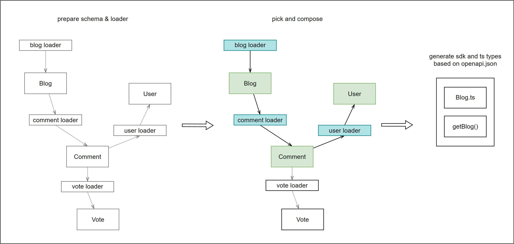

[](https://pypi.python.org/pypi/pydantic-resolve)
[](https://pepy.tech/project/pydantic-resolve)

[](https://github.com/allmonday/pydantic_resolve/actions/workflows/ci.yml)

Pydantic-resolve is a schema based solution for data composition, it can provide you with 3 ~ 5 times the increase in development efficiency and reduce the amount of code by more than 50%.

1. It manages the deep data inside each schema, instead of visiting from outside by manual traversal.
2. It runs a Level Order Traversal (BFS) inside and execute `resolve` and `post` during this process.
3. It describes the relationship between data in a form close to ERD (entity relationship diagram)

## Install

~~User of pydantic v2, please use [pydantic2-resolve](https://github.com/allmonday/pydantic2-resolve) instead.~~

This lib now supports both pydantic v1 and v2 starts from v1.11.0

```shell
pip install pydantic-resolve
```

## Hello world

manage your data inside the schema.

```python
class Tree(BaseModel):
    name: str
    number: int
    description: str = ''
    def resolve_description(self):
        return f"I'm {self.name}, my number is {self.number}"
    children: list['Tree'] = []


tree = dict(
    name='root',
    number=1,
    children=[
        dict(
            name='child1',
            number=2,
            children=[
                dict(
                    name='child1-1',
                    number=3,
                ),
                dict(
                    name='child1-2',
                    number=4,
                ),
            ]
        )
    ]
)

async def main():
    t = Tree.parse_obj(tree)
    t = await Resolver().resolve(t)
    print(t.json(indent=4))

import asyncio
asyncio.run(main())
```

output

```json
{
  "name": "root",
  "number": 1,
  "description": "I'm root, my number is 1",
  "children": [
    {
      "name": "child1",
      "number": 2,
      "description": "I'm child1, my number is 2",
      "children": [
        {
          "name": "child1-1",
          "number": 3,
          "description": "I'm child1-1, my number is 3",
          "children": []
        },
        {
          "name": "child1-2",
          "number": 4,
          "description": "I'm child1-2, my number is 4",
          "children": []
        }
      ]
    }
  ]
}
```

## Composing a subset from ERD definitions



define elements of ERD, schema (entity), dataloader (relationship).

then pick and compose them together according to your requirement and get the result.

```python
import asyncio
import json
from typing import Optional
from pydantic import BaseModel
from pydantic_resolve import Resolver, build_object, build_list, LoaderDepend
from aiodataloader import DataLoader

# Schema/ Entity
class Comment(BaseModel):
    id: int
    content: str
    user_id: int

class Blog(BaseModel):
    id: int
    title: str
    content: str

class User(BaseModel):
    id: int
    name: str


# Loaders/ relationships
class CommentLoader(DataLoader):
    async def batch_load_fn(self, comment_ids):
        comments = [
            dict(id=1, content="world is beautiful", blog_id=1, user_id=1),
            dict(id=2, content="Mars is beautiful", blog_id=2, user_id=2),
            dict(id=3, content="I love Mars", blog_id=2, user_id=3),
        ]
        return build_list(comments, comment_ids, lambda c: c['blog_id'])

class UserLoader(DataLoader):
    async def batch_load_fn(self, user_ids):
        users = [ dict(id=1, name="Alice"), dict(id=2, name="Bob"), ]
        return build_object(users, user_ids, lambda u: u['id'])


# Compose schemas and dataloaders together
class CommentWithUser(Comment):
    user: Optional[User] = None
    def resolve_user(self, loader=LoaderDepend(UserLoader)):
        return loader.load(self.user_id)

class BlogWithComments(Blog):
    comments: list[CommentWithUser] = []
    def resolve_comments(self, loader=LoaderDepend(CommentLoader)):
        return loader.load(self.id)


# Run
async def main():
    raw_blogs =[
        dict(id=1, title="hello world", content="hello world detail"),
        dict(id=2, title="hello Mars", content="hello Mars detail"),
    ]
    blogs = await Resolver().resolve([BlogWithComments.parse_obj(b) for b in raw_blogs])
    print(json.dumps(blogs, indent=2, default=lambda o: o.dict()))

asyncio.run(main())
```

output

```json
[
  {
    "id": 1,
    "title": "hello world",
    "content": "hello world detail",
    "comments": [
      {
        "id": 1,
        "content": "world is beautiful",
        "user_id": 1,
        "user": {
          "id": 1,
          "name": "Alice"
        }
      }
    ]
  },
  {
    "id": 2,
    "title": "hello Mars",
    "content": "hello Mars detail",
    "comments": [
      {
        "id": 2,
        "content": "Mars is beautiful",
        "user_id": 2,
        "user": {
          "id": 2,
          "name": "Bob"
        }
      },
      {
        "id": 3,
        "content": "I love Mars",
        "user_id": 3,
        "user": null
      }
    ]
  }
]
```

## Documents

- **Quick start**: https://allmonday.github.io/pydantic-resolve/about/
- **API**: https://allmonday.github.io/pydantic-resolve/reference_api/
- **Demo**: https://github.com/allmonday/pydantic-resolve-demo
- **Composition oriented pattern**: https://github.com/allmonday/composition-oriented-development-pattern

## Test and coverage

```shell
tox
```

```shell
tox -e coverage
python -m http.server
```

latest coverage: 98%

## Sponsor

If this code helps and you wish to support me

Paypal: https://www.paypal.me/tangkikodo

## Discussion

[Discord](https://discord.com/channels/1197929379951558797/1197929379951558800)
