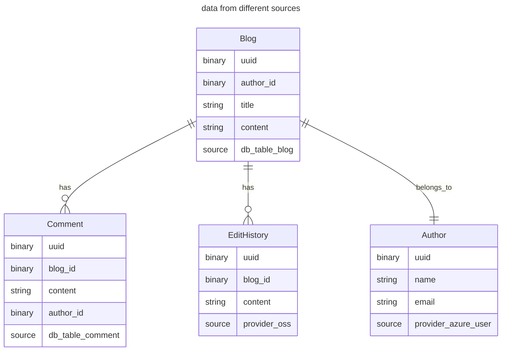
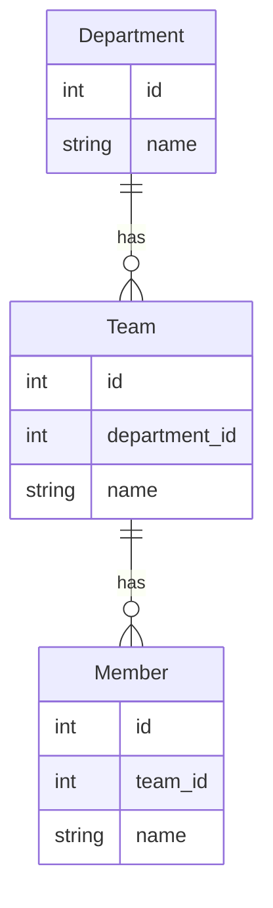

[](https://pypi.python.org/pypi/pydantic-resolve)
[](https://pepy.tech/project/pydantic-resolve)


[](https://github.com/allmonday/pydantic_resolve/actions/workflows/ci.yml)


[Change Log](./changelog.md)

> if you are using pydantic v2, please use pydantic2-resolve instead.

## Introduction

Building related data has always been a troublesome thing, whether through ORM or manually constructing it, especially when you need to build data that combines data from multiple kind of sources. (and at the same time, avoid N+1 Queries)

> GraphQL is a good idea, but you need to introduce a FRAMEWORK (strawberry, graphene..) to make it, it's too heavy, I don't want frontend's extra job to adapt to it, and... dataloader management is also annoying

for example, if I want to provide a blog list with recent 10 comment, 5 edit histories and author info, however:
- blogs and comments are stored in the DB
- edit histories are stored as files
- author details are provided by some 3rd party user service module.  

> this is merely hypothetical



`pydantic-resolve` provides a unified approach to stitching together various data sources, all you need is to define `DataLoader` for each data source.  

```python
class Blog(BaseModel):
    id: int
    name: str
    author_id: str

    # 1 : 1
    author: Optional[Author] = None  
    def resolve_author(self, user_loader: LoaderDepend(UserDataLoader)):
        return user_loader.load(self.author_id)  # service: api handler

    # 1 : n
    comments: List[Comment] = []  
    def resolve_comments(self, comment_loader: LoaderDepend(CommentDataLoader)):
        return comment_loader.load(self.id)  # service: db handler

    # 1 : n
    edit_histories: List[EditHistory] = []  
    def resolve_edit_histories(self, history_loader: LoaderDepend(EditHistoryDataLoader)):
        return history_loader.load(self.id)  # service: file handler
```

In addition, it can help you do some extra calculations after resolving the data.

```python
class Blog(BaseModel):
    ...
    
    comments_count: int = 0
    def post_comments_count(self):
        return len(self.comments)
```

After schema is done, you only need to query for the base data (blogs), after which `pydantic-resolve` will load all the related data for you.


```python
blogs = await query_blogs()
blogs = [Blog(**blog) for blog in blogs]
blogs = await Resolver().resolve(blogs)
return blogs
```


## Install

```shell
pip install pydantic-resolve
```

## Demo

Assume we have 3 tables: `departments`, `teams` and `members`, which have `1:N relationship` from left to right. 



```python
departments = [
    dict(id=1, name='INFRA'),
    dict(id=2, name='DevOps'),
    dict(id=3, name='Sales'),
]

teams = [
    dict(id=1, department_id=1, name="K8S"),
    dict(id=2, department_id=1, name="MONITORING"),
    # ...
    dict(id=10, department_id=2, name="Operation"),
]

members = [
    dict(id=1, team_id=1, name="Sophia"),
    # ...
    dict(id=19, team_id=10, name="Emily"),
    dict(id=20, team_id=10, name="Ella")
]
```

and we want to generate nested json base on these 3 tables. the output should be looks like: 


```json
{
  "departments": [
    {
      "id": 1,
      "name": "INFRA",
      "teams": [
        {
          "id": 1,
          "name": "K8S",
          "members": [
            {
              "id": 1,
              "name": "Sophia"
            }
          ]
        }
      ]
    }
  ]
}
```


We will shows how to make it with `pydantic-resolve` which has 4 steps:

1. define dataloader
2. define pydantic schema, use dataloaders  (no N+1 query)
3. resolve


```python
import json
import asyncio
from typing import List
from pydantic import BaseModel
from pydantic_resolve import Resolver, LoaderDepend, build_list

# 0. prepare table records
departments = [
    dict(id=1, name='INFRA'),
    dict(id=2, name='DevOps'),
    dict(id=3, name='Sales'),
]

teams = [
    dict(id=1, department_id=1, name="K8S"),
    dict(id=2, department_id=1, name="MONITORING"),
    dict(id=3, department_id=1, name="Jenkins"), 
    dict(id=5, department_id=2, name="Frontend"),
    dict(id=6, department_id=2, name="Bff"),
    dict(id=7, department_id=2, name="Backend"), 
    dict(id=8, department_id=3, name="CAT"),
    dict(id=9, department_id=3, name="Account"),
    dict(id=10, department_id=3, name="Operation"),
]

members = [
    dict(id=1, team_id=1, name="Sophia"),
    dict(id=2, team_id=1, name="Jackson"),
    dict(id=3, team_id=2, name="Olivia"),
    dict(id=4, team_id=2, name="Liam"),
    dict(id=5, team_id=3, name="Emma"),
    dict(id=6, team_id=4, name="Noah"),
    dict(id=7, team_id=5, name="Ava"),
    dict(id=8, team_id=6, name="Lucas"),
    dict(id=9, team_id=6, name="Isabella"),
    dict(id=10, team_id=6, name="Mason"),
    dict(id=11, team_id=7, name="Mia"),
    dict(id=12, team_id=8, name="Ethan"),
    dict(id=13, team_id=8, name="Amelia"),
    dict(id=14, team_id=9, name="Oliver"),
    dict(id=15, team_id=9, name="Charlotte"),
    dict(id=16, team_id=10, name="Jacob"),
    dict(id=17, team_id=10, name="Abigail"),
    dict(id=18, team_id=10, name="Daniel"),
    dict(id=19, team_id=10, name="Emily"),
    dict(id=20, team_id=10, name="Ella")
]

# 1. define dataloader
async def teams_batch_load_fn(department_ids):
    """ return teams grouped by department_id """
    # visit [aiodataloader](https://github.com/syrusakbary/aiodataloader) to know how to define `DataLoader`

    dct = defaultdict(list)
    _teams = team_service.batch_query_by_department_ids(department_ids)  # assume data is exposed by service
    for team in _teams:
        dct[team['department_id']].append(team)

    return [dct.get(did, []) for did in department_ids]

async def members_batch_load_fn(team_ids):
    """ return members grouped by team_id """
    _members = member_service.batch_query_by_team_ids(team_ids)

    return build_list(_members, team_ids, lambda t: t['team_id'])  # helper func

# 2. define pydantic schemas
class Member(BaseModel):
    id: int
    name: str

class Team(BaseModel):
    id: int
    name: str

    members: List[Member] = []
    def resolve_members(self, loader=LoaderDepend(members_batch_load_fn)):
        return loader.load(self.id)
    
    member_count: int = 0
    def post_member_count(self):
        return len(self.members)

class Department(BaseModel):
    id: int
    name: str
    teams: List[Team] = []
    def resolve_teams(self, loader=LoaderDepend(teams_batch_load_fn)):
        return loader.load(self.id)

    member_count: int = 0
    def post_member_count(self):
        return sum([team.member_count for team in self.teams])

class Result(BaseModel):
    departments: List[Department] = []
    def resolve_departments(self):
        return departments

# 3. resolve
async def main():
    result = Result()
    data = await Resolver().resolve(result)
    print(json.dumps(data.dict(), indent=4))

asyncio.run(main())
```

then we got the output (display the first item for demostration)

```json
{
  "departments": [
    {
      "id": 1,
      "name": "INFRA",
      "member_count": 5,
      "teams": [
        {
          "id": 1,
          "name": "K8S",
          "member_count": 2,
          "members": [
            {
              "id": 1,
              "name": "Sophia"
            },
            {
              "id": 2,
              "name": "Jackson"
            }
          ]
        },
        {
          "id": 2,
          "name": "MONITORING",
          "member_count": 2,
          "members": [
            {
              "id": 3,
              "name": "Olivia"
            },
            {
              "id": 4,
              "name": "Liam"
            }
          ]
        },
        {
          "id": 3,
          "name": "Jenkins",
          "member_count": 1,
          "members": [
            {
              "id": 5,
              "name": "Emma"
            }
          ]
        }
      ]
    },
  ]
}
```

## More cases:

for more cases like: 
- how to filter members
- how to make post calculation after resolved?
- and so on..

please read the following demos.

```shell
cd examples

python -m readme_demo.0_basic
python -m readme_demo.1_filter
python -m readme_demo.2_post_methods
python -m readme_demo.3_context
python -m readme_demo.4_loader_instance
python -m readme_demo.5_subset
python -m readme_demo.6_mapper
python -m readme_demo.7_single
```


## API

### Resolver(loader_filters, loader_instances, ensure_type, annotation_class, context)

- loader_filters: `dict`

  provide extra query filters along with loader key.

  reference: [6_sqlalchemy_loaderdepend_global_filter.py](examples/6_sqlalchemy_loaderdepend_global_filter.py) L55, L59

- loader_instances: `dict`

  provide pre-created loader instance, with can `prime` data into loader cache.

  reference: [test_20_loader_instance.py](tests/resolver/test_20_loader_instance.py), L62, L63

- ensure_type: `bool`

  if `True`, resolve method is restricted to be annotated.

  reference: [test_13_check_wrong_type.py](tests/resolver/test_13_check_wrong_type.py)

- annotation_class: `class`

  if you have `from __future__ import annotation`, and pydantic raises error, use this config to update forward refs

  reference: [test_25_parse_to_obj_for_pydantic_with_annotation.py](tests/resolver/test_25_parse_to_obj_for_pydantic_with_annotation.py), L39

- context: `dict`

  context can carry setting into each single resolver methods.

  ```python

  class Earth(BaseModel):
      humans: List[Human] = []
      def resolve_humans(self, context):
          return [dict(name=f'man-{i}') for i in range(context['count'])]

  earth = await Resolver(context={'count': 10}).resolve(earth)
  ```

### LoaderDepend(loader_fn)

- loader_fn: `subclass of DataLoader or batch_load_fn`. [detail](https://github.com/syrusakbary/aiodataloader#dataloaderbatch_load_fn-options)

  declare dataloader dependency, `pydantic-resolve` will take the care of lifecycle of dataloader.

### build_list(rows, keys, fn), build_object(rows, keys, fn)

- rows: `list`, query result
- keys: `list`, batch_load_fn:keys
- fn: `lambda`, define the way to get primary key

  helper function to generate return value required by `batch_load_fn`. read the code for details.

  reference: [test_utils.py](tests/utils/test_utils.py), L32

### mapper(param)

- param: `class of pydantic or dataclass, or a lambda`

  `pydantic-resolve` will trigger the fn in `mapper` after inner future is resolved. it exposes an interface to change return schema even from the same dataloader.
  if param is a class, it will try to automatically transform it.

  reference: [test_16_mapper.py](tests/resolver/test_16_mapper.py)


### ensure_subset(base_class)

- base_class: `class`

  it will raise exception if fields of decorated class has field not existed in `base_class`.

  reference: [test_2_ensure_subset.py](tests/utils/test_2_ensure_subset.py)


## Run FastAPI example

```shell
poetry shell
cd examples
uvicorn fastapi_demo.main:app
# http://localhost:8000/docs#/default/get_tasks_tasks_get
```


## Unittest

```shell
poetry run python -m unittest  # or
poetry run pytest  # or
poetry run tox
```

## Coverage

```shell
poetry run coverage run -m pytest
poetry run coverage report -m
```
