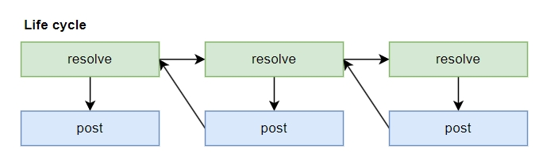

[](https://pypi.python.org/pypi/pydantic-resolve)
[](https://pepy.tech/projects/pydantic-resolve)

[](https://github.com/allmonday/pydantic_resolve/actions/workflows/ci.yml)

</img>


pydantic-resolve is a tool helps to flexibly assemble data together, it might be the most intuitive one, it plays pretty well with FastAPI / Litestar / Django-ninja

you can simply extend your data by adding `resolve_field` function, no matter the position, no matter list or single.

> It also supports dataclass

```python
from pydantic import BaseModel
from pydantic_resolve import Resolver, build_list
from aiodataloader import DataLoader


# ER model of story and task
# ┌───────────┐          
# │           │          
# │   story   │          
# │           │          
# └─────┬─────┘          
#       │                
#       │   owns multiple (TaskLoader)
#       │                
#       │                
# ┌─────▼─────┐          
# │           │          
# │   task    │          
# │           │          
# └───────────┘

class TaskLoader(DataLoader):
    async def batch_load_fn(self, story_ids):
        tasks = await get_tasks_by_ids(story_ids)
        return build_list(tasks, story_ids, lambda t: t.story_id)

class BaseTask(BaseModel):
    id: int
    story_id: int
    name: str

class BaseStory(BaseModel):
    id: int
    name: str

class Story(BaseStory):  # inherit and compose
    tasks: list[BaseTask] = []
    def resolve_tasks(self, loader=LoaderDepend(TaskLoader)):
        return loader.load(self.id)

stories = await get_raw_stories()
stories = [Story(**s) for s in stories)]
stories = await Resolver().resolve(stories)     
```


## Installation

```
pip install pydantic-resolve
```

Starting from pydantic-resolve v1.11.0, it suports both pydantic v1 and v2.

## Features

### Dataloader
Dataloader provides a universal method to associate data without worrying about N+1 queries.

Once the query methods for entities and the query methods for entity associations (DataLoaders) are defined, all that remains is to make declarative definitions at the pydantic level. (The query details are encapsulated within methods and DataLoaders.）

### Post process

Another issue that pydantic-resolve solved is the transformation process of the ER model data into view data, you can use `expose` to expose the data of ancestor nodes to descendant nodes, or use the `collect` tool to gather the final data of descendant nodes into ancestor nodes, thus easily achieving the restructuring of the data schema.

Here's a simple ER model of Story and Task and it's code implementation.

As a tool for data composition, it would not be fancy if it only supports mounting related data, pydantic-resolve provides an extra life cycle hooks for post method.

This post process could help transform business object (generated at resolve process) to the view object 


You'll be able to adjust the fields immediately after all the resolve processes finish, and it has many useful params, it even supports async. 

for example, calculate extra fields:

```python
class Story(BaseModel):
    id: int
    name: str

    tasks: list[Task] = []
    def resolve_tasks(self, loader=LoaderDepend(TaskLoader)):
        return loader.load(self.id)

    ratio: float = 0
    def post_ratio(self):
        return len([t for t in tasks if task.done is True]) / len(self.tasks) 
```

### Communication between ancestor and descendents

This sample shows the capability of: 1 exposing specific data to descendents, 2 collecting data from descendents.

during resolve process:
- read list of story
- expose story name to task

during post process:
- collect all task into Data.tasks
- hide Data.stories during serilization

now Data only contains tasks with each one's story name.

```python
class BaseTask(BaseModel):
    id: int
    story_id: int
    name: str

class BaseStory(BaseModel):
    id: int
    name: str

class Task(BaseTask):
    story_name: str = ''
    def resolve_story_name(self, ancestor_context):
        return ancestor_context['story_name'] # read story_name of direct ancestor

class Story(BaseStory):
    __pydantic_resolve_expose__ = {'name': 'story_name'}  # expose name (as story_name) to descendent nodes
    __pydantic_resolve_collect__ = {'tasks': 'task_collector'}  # tasks will be collected by task_collector

    tasks: list[BaseTask] = []
    def resolve_tasks(self, loader=LoaderDepend(TaskLoader)):
        return loader.load(self.id)

class Data(BaseModel):
    stories: list[Story] = Field(default_factory=list, exclude=True)
    async def resolve_stories(self):
        return await get_raw_stories()

    tasks: list[Task] = []
    def post_tasks(self, collector=Collector('task_collector', flat=True)):  # flat=True to avoid list of list
        return collector.values()
```
    
## Why create it?

### Problems to solve

A typical flow of data composition contains steps of: 

1. query root data (single item or array of items)
2. query related data a, b, c ...
3. modify data, from leaf data to root data

Take story and task for example, we fetch tasks and group for each story and then do some business calculation.

```python
# 1. query root data
stories = await query_stories()

# 2. query related data
story_ids = [s.id for s in stories]
tasks = await get_all_tasks_by_story_ids(story_ids)

story_tasks = defaultdict(list)

for task in tasks:
    story_tasks[task.story_id].append(task)

for story in stories:
    tasks = story_tasks.get(story.id, [])

    # 3. modify data
    story.total_task_time = sum(task.time for task in tasks)
    story.total_done_tasks_time = sum(task.time for task in tasks if task.done)
```

In this code we handled the tasks querying, composing (tasks group by story) and then the final business calculation. 

But there are some problems:

- Temp variables are defined however they are useless from the view of the business calculation. 
- The business logic is located insde `for` indent. 
- The composition part is boring.

If we add one more layer, for example, add sprint, it gets worse

```python
# 1. query root data
sprints = await query_sprints()

# 2-1. query related data, stories
sprint_ids = [s.id for s in sprints]
stories = await get_all_stories_by_sprint_id(sprint_ids)

# 2-2. query related data, tasks
story_ids = [s.id for s in stories]
tasks = await get_all_tasks_by_story_ids(story_ids)

sprint_stories = defaultdict(list)
story_tasks = defaultdict(list)

for story in stories:
    sprint_stories[story.sprint_id].append(story)

for task in tasks:
    story_tasks[task.story_id].append(task)

for sprint in sprints:
    stories = sprint_stories.get(sprint.id, [])
    sprint.stories = stories

    for story in stories:
        tasks = story_tasks.get(story.id, [])

        # 3-1. modify data
        story.total_task_time = sum(task.time for task in tasks)
        story.total_done_task_time = sum(task.time for task in tasks if task.done)

    # 3-2. modify data
    sprint.total_time = sum(story.total_task_time for story in stories) 
    sprint.total_done_time = sum(story.total_done_task_time for story in stories)
```

It spends quite a lot of code just for querying and composing the data, and the business calculation is mixed within for loops.

> breadth first approach is used to minize the number of queries.

### Solution

The code could be simified if we can get rid of these querying and composing, let pydantic-resolve handle it, even the for loops.

pydantic-resolve can help **split them apart**, dedicate the querying and composing to Dataloader, handle the traversal internally

So that we can focus on the **business calculation**.

```python
from pydantic_resolve import Resolver, LoaderDepend, build_list
from aiodataloader import DataLoader

# data fetching, dataloader will group the tasks by story.
class TaskLoader(DataLoader):
    async def batch_load_fn(self, story_ids):
        tasks = await get_all_tasks_by_story_ids(story_ids)
        return build_list(tasks, story_ids, lambda t: t.story_id)

# core business logics
class Story(Base.Story):
    # fetch tasks with dataloader in resolve_method
    tasks: List[Task] = []
    def resolve_tasks(self, loader=LoaderDepend(TaskLoader)):
        return loader.load(self.id)

    # calc after fetched, with post_method
    total_task_time: int = 0
    def post_total_task_time(self):
        return sum(task.time for task in self.tasks)

    total_done_task_time: int = 0
    def post_total_done_task_time(self):
        return sum(task.time for task in self.tasks if task.done)

# traversal and execute methods (runner)
# query root data
stories: List[Story] = await query_stories()
await Resolver().resolve(stories)
```

for the second scenario:

```python
# data fetching
class TaskLoader(DataLoader):
    async def batch_load_fn(self, story_ids):
        tasks = await get_all_tasks_by_story_ids(story_ids)
        return build_list(tasks, story_ids, lambda t: t.story_id)

class StoryLoader(DataLoader):
    async def batch_load_fn(self, sprint_ids):
        stories = await get_all_stories_by_sprint_ids(sprint_ids)
        return build_list(stories, sprint_ids, lambda t: t.sprint_id)

# core business logic
class Story(Base.Story):
    tasks: List[Task] = []
    def resolve_tasks(self, loader=LoaderDepend(TaskLoader)):
        return loader.load(self.id)

    total_task_time: int = 0
    def post_total_task_time(self):
        return sum(task.time for task in self.tasks)

    total_done_task_time: int = 0
    def post_total_done_task_time(self):
        return sum(task.time for task in self.tasks if task.done)

class Sprint(Base.Sprint):
    stories: List[Story] = []
    def resolve_stories(self, loader=LoaderDepend(StoryLoader)):
        return loader.load(self.id)

    total_time: int = 0
    def post_total_time(self):
        return sum(story.total_task_time for story in self.stories)

    total_done_time: int = 0
    def post_total_done_time(self):
        return sum(story.total_done_task_time for story in self.stories)


# traversal and execute methods (runner)
# query root data
sprints: List[Sprint] = await query_sprints()
await Resolver().resolve(sprints)
```

No more indent, no more temp helper variables, no more for loops (and indents).

All the relationships and traversal is defined by pydantic/ dataclass class.

> why not using ORM relationship for querying and composing?
> 
> Dataloader is a general interface for different implemetations
> If the ORM has provided the related data, we just need to simply remove the resolve_method and dataloder.


## How it works?

It can reduce the code complexity during the data composition, making the code close to the ER model and then more maintainable.

> Using an ER oriented modeling approach, it can provide us with a 3 to 5 times increase in development efficiency and reduce code by more than 50%.

With the help of pydantic, it can describe data structures in a graph-like relationship like GraphQL, and can also make adjustments based on business needs while fetching data.

It can easily run with FastAPI to build frontend friendly data structures on the backend and provide them to the frontend in the form of a TypeScript SDK.

Basically it just provides resolve and post methods for pydantic and dataclass objects.

- resolve is used to fetch data
- post is used to do additional processing after fetching data

And this is a recursive process, the resolve process finishs after all descendants are done.



take Sprint, Story and Task for example:


When the object methods are defined and the objects are initialized, pydantic-resolve will internally traverse the data, execute these methods to process the data, and finally obtain all the data.

With DataLoader, pydantic-resolve can avoid the N+1 query problem that easily occurs when fetching data in multiple layers, optimizing performance.

Using DataLoader also allows the defined class fragments to be reused in any location.

In addition, it also provides expose and collector mechanisms to facilitate cross-layer data processing.


## Hello world sample

originally we have list of books, then we want to attach the author info.

```python
import asyncio
from pydantic_resolve import Resolver

# data
books = [
    {"title": "1984", "year": 1949},
    {"title": "To Kill a Mockingbird", "year": 1960},
    {"title": "The Great Gatsby", "year": 1925}]

persons = [
    {"name": "George Orwell", "age": 46},
    {"name": "Harper Lee", "age": 89},
    {"name": "F. Scott Fitzgerald", "age": 44}]

book_author_mapping = {
    "1984": "George Orwell",
    "To Kill a Mockingbird": "Harper Lee",
    "The Great Gatsby": "F. Scott Fitzgerald"}

async def get_author(title: str) -> Person:
    await asyncio.sleep(0.1)
    author_name = book_author_mapping[title]
    if not author_name:
        return None
    author = [person for person in persons if person['name'] == author_name][0]
    return Person(**author)

class Person(BaseModel):
    name: str
    age: int


class Book(BaseModel):
    title: str
    year: int
    author: Optional[Person] = None

    async def resolve_author(self):
        return await get_author(self.title)

books = [Book(**book) for book in books]
books_with_author = await Resolver().resolve(books)

```

output

```python
[
    Book(title='1984', year=1949, author=Person(name='George Orwell', age=46)),
    Book(title='To Kill a Mockingbird', year=1960, author=Person(name='Harper Lee', age=89)),
    Book(title='The Great Gatsby', year=1925, author=Person(name='F. Scott Fitzgerald', age=44))
]
```

internally, it runs concurrently to execute the async functions, which looks like:

```python
import asyncio

async def handle_author(book: Book):
    author = await get_author(book.title)
    book.author = author

await asyncio.gather(*[handle_author(book) for book in books])
```

## Documents

- **Doc**: https://allmonday.github.io/pydantic-resolve/v2/introduction/
- **Demo**: https://github.com/allmonday/pydantic-resolve-demo
- **Composition oriented pattern**: https://github.com/allmonday/composition-oriented-development-pattern

## Test and coverage

```shell
tox
```

```shell
tox -e coverage
python -m http.server
```

latest coverage: 97%

## Hear your voice

[Discord](https://discord.com/channels/1197929379951558797/1197929379951558800)
