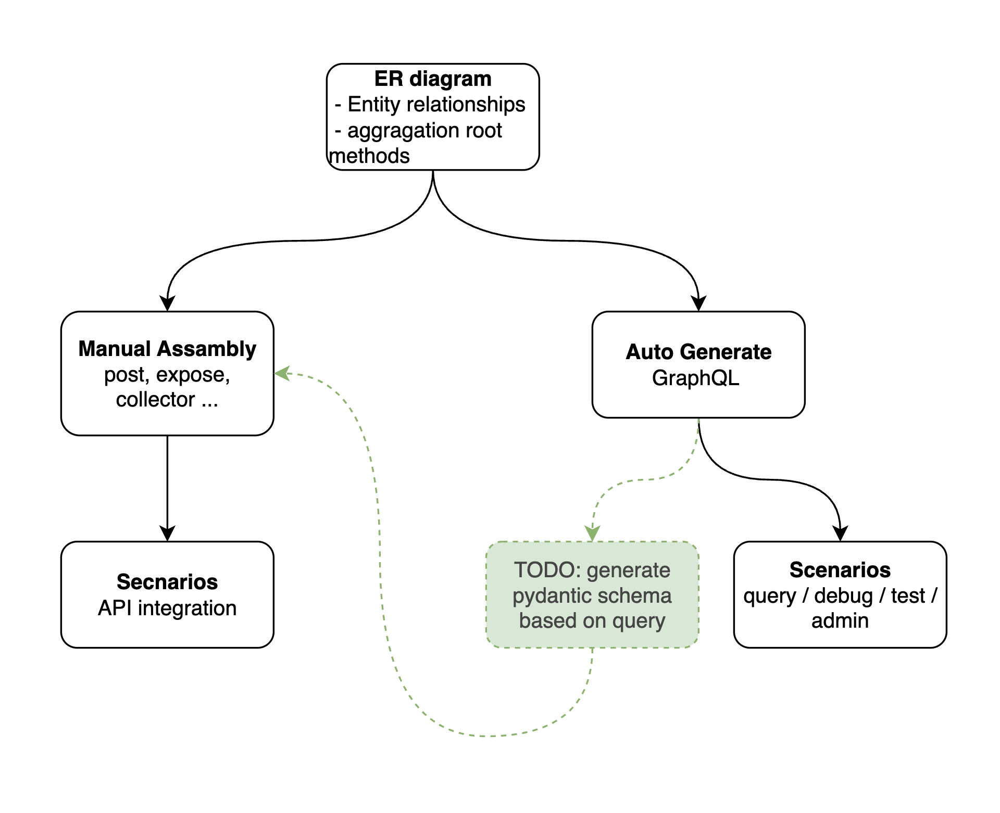

# Pydantic Resolve

> Declarative data assembly for Pydantic — eliminate N+1 queries with minimal code.

[](https://pypi.python.org/pypi/pydantic-resolve)
[](https://pepy.tech/projects/pydantic-resolve)

[](https://github.com/allmonday/pydantic_resolve/actions/workflows/ci.yml)

[中文版](./README.zh.md)



---

**pydantic-resolve** is inspired by GraphQL. It builds database-independent application-layer Entity Relationship Diagrams using DataLoader, providing rich data assembly and post-processing capabilities. It can also auto-generate GraphQL queries and MCP services.

## Why pydantic-resolve?

**Core capabilities:**

| Feature | What it does |
|---------|--------------|
| **Automatic Batching** | DataLoader eliminates N+1 queries automatically |
| **Declarative Assembly** | Declare dependencies, framework handles the rest |
| **Entity-First Architecture** | ER Diagram defines relationships, `AutoLoad` auto-resolves |
| **GraphQL Support** | Generate schema from ERD, query with dynamic models |
| **MCP Integration** | Expose GraphQL APIs to AI agents with progressive disclosure |

**One line to fetch nested data:**

```python
class Task(BaseModel):
    owner_id: int
    owner: Optional[User] = None

    def resolve_owner(self, loader=Loader(user_loader)):
        return loader.load(self.owner_id)  # That's it!

# Resolver automatically batches all owner lookups into one query
result = await Resolver().resolve(tasks)
```

---

## Quick Start

### Install

```bash
pip install pydantic-resolve
```

### The N+1 Problem

```python
# Traditional: 1 + N queries
for task in tasks:
    task.owner = await get_user(task.owner_id)  # N queries!
```

### The pydantic-resolve Solution

```python
from pydantic import BaseModel
from typing import Optional, List
from pydantic_resolve import Resolver, Loader, build_list

# 1. Define your loaders (batch queries)
async def user_loader(ids: list[int]):
    users = await db.query(User).filter(User.id.in_(ids)).all()
    return build_list(users, ids, lambda u: u.id)

async def task_loader(sprint_ids: list[int]):
    tasks = await db.query(Task).filter(Task.sprint_id.in_(sprint_ids)).all()
    return build_list(tasks, sprint_ids, lambda t: t.sprint_id)

# 2. Define your schema with resolve methods
class TaskResponse(BaseModel):
    id: int
    name: str
    owner_id: int

    owner: Optional[dict] = None
    def resolve_owner(self, loader=Loader(user_loader)):
        return loader.load(self.owner_id)

class SprintResponse(BaseModel):
    id: int
    name: str

    tasks: List[TaskResponse] = []
    def resolve_tasks(self, loader=Loader(task_loader)):
        return loader.load(self.id)

# 3. Resolve - framework handles batching automatically
@app.get("/sprints")
async def get_sprints():
    sprints = await get_sprint_data()
    return await Resolver().resolve([SprintResponse.model_validate(s) for s in sprints])
```

**Result:** 1 query per loader, regardless of data depth.

---

## Core Concepts

### Resolve: Declarative Data Loading

Instead of imperative data fetching, declare what you need:

```python
class Task(BaseModel):
    owner_id: int
    owner: Optional[User] = None

    def resolve_owner(self, loader=Loader(user_loader)):
        return loader.load(self.owner_id)
```

The framework:
1. Collects all `owner_id` values
2. Batches them into one query
3. Maps results back to correct objects

### DataLoader: Automatic Batching

DataLoader batches multiple requests within the same event loop tick:

```python
# Without DataLoader: 100 tasks = 100 user queries
# With DataLoader: 100 tasks = 1 user query (WHERE id IN (...))

async def user_loader(user_ids: list[int]):
    return await db.query(User).filter(User.id.in_(user_ids)).all()
```

### Expose & Collect: Cross-layer Data Flow

In nested data structures, parent and child nodes often need to share data. Traditional approaches require explicit parameter passing or tight coupling. pydantic-resolve provides two declarative mechanisms:

- **ExposeAs**: Parent nodes expose data to all descendants (downward flow)
- **SendTo + Collector**: Child nodes send data to parent collectors (upward flow)

This creates a clean separation — parent doesn't need to know child's structure, and child doesn't need explicit parent references.

```python
from pydantic_resolve import ExposeAs, Collector, SendTo
from typing import Annotated

# 1. Parent EXPOSES data to descendants (downward flow)
class Story(BaseModel):
    name: Annotated[str, ExposeAs('story_name')]
    tasks: List[Task] = []

# 2. Child ACCESSES ancestor context (no explicit parent reference needed)
class Task(BaseModel):
    def post_full_path(self, ancestor_context):
        return f"{ancestor_context['story_name']} / {self.name}"

# 3. Child SENDS data to parent collector (upward flow)
class Task(BaseModel):
    owner: Annotated[User, SendTo('contributors')] = None

class Story(BaseModel):
    contributors: List[User] = []
    def post_contributors(self, collector=Collector('contributors')):
        return collector.values()  # Auto-deduplicated list of all task owners
```

**Use cases:**
- Pass configuration/context down to nested objects (e.g., user permissions, locale)
- Aggregate results up from nested objects (e.g., collect all unique tags from posts)

---

## Advanced Features

### Entity-First Architecture

Define business entities independent of database schema.

**Why Entity-First vs DB-based relationships?**

| Aspect | DB-based (ORM) | Entity-First (pydantic-resolve) |
|--------|----------------|--------------------------------|
| **Flexibility** | Tied to database schema | Define relationships at application layer |
| **Data Sources** | Single database | Cross multiple sources (PostgreSQL, MongoDB, Redis, RPC) |
| **Encapsulation** | Exposes FK fields (`owner_id`) | Loader implementation hidden from API |
| **API Contract** | Changes when DB changes | Stable, decoupled from storage |

```python
from pydantic_resolve import base_entity, Relationship, AutoLoad

BaseEntity = base_entity()

# Entity defines business relationship, not database FK
class TaskEntity(BaseModel, BaseEntity):
    __relationships__ = [
        # Loader can query Postgres, call RPC, or fetch from Redis
        # API consumers don't need to know where data comes from
        Relationship(fk='owner_id', name='owner', target=UserEntity, loader=user_loader)
    ]
    id: int
    name: str
    description: Optional[str] = None
    status: str  # todo, in_progress, done
    owner_id: int  # Internal FK, can be hidden from API

# Response schema: choose what to expose
class TaskResponse(DefineSubset):
    __subset__ = (TaskEntity, ('id', 'name'))  # owner_id excluded
    owner: Annotated[User, AutoLoad()] = None  # Auto-resolved!
```

**Key benefits:**
- Change loader implementation (SQL → RPC) without touching Response code
- Mix data from multiple sources in single entity graph
- Hide internal IDs from API, expose only business concepts

[→ Full Entity-First Guide](https://allmonday.github.io/pydantic-resolve/erd_driven/)

### GraphQL Support

Generate GraphQL schema from ERD:

```python
from pydantic_resolve.graphql import GraphQLHandler

handler = GraphQLHandler(BaseEntity.get_diagram())
result = await handler.execute("{ users { id name posts { title } } }")
```

[→ GraphQL Documentation](./demo/graphql/README.md)

### MCP Integration

Expose GraphQL APIs to AI agents with progressive disclosure:

```python
from pydantic_resolve.graphql.mcp import create_mcp_server

mcp = create_mcp_server(apps=[AppConfig(name="blog", er_diagram=diagram)])
mcp.run()  # AI agents can now discover and query your API
```

[→ MCP Documentation](https://allmonday.github.io/pydantic-resolve/api/)

### Visualization

Interactive schema exploration with [fastapi-voyager](https://github.com/allmonday/fastapi-voyager):

```python
from fastapi_voyager import create_voyager

app.mount('/voyager', create_voyager(app, er_diagram=BaseEntity.get_diagram()))
```

---

## pydantic-resolve vs GraphQL

| Feature | GraphQL | pydantic-resolve |
|---------|---------|------------------|
| **N+1 Prevention** | Manual DataLoader setup | Built-in automatic batching |
| **Type Safety** | Separate schema files | Native Pydantic types |
| **Learning Curve** | Steep (Schema, Resolvers, Loaders) | Gentle (just Pydantic) |
| **Debugging** | Complex introspection | Standard Python debugging |
| **Integration** | Requires dedicated server | Works with any framework |
| **Query Flexibility** | Any client can query anything | Explicit API contracts |

---

## Resources

- 📖 [Full Documentation](https://allmonday.github.io/pydantic-resolve/)
- 🚀 [Example Project](https://github.com/allmonday/composition-oriented-development-pattern)
- 🎮 [Live Demo](https://www.fastapi-voyager.top/voyager/)
- 🎮 [Live Demo - GraphQL](https://www.fastapi-voyager.top/graphql)
- 📚 [API Reference](https://allmonday.github.io/pydantic-resolve/api/)

---

## License

MIT License

## Author

tangkikodo (allmonday@126.com)
