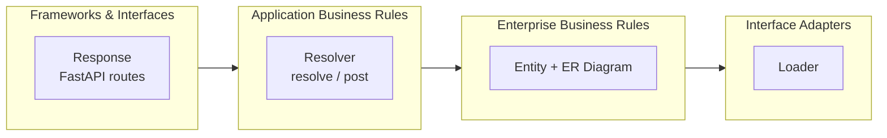
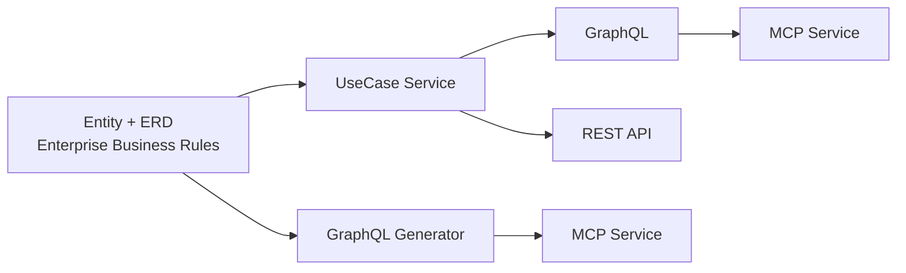

# Pydantic Resolve

> Clean Architecture for Python — define business entities, declare relationships, let the framework assemble your data.

[](https://pypi.python.org/pypi/pydantic-resolve)
[](https://pepy.tech/projects/pydantic-resolve)

[](https://github.com/allmonday/pydantic_resolve/actions/workflows/ci.yml)

[中文版](./README.zh.md)

**Requirements:** Python 3.10+, Pydantic v2

---

## TL;DR

pydantic-resolve fills in the missing fields of your Pydantic models — batch-loaded, recursive, N+1-safe.

```python
from typing import Optional
from pydantic import BaseModel
from pydantic_resolve import Loader, Resolver


class TaskView(BaseModel):
    id: int
    title: str
    owner_id: int
    owner: Optional[UserView] = None

    def resolve_owner(self, loader=Loader(user_loader)):
        return loader.load(self.owner_id)


tasks = await Resolver().resolve(tasks)  # one query, no N+1
```

That's the whole idea: **describe what's missing, the framework fetches it.**

---

## The Problem

In most FastAPI projects, you define SQLAlchemy ORM models first, then create Pydantic schemas that mirror them. As the project grows, data-assembly logic ends up scattered across Repository / Service / Route:

```python
@router.get("/tasks")
async def get_tasks():
    tasks = await task_service.get_tasks()
    user_ids = list({t.owner_id for t in tasks})
    users = await user_service.get_users_by_ids(user_ids)
    user_map = {u.id: u for u in users}
    return [
        TaskResponse(**{**t.model_dump(), 'owner': user_map.get(t.owner_id)})
        for t in tasks
    ]
```

This pattern couples your API contract to the database layout and gives business logic no stable home. pydantic-resolve provides that home. For the full architectural analysis, see [Clean Architecture for Python](./docs/architecture_entity_first.md).

---

## Quick Start

### Install

```bash
pip install pydantic-resolve
pip install pydantic-resolve[mcp]  # with MCP support
```

### The Example

Throughout the Quick Start, we build one API:

- `Sprint` has many `Task`
- `Task` has one `owner` (a `User`)
- The API also needs derived fields like `task_count` and `contributors`

Each step adds one concept on top of the previous code.

### Step 1: Load Related Data with `resolve_*`

Every response model has some fields already filled (from the database, from user input) and some fields that need to be fetched separately. `resolve_*` is how you declare those missing fields.

```python
from typing import Optional

from pydantic import BaseModel
from pydantic_resolve import Loader, Resolver, build_object


class UserView(BaseModel):
    id: int
    name: str


async def user_loader(user_ids: list[int]):
    users = await db.query(User).filter(User.id.in_(user_ids)).all()
    return build_object(users, user_ids, lambda user: user.id)


class TaskView(BaseModel):
    id: int
    title: str
    owner_id: int
    owner: Optional[UserView] = None

    def resolve_owner(self, loader=Loader(user_loader)):
        return loader.load(self.owner_id)


tasks = [TaskView.model_validate(task) for task in raw_tasks]
tasks = await Resolver().resolve(tasks)
```

A useful mental model: **`resolve_*` means "this field needs data from outside the current node."** The framework collects every `loader.load(...)` call across the tree, batches one query per loader, and maps the results back.

### Step 2: Compose Nested Trees

Real APIs rarely have just one relationship. When `Sprint` contains many `Task`s, and each `Task` already knows how to load its `owner`, the resolver walks the tree and batch-loads everything recursively.

```python
from typing import List

from pydantic_resolve import build_list


async def task_loader(sprint_ids: list[int]):
    tasks = await db.query(Task).filter(Task.sprint_id.in_(sprint_ids)).all()
    return build_list(tasks, sprint_ids, lambda task: task.sprint_id)


class SprintView(BaseModel):
    id: int
    name: str
    tasks: List[TaskView] = []

    def resolve_tasks(self, loader=Loader(task_loader)):
        return loader.load(self.id)


sprints = [SprintView.model_validate(sprint) for sprint in raw_sprints]
sprints = await Resolver().resolve(sprints)
```

**Result:** one query per loader, regardless of how many sprints or tasks you load.

### Step 3: Compute Derived Fields with `post_*`

`task_count` and `contributor_names` don't come from a query — they're derived from data already on the model. `post_*` handles these: it runs **after** all nested `resolve_*` calls have finished.

```python
class SprintView(BaseModel):
    id: int
    name: str
    tasks: List[TaskView] = []
    task_count: int = 0
    contributor_names: list[str] = []

    def resolve_tasks(self, loader=Loader(task_loader)):
        return loader.load(self.id)

    def post_task_count(self):
        return len(self.tasks)

    def post_contributor_names(self):
        return sorted({task.owner.name for task in self.tasks if task.owner})
```

Execution order:

1. `resolve_tasks` loads the sprint's tasks.
2. Each `TaskView.resolve_owner` loads its owner.
3. `post_task_count` and `post_contributor_names` run after those nested fields are ready.

Putting it all together, the response looks like:

```json
{
  "id": 1,
  "name": "Sprint 1",
  "tasks": [
    {
      "id": 101,
      "title": "Implement login",
      "owner_id": 1,
      "owner": { "id": 1, "name": "Alice" }
    }
  ],
  "task_count": 1,
  "contributor_names": ["Alice"]
}
```

| | `resolve_*` | `post_*` |
|---|---|---|
| Needs external IO? | Yes | Usually no |
| Runs before descendants ready? | Yes | No |
| Good for counts, sums, formatting? | Sometimes | Yes |
| Return value resolved again? | Yes | No |

These two patterns cover most API endpoints. The next section covers cross-tree coordination — skip it if your tree is simple enough with `resolve_*` and `post_*`.

### Step 4: Coordinate Parent and Child *(optional)*

When parent and child nodes need to share data without hard-coding references to each other, two helpers cover the two directions.

#### 4a. ExposeAs — parent → child

Send a value from an ancestor down to its descendants.

```python
from typing import Annotated

from pydantic_resolve import ExposeAs


class SprintView(BaseModel):
    id: int
    name: Annotated[str, ExposeAs('sprint_name')]  # visible to all descendants
    tasks: List[TaskView] = []

    def resolve_tasks(self, loader=Loader(task_loader)):
        return loader.load(self.id)


class TaskView(BaseModel):
    id: int
    title: str
    owner_id: int
    owner: Optional[UserView] = None
    full_title: str = ""

    def resolve_owner(self, loader=Loader(user_loader)):
        return loader.load(self.owner_id)

    def post_full_title(self, ancestor_context):
        return f"{ancestor_context['sprint_name']} / {self.title}"
```

Use this when a child needs context from an ancestor (sprint name, permissions, locale).

#### 4b. SendTo + Collector — child → parent

Aggregate values from many descendants up to one ancestor.

```python
from typing import Annotated

from pydantic_resolve import Collector, SendTo


class SprintView(BaseModel):
    id: int
    name: str
    tasks: List[TaskView] = []
    contributors: list[UserView] = []

    def resolve_tasks(self, loader=Loader(task_loader)):
        return loader.load(self.id)

    def post_contributors(self, collector=Collector('contributors')):
        return collector.values()


class TaskView(BaseModel):
    id: int
    title: str
    owner_id: int
    owner: Annotated[Optional[UserView], SendTo('contributors')] = None

    def resolve_owner(self, loader=Loader(user_loader)):
        return loader.load(self.owner_id)
```

Use this when a parent needs to aggregate values from many descendants (all contributors, all tags, all attachments).

---

## How It Works

Three mechanisms cover the whole library:

| What you need | What you write | What the framework does |
|------|----------------|-------------------------|
| Load related data | `resolve_*` + `Loader(...)` | Batch lookups and map results back |
| Compute derived fields | `post_*` | Run after descendants are fully resolved |
| Reuse relationship declarations | ER Diagram + `AutoLoad` (see below) | Centralize relationship wiring for many models |


```mermaid
flowchart LR
    subgraph FW["Frameworks & Interfaces"]
        R["Response<br/>FastAPI routes"]
    end
    subgraph APP["Application Business Rules"]
        RV["Resolver<br/>resolve / post"]
    end
    subgraph ENT["Enterprise Business Rules"]
        E["Entity + ER Diagram"]
    end
    subgraph ADP["Interface Adapters"]
        L["Loader"]
    end
    FW --> APP --> ENT --> ADP
```

The dependency direction always points inward: Entity doesn't know about Loader. Loader doesn't know about FastAPI. FastAPI doesn't know about the database.

---

## Clean Architecture Mapping

pydantic-resolve is built around Clean Architecture. Its components map 1:1 to the layers:

| Clean Architecture Layer | pydantic-resolve Component |
|--------------------------|---------------------------|
| Enterprise Business Rules | Entity + ER Diagram |
| Application Business Rules | Resolver + resolve/post |
| Interface Adapters | Loader (data access) |
| Frameworks & Interfaces | FastAPI routes + GraphQL + MCP |

This mapping is what makes the library more than a DataLoader helper — it gives data assembly a stable home that survives framework churn.

For the full architectural analysis, see [Clean Architecture for Python](./docs/architecture_entity_first.md).

---

## Going Further: ER Diagram + AutoLoad

> **Optional.** The Core API above (`resolve_*` / `post_*` + `Loader`) covers most use cases. Read this section only when you notice the same relationship being declared repeatedly across response models.

A common signal is when you see the same relation described again and again:

- `TaskCard.resolve_owner`
- `TaskDetail.resolve_owner`
- `SprintBoard.resolve_tasks`
- `SprintReport.resolve_tasks`

At that point, the problem is no longer "how do I load this field?" but "where is the source of truth for relationships?" ER Diagram + `AutoLoad` is the answer.

### Cost vs Benefit

| Question | Hand-written Core API | ER Diagram + `AutoLoad` |
|----------|------------------------|--------------------------|
| First endpoint | Faster | Slower |
| Upfront setup | Low | Medium |
| Reusing the same relation in many models | Repetitive | Centralized |
| Changing a relationship later | Update many `resolve_*` methods | Update one ERD declaration |
| GraphQL / MCP generation | Separate work | Natural extension |

ERD mode asks for more discipline up front:

- Define entity classes.
- Declare relationships explicitly.
- Create `AutoLoad` from the same `diagram` used by the resolver.

That setup cost is real. The payoff is that relationship knowledge converges into one place — every Response is just a different view of the same Entity graph. The same ERD also powers GraphQL queries, MCP services, and admin tools.

### The Same Example in ERD Mode

```python
from typing import Annotated, Optional

from pydantic import BaseModel
from pydantic_resolve import Relationship, base_entity, config_global_resolver


BaseEntity = base_entity()


class UserEntity(BaseModel, BaseEntity):
    id: int
    name: str


class TaskEntity(BaseModel, BaseEntity):
    __relationships__ = [
        Relationship(fk='owner_id', name='owner', target=UserEntity, loader=user_loader)
    ]
    id: int
    title: str
    owner_id: int


class SprintEntity(BaseModel, BaseEntity):
    __relationships__ = [
        Relationship(fk='id', name='tasks', target=list[TaskEntity], loader=task_loader)
    ]
    id: int
    name: str


diagram = BaseEntity.get_diagram()
AutoLoad = diagram.create_auto_load()
config_global_resolver(diagram)


class TaskView(TaskEntity):
    owner: Annotated[Optional[UserEntity], AutoLoad()] = None


class SprintView(SprintEntity):
    tasks: Annotated[list[TaskView], AutoLoad()] = []
    task_count: int = 0

    def post_task_count(self):
        return len(self.tasks)
```

Compared with the Core API version:

- `resolve_owner` disappears.
- `resolve_tasks` disappears.
- The relationship definitions live in one place.
- `post_*` still works exactly the same.

If you want to hide internal FK fields such as `owner_id`, add `DefineSubset` on top of the ERD setup:

```python
from pydantic_resolve import DefineSubset


class TaskSummary(DefineSubset):
    __subset__ = (TaskEntity, ('id', 'title'))
    owner: Annotated[Optional[UserEntity], AutoLoad()] = None
```

### If Your ORM Already Knows the Relationships

Once ERD mode makes sense conceptually, you can let the ORM describe the relationships for you and import them into the Enterprise layer:

```python
from pydantic_resolve import ErDiagram
from pydantic_resolve.integration.mapping import Mapping
from pydantic_resolve.integration.sqlalchemy import build_relationship


entities = build_relationship(
    mappings=[
        Mapping(entity=SprintEntity, orm=SprintORM),
        Mapping(entity=TaskEntity, orm=TaskORM),
        Mapping(entity=UserEntity, orm=UserORM),
    ],
    session_factory=session_factory,
)

diagram = ErDiagram(entities=[]).add_relationship(entities)
AutoLoad = diagram.create_auto_load()
config_global_resolver(diagram)
```

`build_relationship` supports **SQLAlchemy**, **Django**, and **Tortoise ORM**. This is a good later optimization when your ORM metadata is already stable and you want to avoid duplicating relationship declarations.

---

## Adoption Path

### 1. Interface Adapters First

Start with `resolve_*` and `post_*` on one endpoint. You gain immediate N+1 protection without changing your architecture.

### 2. Enterprise Business Rules When Ready

When relationships start repeating across models, move them into ERD. This is the step where you establish your Enterprise layer.

### 3. Let the Framework Absorb ORM Metadata

When your ORM is stable, use `build_relationship()` to import existing relationship knowledge from the database layer.

**ERD mode is a good fit when:**

- The project has 3+ related entities reused across multiple response models.
- The team wants one shared place to inspect and discuss relationships.
- You want GraphQL or MCP generated from the same model graph.
- You want to hide FK fields while keeping relationship definitions centralized.

**Core API is usually enough when:**

- You only have a few loading requirements.
- You want each endpoint to stay maximally explicit.
- The response shape is still changing quickly.

[→ Full ERD-Driven Guide](https://allmonday.github.io/pydantic-resolve/erd_driven/)

---

## Frameworks & Integrations

The library exposes your data through **two entry points** — ERD mode (data-model-first) and UseCase mode (operation-first). Both can power GraphQL, MCP, and admin tools:


```mermaid
flowchart LR
    entity["Entity + ERD<br/>Enterprise Business Rules"]
    graphql_gen["GraphQL Generator"]
    usecase["UseCase Service"]
    graphql_uc["GraphQL"]
    api["REST API"]
    mcp_uc["MCP Service"]
    mcp_gen["MCP Service"]

    entity --> graphql_gen
    entity --> usecase
    usecase --> api
    usecase --> graphql_uc
    graphql_uc --> mcp_uc
    graphql_gen --> mcp_gen
```

### GraphQL — from ERD

Generate GraphQL schema from ERD and execute queries:

```python
from pydantic_resolve.graphql import GraphQLHandler

handler = GraphQLHandler(diagram)
result = await handler.execute("{ users { id name posts { title } } }")
# result.data == {"users": [{"id": 1, "name": "Alice", "posts": [{"title": "Hello"}]}, ...]}
```

[→ GraphQL Documentation](./demo/graphql/README.md)

### GraphQL — from UseCase Services

Compose GraphQL queries over `UseCaseService` classes — the API surface is a set of business operations, not a graph of entities:

```python
from pydantic_resolve import query
from pydantic_resolve.use_case import UseCaseService
from pydantic_resolve.use_case.manager import UseCaseAppConfig, UseCaseManager


class UserService(UseCaseService):
    """User management."""

    @query
    async def list_users(cls) -> list[UserSummary]:
        """Get all users."""
        ...


manager = UseCaseManager(
    apps=[UseCaseAppConfig(name="blog", services=[UserService])]
)
app = manager.get_app("blog")
result = await app.compose("{ listUsers { id name } }")
```

Use this when the API is operation-first (RPC-style) rather than entity-graph-first.

### MCP — from ERD

Expose GraphQL APIs to AI agents (requires `pip install pydantic-resolve[mcp]`):

```python
from pydantic_resolve import AppConfig, create_mcp_server

mcp = create_mcp_server(apps=[AppConfig(name="blog", er_diagram=diagram)])
mcp.run()
# Agents can then query: "list all posts by user Alice" → translated to GraphQL against your ERD
```

[→ MCP Documentation](https://allmonday.github.io/pydantic-resolve/api/)

### MCP — from UseCase Services

Expose UseCase operations to AI agents via the same compose surface:

```python
from pydantic_resolve.use_case import (
    UseCaseAppConfig,
    create_use_case_graphql_mcp_server,
)

mcp = create_use_case_graphql_mcp_server(
    apps=[UseCaseAppConfig(name="blog", services=[UserService, PostService])],
)
mcp.run()
```

The MCP server uses a 4-layer progressive disclosure (`list_apps` → `describe_compose_schema` → `describe_compose_method` → `compose_query`) so the agent can discover operations and shape queries without flooding its tool list.

### Visualization

Interactive ERD exploration with [fastapi-voyager](https://github.com/allmonday/fastapi-voyager):

```python
from fastapi_voyager import create_voyager

app.mount('/voyager', create_voyager(app, er_diagram=diagram))
```

---

## Comparisons

### Entity-First (pydantic-resolve) vs ORM-First (traditional FastAPI)

| Dimension | ORM-First | Entity-First |
|-----------|-----------|-------------|
| Type source of truth | ORM model | Entity (Pydantic) |
| Relationship wiring | Repeated per endpoint | Centralized in ERD |
| Data assembly | Manual in Service/Route | Automatic via Resolver |
| N+1 prevention | Manual eager loading | Built-in DataLoader batching |
| Multi-data source | Scattered conversion code | Unified Loader interface |
| API contract stability | Tied to DB schema | Independent of DB |

### pydantic-resolve vs GraphQL

| Feature | GraphQL | pydantic-resolve |
|---------|---------|------------------|
| **N+1 Prevention** | Manual DataLoader setup | Built-in automatic batching |
| **Type Safety** | Separate schema files | Native Pydantic types |
| **Learning Curve** | Steep (Schema, Resolvers, Loaders) | Moderate (Loader/batch pattern required) |
| **Debugging** | Complex introspection | Standard Python debugging |
| **Integration** | Requires dedicated server | Works with any framework |
| **Query Flexibility** | Any client can query anything | Explicit API contracts |

> **Note:** pydantic-resolve borrows the DataLoader batch pattern from GraphQL ecosystems but stays inside your existing REST framework. If you already use strawberry or ariadne and are happy with it, pydantic-resolve may be redundant for you.

---

## Resources

- [Full Documentation](https://allmonday.github.io/pydantic-resolve/)
- [Clean Architecture for Python (full paper)](./docs/architecture_entity_first.md)
- [Example Project](https://github.com/allmonday/composition-oriented-development-pattern)
- [Live Demo](https://www.fastapi-voyager.top/voyager/)
- [Live Demo - GraphQL](https://www.fastapi-voyager.top/graphql)
- [API Reference](https://allmonday.github.io/pydantic-resolve/api/)

---

## Credits

- [Faster Breadth-First GraphQL Execution — Shopify Engineering](https://shopify.engineering/faster-breadth-first-graphql-execution)

---

## License

MIT License

## Author

tangkikodo (allmonday@126.com)
