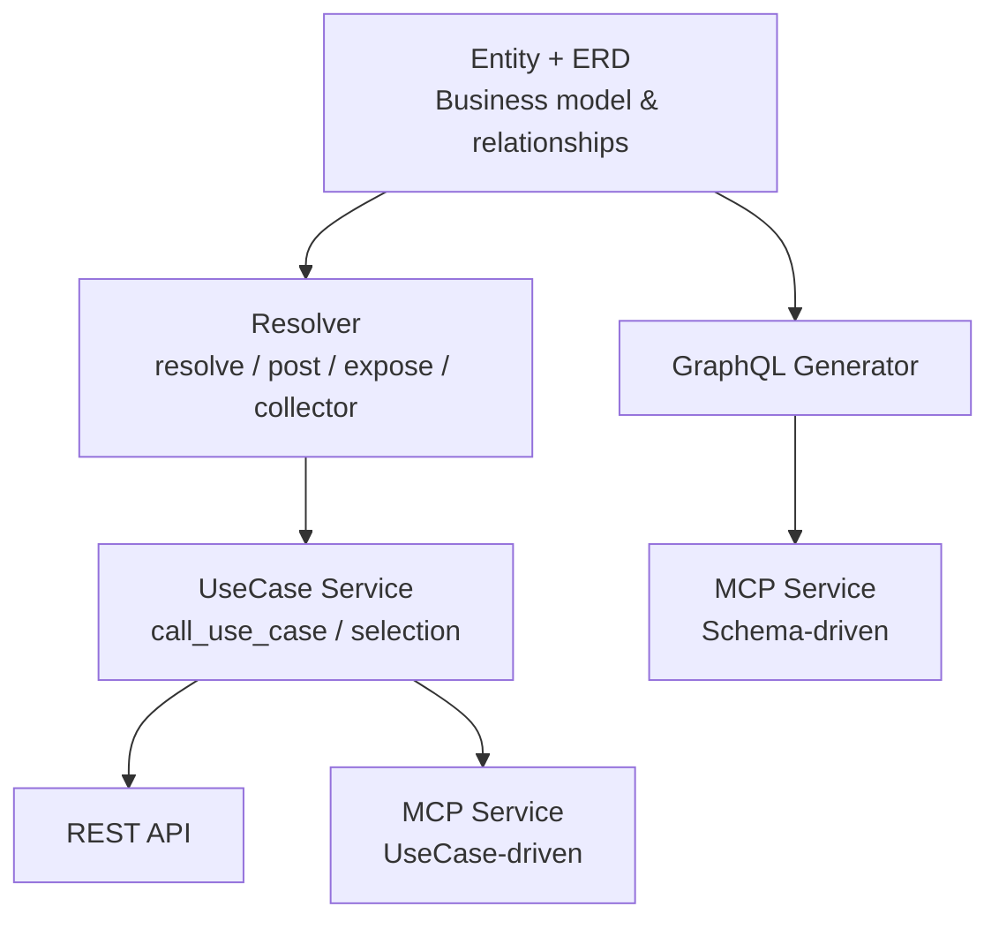

# Pydantic Resolve

> Entity-First Architecture for Python — define business entities, declare relationships, let the framework assemble your data.

[](https://pypi.python.org/pypi/pydantic-resolve)
[](https://pepy.tech/projects/pydantic-resolve)

[](https://github.com/allmonday/pydantic_resolve/actions/workflows/ci.yml)

[中文版](./README.zh.md)


---

## The ORM-First Trap

Most FastAPI projects follow the same pattern: define SQLAlchemy ORM models first, then create Pydantic schemas that mirror them. This "ORM-First" approach is so common that many developers have never questioned it. But as projects grow, it creates systemic problems:

| # | Problem | Symptom |
|---|---------|---------|
| 1 | Schema passively follows ORM | Same fields defined twice; API contract tied to DB design |
| 2 | Business concepts lost | Frontend sees `owner_id` instead of "task has an owner" |
| 3 | Data assembly has no home | Join logic scatters across Repository / Service / Route |
| 4 | Multi-source data is hard | Each new data source means new conversion code everywhere |
| 5 | Schema reuse is hard | Copy-paste for UserSummary / UserDetail / UserAvatar |

These are not individual tooling issues. They all stem from one root cause: **the absence of an independent business entity layer between the database and the API**.

```python
# The data assembly dilemma: where does this logic go?
@router.get("/tasks")
async def get_tasks():
    tasks = await task_service.get_tasks()

    # Collect IDs, batch query, build mapping, assemble result...
    user_ids = list({t.owner_id for t in tasks})
    users = await user_service.get_users_by_ids(user_ids)
    user_map = {u.id: u for u in users}

    result = []
    for task in tasks:
        task_dict = task.model_dump()
        task_dict['owner'] = user_map.get(task.owner_id)
        result.append(TaskResponse(**task_dict))
    return result
```

Whether this code lives in Repository, Service, or Route, the problem is the same: data assembly logic has no proper place in traditional three-layer architecture.

## Entity-First: Clean Architecture for Python

**pydantic-resolve** provides the missing layer. It implements Entity-First Architecture, which maps naturally to Clean Architecture:

| Clean Architecture Layer | pydantic-resolve Component |
|--------------------------|---------------------------|
| Enterprise Business Rules | Entity + ER Diagram |
| Application Business Rules | Resolver + resolve/post |
| Interface Adapters | Loader (data access) |
| Frameworks & Interfaces | Response + FastAPI routes |

For the full analysis with code examples and migration guidance, see [Entity-First Architecture](./docs/architecture_entity_first.md).

---

## How pydantic-resolve Works

**pydantic-resolve** provides three mechanisms:

| What you need | What you write | What the framework does |
|------|----------------|-------------------------|
| Load related data | `resolve_*` + `Loader(...)` | Batch lookups and map results back |
| Compute derived fields | `post_*` | Run after descendants are fully resolved |
| Reuse relationship declarations | ER Diagram + `AutoLoad` | Centralize relationship wiring for many models |

The same ERD also powers GraphQL queries, MCP services, and admin tools:


```mermaid
flowchart TB
    entity["Entity + ERD<br/>Business model & relationships"]
    resolve["Resolver<br/>resolve / post / expose / collector"]
    graphql["GraphQL Generator"]
    usecase["UseCase Service<br/>call_use_case / selection"]
    api["REST API"]
    mcp1["MCP Service<br/>UseCase-driven"]
    mcp2["MCP Service<br/>Schema-driven"]

    entity --> resolve
    entity --> graphql
    resolve --> usecase
    usecase --> api
    usecase --> mcp1
    graphql --> mcp2
```

If you just need to fix an N+1 problem on one endpoint, skip to [Quick Start](#quick-start).


## Quick Start

### Install

```bash
pip install pydantic-resolve
pip install pydantic-resolve[mcp]  # with MCP support
```

### The Example

Throughout the Quick Start, we build one API:

- `Sprint` has many `Task`
- `Task` has one `owner` (a `User`)
- The API also needs derived fields like `task_count` and `contributors`

Each step adds one concept on top of the previous code.

### Step 1: Load Related Data with `resolve_*`

Every response model has some fields already filled (from the database, from user input) and some fields that need to be fetched separately. `resolve_*` is how you declare those missing fields.

Start with the simplest case: each task has an `owner_id`, and you want an `owner` object on the response.

```python
from typing import Optional

from pydantic import BaseModel
from pydantic_resolve import Loader, Resolver, build_object


class UserView(BaseModel):
    id: int
    name: str


async def user_loader(user_ids: list[int]):
    users = await db.query(User).filter(User.id.in_(user_ids)).all()
    return build_object(users, user_ids, lambda user: user.id)


class TaskView(BaseModel):
    id: int
    title: str
    owner_id: int
    owner: Optional[UserView] = None

    def resolve_owner(self, loader=Loader(user_loader)):
        return loader.load(self.owner_id)


tasks = [TaskView.model_validate(task) for task in raw_tasks]
tasks = await Resolver().resolve(tasks)
```

That is the core idea of the library:

- `owner` is missing data, so you describe how to fetch it.
- `user_loader` receives all requested `owner_id` values together.
- `Resolver().resolve(...)` walks the model tree and fills the field.

A useful mental model is: **`resolve_*` means "this field needs data from outside the current node."**

### Step 2: Compose Nested Trees

Real APIs rarely have just one relationship. When `Sprint` contains many `Task`s, and each `Task` already knows how to load its `owner`, the resolver walks the tree and batch-loads everything recursively.

```python
from typing import List

from pydantic_resolve import build_list


async def task_loader(sprint_ids: list[int]):
    tasks = await db.query(Task).filter(Task.sprint_id.in_(sprint_ids)).all()
    return build_list(tasks, sprint_ids, lambda task: task.sprint_id)


class SprintView(BaseModel):
    id: int
    name: str
    tasks: List[TaskView] = []

    def resolve_tasks(self, loader=Loader(task_loader)):
        return loader.load(self.id)


sprints = [SprintView.model_validate(sprint) for sprint in raw_sprints]
sprints = await Resolver().resolve(sprints)
```

**Result:** one query per loader, regardless of how many sprints or tasks you load.

This is why `resolve_*` is the best place to start. You can get value from the library before learning any advanced features.

### Step 3: Compute Derived Fields with `post_*`

`task_count` and `contributor_names` don't come from a query — they're derived from data already on the model. `post_*` handles these: it runs **after** all nested `resolve_*` calls have finished.

```python
class SprintView(BaseModel):
    id: int
    name: str
    tasks: List[TaskView] = []
    task_count: int = 0
    contributor_names: list[str] = []

    def resolve_tasks(self, loader=Loader(task_loader)):
        return loader.load(self.id)

    def post_task_count(self):
        return len(self.tasks)

    def post_contributor_names(self):
        return sorted({task.owner.name for task in self.tasks if task.owner})
```

Execution order:

1. `resolve_tasks` loads the sprint's tasks.
2. Each `TaskView.resolve_owner` loads its owner.
3. `post_task_count` and `post_contributor_names` run after those nested fields are ready.

| | `resolve_*` | `post_*` |
|---|---|---|
| Needs external IO? | Yes | Usually no |
| Runs before descendants ready? | Yes | No |
| Good for counts, sums, formatting? | Sometimes | Yes |
| Return value resolved again? | Yes | No |

These two patterns cover most API endpoints. The next section covers cross-layer data flow — skip to [ER Diagram](#when-er-diagram--autoload-becomes-worth-it) if you don't need it yet.

---

## Advanced: Cross-Layer Data Flow

Reach for these tools when parent and child nodes need to coordinate without hard-coding references to each other.

- `ExposeAs`: send ancestor data downward
- `SendTo` + `Collector`: send child data upward

```python
from typing import Annotated

from pydantic_resolve import Collector, ExposeAs, SendTo


class SprintView(BaseModel):
    id: int
    name: Annotated[str, ExposeAs('sprint_name')]
    tasks: List[TaskView] = []
    contributors: list[UserView] = []

    def resolve_tasks(self, loader=Loader(task_loader)):
        return loader.load(self.id)

    def post_contributors(self, collector=Collector('contributors')):
        return collector.values()


class TaskView(BaseModel):
    id: int
    title: str
    owner_id: int
    owner: Annotated[Optional[UserView], SendTo('contributors')] = None
    full_title: str = ""

    def resolve_owner(self, loader=Loader(user_loader)):
        return loader.load(self.owner_id)

    def post_full_title(self, ancestor_context):
        return f"{ancestor_context['sprint_name']} / {self.title}"
```

Use this only when the shape of the tree matters:

- A child needs ancestor context, such as a sprint name or permissions.
- A parent needs to aggregate values from many descendants, such as all contributors or tags.

---

## When ER Diagram + AutoLoad Becomes Worth It

ER Diagram + `AutoLoad` is where Entity-First Architecture fully crystallizes: relationships become the stable core, and every Response is just a different view of the same Entity graph.

Up to this point, the Core API is enough. Stay there until relationship declarations start repeating across many response models.

A common signal is when you see the same relation described again and again:

- `TaskCard.resolve_owner`
- `TaskDetail.resolve_owner`
- `SprintBoard.resolve_tasks`
- `SprintReport.resolve_tasks`

At that point, the problem is no longer "how do I load this field?" but "where is the source of truth for relationships?"

### Cost vs Benefit

| Question | Hand-written Core API | ER Diagram + `AutoLoad` |
|----------|------------------------|--------------------------|
| First endpoint | Faster | Slower |
| Upfront setup | Low | Medium |
| Reusing the same relation in many models | Repetitive | Centralized |
| Changing a relationship later | Update many `resolve_*` methods | Update one ERD declaration |
| GraphQL / MCP generation | Separate work | Natural extension |

ERD mode asks for more discipline up front:

- Define entity classes.
- Declare relationships explicitly.
- Create `AutoLoad` from the same `diagram` used by the resolver.

That setup cost is real. The payoff is that relationship knowledge moves into one place.

### The Same Example in ERD Mode

Here is the same `Sprint -> Task -> User` example after moving relationship wiring into an ER Diagram:

```python
from typing import Annotated, Optional

from pydantic import BaseModel
from pydantic_resolve import Relationship, base_entity, config_global_resolver


BaseEntity = base_entity()


class UserEntity(BaseModel, BaseEntity):
    id: int
    name: str


class TaskEntity(BaseModel, BaseEntity):
    __relationships__ = [
        Relationship(fk='owner_id', name='owner', target=UserEntity, loader=user_loader)
    ]
    id: int
    title: str
    owner_id: int


class SprintEntity(BaseModel, BaseEntity):
    __relationships__ = [
        Relationship(fk='id', name='tasks', target=list[TaskEntity], loader=task_loader)
    ]
    id: int
    name: str


diagram = BaseEntity.get_diagram()
AutoLoad = diagram.create_auto_load()
config_global_resolver(diagram)


class TaskView(TaskEntity):
    owner: Annotated[Optional[UserEntity], AutoLoad()] = None


class SprintView(SprintEntity):
    tasks: Annotated[list[TaskView], AutoLoad()] = []
    task_count: int = 0

    def post_task_count(self):
        return len(self.tasks)
```

Compared with the Core API version:

- `resolve_owner` disappears.
- `resolve_tasks` disappears.
- The relationship definitions live in one place.
- `post_*` still works exactly the same.

If you want to hide internal FK fields such as `owner_id`, add `DefineSubset` on top of the ERD setup:

```python
from pydantic_resolve import DefineSubset


class TaskSummary(DefineSubset):
    __subset__ = (TaskEntity, ('id', 'title'))
    owner: Annotated[Optional[UserEntity], AutoLoad()] = None
```

### If Your ORM Already Knows the Relationships

Once ERD mode makes sense conceptually, you can let the ORM describe the relationships for you and import them into the application-layer ERD.

```python
from pydantic_resolve import ErDiagram
from pydantic_resolve.integration.mapping import Mapping
from pydantic_resolve.integration.sqlalchemy import build_relationship


entities = build_relationship(
    mappings=[
        Mapping(entity=SprintEntity, orm=SprintORM),
        Mapping(entity=TaskEntity, orm=TaskORM),
        Mapping(entity=UserEntity, orm=UserORM),
    ],
    session_factory=session_factory,
)

diagram = ErDiagram(entities=[]).add_relationship(entities)
AutoLoad = diagram.create_auto_load()
config_global_resolver(diagram)
```

`build_relationship` supports **SQLAlchemy**, **Django**, and **Tortoise ORM**. This is a good later optimization when your ORM metadata is already stable and you want to avoid duplicating relationship declarations.

### A Practical Adoption Path

1. Start with hand-written `resolve_*` and `post_*` on one endpoint.
2. Move repeated relations into ERD when multiple models need the same wiring.
3. Let `build_relationship()` read ORM metadata when the ORM is already the source of truth.

### When to Use Declarative Mode

**ERD mode is a good fit when:**

- The project has 3+ related entities reused across multiple response models.
- The team wants one shared place to inspect and discuss relationships.
- You want GraphQL or MCP generated from the same model graph.
- You want to hide FK fields while keeping relationship definitions centralized.

**Core API is usually enough when:**

- You only have a few loading requirements.
- You want each endpoint to stay maximally explicit.
- The response shape is still changing quickly.

[→ Full ERD-Driven Guide](https://allmonday.github.io/pydantic-resolve/erd_driven/)

## Integrations

The same ERD that drives REST APIs also powers GraphQL queries, MCP services, and admin tools.

### GraphQL

Generate GraphQL schema from ERD and execute queries:

```python
from pydantic_resolve.graphql import GraphQLHandler

handler = GraphQLHandler(diagram)
result = await handler.execute("{ users { id name posts { title } } }")
```

[→ GraphQL Documentation](./demo/graphql/README.md)

### MCP

Expose GraphQL APIs to AI agents (requires `pip install pydantic-resolve[mcp]`):

```python
from pydantic_resolve import AppConfig, create_mcp_server

mcp = create_mcp_server(apps=[AppConfig(name="blog", er_diagram=diagram)])
mcp.run()
```

[→ MCP Documentation](https://allmonday.github.io/pydantic-resolve/api/)

### Visualization

Interactive ERD exploration with [fastapi-voyager](https://github.com/allmonday/fastapi-voyager):

```python
from fastapi_voyager import create_voyager

app.mount('/voyager', create_voyager(app, er_diagram=diagram))
```

---

## Comparisons

### Entity-First (pydantic-resolve) vs ORM-First (traditional FastAPI)

| Dimension | ORM-First | Entity-First |
|-----------|-----------|-------------|
| Type source of truth | ORM model | Entity (Pydantic) |
| Relationship wiring | Repeated per endpoint | Centralized in ERD |
| Data assembly | Manual in Service/Route | Automatic via Resolver |
| N+1 prevention | Manual eager loading | Built-in DataLoader batching |
| Multi-data source | Scattered conversion code | Unified Loader interface |
| API contract stability | Tied to DB schema | Independent of DB |

### pydantic-resolve vs GraphQL

| Feature | GraphQL | pydantic-resolve |
|---------|---------|------------------|
| **N+1 Prevention** | Manual DataLoader setup | Built-in automatic batching |
| **Type Safety** | Separate schema files | Native Pydantic types |
| **Learning Curve** | Steep (Schema, Resolvers, Loaders) | Gentle (just Pydantic) |
| **Debugging** | Complex introspection | Standard Python debugging |
| **Integration** | Requires dedicated server | Works with any framework |
| **Query Flexibility** | Any client can query anything | Explicit API contracts |

---

## Resources

- 📖 [Full Documentation](https://allmonday.github.io/pydantic-resolve/)
- 🏛️ [Entity-First Architecture (full paper)](./docs/architecture_entity_first.md)
- 🚀 [Example Project](https://github.com/allmonday/composition-oriented-development-pattern)
- 🎮 [Live Demo](https://www.fastapi-voyager.top/voyager/)
- 🎮 [Live Demo - GraphQL](https://www.fastapi-voyager.top/graphql)
- 📚 [API Reference](https://allmonday.github.io/pydantic-resolve/api/)

---

## License

MIT License

## Author

tangkikodo (allmonday@126.com)
