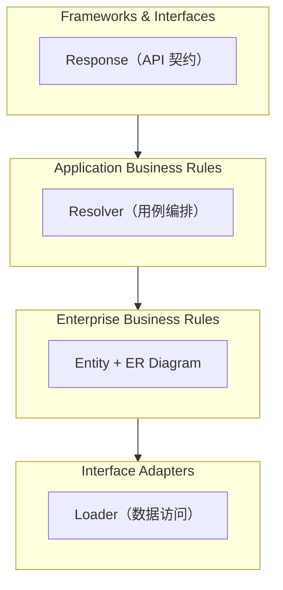
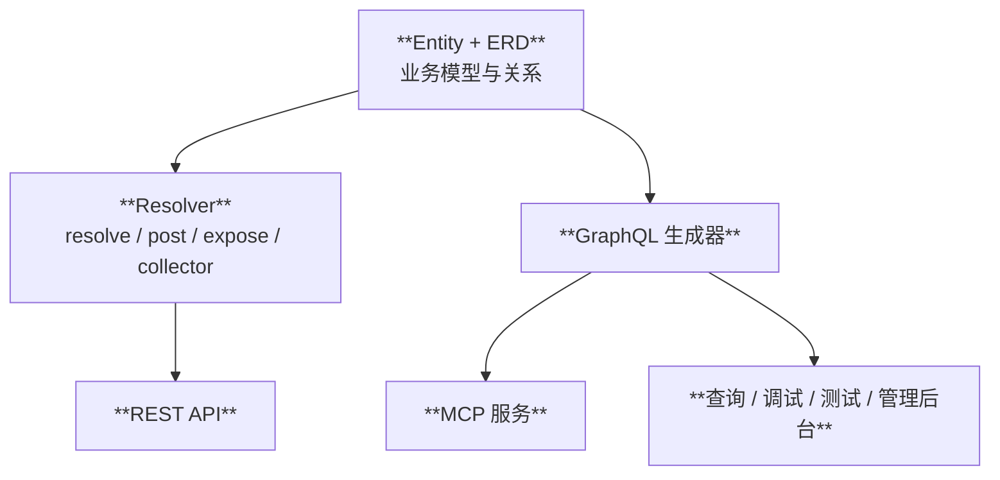

# Pydantic Resolve

> Python 的 Entity-First 架构框架 —— 定义业务实体，声明关系，让框架组装数据。

[](https://pypi.python.org/pypi/pydantic-resolve)
[](https://pepy.tech/projects/pydantic-resolve)

[](https://github.com/allmonday/pydantic_resolve/actions/workflows/ci.yml)

[English](./README.md)


---

## ORM-First 的陷阱

大多数 FastAPI 项目遵循相同的模式：先定义 SQLAlchemy ORM 模型，然后创建 Pydantic schema 来镜像它们。这种"ORM-First"的做法如此普遍，以至于很多开发者从未质疑过它。但随着项目规模增长，它会产生一系列系统性问题：

| # | 问题 | 表现 |
|---|------|------|
| 1 | Schema 被动跟随 ORM | 同一字段定义两次；API 契约受制于数据库设计 |
| 2 | 业务概念被丢失 | 前端看到 `owner_id` 而不是"任务有负责人" |
| 3 | 数据组装无处安放 | join 逻辑散落在 Repository / Service / Route 中 |
| 4 | 多数据源难以统一 | 每新增一个数据源就要写新的转换代码 |
| 5 | Schema 复用困难 | UserSummary / UserDetail / UserAvatar 靠复制粘贴 |

这些不是个别的工具问题。它们的共同根源是：**数据库和 API 之间缺少一个独立的业务实体层**。

```python
# 数据组装的困境：这段逻辑该放在哪里？
@router.get("/tasks")
async def get_tasks():
    tasks = await task_service.get_tasks()

    # 收集 ID、批量查询、构建映射、组装结果...
    user_ids = list({t.owner_id for t in tasks})
    users = await user_service.get_users_by_ids(user_ids)
    user_map = {u.id: u for u in users}

    result = []
    for task in tasks:
        task_dict = task.model_dump()
        task_dict['owner'] = user_map.get(task.owner_id)
        result.append(TaskResponse(**task_dict))
    return result
```

无论这段代码放在 Repository、Service 还是 Route 里，问题都一样：传统的三层架构中，数据组装逻辑没有合适的位置。

## Entity-First：Python 的整洁架构实现

**pydantic-resolve** 提供了缺失的那一层。它实现了 Entity-First 架构，与整洁架构（Clean Architecture）天然对应：



| 整洁架构层次 | pydantic-resolve 对应组件 |
|-------------|-------------------------|
| Enterprise Business Rules | Entity + ER Diagram |
| Application Business Rules | Resolver + resolve/post |
| Interface Adapters | Loader（数据访问） |
| Frameworks & Interfaces | Response + FastAPI 路由 |

完整分析、代码示例和迁移指南请参阅 [Entity-First Architecture](./docs/architecture_entity_first.zh.md)。

---

## pydantic-resolve 如何实现

**pydantic-resolve** 提供三个核心机制：`resolve_*` 加载关联数据、`post_*` 计算派生字段、ER Diagram + `AutoLoad` 集中管理关系定义。同一份 ERD 还能驱动 GraphQL 查询和 MCP 服务。



## 建议按这个顺序阅读

下面整篇 README 会始终复用同一个例子：

- `Sprint` 有多个 `Task`
- `Task` 有一个 `owner`
- 接口还需要 `task_count`、`contributors` 这类派生字段

概念的引入顺序是刻意安排的：

1. `resolve_*`：加载关联数据 — **Adapter 层**
2. `post_*`：在嵌套数据就绪后计算字段 — **Application 层**
3. `ExposeAs` / `SendTo`：当父子节点需要跨层协作时传递数据 — **横切关注点**
4. ER Diagram + `AutoLoad`：当关系定义开始重复时，把关系收敛到一个地方 — **Enterprise 层**

如果你只是想快速修复一个接口的 N+1 问题，可以直接跳到[快速开始](#快速开始)。

## pydantic-resolve 能解决什么

| 架构需求 | 你写什么 | 框架负责什么 |
|------|----------|--------------|
| 加载关联数据 | `resolve_*` + `Loader(...)` | 批量查询并把结果映射回对应节点 |
| 计算派生字段 | `post_*` | 在后代节点全部解析完成后执行 |
| 跨层传递数据 | `ExposeAs`、`SendTo`、`Collector` | 向下传上下文，或向上聚合结果 |
| 复用关系声明 | ER Diagram + `AutoLoad` | 将关系定义集中管理，供多个模型复用 |

## 快速开始

### 安装

```bash
pip install pydantic-resolve
pip install pydantic-resolve[mcp]  # 包含 MCP 支持
```

### Step 1：先用 `resolve_*` 解决一个 N+1 问题

用架构术语来说，`resolve_*` 就是你的 Adapter —— 它声明如何从当前节点之外获取数据。

先看最小可用场景：每个 task 上有 `owner_id`，接口响应里想拿到完整的 `owner` 对象。

```python
from typing import Optional

from pydantic import BaseModel
from pydantic_resolve import Loader, Resolver, build_object


class UserView(BaseModel):
    id: int
    name: str


async def user_loader(user_ids: list[int]):
    users = await db.query(User).filter(User.id.in_(user_ids)).all()
    return build_object(users, user_ids, lambda user: user.id)


class TaskView(BaseModel):
    id: int
    title: str
    owner_id: int
    owner: Optional[UserView] = None

    def resolve_owner(self, loader=Loader(user_loader)):
        return loader.load(self.owner_id)


tasks = [TaskView.model_validate(task) for task in raw_tasks]
tasks = await Resolver().resolve(tasks)
```

这就是整个库最核心的工作方式：

- `owner` 当前缺数据，所以你声明如何加载它。
- `user_loader` 会一次性收到所有被请求到的 `owner_id`。
- `Resolver().resolve(...)` 负责遍历模型树并补全字段。

一个很好用的心智模型是：**`resolve_*` 的含义就是"这个字段需要从当前节点之外拿数据"。**

### Step 2：把同样的模式扩展到嵌套树

现在再增加一层关系：`Sprint -> tasks`。由于 `TaskView` 已经知道怎么加载 `owner`，resolver 会继续递归往下处理。

```python
from typing import List

from pydantic_resolve import build_list


async def task_loader(sprint_ids: list[int]):
    tasks = await db.query(Task).filter(Task.sprint_id.in_(sprint_ids)).all()
    return build_list(tasks, sprint_ids, lambda task: task.sprint_id)


class SprintView(BaseModel):
    id: int
    name: str
    tasks: List[TaskView] = []

    def resolve_tasks(self, loader=Loader(task_loader)):
        return loader.load(self.id)


sprints = [SprintView.model_validate(sprint) for sprint in raw_sprints]
sprints = await Resolver().resolve(sprints)
```

**结果：** 无论有多少个 sprint、多少个 task，每个 loader 都只需要执行一次查询。

这也是为什么 `resolve_*` 是最适合的入门点。你不需要先学完整套概念，就能先获得实际收益。

### Step 3：用 `post_*` 处理派生字段

`post_*` 代表 Application Business Rules 层 —— 它操作的是已经组装完成的数据。

最简单的理解方式是：

- `resolve_*` 用来加载外部数据。
- `post_*` 用来在当前子树已经组装完成之后，计算派生字段。

在同一个 sprint 例子里，`task_count` 和 `contributor_names` 都不是从别的表直接查出来的；它们是基于已经解析完成的 `tasks` 和 `owner` 推导出来的。

```python
class SprintView(BaseModel):
    id: int
    name: str
    tasks: List[TaskView] = []
    task_count: int = 0
    contributor_names: list[str] = []

    def resolve_tasks(self, loader=Loader(task_loader)):
        return loader.load(self.id)

    def post_task_count(self):
        return len(self.tasks)

    def post_contributor_names(self):
        return sorted({task.owner.name for task in self.tasks if task.owner})
```

一个 sprint 上的执行顺序可以理解为：

1. `resolve_tasks` 先把该 sprint 的 tasks 加载出来。
2. 每个 `TaskView.resolve_owner` 再继续把 owner 加载出来。
3. 等这些嵌套字段都准备好之后，才执行 `post_task_count` 和 `post_contributor_names`。

关键点就在这里。`post_*` 不是另一种加载关联数据的方式，它的职责是对**已经拿到的数据**做收尾、汇总、格式化。

可以用下面这个简单对照表来区分：

| 问题 | `resolve_*` | `post_*` |
|------|-------------|----------|
| 需要外部 IO 吗？ | 是 | 通常不需要 |
| 执行时后代节点已经准备好了吗？ | 没有 | 是 |
| 适合做计数、求和、标签整理、格式化吗？ | 有时可以 | 非常适合 |
| 返回值还会继续被递归 resolve 吗？ | 会 | 不会 |

`post_*` 还可以接收 `context`、`parent`、`ancestor_context`、`collector` 等参数，但理解基础模式并不依赖这些高级能力。

### Step 4：跨层数据流是进阶能力

大部分用户第一次阅读时可以先跳过这一节。只有当父节点和子节点需要跨层协作、又不想写死相互引用时，再使用这些工具。

- `ExposeAs`：把祖先数据向下传递
- `SendTo` + `Collector`：把子孙数据向上汇总

```python
from typing import Annotated

from pydantic_resolve import Collector, ExposeAs, SendTo


class SprintView(BaseModel):
    id: int
    name: Annotated[str, ExposeAs('sprint_name')]
    tasks: List[TaskView] = []
    contributors: list[UserView] = []

    def resolve_tasks(self, loader=Loader(task_loader)):
        return loader.load(self.id)

    def post_contributors(self, collector=Collector('contributors')):
        return collector.values()


class TaskView(BaseModel):
    id: int
    title: str
    owner_id: int
    owner: Annotated[Optional[UserView], SendTo('contributors')] = None
    full_title: str = ""

    def resolve_owner(self, loader=Loader(user_loader)):
        return loader.load(self.owner_id)

    def post_full_title(self, ancestor_context):
        return f"{ancestor_context['sprint_name']} / {self.title}"
```

这类能力适合下面两种情况：

- 子节点需要祖先上下文，比如 sprint 名称、权限信息、租户配置。
- 父节点需要聚合多个后代节点的结果，比如全部贡献者、全部标签。

---

## 什么时候值得引入 ER Diagram + AutoLoad

ER Diagram + `AutoLoad` 是 Entity-First 架构完全成型的地方：关系成为稳定的内核，每个 Response 都只是同一张 Entity 图的不同视图。

到这里为止，Core API 已经足够实用。只有当你发现关系定义开始在多个响应模型里反复出现时，才值得继续往 ERD 模式走。

一个很常见的信号是，你开始不断写出类似这些方法：

- `TaskCard.resolve_owner`
- `TaskDetail.resolve_owner`
- `SprintBoard.resolve_tasks`
- `SprintReport.resolve_tasks`

这时问题已经不再是"这个字段怎么加载"，而是"关系定义的唯一事实来源应该放在哪里"。

### 成本与收益

| 问题 | 手写 Core API | ER Diagram + `AutoLoad` |
|------|----------------|--------------------------|
| 第一个接口上手速度 | 更快 | 更慢 |
| 前期配置成本 | 低 | 中 |
| 同一关系在多个模型里复用 | 容易重复 | 可以集中管理 |
| 后续修改某条关系 | 要改多个 `resolve_*` | 改一处 ERD 声明即可 |
| GraphQL / MCP 生成 | 需要单独处理 | 很自然地延伸出去 |

ERD 模式确实要求你在前期多做一些整理：

- 先定义实体类。
- 显式声明关系。
- 从和 resolver 相同的 `diagram` 里创建 `AutoLoad`。

这些都是实际成本。但对应的收益也很直接：关系知识终于能收敛到一个地方。

### 同一个例子换成 ERD 模式

下面还是同一个 `Sprint -> Task -> User` 例子，只是把关系定义从响应模型中抽出来，放进 ER Diagram：

```python
from typing import Annotated, Optional

from pydantic import BaseModel
from pydantic_resolve import Relationship, base_entity, config_global_resolver


BaseEntity = base_entity()


class UserEntity(BaseModel, BaseEntity):
    id: int
    name: str


class TaskEntity(BaseModel, BaseEntity):
    __relationships__ = [
        Relationship(fk='owner_id', name='owner', target=UserEntity, loader=user_loader)
    ]
    id: int
    title: str
    owner_id: int


class SprintEntity(BaseModel, BaseEntity):
    __relationships__ = [
        Relationship(fk='id', name='tasks', target=list[TaskEntity], loader=task_loader)
    ]
    id: int
    name: str


diagram = BaseEntity.get_diagram()
AutoLoad = diagram.create_auto_load()
config_global_resolver(diagram)


class TaskView(TaskEntity):
    owner: Annotated[Optional[UserEntity], AutoLoad()] = None


class SprintView(SprintEntity):
    tasks: Annotated[list[TaskView], AutoLoad()] = []
    task_count: int = 0

    def post_task_count(self):
        return len(self.tasks)
```

和 Core API 版本相比：

- `resolve_owner` 不见了。
- `resolve_tasks` 不见了。
- 关系定义集中到了一个地方。
- `post_*` 的用法完全不变。

如果你还希望把 `owner_id` 这类内部 FK 字段从外部响应里隐藏掉，可以在 ERD 基础上叠加 `DefineSubset`：

```python
from pydantic_resolve import DefineSubset


class TaskSummary(DefineSubset):
    __subset__ = (TaskEntity, ('id', 'title'))
    owner: Annotated[Optional[UserEntity], AutoLoad()] = None
```

### 如果 ORM 本身已经知道关系

当你已经接受了 ERD 模式的思路，下一步就可以让 ORM 关系元数据直接参与进来，减少重复声明。

```python
from pydantic_resolve import ErDiagram
from pydantic_resolve.integration.mapping import Mapping
from pydantic_resolve.integration.sqlalchemy import build_relationship


entities = build_relationship(
    mappings=[
        Mapping(entity=SprintEntity, orm=SprintORM),
        Mapping(entity=TaskEntity, orm=TaskORM),
        Mapping(entity=UserEntity, orm=UserORM),
    ],
    session_factory=session_factory,
)

diagram = ErDiagram(entities=[]).add_relationship(entities)
AutoLoad = diagram.create_auto_load()
config_global_resolver(diagram)
```

`build_relationship` 支持 **SQLAlchemy**、**Django** 和 **Tortoise ORM**。这更适合作为后续优化步骤：当你的 ORM 元数据已经稳定，而且你不想再手写重复关系时，再引入它。

### 一个务实的演进路径

1. 先在单个接口上手写 `resolve_*` 和 `post_*`。
2. 当多个模型开始复用同一批关系时，再把关系收敛进 ERD。
3. 当 ORM 已经成为事实来源时，再让 `build_relationship()` 去读取 ORM 元数据。

### 什么时候用声明式模式

**适合进入 ERD 模式的场景：**

- 项目里有 3 个以上相关实体，并且这些关系会在多个响应模型中重复出现。
- 团队需要一个可以共同讨论、共同维护的关系定义中心。
- 你希望 GraphQL 和 MCP 也复用同一套模型关系。
- 你希望隐藏 FK 字段，同时保留统一的关系声明。

**继续停留在 Core API 更合适的场景：**

- 当前只有少量数据加载需求。
- 你希望每个接口都保持显式、直观。
- 响应结构还在快速变化，暂时不值得抽象。

[→ 完整 ERD 驱动指南](https://allmonday.github.io/pydantic-resolve/erd_driven/)

## 集成

### GraphQL

从 ERD 生成 GraphQL schema 并执行查询：

```python
from pydantic_resolve.graphql import GraphQLHandler

handler = GraphQLHandler(diagram)
result = await handler.execute("{ users { id name posts { title } } }")
```

[→ GraphQL 文档](./demo/graphql/README.md)

### MCP

将 GraphQL API 暴露给 AI 代理使用（需要 `pip install pydantic-resolve[mcp]`）：

```python
from pydantic_resolve import AppConfig, create_mcp_server

mcp = create_mcp_server(apps=[AppConfig(name="blog", er_diagram=diagram)])
mcp.run()
```

[→ MCP 文档](https://allmonday.github.io/pydantic-resolve/api/)

### 可视化

借助 [fastapi-voyager](https://github.com/allmonday/fastapi-voyager) 进行交互式 ERD 浏览：

```python
from fastapi_voyager import create_voyager

app.mount('/voyager', create_voyager(app, er_diagram=diagram))
```

---

## 对比

### Entity-First（pydantic-resolve）vs ORM-First（传统 FastAPI）

| 维度 | ORM-First | Entity-First |
|------|-----------|-------------|
| 类型定义来源 | ORM 模型 | Entity（Pydantic） |
| 关系定义 | 每个接口重复编写 | 集中在 ERD 中 |
| 数据组装 | Service / Route 中手动完成 | Resolver 自动完成 |
| N+1 预防 | 手动配置 eager loading | 内置 DataLoader 批量加载 |
| 多数据源 | 分散的转换代码 | 统一的 Loader 接口 |
| API 契约稳定性 | 绑定数据库结构 | 独立于数据库 |

### pydantic-resolve vs GraphQL

| 特性 | GraphQL | pydantic-resolve |
|------|---------|------------------|
| **N+1 预防** | 手动配置 DataLoader | 内置自动批量加载 |
| **类型安全** | 需要额外 schema 文件 | 直接使用 Pydantic 类型 |
| **学习曲线** | 陡峭（Schema、Resolvers、Loaders） | 平缓（主要理解 Pydantic 模型） |
| **调试** | 依赖复杂的内省机制 | 标准 Python 调试方式 |
| **集成** | 需要专用服务器 | 可与任意框架配合 |
| **查询灵活性** | 客户端几乎可以请求任意结构 | 由服务端明确给出 API 契约 |

---

## 资源

- 📖 [完整文档](https://allmonday.github.io/pydantic-resolve/)
- 🏛️ [Entity-First Architecture（完整论文）](./docs/architecture_entity_first.zh.md)
- 🚀 [示例项目](https://github.com/allmonday/composition-oriented-development-pattern)
- 🎮 [在线演示](https://www.fastapi-voyager.top/voyager/)
- 🎮 [在线演示 - GraphQL](https://www.fastapi-voyager.top/graphql)
- 📚 [API 参考](https://allmonday.github.io/pydantic-resolve/api/)

---

## 许可证

MIT License

## 作者

tangkikodo (allmonday@126.com)
