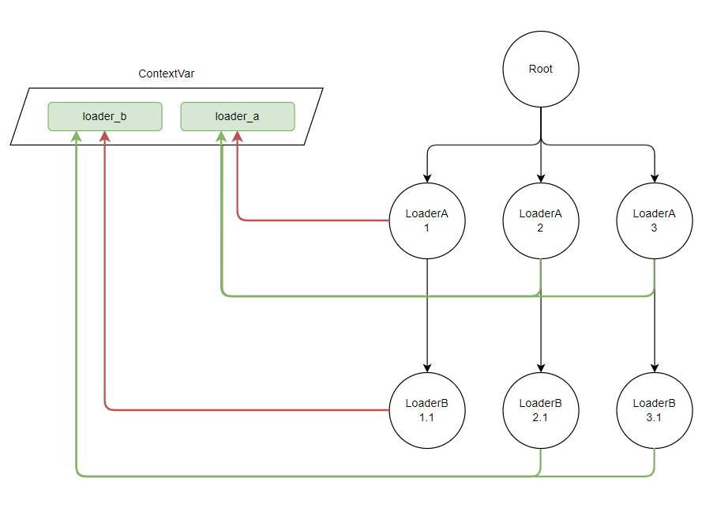

# LoaderDepend的用途

## 背景介绍
如果你使用过dataloader, 不论是js还是python的，都会遇到一个问题，如何为单独的一个请求创建独立的dataloader?

以 python 的 `strawberry` 来举例子：

```python
@strawberry.type
class User:
    id: strawberry.ID

async def load_users(keys) -> List[User]:
    return [User(id=key) for key in keys]

loader = DataLoader(load_fn=load_users)

@strawberry.type
class Query:
    @strawberry.field
    async def get_user(self, id: strawberry.ID) -> User:
        return await loader.load(id)

schema = strawberry.Schema(query=Query)
```

如果单独实例化的话，会导致所有的请求都使用同一个dataloader, 由于loader本身是有缓存优化机制的，所以即使内容更新之后，依然会返回缓存的历史数据。

因此 `strawberry` 的处理方式是：

```python
@strawberry.type
class User:
    id: strawberry.ID

async def load_users(keys) -> List[User]:
    return [User(id=key) for key in keys]

class MyGraphQL(GraphQL):
    async def get_context(
        self, request: Union[Request, WebSocket], response: Optional[Response]
    ) -> Any:
        return {"user_loader": DataLoader(load_fn=load_users)}


@strawberry.type
class Query:
    @strawberry.field
    async def get_user(self, info: Info, id: strawberry.ID) -> User:
        return await info.context["user_loader"].load(id)

schema = strawberry.Schema(query=Query)
app = MyGraphQL(schema)
```

开发者需要在`get_context`中去初始化loader, 然后框架会负责在每次request的时候会执行初始化。 这样每个请求就会有独立的loader, 解决了多次请求被缓存的问题。

其中的原理是：contextvars 在 await 的时候会做一次浅拷贝，所以外层的context可以被内部读到，因此手动在最外层（request的时候) 初始化一个引用类型(dict)之后，那么在 request 内部自然就能获取到引用类型内的loader。

这个方法虽然好，但存在两个问题：

1. 需要手动去维护 `get_context`, 每当新增了一个 DataLoader, 就需要去里面添加, 而且实际执行 `.load` 的地方也要从context 里面取loader。
2. 存在初始化了loaders却没有被使用到的情况，比如整个Query 有 N 个loader，但是用户的查询实际只用到了1个，那么其他loader 的初始化就浪费了。而且作为公共区域东西多了之后代码维护会不清晰。(重要)

而 `graphene` 就更加任性了，把loader 的活交给了 [aiodataloader](https://github.com/graphql/dataloader#creating-a-new-dataloader-per-request), 如果翻阅文档的话，会发现处理的思路也是类似的，只是需要手动去维护创建过程。

## 解决方法

我所期望的功能是：

1. 初始化按需执行，比如我的整个schema 里面只存在 DataLoaderA, 那我希望只有DataLoaderA 被实例化
2. 不希望在某个reqeust或者 middleware中干手动维护初始化。

其实这两件事情说的是同一个问题，就是如何把初始化的事情依赖反转到 resolve_field 方法中。

具体转化为代码：

```python
class CommentSchema(BaseModel):
    id: int
    task_id: int
    content: str

    feedbacks: List[FeedbackSchema]  = []
    def resolve_feedbacks(self, loader=LoaderDepend(FeedbackLoader)):
        return loader.load(self.id)

class TaskSchema(BaseModel):
    id: int
    name: str

    comments: List[CommentSchema]  = []
    def resolve_comments(self, loader=LoaderDepend(CommentLoader)):
        return loader.load(self.id)
```

就是说，我只要这样申明好loader，其他的事情就一律不用操心。那么，这做得到么？

得益于`pydantic-resolve` 存在一个手动执行`resolve`的过程，于是有一个思路：

1. contextvar 是浅拷贝，所以存的如果是引用类型，那么在最外层定义的dict，可以被所有内层读到。可以在Resolver初始化的时候定义。
2. 假如 `tasks: list[TaskSchema]` 有n个，我希望在第一次遇到的时候把loader 初始化并缓存，后续其他都使用缓存的loader。
3. LoaderDepend 里面存放的是 DataLoader类，做为default 参数传入resolve_field 方法
4. 执行resolve_field之前，利用inspect.signature 分析 default 参数，执行初始化和缓存的逻辑。

总体就是一个lazy的路子，到实际执行的时候去处理初始化流程。

下图中 1 会执行LoaderA 初始化，2，3则是读取缓存, 1.1 会执行LoaderB初始化，2.1，3.1 读取缓存



代码如下：

```python
class Resolver:
    def __init__(self):
        self.ctx = contextvars.ContextVar('pydantic_resolve_internal_context', default={})
    
    def exec_method(self, method):
        signature = inspect.signature(method)
        params = {}

        for k, v in signature.parameters.items():
            if isinstance(v.default, Depends):
                cache_key = str(v.default.dependency.__name__)
                cache = self.ctx.get()

                hit = cache.get(cache_key, None)
                if hit:
                    instance = hit
                else:
                    instance = v.default.dependency()
                    cache[cache_key] = instance
                    self.ctx.set(cache)

                params[k] = instance
                
        return method(**params)
```

## 遗留问题

有些DataLoader的实现可能需要一个外部的查询条件， 比如查询用户的absense信息的时候，除了user_key 之外，还需要额外提供其他全局filter 比如sprint_id)。 这种全局变量从load参数走会显得非常啰嗦。

这种时候就依然需要借助contextvars 在外部设置变量。 以一段项目代码为例：

```python
async def get_team_users_load(team_id: int, sprint_id: Optional[int], session: AsyncSession):
    ctx.team_id_context.set(team_id)      # set global filter
    ctx.sprint_id_context.set(sprint_id)  # set global filter

    res = await session.execute(select(User)
                                .join(UserTeam, UserTeam.user_id == User.id)
                                .filter(UserTeam.team_id == team_id))
    db_users = res.scalars()
    users = [schema.UserLoadUser(id=u.id, employee_id=u.employee_id, name=u.name) 
                for u in db_users]

    results = await Resolver().resolve(users)  # resolve
    return results
```

```python
class AbsenseLoader(DataLoader):
    async def batch_load_fn(self, user_keys):
        async with async_session() as session, session.begin():
            sprint_id = ctx.sprint_id_context.get()  # read global filter

            sprint_stmt = Sprint.status == SprintStatusEnum.ongoing if not sprint_id else Sprint.id == sprint_id
            res = await session.execute(select(SprintAbsence)
                                        .join(Sprint, Sprint.id == SprintAbsence.sprint_id)
                                        .join(User, User.id == SprintAbsence.user_id)
                                        .filter(sprint_stmt)
                                        .filter(SprintAbsence.user_id.in_(user_keys)))
            rows = res.scalars().all()
            dct = {}
            for row in rows:
                dct[row.user_id] = row.hours
            return [dct.get(k, 0) for k in user_keys]
```

期望的设置方式为：

```python
loader_filters = {
    AbsenseLoader: {'sprint_id': 10}, 
    OtherLoader: {field: 'value_x'}
}
results = await Resolver(loader_filters=loader_filters).resolve(users)
```

> 如果需要filter但是却没有设置, 该情况下要抛异常
