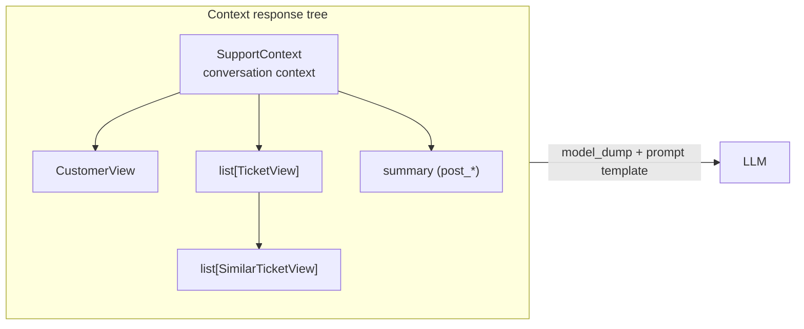
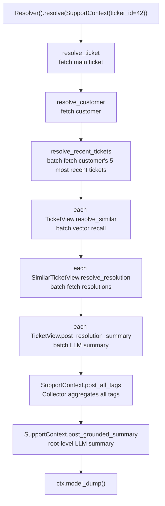
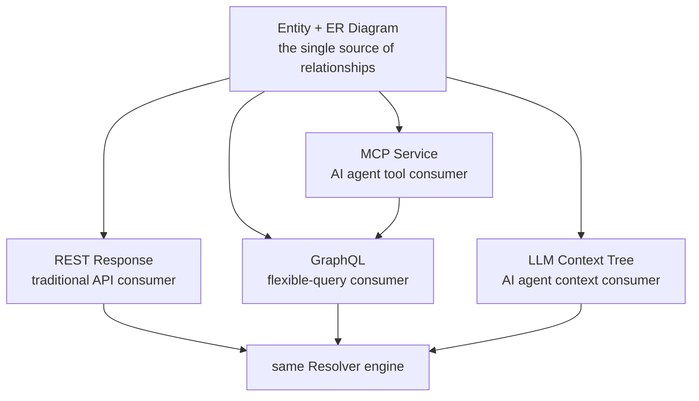

# Treat the Context Window as a Data Assembly Problem: Where pydantic-resolve Fits in AI Workflows

## A typical piece of AI code

Open any service in your project that calls an LLM. You will most likely see a function that looks something like this:

```python
async def build_support_context(ticket_id: int) -> str:
    ticket = await db.get(Ticket, ticket_id)
    customer = await db.get(Customer, ticket.customer_id)

    recent_tickets = await db.query(Ticket).filter(
        Ticket.customer_id == customer.id
    ).order_by(Ticket.created_at.desc()).limit(5).all()

    # Retrieve similar past tickets
    embedding = await embed(ticket.description)
    similar = await vector_store.search(embedding, top_k=3)

    # Each similar ticket needs its resolution pulled in
    similar_with_resolution = []
    for s in similar:
        resolution = await db.query(Resolution).filter(
            Resolution.ticket_id == s.id
        ).first()
        similar_with_resolution.append({
            "title": s.title,
            "resolution": resolution.text if resolution else "",
        })

    # Collect tags
    all_tags = []
    for t in recent_tickets:
        all_tags.extend(t.tags)

    # Finally, ask the LLM to summarize
    summary = await llm.summarize(
        customer=customer,
        recent_tickets=recent_tickets,
        similar=similar_with_resolution,
    )

    return f"""
Customer: {customer.name} (id={customer.id})
Recent tickets: {len(recent_tickets)}
Tags: {', '.join(set(all_tags))}
Similar past cases:
{format_similar(similar_with_resolution)}
Summary: {summary}
"""
```

The function is not long, but the problem is already visible: **this is a `build_context()` function that is fundamentally doing data assembly, but its shape is entirely procedural**.

It is isomorphic to the FastAPI code that [Clean Architecture for Python](./architecture_entity_first.md) criticizes — only "assembling an API response" has been swapped for "assembling a prompt context". The problems are unchanged:

- Data-fetching logic is scattered through the function body with no structure.
- Dependencies of derived fields (`all_tags`, `summary`) are held together by comments and line ordering.
- Vector retrieval, database queries, and LLM calls live in one function. Every new piece of context means editing this function.
- Concurrency optimization (fetching similar tickets in parallel) requires a rewrite.
- Reuse — say, exposing `recent_tickets` to the frontend too — is impossible.

This code is not badly written. **It has no home**.

## "The context window" is a data assembly problem

When people discuss LLM applications, attention usually lands first on prompt templates, model choice, and temperature. Those matter — but as applications grow, **the real bottleneck shifts from prompt engineering to context assembly**.

The reason: prompt templates are stable, model choice is stable, **but "what data to feed the LLM" differs on every call**. A support agent handling ticket A and ticket B can share the same prompt template, yet the underlying data-assembly path may diverge completely — A is a VIP customer requiring SLA context and similar-case retrieval; B is a regular customer needing only the basics.

This "same template, different data-assembly path" requirement **is exactly what API response assembly does**. Your FastAPI project already solves it — different endpoints assemble different response trees. An LLM context is just another endpoint, only the consumer is an LLM rather than an HTTP client.

Once that perspective lands, the problem becomes concrete. The things pydantic-resolve solves well on the API side hold equally well on the LLM side:

| API response assembly | LLM context assembly |
|---|---|
| Multi-level nesting (Sprint → Task → Owner) | Multi-level nesting (Customer → Ticket → Similar Ticket) |
| Batch-load related data | Batch-recall related context |
| Derived fields (`task_count`, `contributors`) | Derived context (`summary`, `aggregated_tags`) |
| N+1 database queries | N+1 vector retrievals + N+1 LLM calls |
| Cross-subtree aggregation (deduplicate all owners) | Cross-subtree aggregation (merge evidence across similar tickets) |

**Every item in the right column already has a solution on the left.** We only need to bring the same machinery over.

## Three classic assembly pain points

Breaking the `build_support_context` snippet apart reveals three symptom classes. They are not specific to support scenarios — they recur in nearly every LLM application.

### Pain point 1: N+1 LLM calls

```python
for s in similar:
    resolution = await db.query(Resolution).filter(...).first()
```

This is a classic N+1 on the ORM side. In the LLM world it gets worse — you might be calling the LLM in the loop:

```python
for s in similar:
    s.summary = await llm.summarize(s.description)   # 5 similar tickets = 5 serial LLM calls
```

LLM calls are an order of magnitude more expensive than database queries. Serial N+1 directly amplifies cost and latency. **And code without a batching abstraction always ends up like this**, because nobody manually maintains a batch queue inside procedural code.

!!! example "Real-world evidence: open-webui"
    `backend/open_webui/utils/middleware.py:2635` (commit `02dc3e6`, 2026-06)

    ```python
    for sid in all_skill_ids:
        if sid in accessible_skill_ids:
            s = await SkillsModel.get_skill_by_id(sid)   # serial N+1
    ```

    The same file has at least three more instances (folder lookup, tool connection, access check), all `await`-inside-a-`for`. open-webui is a production-grade AI application, and it still falls into this trap — evidence that the trap is structural, not a coding-quality issue.

### Pain point 2: Cross-subtree aggregation has no home

```python
all_tags = []
for t in recent_tickets:
    all_tags.extend(t.tags)
```

This "walk the subtree and collect things" logic, in procedural code, can only be written as global variables plus a for loop. As soon as aggregation needs grow — all similar-ticket resolutions, all products mentioned, all features touched — you get a pile of `all_xxx = []` lists scattered across the function, held together by convention.

What makes this worse is that **these aggregations are inherently "parent depends on children"**. In procedural code, they are separated from child-fetch logic. Fetching is above the `for` loop; aggregation is below. The parent→child dependency has been reduced to "line number ordering".

!!! example "Real-world evidence: open-webui"
    `backend/open_webui/utils/middleware.py` chat-completion orchestration (commit `02dc3e6`, 2026-06)

    ```python
    sources = []
    sources.extend(flags.get('sources', []))   # line 2882
    sources.extend(flags.get('sources', []))   # line 2892
    sources = [s for s in sources if ...]      # line 2909: mid-function reassignment
    events.append({'sources': sources})        # line 2916: another accumulator
    ```

    `sources` and `events` have no structured parent-child dependency declaration — they're stitched across handlers with `extend`. This is exactly the "aggregation has no home" pattern from the previous section — not a one-off defect, but the inevitable shape of procedural code that has to coordinate context across multiple sources.

### Pain point 3: Prompt shape is welded to data fetching

```python
return f"""
Customer: {customer.name} (id={customer.id})
...
Summary: {summary}
"""
```

This final f-string welds three things together: **data fetching, derived computation, prompt format**. Touching the prompt template means touching the data code; touching data fetching means touching the prompt text; adding a field means editing from top to bottom.

This is the limit of procedural code: **it has no structure, so every change is invasive**.

!!! example "Real-world evidence: open-webui"
    `backend/open_webui/utils/middleware.py:931` `get_source_context` (commit `02dc3e6`, 2026-06)

    ```python
    def get_source_context(sources, ...) -> str:
        context_string = ''
        for source in sources:
            for doc, meta in zip(source.get('document', []),
                                 source.get('metadata', [])):
                context_string += (
                    f'<source id="{...}" name="{...}">{body}</source>\n'
                )
        return context_string
    ```

    Iteration, XML template string, and f-string formatting all welded into one function — structurally identical to the hypothetical `build_support_context()` at the top of this article. Not a coincidence; this is the typical shape of procedural LLM code.

## Redefinition: LLM context = response tree

With the three pain points diagnosed, the fix is clear: **assemble the LLM context as a response tree**.

On the API side, you already speak this language:

```python
class SprintView(BaseModel):
    id: int
    name: str
    tasks: list[TaskView] = []
    task_count: int = 0           # post_*

    def resolve_tasks(self, loader=Loader(task_loader)):
        return loader.load(self.id)

    def post_task_count(self):
        return len(self.tasks)
```

Bringing this language to the LLM case requires only a change of perspective: **the tree root is no longer Sprint but some conversation context; the leaves are no longer Task but some field an LLM will read**. When you `model_dump()` the result, you either feed it to a prompt template or JSON-serialize it as a tool-call argument.



The tree shape is defined by your Pydantic model; data is fetched by `resolve_*`; derived fields are computed by `post_*`; cross-subtree aggregation is handled by `Collector`. **Same machinery as an API response, same Resolver, same batch loaders.**

## Mechanism mapping

Putting that perspective into code gives three one-to-one mappings:

| AI assembly need | pydantic-resolve primitive | Role in the LLM scenario |
|---|---|---|
| Pull external knowledge (DB, vector store, external APIs) | `resolve_*` + `Loader` | Recall related docs, similar tickets, user profile |
| Call the LLM for derivation after subtree is ready | `post_*` (supports async) | Summary, classification, risk assessment — `post_*` execution timing guarantees a complete subtree |
| Aggregate evidence / tags / fragments across subtrees | `Collector` + `SendTo` | Pool signals scattered across leaves back to the root, feed them to the LLM as grounding |

These three primitives cover the three pain points exactly. The next section walks through a concrete example.

## Walkthrough: a customer support agent context

Rewriting the opening `build_support_context` with pydantic-resolve. First, the model definitions:

```python
from typing import Annotated, Optional
from pydantic import BaseModel
from pydantic_resolve import (
    Collector, Loader, Resolver, SendTo, build_list, build_object,
)


# ---------- Data access layer (loaders) ----------

async def customer_loader(customer_ids: list[int]) -> list[CustomerView]:
    rows = await db.query(Customer).filter(Customer.id.in_(customer_ids)).all()
    return build_object(rows, customer_ids, lambda c: c.id)

async def ticket_loader(ticket_ids: list[int]) -> list[dict]:
    # Used to pull a customer's most recent tickets by customer_id
    rows = await db.query(Ticket).filter(
        Ticket.customer_id.in_(ticket_ids)
    ).order_by(Ticket.created_at.desc()).limit(5 * len(ticket_ids)).all()
    return build_list(rows, ticket_ids, lambda t: t.customer_id)

async def similar_ticket_loader(ticket_ids: list[int]) -> dict[int, list[dict]]:
    # One batched vector recall: search all query embeddings at once
    queries = await db.query(Ticket).filter(Ticket.id.in_(ticket_ids)).all()
    embeddings = await embed_batch([t.description for t in queries])
    results = await vector_store.batch_search(embeddings, top_k=3)
    return {
        t.id: [r.dict() for r in results[i]]
        for i, t in enumerate(queries)
    }


# ---------- Context model tree ----------

class SimilarTicketView(BaseModel):
    id: int
    title: str
    resolution: str = ""

    def resolve_resolution(self, loader=Loader(resolution_loader)):
        return loader.load(self.id)


class TicketView(BaseModel):
    id: int
    title: str
    description: str
    customer_id: int
    tags: list[str] = []
    similar: list[SimilarTicketView] = []
    resolution_summary: str = ""   # post_*, LLM-derived

    def resolve_similar(self, loader=Loader(similar_ticket_loader)):
        return loader.load(self.id)

    async def post_resolution_summary(self):
        # LLM called after subtree is ready: every similar.resolution has been resolved
        if not self.similar:
            return ""
        return await llm.summarize_resolutions(
            ticket_title=self.title,
            resolutions=[s.resolution for s in self.similar],
        )


class SupportContext(BaseModel):
    """Root context: maps directly to the information one LLM call needs."""
    ticket_id: int
    ticket: Optional[TicketView] = None
    customer: Optional[CustomerView] = None
    recent_tickets: list[TicketView] = []

    # Collector aggregates tags from all child tickets
    all_tags: list[str] = []
    # Root-level LLM summary: runs only after the whole subtree is ready
    grounded_summary: str = ""

    def resolve_ticket(self, loader=Loader(ticket_by_id_loader)):
        return loader.load(self.ticket_id)

    def resolve_customer(self, loader=Loader(customer_loader)):
        return loader.load(self.ticket.customer_id) if self.ticket else None

    def resolve_recent_tickets(self, loader=Loader(ticket_loader)):
        return loader.load(self.customer.id) if self.customer else []

    def post_all_tags(self, collector=Collector("tag_pool")):
        # Collector gathers tags upward from all child TicketViews
        return sorted(set(collector.values()))

    async def post_grounded_summary(self):
        # LLM call after the entire tree is ready
        return await llm.summarize_context(
            customer=self.customer,
            ticket=self.ticket,
            recent=self.recent_tickets,
            all_tags=self.all_tags,
        )


class TicketView(TicketView):  # The same TicketView feeds both recent_tickets and the tag collector
    tags: Annotated[list[str], SendTo("tag_pool")] = []
```

Invocation:

```python
ctx = SupportContext(ticket_id=42)
ctx = await Resolver().resolve(ctx)

prompt = render_prompt(ctx.model_dump())  # feed straight into a template
response = await llm.chat(prompt)
```

### Execution flow



Each pain point is addressed in turn:

- **Pain point 1 (N+1 LLM calls)**: All `TicketView.post_resolution_summary` calls sit at the same depth, and pydantic-resolve **dispatches them in a batch** — no need to manually `gather` inside a loop. If you want to push batching further, wrap the LLM call itself in a `Loader` (multiple same-template requests collapse into one batch API call).
- **Pain point 2 (cross-subtree aggregation)**: `all_tags` flows through `Collector("tag_pool")`; `TicketView.tags` declares `SendTo("tag_pool")` to ship values upward. Aggregation has a fixed home — no more for loops and global variables.
- **Pain point 3 (shape welded to fetching)**: The prompt template and the model definition are separated — `render_prompt(ctx.model_dump())`. Editing the prompt text touches no model code; adding a field doesn't move the template; every fetch lives independently inside its `resolve_*`.

### Output

```python
print(ctx.model_dump_json(indent=2))
```

```json
{
  "ticket_id": 42,
  "ticket": {
    "id": 42,
    "title": "Login button unresponsive on Safari",
    "description": "...",
    "tags": ["auth", "safari"],
    "similar": [
      { "id": 101, "title": "Safari click event issue", "resolution": "..." },
      { "id": 187, "title": "WebKit pointer-events bug", "resolution": "..." }
    ],
    "resolution_summary": "Likely a WebKit pointer-events issue; see ticket #187."
  },
  "customer": { "id": 7, "name": "Acme Corp", "tier": "enterprise" },
  "recent_tickets": [ /* ... */ ],
  "all_tags": ["auth", "billing", "safari", "webkit"],
  "grounded_summary": "Enterprise customer Acme Corp reported a Safari-specific login issue..."
}
```

This tree can be serialized and fed straight into an LLM, or sliced apart — return the `recent_tickets` field to a frontend dashboard with zero extra code.

## Comparison with other approaches

| Approach | Where assembly lives | N+1 protection | Cross-subtree aggregation | Reuse with API responses |
|---|---|---|---|---|
| Hand-written `build_context()` | Inlined in function body | None | Globals / for loops | None |
| LangChain retrieval chain | Chained nodes | Implementation-dependent | Glued via chain composition | Fully separated from API |
| Naked RAG (embed → search → stuff) | A few inlined lines | Usually single-shot | None | Fully separated from API |
| pydantic-resolve context tree | Model field declarations | Built-in batching | `Collector` / `SendTo` | Same source as API responses |

Worth noting: this is **not a replacement** for LangChain. LangChain orchestrates the sequence of LLM calls; pydantic-resolve assembles the structured context each step consumes. In a complex agent pipeline the two stack cleanly: pydantic-resolve prepares structured context for every step; LangChain (or any agent framework) schedules the execution.

## One Entity graph, four consumer types

Push this further and a deeper payoff appears.

Once a project is in ERD mode, **REST, GraphQL, MCP, and LLM Context all derive from the same Entity graph**:



Concretely:

- The `TicketView` you wrote for the support dashboard **is** the `TicketView` the LLM sees, **is** the GraphQL node MCP exposes.
- The "Task has one owner" relationship is defined once and reused by all four consumers automatically.
- Change the relationship — all four places update together. Add a consumer — the relationship definition stays untouched.

This is where pydantic-resolve truly fits in AI workflows — **not another LLM framework, but a stable home for AI context assembly**. As AI agents become a standard consumer in your system, the dividend of "same source" compounds.

## When to use it, when not to

**Use it when:**

- LLM context needs 2+ levels of nesting (root + related data + related-of-related).
- The same domain model serves both an API and an LLM.
- You have a loop calling the LLM per item — N+1 is burning money.
- Cross-subtree aggregation is needed to ground the LLM (evidence, tags, fragments).
- A multi-step agent pipeline where every step needs its own context assembled.

**Skip it when:**

- The context is a static text plus a few variables — f-string it.
- It's a one-shot script or prototype — procedural code is faster.
- There's a single LLM call with no related-data fetch — `resolve_*` is unnecessary abstraction.
- LangChain is already in place and the chain is stable — adding another layer adds cognitive load without benefit.

The heuristic is simple: **when you start writing the second `build_xxx_context()` function and notice it overlaps with the first, it's time to migrate**. This is the same adoption signal pydantic-resolve uses on the API side — only this time, the consumer is an LLM instead of a browser.

## Conclusion

The complexity of LLM applications ultimately lands on **context assembly**, not on prompt templates. Today's AI projects are full of hand-written `build_context()` functions carrying the same scattered logic that Service/Route layers used to carry in FastAPI projects — and pydantic-resolve already solved that once on the API side.

Treating LLM context as a response tree, three primitives cover three pain points:

- `resolve_*` pulls external knowledge with built-in batching, killing N+1.
- `post_*` is the LLM hook, batch-dispatched after the subtree is ready — prompt shape decoupled from data fetching.
- `Collector` / `SendTo` give cross-subtree aggregation a fixed home, replacing global variables.

The broader payoff: your Entity graph now has **four standard consumers** — REST, GraphQL, MCP, LLM Context — with the relationship defined once. AI is not a special case that needs its own graph. It is just another reader of the same tree.

**Invest in your domain model, not in your prompt template.** The longer the context window and the more complex the agent pipeline, the larger this dividend grows.
