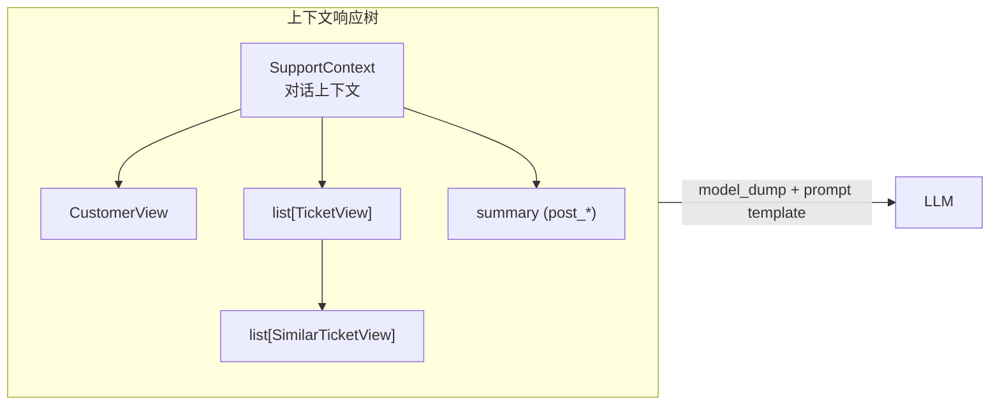
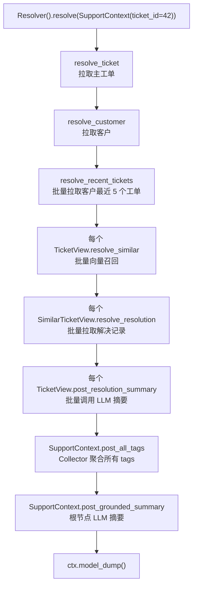
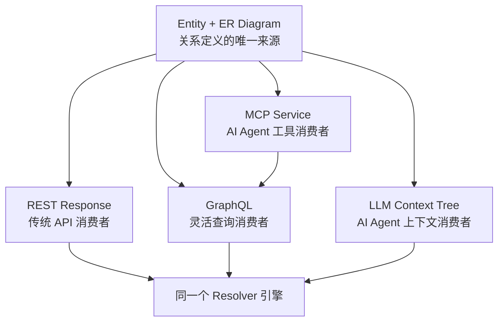

# 把「上下文窗口」当作数据装配问题：pydantic-resolve 在 AI 工作流里的位置

## 一段典型的 AI 代码

打开你项目里任何一个调用 LLM 的服务，你大概率会看到这样的函数：

```python
async def build_support_context(ticket_id: int) -> str:
    ticket = await db.get(Ticket, ticket_id)
    customer = await db.get(Customer, ticket.customer_id)

    recent_tickets = await db.query(Ticket).filter(
        Ticket.customer_id == customer.id
    ).order_by(Ticket.created_at.desc()).limit(5).all()

    # 召回相似的历史工单
    embedding = await embed(ticket.description)
    similar = await vector_store.search(embedding, top_k=3)

    # 每个相似工单都要拉一下它的解决记录
    similar_with_resolution = []
    for s in similar:
        resolution = await db.query(Resolution).filter(
            Resolution.ticket_id == s.id
        ).first()
        similar_with_resolution.append({
            "title": s.title,
            "resolution": resolution.text if resolution else "",
        })

    # 拼标签
    all_tags = []
    for t in recent_tickets:
        all_tags.extend(t.tags)

    # 最后再让 LLM 总结一遍
    summary = await llm.summarize(
        customer=customer,
        recent_tickets=recent_tickets,
        similar=similar_with_resolution,
    )

    return f"""
Customer: {customer.name} (id={customer.id})
Recent tickets: {len(recent_tickets)}
Tags: {', '.join(set(all_tags))}
Similar past cases:
{format_similar(similar_with_resolution)}
Summary: {summary}
"""
```

函数不算长，但已经能看出问题：**这是一个 `build_context()` 函数，本质上在做数据装配，但形状完全是过程式的**。

它和 pydantic-resolve 在 [Clean Architecture for Python](./architecture_entity_first.zh.md) 里批评的那段 FastAPI 代码是同构的——只是把"组装 API 响应"换成了"组装 prompt 上下文"。问题没变：

- 数据获取逻辑散落在函数体里，没有结构。
- 派生字段（`all_tags`、`summary`）的依赖关系靠注释和顺序维系。
- 向量召回、数据库查询、LLM 调用混在一个函数里，每加一类上下文就要修改这个函数。
- 如果要做并发优化（同时召回多个相似工单），需要重写。
- 如果要复用其中一部分（比如只要 `recent_tickets` 给前端用），做不到。

这段代码不是写得不好。**是它没有家**。

## 「上下文窗口」其实是数据装配问题

讨论 LLM 应用时，注意力通常会先落在 prompt 模板、模型选择、温度参数上。这些当然重要，但当应用规模变大之后，**真正的瓶颈会从 prompt 工程转移到上下文装配**。

原因是：prompt 模板是稳定的，模型选择是稳定的，**但「要喂给 LLM 什么数据」每次调用都不一样**。一个客服 Agent 处理工单 A 和工单 B，prompt 模板可以完全一样，但底层数据装配的逻辑可能要走完全不同的路径——A 是 VIP 客户、要拉 SLA、要召回相似工单；B 是普通客户、只要基本上下文。

这种"同一个模板，不同的数据装配路径"的需求，**就是 API 响应组装的需求**。你的 FastAPI 项目里早就在解决它——为不同的 endpoint 组装不同的响应树。LLM 上下文只是又一个 endpoint，只是消费者不是 HTTP 客户端，而是 LLM。

把这个视角切换过来之后，问题就具体了。pydantic-resolve 在 API 那一侧解决得很好的事情，在 LLM 这一侧同样成立：

| API 响应装配 | LLM 上下文装配 |
|---|---|
| 多层嵌套（Sprint → Task → Owner） | 多层嵌套（Customer → Ticket → Similar Ticket） |
| 关联数据批量加载 | 关联上下文批量召回 |
| 派生字段（`task_count`、`contributors`） | 派生上下文（`summary`、`aggregated_tags`） |
| N+1 数据库查询 | N+1 向量召回 + N+1 LLM 调用 |
| 跨子树聚合（所有 owner 去重） | 跨子树聚合（所有相似工单的证据合并） |

**右列的每一项，左列早就有解。** 我们只需要把同一套机制搬过来。

## 三类典型的装配痛点

把上面那段 `build_support_context` 拆开看，可以归出三类症状。这三类症状不只在客服场景出现，几乎在所有 LLM 应用里都会反复出现。

### 痛点一：N+1 LLM 调用

```python
for s in similar:
    resolution = await db.query(Resolution).filter(...).first()
```

这段代码在 ORM 那一侧就是经典的 N+1。在 LLM 场景里更严重——你可能在循环里调用 LLM：

```python
for s in similar:
    s.summary = await llm.summarize(s.description)   # 5 个相似工单 = 5 次串行 LLM 调用
```

LLM 调用比数据库查询贵一个数量级，串行 N+1 直接放大成本和延迟。**而没有 batching 抽象的代码，最后都会演化成这样**——因为没有人会在过程式代码里主动维护一个 batch queue。

!!! example "真实代码佐证：open-webui"
    `backend/open_webui/utils/middleware.py:2635`（commit `02dc3e6`, 2026-06）

    ```python
    for sid in all_skill_ids:
        if sid in accessible_skill_ids:
            s = await SkillsModel.get_skill_by_id(sid)   # 串行 N+1
    ```

    同文件至少还有 3 处同类模式（folder lookup、tool connection、access check），都是循环里 `await` IO。open-webui 是生产级 AI 应用，依然落入这个陷阱——证明这不是"写得不好"，是过程式代码本身缺 batching 抽象。

### 痛点二：跨子树聚合没有归宿

```python
all_tags = []
for t in recent_tickets:
    all_tags.extend(t.tags)
```

这种"遍历子树收集一些东西"的逻辑，在过程式代码里只能写成全局变量 + for 循环。一旦聚合需求变多——所有相似工单的 resolution、所有涉及的产品、所有提及的功能——就会出现一堆 `all_xxx = []` 列表，散落在函数各处，靠人为约定维系。

更糟糕的是，**这些聚合逻辑本属于"父节点对子节点的依赖"**，但在过程式代码里它和子节点的获取逻辑分开了。子节点获取在 `for t in recent_tickets` 上面，聚合在下面，父节点对子节点的依赖关系变成了"代码行号顺序"。

!!! example "真实代码佐证：open-webui"
    `backend/open_webui/utils/middleware.py` 的 chat completion 编排（commit `02dc3e6`, 2026-06）

    ```python
    sources = []
    sources.extend(flags.get('sources', []))   # line 2882
    sources.extend(flags.get('sources', []))   # line 2892
    sources = [s for s in sources if ...]      # line 2909：中途重新过滤
    events.append({'sources': sources})        # line 2916：又一个累加器
    ```

    `sources` 和 `events` 没有任何"父子依赖"的结构化声明，靠 `extend` 在多个 handler 之间手工维系。这就是上一节说的"聚合没有归宿"——它不是某个项目的偶然缺陷，而是过程式代码处理多源上下文的必然形态。

### 痛点三：prompt 形状和数据获取耦合

```python
return f"""
Customer: {customer.name} (id={customer.id})
...
Summary: {summary}
"""
```

最后这个 f-string 把所有事情焊在了一起：**数据获取、派生计算、prompt 格式**。改 prompt 模板要碰数据代码，改数据获取要碰 prompt 文本，加一个字段要从头改到尾。

这就是过程式代码的极限：**它没有结构，所以一切变化都是侵入式的**。

!!! example "真实代码佐证：open-webui"
    `backend/open_webui/utils/middleware.py:931` 的 `get_source_context`（commit `02dc3e6`, 2026-06）

    ```python
    def get_source_context(sources, ...) -> str:
        context_string = ''
        for source in sources:
            for doc, meta in zip(source.get('document', []),
                                 source.get('metadata', [])):
                context_string += (
                    f'<source id="{...}" name="{...}">{body}</source>\n'
                )
        return context_string
    ```

    数据遍历、XML 模板字符串、f-string 格式化全焊在一个函数里——和本文开篇那段虚构的 `build_support_context()` 在结构上完全一致。这不是巧合，而是过程式 LLM 代码的典型形态。

## 重新定义：LLM 上下文 = 响应树

有了上面三类痛点的诊断，解法就清楚了：**把 LLM 上下文当作一棵响应树来组装**。

在 API 那一侧，你已经熟悉这套语言了：

```python
class SprintView(BaseModel):
    id: int
    name: str
    tasks: list[TaskView] = []
    task_count: int = 0           # post_*

    def resolve_tasks(self, loader=Loader(task_loader)):
        return loader.load(self.id)

    def post_task_count(self):
        return len(self.tasks)
```

把这套语言搬到 LLM 场景，只需要换个视角：**树根不是 Sprint，是某个对话上下文；叶子不是 Task，是某个会被 LLM 读到的字段**。最终你 `model_dump()` 出来，要么直接喂给 prompt 模板，要么 JSON 序列化之后作为 tool call 的参数。



树的形状由你的 Pydantic 模型决定，数据由 `resolve_*` 拉取，派生字段由 `post_*` 计算，跨子树聚合由 `Collector` 完成。**和 API 响应用的是同一套机制、同一个 Resolver、同一套 batch loader。**

## 机制映射

把上一节的视角落实到 API，就是三组一一对应的映射：

| AI 装配需求 | pydantic-resolve 原语 | 在 LLM 场景里的角色 |
|---|---|---|
| 拉外部知识（DB、向量库、外部 API） | `resolve_*` + `Loader` | 召回相关文档、相似工单、用户画像 |
| 子树就绪后调用 LLM 做派生 | `post_*`（支持 async） | 摘要、分类、风险评估——`post_*` 的执行点保证子树已完整 |
| 跨子树聚合证据 / 标签 / 片段 | `Collector` + `SendTo` | 把分散在叶子节点的信号汇聚到根，喂给 LLM 作为 grounding |

三个原语正好覆盖了上一节诊断的三类痛点。下面用一个具体例子走查。

## 走查：客服 Agent 上下文

把开篇那段 `build_support_context` 用 pydantic-resolve 重写。先看模型定义：

```python
from typing import Annotated, Optional
from pydantic import BaseModel
from pydantic_resolve import (
    Collector, Loader, Resolver, SendTo, build_list, build_object,
)


# ---------- 数据访问层（loader） ----------

async def customer_loader(customer_ids: list[int]) -> list[CustomerView]:
    rows = await db.query(Customer).filter(Customer.id.in_(customer_ids)).all()
    return build_object(rows, customer_ids, lambda c: c.id)

async def ticket_loader(ticket_ids: list[int]) -> list[dict]:
    # 用于按 customer_id 拉最近工单
    rows = await db.query(Ticket).filter(
        Ticket.customer_id.in_(ticket_ids)
    ).order_by(Ticket.created_at.desc()).limit(5 * len(ticket_ids)).all()
    return build_list(rows, ticket_ids, lambda t: t.customer_id)

async def similar_ticket_loader(ticket_ids: list[int]) -> dict[int, list[dict]]:
    # 一次批量向量召回：对所有 query embedding 同时检索
    queries = await db.query(Ticket).filter(Ticket.id.in_(ticket_ids)).all()
    embeddings = await embed_batch([t.description for t in queries])
    results = await vector_store.batch_search(embeddings, top_k=3)
    return {
        t.id: [r.dict() for r in results[i]]
        for i, t in enumerate(queries)
    }


# ---------- 上下文模型树 ----------

class SimilarTicketView(BaseModel):
    id: int
    title: str
    resolution: str = ""

    def resolve_resolution(self, loader=Loader(resolution_loader)):
        return loader.load(self.id)


class TicketView(BaseModel):
    id: int
    title: str
    description: str
    customer_id: int
    tags: list[str] = []
    similar: list[SimilarTicketView] = []
    resolution_summary: str = ""   # post_*, LLM 派生

    def resolve_similar(self, loader=Loader(similar_ticket_loader)):
        return loader.load(self.id)

    async def post_resolution_summary(self):
        # 子树就绪后调用 LLM：相似工单的 resolution 都已 resolve 完
        if not self.similar:
            return ""
        return await llm.summarize_resolutions(
            ticket_title=self.title,
            resolutions=[s.resolution for s in self.similar],
        )


class SupportContext(BaseModel):
    """根上下文：直接对应一次 LLM 调用需要的信息。"""
    ticket_id: int
    ticket: Optional[TicketView] = None
    customer: Optional[CustomerView] = None
    recent_tickets: list[TicketView] = []

    # Collector 聚合所有子节点的标签
    all_tags: list[str] = []
    # 根节点的 LLM 摘要：等整个子树 ready 后才跑
    grounded_summary: str = ""

    def resolve_ticket(self, loader=Loader(ticket_by_id_loader)):
        return loader.load(self.ticket_id)

    def resolve_customer(self, loader=Loader(customer_loader)):
        return loader.load(self.ticket.customer_id) if self.ticket else None

    def resolve_recent_tickets(self, loader=Loader(ticket_loader)):
        return loader.load(self.customer.id) if self.customer else []

    def post_all_tags(self, collector=Collector("tag_pool")):
        # Collector 在所有子 TicketView 上游收集标签
        return sorted(set(collector.values()))

    async def post_grounded_summary(self):
        # 整棵树就绪后调用 LLM
        return await llm.summarize_context(
            customer=self.customer,
            ticket=self.ticket,
            recent=self.recent_tickets,
            all_tags=self.all_tags,
        )


class TicketView(TicketView):  # 同一个 TicketView 既能作为根的 recent，也能向上送标签
    tags: Annotated[list[str], SendTo("tag_pool")] = []
```

调用方式：

```python
ctx = SupportContext(ticket_id=42)
ctx = await Resolver().resolve(ctx)

prompt = render_prompt(ctx.model_dump())  # 直接喂模板
response = await llm.chat(prompt)
```

### 执行流程



关键点逐条对照之前的三类痛点：

- **痛点一（N+1 LLM 调用）**：所有 `TicketView.post_resolution_summary` 在同一层级，pydantic-resolve 会**批量调度**它们的 LLM 调用——你不再需要在循环里手动 `gather`，框架替你做了。如果你愿意进一步批量化，可以把 LLM 调用本身也封进一个 `Loader`（同模板的多个请求合并成一次 batch API 调用）。
- **痛点二（跨子树聚合）**：`all_tags` 通过 `Collector("tag_pool")` 聚合，`TicketView.tags` 用 `SendTo("tag_pool")` 声明它要送什么上去。聚合逻辑有了固定的家，不再靠 for 循环和全局变量。
- **痛点三（形状与获取耦合）**：prompt 模板和模型定义分离——`render_prompt(ctx.model_dump())`。改 prompt 文本不动模型代码；加字段不改 prompt 模板；数据获取逻辑各自独立在 `resolve_*` 里。

### 输出结果

```python
print(ctx.model_dump_json(indent=2))
```

```json
{
  "ticket_id": 42,
  "ticket": {
    "id": 42,
    "title": "Login button unresponsive on Safari",
    "description": "...",
    "tags": ["auth", "safari"],
    "similar": [
      { "id": 101, "title": "Safari click event issue", "resolution": "..." },
      { "id": 187, "title": "WebKit pointer-events bug", "resolution": "..." }
    ],
    "resolution_summary": "Likely a WebKit pointer-events issue; see ticket #187."
  },
  "customer": { "id": 7, "name": "Acme Corp", "tier": "enterprise" },
  "recent_tickets": [ /* ... */ ],
  "all_tags": ["auth", "billing", "safari", "webkit"],
  "grounded_summary": "Enterprise customer Acme Corp reported a Safari-specific login issue..."
}
```

这棵树既可以直接序列化喂给 LLM，也可以拆开使用——比如把 `recent_tickets` 字段单独返回给前端 dashboard，零额外代码。

## 对比：与其他方案的差异

| 方案 | 数据装配位置 | N+1 防护 | 跨子树聚合 | 与 API 响应复用 |
|---|---|---|---|---|
| 手写 `build_context()` | 函数体内联 | 无 | 全局变量 / for 循环 | 无法复用 |
| LangChain retrieval chain | Chain 节点串联 | 取决于实现 | 通过 chain 拼接 | 与 API 完全分离 |
| 裸 RAG（embed → search → stuff） | 几行内联代码 | 通常单次 | 无 | 与 API 完全分离 |
| pydantic-resolve 上下文树 | 模型字段声明 | 内建 batching | `Collector` / `SendTo` | 与 API 响应同源 |

值得说明的是和 LangChain 的关系——**这不是替代关系**。LangChain 解决的是"LLM 调用链的编排"，pydantic-resolve 解决的是"调用链每一步要消费的数据怎么装配"。在复杂的 Agent 流水线里，两者完全可以叠用：pydantic-resolve 负责为每一步准备好结构化上下文，LangChain（或任何 agent 框架）负责调度执行。

## 同一个 Entity graph，驱动四类消费者

走到这一步，一个更深层的收益浮现出来了。

当你的项目用 ERD 模式之后，**REST、GraphQL、MCP、LLM Context 这四类消费者，全部从同一份 Entity graph 派生**：



也就是说：

- 你为客服 dashboard 写的 `TicketView`，**就是**给 LLM 用的 `TicketView`，**就是**给 MCP 暴露的 GraphQL 节点。
- "Task 有一个 owner"这条关系定义只写一次，四类消费者全部自动复用。
- 关系变了，四个地方同时更新；新增消费者，关系定义不动。

这是 pydantic-resolve 在 AI 工作流里真正的位置——**不是又一个 LLM 框架，而是给 AI 上下文一个稳定的数据装配家**。当 AI Agent 逐渐成为你系统的标准消费者之一时，这种"同源"的收益会越来越显著。

## 什么时候用，什么时候别用

**值得用的场景：**

- LLM 上下文需要 2 层以上嵌套（根对象 + 关联数据 + 关联的关联）。
- 同一份领域模型既要给 API 又要给 LLM 用。
- 出现了"per-item 调用 LLM"的循环——N+1 在烧钱。
- 跨子树要聚合证据 / 标签 / 片段喂给 LLM 做 grounding。
- Agent 多步流程里，每一步都需要装配上下文。

**不值得用的场景：**

- 上下文就是一段静态文本 + 几个变量——直接 f-string 就好。
- 一次性脚本、原型——过程式代码更快。
- LLM 调用只有一次、没有关联数据拉取——`resolve_*` 是多余的抽象。
- 已经在用 LangChain 且 chain 编排已经稳定——再叠一层 pydantic-resolve 反而增加认知负担。

判断标准很简单：**当你开始写第二个 `build_xxx_context()` 函数，且发现它和第一个有重叠时，就该考虑迁移了**。这正是 pydantic-resolve 在 API 那一侧的 adoption 信号——只是这一次，消费者从浏览器换成了 LLM。

## 结论

LLM 应用的代码复杂度，最终会落在**上下文装配**上，而不是 prompt 模板上。今天的 AI 项目里到处是手写的 `build_context()` 函数，承担着当年 FastAPI 项目里 Service/Route 的散落逻辑——而那一类问题，pydantic-resolve 已经在 API 那一侧解过一遍了。

把 LLM 上下文当作响应树来看，三个原语刚好覆盖三类痛点：

- `resolve_*` 拉外部知识，自带 batching，干掉 N+1。
- `post_*` 作为 LLM 钩子，在子树就绪后批量调度，prompt 形状和数据获取解耦。
- `Collector` / `SendTo` 给跨子树聚合一个固定的家，不再靠全局变量。

更宏观的收益是：你的 Entity graph 第一次有了**四类标准消费者**——REST、GraphQL、MCP、LLM Context——关系定义只写一次。AI 不是又一个需要重新建图的特殊场景，它就是同一棵树的另一个读者。

**投资你的领域模型，而不是投资 prompt 模板。** 当上下文窗口越长、Agent 流程越复杂，这个原则的红利就越大。
