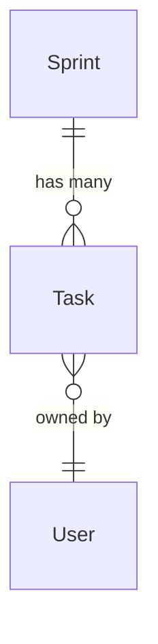
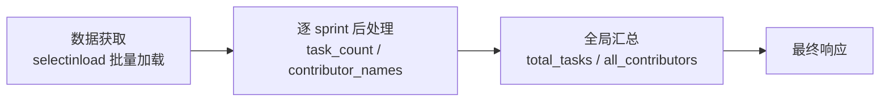
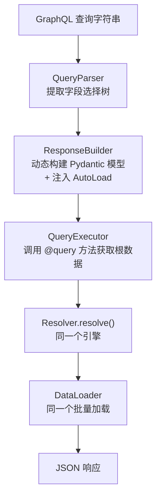
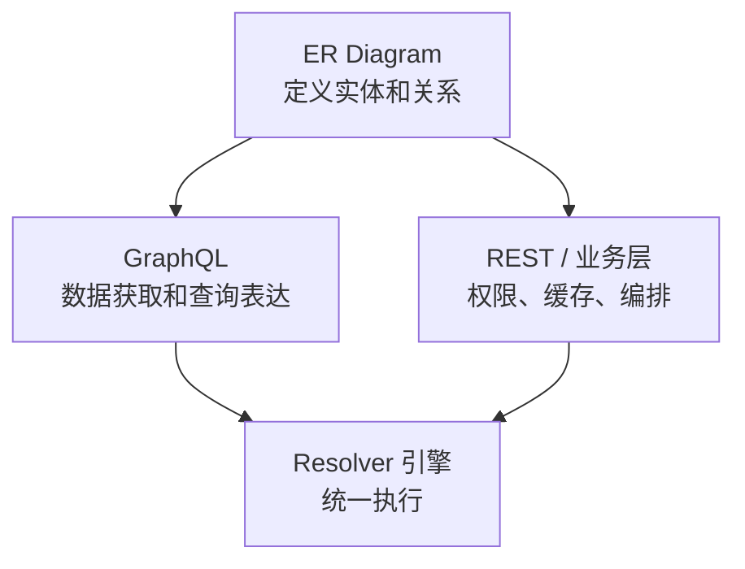

# REST 和 GraphQL 之争，漏掉了关键的一层

## 一个错误的二选一

你的团队大概也经历过这样的讨论：新项目该用 REST 还是 GraphQL？

争论的焦点通常落在几个熟悉的维度上：查询灵活性、over-fetching、schema 演进、学习曲线、调试体验……每个人都能列出一张对比表。这种讨论本身并不坏，但它暗含了一个前提——**REST 和 GraphQL 是互斥的架构选择，你必须选一个**。

这个前提是错的。

如果你把视角拉高一层，会发现一个有趣的事实：不管你选了哪个协议，你最终都要回答同一组问题：

- 系统里有哪些实体？
- 实体之间是什么关系？
- 如何批量加载关联数据？
- 拿到原始数据之后，怎么计算派生字段？

这些问题跟协议无关。它们是更底层的领域模型问题。REST 和 GraphQL 只是回答这些问题的不同"语法"——一个把答案散落在 endpoint 实现里，另一个把答案集中在 schema 声明里，但两者都在回答同一组问题。

所以真正值得讨论的不是"REST 还是 GraphQL"，而是：**你的领域模型定义在哪里？它能不能同时驱动两种协议？**

## 底下那层到底是什么

### 共同的隐藏依赖

不管用 REST 还是 GraphQL，你的代码里都隐含了一份 ER Diagram（实体关系模型）。区别只在于，GraphQL 把它写成了 schema，REST 把它藏在了 endpoint 代码里。

以一个常见的场景为例：Sprint 有多个 Task，Task 有一个 Owner（User）。不管你用什么协议，这三个实体和它们之间的关系是确定的：



### 传统 ORM 的问题：查询结果和 ER 关系的依赖感知脱钩

你可能会想：我的 ORM 已经定义了这些关系——SQLAlchemy 的 `relationship()`、Django 的 `ForeignKey`——这不就是 ER Diagram 吗？

ORM 确实能通过 `selectinload` / `joinedload` 自动加载关联数据：

```python
@app.get("/sprints/{sprint_id}")
async def get_sprint(sprint_id: int, db: Session):
    sprint = db.query(Sprint).options(
        selectinload(Sprint.tasks).selectinload(Task.owner)
    ).filter(Sprint.id == sprint_id).first()

    return SprintResponse.model_validate(sprint)
```

这段代码看起来干净，但问题在于：**加载策略（`selectinload`）和 ER 关系定义是分离的。**

`selectinload(Sprint.tasks).selectinload(Task.owner)` 这行代码本质上是在**手动描述 ER Diagram 的遍历路径**——先加载 tasks，再加载 owner。ORM 的 `relationship()` 定义了"关系是什么"，但每次查询时你都得重新告诉它"沿着哪条路径加载、加载到多深"。这个遍历路径的知识不在 ER Diagram 里，而是在你的脑子里，写在每个 endpoint 的 `options()` 里。

后果是：

1. **每个 endpoint 各自描述加载路径**。`GET /sprints` 需要 tasks + owner，`GET /tasks` 只需要 owner，`GET /users/{id}/tasks` 需要 tasks 的 owner……每个 endpoint 都要写一遍自己的 `options()`。这些 options 之间的逻辑关系（"Task 有 owner"这条关系被多处用到）是隐含的，没有集中管理。

2. **响应模型对关系加载无感知**。`SprintResponse` 只是一个数据容器，它不知道 `tasks` 字段需要触发 `selectinload`，不知道 `owner` 字段依赖 `owner_id`。加载策略在 ORM 查询层，响应结构在 Pydantic 模型层，两者之间没有连接。

3. **跨 endpoint 的关系复用困难**。当 "Task → owner" 的加载逻辑需要变化时（比如加一层缓存、换一个数据源），你得到所有用了这个关系的 endpoint 里逐一修改。

这就是"依赖感知的脱钩"：**ER Diagram 定义了关系，查询时手动指定遍历路径，查询结果转成响应 DTO 后，响应模型对底层关系一无所知。** 关系知识散落在三层地方——ORM 定义、查询 options、响应模型——彼此之间没有联动。

### ER Diagram 作为"可执行的关系层"

问题的根源在于：传统 ORM 的 ER Diagram 是**描述性的**，它告诉你"关系是什么"，但不告诉你"怎么用"。查询层用 `options()` 手动指定遍历路径，响应层对关系一无所知。我们需要的是一个**可执行的关系层**——不仅定义关系，还绑定数据加载策略（loader），让关系定义和实际执行联动起来。

这就是 pydantic-resolve 的 ER Diagram 所做的事：

```python
from pydantic_resolve import Relationship, base_entity, config_global_resolver

BaseEntity = base_entity()

class UserEntity(BaseModel, BaseEntity):
    id: int
    name: str

class TaskEntity(BaseModel, BaseEntity):
    __relationships__ = [
        Relationship(fk='owner_id', name='owner', target=UserEntity, loader=user_loader)
    ]
    id: int
    title: str
    owner_id: int

class SprintEntity(BaseModel, BaseEntity):
    __relationships__ = [
        Relationship(fk='id', name='tasks', target=list[TaskEntity], loader=task_loader, load_many=True)
    ]
    id: int
    name: str
```

关键区别：`Relationship` 不仅声明了"Task 有一个 owner"，还绑定了 `user_loader`——一个批量加载函数。关系定义变成了**可执行的**，不再是纸上谈兵。

## 数据构建的两个环节

在讨论 REST 和 GraphQL 各自的缺陷之前，需要先建立一个分析框架。

看一段常见的 ORM 代码。你要构建一个 Sprint 列表接口，返回每个 sprint 的信息、它的 tasks、每个 task 的 owner，以及 `task_count` 和 `contributor_names` 两个派生字段，最后还要汇总全局统计：

```python
@app.get("/sprints")
async def get_sprints(db: Session):
    # 环节一：数据获取
    sprints = db.query(Sprint).options(
        selectinload(Sprint.tasks).selectinload(Task.owner)
    ).all()

    # 环节二：数据后处理——遍历计算每个 sprint 的派生字段
    sprint_list = []
    for sprint in sprints:
        task_count = len(sprint.tasks)
        contributor_names = sorted({
            t.owner.name for t in sprint.tasks if t.owner
        })
        sprint_list.append({
            "id": sprint.id,
            "name": sprint.name,
            "task_count": task_count,
            "contributor_names": contributor_names,
            "tasks": [
                {
                    "id": t.id,
                    "title": t.title,
                    "owner": {"id": t.owner.id, "name": t.owner.name} if t.owner else None
                }
                for t in sprint.tasks
            ]
        })

    # 全局汇总
    total_tasks = sum(s["task_count"] for s in sprint_list)
    all_contributors = sorted({
        name for s in sprint_list for name in s["contributor_names"]
    })

    return {
        "sprints": sprint_list,
        "total_tasks": total_tasks,
        "all_contributors": all_contributors,
    }
```

这段代码清晰地区分了两个环节：



**环节一，数据获取**：用 `selectinload` 批量加载 tasks 和 owner。核心挑战是 N+1 查询——如果逐个 task 去查 owner，查询数会爆炸。

**环节二，数据后处理**：分为两层。第一层是逐 sprint 遍历，计算 `task_count` 和 `contributor_names`——它们依赖每个 task 的 owner，必须等关联数据全部就绪。第二层是全局汇总——`total_tasks` 和 `all_contributors` 必须等每个 sprint 的后处理都完成之后才能计算。

两个环节有严格的依赖关系：后处理必须等数据获取完成，全局汇总必须等逐条后处理完成。**一个完整的数据组装方案必须同时覆盖这两个环节。** 接下来我们看看 REST 和 GraphQL 各自在哪个环节出了问题。

## REST 和 GraphQL 各自的短板

### REST 没有处理好数据获取

前面看到，即使用了 `selectinload`，加载策略仍然和 ER 关系定义是分离的。每个 endpoint 要自己描述遍历路径，响应模型对关系加载无感知。这是 REST 在数据获取环节的根本问题：**缺少一个声明式的、可复用的关系加载机制。**

具体表现有两个：

**第一，加载策略绑定在查询层，不绑定在响应模型上。** 同一个 `Task.owner` 关系，在 `GET /tasks` 里是 `selectinload(Task.owner)`，在 `GET /sprints` 里嵌套在 `selectinload(Sprint.tasks).selectinload(Task.owner)` 里。关系是同一个关系，但每个 endpoint 都要自己组织 `options()` 的调用链。`selectinload` 解决了 SQL 层面的 N+1 问题，但没有解决架构层面的关系复用问题。

**第二，响应模型是纯数据容器，不参与加载决策。** `SprintResponse` 不知道 `tasks` 字段需要触发什么加载，不知道 `owner` 字段依赖 `owner_id`。加载在查询层做完了，响应模型只是被动接收数据。这意味着如果响应结构变了（比如加了一层嵌套），你得回到查询层去改 `options()`。

pydantic-resolve 的 `resolve_*` + DataLoader 把加载策略搬到了响应模型上——响应模型自己声明"我需要什么数据、从哪里加载"。但这只是第一步。如果每个响应模型都要手写 `resolve_owner`，关系定义仍然是分散的——只是从"散落在 `options()` 里"变成了"散落在 resolve 方法里"。

### REST 和 GraphQL 都没有原生处理好数据后处理

GraphQL 在数据获取上确实做得好——schema 声明了关系，客户端按需查询，DataLoader 自动批量加载。但如果把视角拉回到"协议本身"，REST 和 GraphQL 在数据后处理上其实都有明显短板。

问题在于：两者都擅长表达"我要什么数据"，却都不擅长表达"拿到数据之后怎么加工"。REST 通常把这部分逻辑散落在 endpoint 的循环和组装代码里；GraphQL 通常把它塞进 resolver 或 computed field。它们都缺少一个显式的、可组合的 post-processing 阶段。

看一个具体的例子。Sprint 接口需要返回 `task_count` 和 `contributor_names` 这两个派生字段。在 REST 或 GraphQL 里，你通常都有几个选择：

**方案 A：在 endpoint / resolver 里计算。** 但这意味着 endpoint 或 resolver 既要负责数据获取，又要负责业务计算。如果 `contributor_names` 需要所有 task 的 owner 都加载完才能汇总，你还得在这层手动处理依赖顺序——查询逻辑和计算逻辑纠缠在一起。

**方案 B：定义成额外的组装字段。** REST 里你会在 DTO 构建阶段临时补字段，GraphQL 里你会定义 computed field。技术上都可行，但协议本身都没有内置的"等后代数据就绪后再计算"机制，依赖顺序仍然要靠你自己维护。

**方案 C：推给客户端计算。** 让前端自己数 task 数量、自己汇总 contributor。这等于把后端的职责推给了前端，而且意味着接口返回的是原始数据而非业务语义。

这三个方案都不理想。根本原因不是某个协议单独有缺陷，而是 REST 和 GraphQL 都缺少一个明确的 **post-processing 阶段**——一个"等所有数据都就绪了，再统一计算派生字段"的机制。`pydantic-resolve` 里的 `post_*` 正是在协议之上补出的这一层能力，它不是 REST 的原生优势，也不是 GraphQL 的内建特性。

### 共同的缺失

| 环节 | REST | GraphQL |
|------|------|---------|
| 数据获取 | 过程式，N+1 风险高 | 声明式，DataLoader 自动批量 |
| 数据后处理 | 原生机制分散在 endpoint 组装代码里 | 原生机制分散在 resolver / computed field 里 |
| 关系定义 | 散落在 endpoint 代码里 | 集中在 schema 里，但与 REST 不共享 |

两个协议都缺少一层**显式的、可执行的关系层**：在数据获取上，它体现为 ER Diagram + loader；在数据后处理上，它体现为 `post_*` 这样的统一模型机制。只有把这两层都从协议实现里抽出来，REST 和 GraphQL 才能真正共享同一套领域组装逻辑。

## 收敛到 ER Diagram + AutoLoad

### 问题的本质

回顾前面的分析，关系定义重复和分散，根源在于**没有关系知识的中心**。每个响应模型都在独立回答"Task 的 owner 怎么加载"这个问题。

当你的代码库里出现以下信号时，说明需要一层抽象：

- `TaskCard.resolve_owner`
- `TaskDetail.resolve_owner`
- `SprintBoard.resolve_tasks`
- `SprintReport.resolve_tasks`

同一个关系，被四五个响应模型反复实现。关系修改时（比如换了一个 loader），你需要改四五个地方。

### ER Diagram + AutoLoad 的解法

pydantic-resolve 的 ER Diagram 把关系定义收敛到一个中心，`AutoLoad` 注解让响应模型自动获得数据加载能力：

```python
# 定义 ER Diagram（只写一次）
BaseEntity = base_entity()

class UserEntity(BaseModel, BaseEntity):
    id: int
    name: str

class TaskEntity(BaseModel, BaseEntity):
    __relationships__ = [
        Relationship(fk='owner_id', name='owner', target=UserEntity, loader=user_loader)
    ]
    id: int
    title: str
    owner_id: int

class SprintEntity(BaseModel, BaseEntity):
    __relationships__ = [
        Relationship(fk='id', name='tasks', target=list[TaskEntity],
                     loader=task_loader, load_many=True)
    ]
    id: int
    name: str

# 创建 diagram 和 AutoLoad 工厂
diagram = BaseEntity.get_diagram()
AutoLoad = diagram.create_auto_load()
config_global_resolver(diagram)
```

然后在响应模型里，只需要一个注解：

```python
# 之前：每个响应模型都要写 resolve_owner
class TaskCard(BaseModel):
    owner_id: int
    owner: Optional[UserEntity] = None
    def resolve_owner(self, loader=Loader(user_loader)):
        return loader.load(self.owner_id)

# 之后：一个 AutoLoad 注解搞定
class TaskCard(TaskEntity):
    owner: Annotated[Optional[UserEntity], AutoLoad()] = None
    # 不需要 resolve_owner，ER Diagram 已经知道怎么加载

class TaskDetail(TaskEntity):
    owner: Annotated[Optional[UserEntity], AutoLoad()] = None
    # 同样不需要 resolve_owner

class SprintBoard(SprintEntity):
    tasks: Annotated[list[TaskCard], AutoLoad()] = []
    task_count: int = 0

    def post_task_count(self):
        return len(self.tasks)
```

注意几件事：

1. **关系定义只写一次**。`Task.owner` 的加载逻辑收敛到了 ER Diagram 的 `Relationship` 里。
2. **post_* 完全不变**。ER Diagram 只收敛了"数据获取"层，不碰"数据后处理"。`post_task_count` 的写法和之前一模一样。
3. **响应模型保持灵活**。`TaskCard` 和 `TaskDetail` 可以有不同的字段组合，但共享同一个 owner 加载逻辑。

### 运行机制

AutoLoad 的背后并不复杂：

1. `config_global_resolver(diagram)` 把 ER Diagram 注入到 Resolver 类
2. Resolver 扫描响应模型时，发现 `AutoLoad()` 注解
3. 根据 ER Diagram 中对应的 `Relationship`，**动态生成 `resolve_*` 方法**
4. 生成的 resolve 方法使用 `Relationship` 中定义的 loader，走标准的 DataLoader 批量加载流程

本质上，AutoLoad 是一个代码生成器——它替你写了那些重复的 `resolve_owner` 和 `resolve_tasks`。

## GraphQL 变成薄薄一层

### 同一个 Resolver 引擎

到了这里，文章的核心论点可以揭示了：**有了 ER Diagram 之后，GraphQL 不需要自己的实现。**

pydantic-resolve 的 GraphQL 集成做了这么一件事：

```python
from pydantic_resolve.graphql import GraphQLHandler

# 传入同一个 diagram
handler = GraphQLHandler(diagram)

# 执行 GraphQL 查询
result = await handler.execute("""
{
    sprintEntities {
        id
        name
        tasks {
            id
            title
            owner {
                id
                name
            }
        }
    }
}
""")
```

内部的执行链路：



关键在于 `ResponseBuilder`：它根据 GraphQL 查询中的字段选择，**动态构建 Pydantic 响应模型**，并在关系字段上自动注入 `AutoLoad()` 注解。然后调用 `Resolver.resolve()`——和 REST 侧用的是**完全同一个 Resolver**、同一套 DataLoader、同一套 N+1 预防机制。

REST 和 GraphQL 的唯一区别是：REST 的响应模型是你手写的，GraphQL 的响应模型是根据查询动态生成的。底层跑的是同一套代码。

### GraphQL schema 应该是 ER Diagram 的投影

一个常见的误用是按 UI 需求来设计 GraphQL schema。比如：

- 前端有个 Sprint Dashboard 页面，于是定义 `SprintDashboardQuery`
- 前端有个 Task Card 组件，于是定义 `TaskCardQuery`
- 前端有个 User Avatar，于是定义 `UserAvatarQuery`

这会导致 schema 急剧膨胀。每个页面都要一套独立的 query 和 type，命名开始混乱（`SprintDashboardTask` vs `SprintBoardTask` vs `SprintReportTask`），而且和 domain 模型严重脱节——当你修改了 Task 的某个关系时，你不知道要改多少个"页面级 type"。

正确的做法是：**GraphQL schema 直接反映 ER Diagram 的实体和关系**。客户端通过字段选择来表达自己的需求，而不是要求后端为每个页面定制一套 schema。

```graphql
# 不是按页面定义 query，而是按实体查询，客户端按需选择字段
{
    sprintEntities {
        id
        name
        tasks {          # Sprint -> Task 关系，来自 ER Diagram
            id
            title
            owner {      # Task -> User 关系，来自 ER Diagram
                id
                name
            }
        }
    }
}
```

这也恰好证明了 ER Diagram 才是本质层——GraphQL schema 不应该是独立的模型体系，而应该是 ER Diagram 的一种视图。schema 是投影，ER Diagram 是光源。

### GraphQL 的边界：数据获取工具，不是业务平台

明确了 GraphQL 的定位之后，它的边界也就清楚了：**GraphQL 是数据获取工具，等价于数据库查询层。**

它告诉你"能查什么、怎么查"。但以下事情不应该由 GraphQL 来承担：

- **权限管理**：谁能查什么数据，这是业务层的职责。把它塞进 GraphQL resolver 会导致权限逻辑散落在每个字段解析器里，难以维护和审计。
- **缓存策略**：数据该缓存多久、什么时候失效，这是基础设施层的事。GraphQL 的 `@cache` 指令只是在把基础设施问题拉进了查询层。
- **业务编排**：跨实体的复杂操作（比如"创建 Sprint 并自动分配 Task"）应该在 REST/业务层处理，不应该变成 GraphQL mutation 里的复杂逻辑。

正确的分层：



把权限、缓存塞进 GraphQL resolver 的结果就是复杂度失控——查询逻辑和业务逻辑纠缠不清，resolver 变成了"上帝函数"。GraphQL 的价值在于灵活的查询表达，保持这个价值的前提是不让它越界。

## 回到你的架构决策

总结一下决策框架：

**场景一：少量实体，一两个接口。** 直接用 `resolve_*` + `post_*` 的 Core API 就够了。手写几个 resolve 方法比搭建 ER Diagram 更快。不需要纠结。

**场景二：3 个以上实体，关系定义开始重复。** 把关系收敛到 ER Diagram。用 `AutoLoad` 消除重复的 resolve 方法，用 `DefineSubset` 控制字段暴露。这一步的收益是代码的维护性和一致性。

**场景三：需要灵活的查询能力。** 在 ER Diagram 上加一层 GraphQL。因为底层是同一个 Resolver 引擎，这不是重写，而是增量添加。schema 直接反映 ER Diagram，不需要额外设计。

**场景四：需要给 AI Agent 提供结构化数据访问。** 同一个 ER Diagram 还可以驱动 MCP 服务——但这已经是另一个话题了。

核心原则只有一个：**投资你的领域模型，而不是投资协议之争。** ER Diagram 是领域知识的载体，REST 和 GraphQL 只是它的两种消费方式。当你把领域模型做好了，协议的选择就不再是架构决策，而是技术选型——哪个场景适合哪个，就用哪个。

---

*本文中的代码示例基于 [pydantic-resolve](https://github.com/allmonday/pydantic_resolve)，一个基于 Pydantic 的声明式数据组装工具。*
