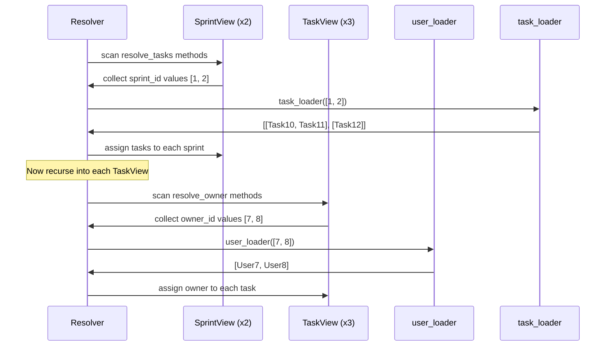

# Core API

[中文版](./core_api.zh.md)

The quick start showed one field loaded from outside the current node. This page extends the same idea into a nested response tree.

The goal is still manual composition. No ERD yet. No `AutoLoad` yet. Just plain `resolve_*` methods, batched loaders, and recursive traversal.

## From One Field to One Tree

We now want a sprint response that looks like this:

- `Sprint` has many `tasks`
- each `Task` has one `owner`

That gives us a nested tree: `Sprint -> Task -> User`.

## Full Example

This example is self-contained and runnable:

```python
import asyncio
from typing import Optional

from pydantic import BaseModel
from pydantic_resolve import Loader, Resolver, build_list, build_object


# --- Fake database ---
USERS = {
    7: {"id": 7, "name": "Ada"},
    8: {"id": 8, "name": "Bob"},
}

TASKS = [
    {"id": 10, "title": "Design docs", "sprint_id": 1, "owner_id": 7},
    {"id": 11, "title": "Refine examples", "sprint_id": 1, "owner_id": 8},
    {"id": 12, "title": "Write tests", "sprint_id": 2, "owner_id": 7},
]


# --- Loaders ---
async def user_loader(user_ids: list[int]):
    users = [USERS.get(uid) for uid in user_ids]
    return build_object(users, user_ids, lambda u: u.id)


async def task_loader(sprint_ids: list[int]):
    tasks = [t for t in TASKS if t["sprint_id"] in sprint_ids]
    return build_list(tasks, sprint_ids, lambda t: t["sprint_id"])


# --- Response models ---
class UserView(BaseModel):
    id: int
    name: str


class TaskView(BaseModel):
    id: int
    title: str
    owner_id: int
    owner: Optional[UserView] = None

    def resolve_owner(self, loader=Loader(user_loader)):
        return loader.load(self.owner_id)


class SprintView(BaseModel):
    id: int
    name: str
    tasks: list[TaskView] = []

    def resolve_tasks(self, loader=Loader(task_loader)):
        return loader.load(self.id)


# --- Resolve ---
raw_sprints = [
    {"id": 1, "name": "Sprint 24"},
    {"id": 2, "name": "Sprint 25"},
]

sprints = [SprintView.model_validate(s) for s in raw_sprints]
sprints = await Resolver().resolve(sprints)

for s in sprints:
    print(s.model_dump())
```

Output:

```python
{
    'id': 1, 'name': 'Sprint 24',
    'tasks': [
        {'id': 10, 'title': 'Design docs', 'owner_id': 7, 'owner': {'id': 7, 'name': 'Ada'}},
        {'id': 11, 'title': 'Refine examples', 'owner_id': 8, 'owner': {'id': 8, 'name': 'Bob'}},
    ]
}
{
    'id': 2, 'name': 'Sprint 25',
    'tasks': [
        {'id': 12, 'title': 'Write tests', 'owner_id': 7, 'owner': {'id': 7, 'name': 'Ada'}},
    ]
}
```

**Result:** one query per loader, regardless of how many sprints or tasks you load.

## build_list vs build_object

`build_object` and `build_list` serve different relationship types:

| Function | Use when | Returns |
|----------|----------|---------|
| `build_object(items, keys, get_key)` | One-to-one | `list[item \| None]` — one element per key |
| `build_list(items, keys, get_key)` | One-to-many | `list[list[item]]` — a list of items per key |

### build_object example (one user per id)

```python
async def user_loader(user_ids: list[int]):
    users = [USERS.get(uid) for uid in user_ids]
    return build_object(users, user_ids, lambda u: u.id)
# Result: [User7, User8, None, User9, ...]
#         ^ aligned with user_ids order
```

### build_list example (many tasks per sprint)

```python
async def task_loader(sprint_ids: list[int]):
    tasks = [t for t in TASKS if t["sprint_id"] in sprint_ids]
    return build_list(tasks, sprint_ids, lambda t: t["sprint_id"])
# Result: [[Task10, Task11], [Task12], []]
#          ^ sprint 1        ^ sprint 2  ^ sprint 3
```

## How the Resolver Traverses the Tree

You do not write any manual traversal code. No nested loops. No orchestration layer that says "load tasks, then for every task load owner". The resolver handles that sequence for you:



The recursive walk is why the Core API scales better than endpoint-specific glue code. Adding a new nested relationship means adding one `resolve_*` method and one loader — the traversal logic stays the same.

## Resolver Constructor Options

The `Resolver` class accepts several configuration parameters:

### context

Pass a global context dict accessible in all `resolve_*` and `post_*` methods:

```python
class TaskView(BaseModel):
    owner: Optional[UserView] = None

    def resolve_owner(self, loader=Loader(user_loader), context=None):
        # context is the dict passed to Resolver
        tenant = context.get('tenant_id')
        return loader.load(self.owner_id)

tasks = await Resolver(context={'tenant_id': 1}).resolve(tasks)
```

### loader_params

Provide parameters to DataLoader classes:

```python
class OfficeLoader(DataLoader):
    status: str  # no default, must be provided

    async def batch_load_fn(self, company_ids):
        offices = await get_offices(company_ids, self.status)
        return build_list(offices, company_ids, lambda o: o.company_id)

companies = await Resolver(
    loader_params={OfficeLoader: {'status': 'open'}}
).resolve(companies)
```

### global_loader_param

Set parameters for all loaders at once. If the same parameter is set in both `loader_params` and `global_loader_param`, an error is raised:

```python
companies = await Resolver(
    global_loader_param={'status': 'open'},
    loader_params={OfficeLoader: {'status': 'closed'}}  # ERROR: overlaps
).resolve(companies)
```

### loader_instances

Pre-create and prime a DataLoader with known data:

```python
loader = UserLoader()
loader.prime(7, UserView(id=7, name="Ada"))

tasks = await Resolver(
    loader_instances={UserLoader: loader}
).resolve(tasks)
```

### debug

Print per-node timing information:

```python
tasks = await Resolver(debug=True).resolve(tasks)
# Output:
# TaskView       : avg: 0.4ms, max: 0.5ms, min: 0.4ms
# SprintView     : avg: 1.1ms, max: 1.1ms, min: 1.1ms
```

Or enable globally: `export PYDANTIC_RESOLVE_DEBUG=true`

### ensure_type

Validate that returned values match the field's type annotation. Useful during development:

```python
tasks = await Resolver(ensure_type=True).resolve(tasks)
```

## Async vs Sync resolve_*

Both forms work:

```python
# Sync — return loader.load(key) directly
def resolve_owner(self, loader=Loader(user_loader)):
    return loader.load(self.owner_id)

# Async — await the result, then transform
async def resolve_owner(self, loader=Loader(user_loader)):
    user = await loader.load(self.owner_id)
    if user and user.name:
        return user
    return None
```

Use async when you need to await the loader and post-process the result.

## Multiple Loaders in One Method

You can declare more than one loader dependency in a single `resolve_*` method:

```python
class SprintView(BaseModel):
    id: int
    tasks: list[TaskView] = []
    metadata: Optional[SprintMeta] = None

    async def resolve_tasks(
        self,
        task_loader=Loader(task_loader_fn),
        meta_loader=Loader(meta_loader_fn)
    ):
        tasks = await task_loader.load(self.id)
        self.metadata = await meta_loader.load(self.id)
        return tasks
```

Note: when using async, you can also set other fields directly via `self.field = value`.

## Common Patterns

### Pattern: Load and Transform

```python
async def resolve_active_tasks(self, loader=Loader(task_loader)):
    tasks = await loader.load(self.id)
    return [t for t in tasks if t.status == 'active']
```

### Pattern: Conditional Loading

```python
def resolve_thumbnail(self, loader=Loader(image_loader)):
    if self.thumbnail_id:
        return loader.load(self.thumbnail_id)
    return None
```

### Pattern: Static Value (no loader needed)

```python
def resolve_display_name(self):
    return f"{self.first_name} {self.last_name}"
```

When a `resolve_*` method does not declare a loader, it simply returns the computed value. This works for fields that can be derived from existing data without external IO.

## When Manual resolve_* Is Still the Right Tool

Manual Core API is often enough when:

- you only have a few response models
- relationship wiring is not repeating yet
- you want each endpoint to stay maximally explicit
- the shape of the response is still changing quickly

At this stage, explicitness is a feature, not a limitation.

## What This Page Does Not Add Yet

This page intentionally stops before derived fields. Right now we only load related data. We are not yet computing fields such as:

- `task_count`
- `contributor_names`

Those belong to the next concept layer.

## Next

Continue to [Post Processing](./post_processing.md) to see when a field should be computed after the subtree is already assembled.
