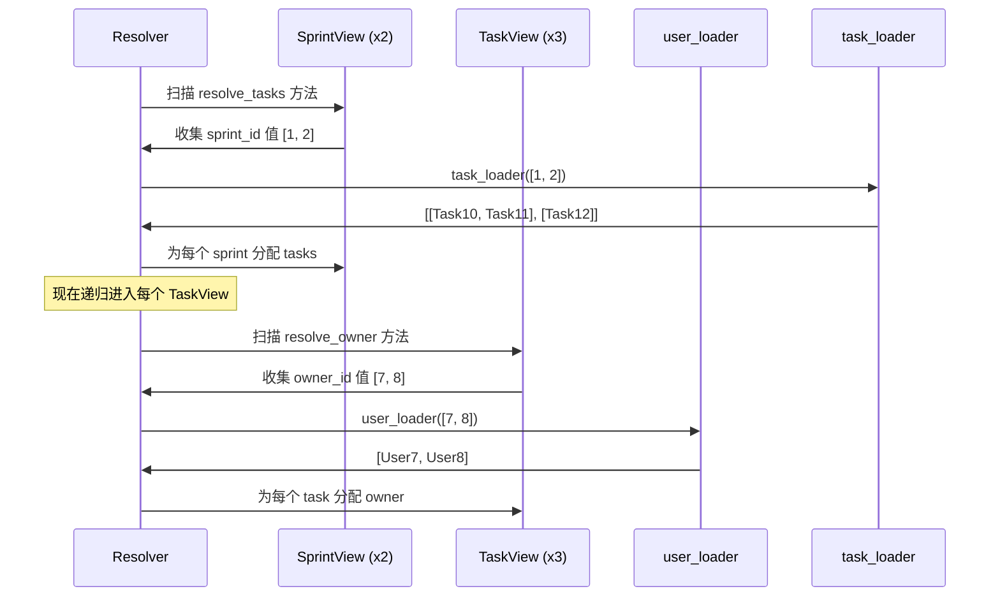

# 核心 API

[English](./core_api.md)

快速入门展示了从当前节点外部加载的一个字段。本页将相同的想法扩展到嵌套的响应树。

目标仍然是手动组合。还没有 ERD。还没有 `AutoLoad`。只有普通的 `resolve_*` 方法、批处理 loader 和递归遍历。

## 从一个字段到一棵树

现在我们想要一个这样的 sprint 响应：

- `Sprint` 有多个 `tasks`
- 每个 `Task` 有一个 `owner`

这给了我们一个嵌套树：`Sprint -> Task -> User`。

## 完整示例

这个示例是自包含且可运行的：

```python
import asyncio
from typing import Optional

from pydantic import BaseModel
from pydantic_resolve import Loader, Resolver, build_list, build_object


# --- 伪数据库 ---
USERS = {
    7: {"id": 7, "name": "Ada"},
    8: {"id": 8, "name": "Bob"},
}

TASKS = [
    {"id": 10, "title": "Design docs", "sprint_id": 1, "owner_id": 7},
    {"id": 11, "title": "Refine examples", "sprint_id": 1, "owner_id": 8},
    {"id": 12, "title": "Write tests", "sprint_id": 2, "owner_id": 7},
]


# --- Loaders ---
async def user_loader(user_ids: list[int]):
    users = [USERS.get(uid) for uid in user_ids]
    return build_object(users, user_ids, lambda u: u.id)


async def task_loader(sprint_ids: list[int]):
    tasks = [t for t in TASKS if t["sprint_id"] in sprint_ids]
    return build_list(tasks, sprint_ids, lambda t: t["sprint_id"])


# --- 响应模型 ---
class UserView(BaseModel):
    id: int
    name: str


class TaskView(BaseModel):
    id: int
    title: str
    owner_id: int
    owner: Optional[UserView] = None

    def resolve_owner(self, loader=Loader(user_loader)):
        return loader.load(self.owner_id)


class SprintView(BaseModel):
    id: int
    name: str
    tasks: list[TaskView] = []

    def resolve_tasks(self, loader=Loader(task_loader)):
        return loader.load(self.id)


# --- 解析 ---
raw_sprints = [
    {"id": 1, "name": "Sprint 24"},
    {"id": 2, "name": "Sprint 25"},
]

sprints = [SprintView.model_validate(s) for s in raw_sprints]
sprints = await Resolver().resolve(sprints)

for s in sprints:
    print(s.model_dump())
```

输出：

```python
{
    'id': 1, 'name': 'Sprint 24',
    'tasks': [
        {'id': 10, 'title': 'Design docs', 'owner_id': 7, 'owner': {'id': 7, 'name': 'Ada'}},
        {'id': 11, 'title': 'Refine examples', 'owner_id': 8, 'owner': {'id': 8, 'name': 'Bob'}},
    ]
}
{
    'id': 2, 'name': 'Sprint 25',
    'tasks': [
        {'id': 12, 'title': 'Write tests', 'owner_id': 7, 'owner': {'id': 7, 'name': 'Ada'}},
    ]
}
```

**结果：** 每个 loader 一次查询，无论你加载多少个 sprint 或 task。

## build_list vs build_object

`build_object` 和 `build_list` 服务于不同的关系类型：

| 函数 | 使用时机 | 返回 |
|----------|----------|---------|
| `build_object(items, keys, get_key)` | 一对一 | `list[item \| None]` —— 每个键一个元素 |
| `build_list(items, keys, get_key)` | 一对多 | `list[list[item]]` —— 每个键一个项列表 |

### build_object 示例（每个 id 一个 user）

```python
async def user_loader(user_ids: list[int]):
    users = [USERS.get(uid) for uid in user_ids]
    return build_object(users, user_ids, lambda u: u.id)
# 结果：[User7, User8, None, User9, ...]
#         ^ 与 user_ids 顺序对齐
```

### build_list 示例（每个 sprint 多个 task）

```python
async def task_loader(sprint_ids: list[int]):
    tasks = [t for t in TASKS if t["sprint_id"] in sprint_ids]
    return build_list(tasks, sprint_ids, lambda t: t["sprint_id"])
# 结果：[[Task10, Task11], [Task12], []]
#          ^ sprint 1        ^ sprint 2  ^ sprint 3
```

## 解析器如何遍历树

你不需要编写任何手动遍历代码。没有嵌套循环。没有说"加载 tasks，然后为每个 task 加载 owner"的编排层。解析器为你处理该序列：



递归遍历就是为什么核心 API 比特定于接口的胶水代码扩展性更好。添加新的嵌套关系意味着添加一个 `resolve_*` 方法和一个 loader —— 遍历逻辑保持不变。

## 解析器构造器选项

`Resolver` 类接受几个配置参数：

### context

传递一个全局上下文字典，可在所有 `resolve_*` 和 `post_*` 方法中访问：

```python
class TaskView(BaseModel):
    owner: Optional[UserView] = None

    def resolve_owner(self, loader=Loader(user_loader), context=None):
        # context 是传递给 Resolver 的字典
        tenant = context.get('tenant_id')
        return loader.load(self.owner_id)

tasks = await Resolver(context={'tenant_id': 1}).resolve(tasks)
```

### loader_params

为 DataLoader 类提供参数：

```python
class OfficeLoader(DataLoader):
    status: str  # 没有默认值，必须提供

    async def batch_load_fn(self, company_ids):
        offices = await get_offices(company_ids, self.status)
        return build_list(offices, company_ids, lambda o: o.company_id)

companies = await Resolver(
    loader_params={OfficeLoader: {'status': 'open'}}
).resolve(companies)
```

### global_loader_param

一次为所有 loader 设置参数。如果在 `loader_params` 和 `global_loader_param` 中都设置了相同的参数，则会引发错误：

```python
companies = await Resolver(
    global_loader_param={'status': 'open'},
    loader_params={OfficeLoader: {'status': 'closed'}}  # 错误：重叠
).resolve(companies)
```

### loader_instances

预创建并用已知数据填充 DataLoader：

```python
loader = UserLoader()
loader.prime(7, UserView(id=7, name="Ada"))

tasks = await Resolver(
    loader_instances={UserLoader: loader}
).resolve(tasks)
```

### debug

打印每个节点的计时信息：

```python
tasks = await Resolver(debug=True).resolve(tasks)
# 输出：
# TaskView       : avg: 0.4ms, max: 0.5ms, min: 0.4ms
# SprintView     : avg: 1.1ms, max: 1.1ms, min: 1.1ms
```

或全局启用：`export PYDANTIC_RESOLVE_DEBUG=true`

### ensure_type

验证返回值是否与字段的类型注释匹配。在开发期间很有用：

```python
tasks = await Resolver(ensure_type=True).resolve(tasks)
```

## 异步 vs 同步 resolve_*

两种形式都可以：

```python
# 同步 —— 直接返回 loader.load(key)
def resolve_owner(self, loader=Loader(user_loader)):
    return loader.load(self.owner_id)

# 异步 —— 等待结果，然后转换
async def resolve_owner(self, loader=Loader(user_loader)):
    user = await loader.load(self.owner_id)
    if user and user.name:
        return user
    return None
```

当你需要等待 loader 并对结果进行后处理时，使用异步。

## 一个方法中的多个 Loader

你可以在单个 `resolve_*` 方法中声明多个 loader 依赖：

```python
class SprintView(BaseModel):
    id: int
    tasks: list[TaskView] = []
    metadata: Optional[SprintMeta] = None

    async def resolve_tasks(
        self,
        task_loader=Loader(task_loader_fn),
        meta_loader=Loader(meta_loader_fn)
    ):
        tasks = await task_loader.load(self.id)
        self.metadata = await meta_loader.load(self.id)
        return tasks
```

注意：使用异步时，你也可以通过 `self.field = value` 直接设置其他字段。

## 常见模式

### 模式：加载和转换

```python
async def resolve_active_tasks(self, loader=Loader(task_loader)):
    tasks = await loader.load(self.id)
    return [t for t in tasks if t.status == 'active']
```

### 模式：条件加载

```python
def resolve_thumbnail(self, loader=Loader(image_loader)):
    if self.thumbnail_id:
        return loader.load(self.thumbnail_id)
    return None
```

### 模式：静态值（不需要 loader）

```python
def resolve_display_name(self):
    return f"{self.first_name} {self.last_name}"
```

当 `resolve_*` 方法不声明 loader 时，它只是返回计算值。这适用于可以从现有数据导出而无需外部 IO 的字段。

## 何时手动 resolve_* 仍然是正确的工具

手动核心 API 通常足够，当：

- 你只有几个响应模型
- 关系连接还没有重复
- 你希望每个接口保持最大显式性
- 响应的形状仍在快速变化

在这个阶段，显式性是一个特性，而不是限制。

## 本页尚未添加的内容

本页有意在派生字段之前停止。现在我们只加载相关数据。我们还没有计算诸如此类的字段：

- `task_count`
- `contributor_names`

这些属于下一个概念层。

## 下一步

继续阅读 [后处理](./post_processing.zh.md)，了解字段应该在子树已经组装之后何时计算。
