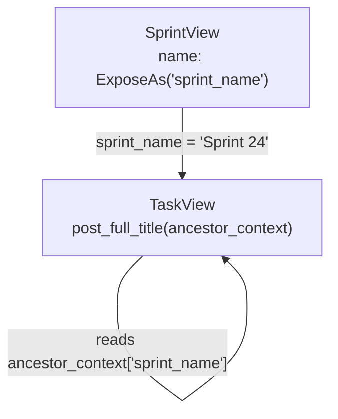
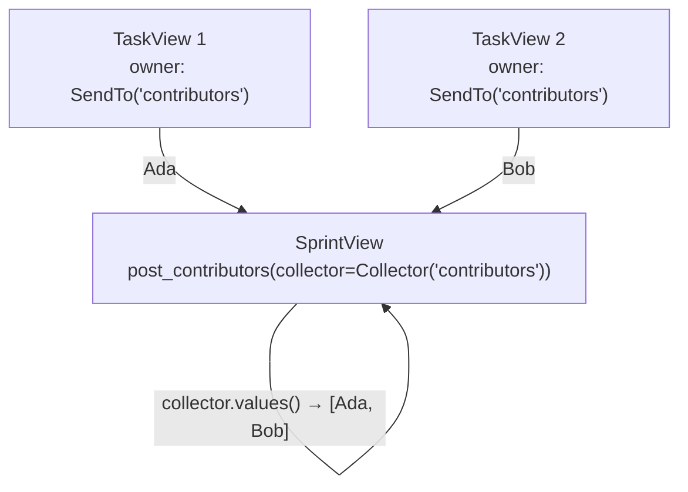
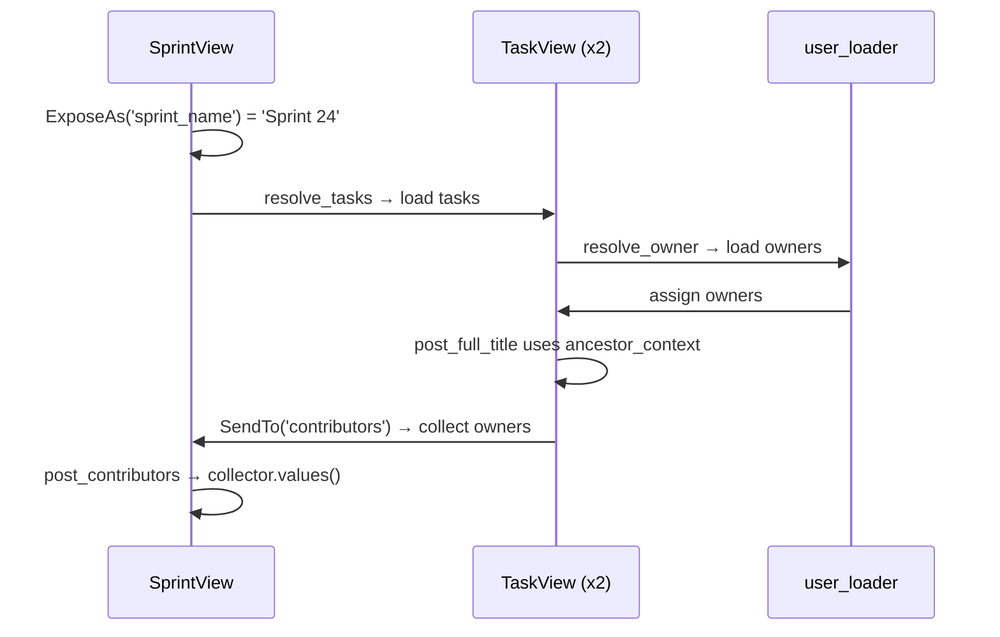

# Cross-Layer Data Flow

[中文版](./cross_layer_data_flow.zh.md)

Most users do not need these features on day one. But when parent and child nodes need to coordinate across multiple layers, `ExposeAs`, `SendTo`, and `Collector` let you keep that logic declarative instead of writing manual traversal code.

We will stay on the same `Sprint -> Task -> User` scenario.

## Two Problems We Want to Solve

1. Each task should build a `full_title` like `Sprint 24 / Design docs`.
2. The sprint should aggregate all task owners into `contributors`.

Both problems cross object boundaries. That is exactly where cross-layer flow starts to pay off.

## Full Example

```python
import asyncio
from typing import Annotated, Optional

from pydantic import BaseModel
from pydantic_resolve import Collector, ExposeAs, Loader, Resolver, SendTo, build_list, build_object


# --- Fake database ---
USERS = {
    7: {"id": 7, "name": "Ada"},
    8: {"id": 8, "name": "Bob"},
}

TASKS = [
    {"id": 10, "title": "Design docs", "sprint_id": 1, "owner_id": 7},
    {"id": 11, "title": "Refine examples", "sprint_id": 1, "owner_id": 8},
]


async def user_loader(user_ids: list[int]):
    users = [USERS.get(uid) for uid in user_ids]
    return build_object(users, user_ids, lambda u: u.id)


async def task_loader(sprint_ids: list[int]):
    tasks = [t for t in TASKS if t["sprint_id"] in sprint_ids]
    return build_list(tasks, sprint_ids, lambda t: t["sprint_id"])


class UserView(BaseModel):
    id: int
    name: str


class SprintView(BaseModel):
    id: int
    name: Annotated[str, ExposeAs('sprint_name')]
    tasks: list['TaskView'] = []
    contributors: list[UserView] = []

    def resolve_tasks(self, loader=Loader(task_loader)):
        return loader.load(self.id)

    def post_contributors(self, collector=Collector('contributors')):
        return collector.values()


class TaskView(BaseModel):
    id: int
    title: str
    owner_id: int
    owner: Annotated[Optional[UserView], SendTo('contributors')] = None
    full_title: str = ""

    def resolve_owner(self, loader=Loader(user_loader)):
        return loader.load(self.owner_id)

    def post_full_title(self, ancestor_context):
        return f"{ancestor_context['sprint_name']} / {self.title}"


# --- Resolve ---
raw_sprints = [{"id": 1, "name": "Sprint 24"}]
sprints = [SprintView.model_validate(s) for s in raw_sprints]
sprints = await Resolver().resolve(sprints)

print(sprints[0].model_dump())
# {'id': 1, 'name': 'Sprint 24',
#  'tasks': [
#      {'id': 10, 'title': 'Design docs', 'owner_id': 7,
#       'owner': {'id': 7, 'name': 'Ada'},
#       'full_title': 'Sprint 24 / Design docs'},
#      {'id': 11, 'title': 'Refine examples', 'owner_id': 8,
#       'owner': {'id': 8, 'name': 'Bob'},
#       'full_title': 'Sprint 24 / Refine examples'},
#  ],
#  'contributors': [{'id': 7, 'name': 'Ada'}, {'id': 8, 'name': 'Bob'}]}
```

## Downward Flow with ExposeAs

`ExposeAs('sprint_name')` means the `SprintView.name` field is published to descendants under the alias `sprint_name`.

That is why `TaskView.post_full_title` can read:

```python
ancestor_context['sprint_name']
```

### How It Works



### When to Use ExposeAs

Use this when descendants need ancestor context such as:

- Sprint names, project names, organization names
- Tenant identifiers or permission scopes
- Display prefixes or formatting config
- Feature flags that affect rendering at lower levels

### Practical Rule

Expose aliases should be globally unique within the resolved tree. If different ancestors reuse the same alias for unrelated meanings, the result becomes hard to reason about.

```python
# GOOD: unique aliases
class Project(BaseModel):
    name: Annotated[str, ExposeAs('project_name')]

class Sprint(BaseModel):
    name: Annotated[str, ExposeAs('sprint_name')]

# BAD: conflicting aliases
class Project(BaseModel):
    name: Annotated[str, ExposeAs('name')]  # ambiguous

class Sprint(BaseModel):
    name: Annotated[str, ExposeAs('name')]  # collides with Project
```

### Multiple Levels of Exposure

ExposeAs works across any depth. A grandparent's exposed value reaches all descendants:

```python
class OrganizationView(BaseModel):
    org_name: Annotated[str, ExposeAs('org_name')]

    projects: list[ProjectView] = []

class ProjectView(BaseModel):
    project_name: Annotated[str, ExposeAs('project_name')]

    sprints: list[SprintView] = []

class SprintView(BaseModel):
    name: str
    context_info: str = ""

    def post_context_info(self, ancestor_context):
        # can read both org_name and project_name
        org = ancestor_context.get('org_name', '')
        proj = ancestor_context.get('project_name', '')
        return f"{org} > {proj} > {self.name}"
```

## Upward Flow with SendTo and Collector

`SendTo('contributors')` marks `TaskView.owner` as data that should flow upward into a collector named `contributors`.

`SprintView.post_contributors` is where the sprint consumes that aggregated data:

```python
def post_contributors(self, collector=Collector('contributors')):
    return collector.values()
```

### How It Works



### Collector with flat=True

By default, `Collector` uses `append` to accumulate values. With `flat=True`, it uses `extend` to merge lists:

```python
class SprintView(BaseModel):
    tasks: list[TaskView] = []
    all_tags: list[str] = []

    def resolve_tasks(self, loader=Loader(task_loader)):
        return loader.load(self.id)

    def post_all_tags(self, collector=Collector('task_tags', flat=True)):
        return collector.values()


class TaskView(BaseModel):
    tags: Annotated[list[str], SendTo('task_tags')] = []
```

Without `flat=True`, the result would be `[['design', 'docs'], ['examples']]`. With `flat=True`, it becomes `['design', 'docs', 'examples']`.

### SendTo with Tuple Targets

A single field can send to multiple collectors:

```python
class TaskView(BaseModel):
    owner: Annotated[
        Optional[UserView],
        SendTo(('contributors', 'all_users'))
    ] = None
```

This sends the same `owner` value to both the `contributors` and `all_users` collectors.

### Custom Collector with ICollector

You can implement your own collector by subclassing `ICollector`:

```python
from pydantic_resolve import ICollector

class CounterCollector(ICollector):
    def __init__(self, alias):
        self.alias = alias
        self.counter = 0

    def add(self, val):
        self.counter += len(val)

    def values(self):
        return self.counter


class SprintView(BaseModel):
    tasks: list[TaskView] = []
    total_tag_count: int = 0

    def resolve_tasks(self, loader=Loader(task_loader)):
        return loader.load(self.id)

    def post_total_tag_count(self, collector=CounterCollector('task_tags')):
        return collector.values()
```

## Lifecycle Mental Model

The cross-layer version still follows the same two-phase discipline:

1. Ancestor data is exposed downward (`ExposeAs`).
2. Descendants resolve and post-process themselves (`resolve_*` + `post_*`).
3. Descendant values are sent upward (`SendTo`).
4. Parent `post_*` methods consume the collected values (`Collector`).



The important point is that you still are not writing manual tree traversal code.

## When These Features Are Worth It

Reach for them when:

- Children need ancestor context and passing it explicitly would clutter signatures everywhere
- Parents need aggregated descendant data and manual loops would spread across endpoint code
- The same ancestor data is needed at many different nesting levels

Skip them when:

- A field can be computed locally inside the current node
- Only one layer is involved
- The explicit version is still short and obvious

## Combining Multiple Annotations

You can combine `AutoLoad`, `SendTo`, and `ExposeAs` on the same field:

```python
from pydantic_resolve import AutoLoad, SendTo

class TaskView(TaskEntity):
    owner: Annotated[
        Optional[UserEntity],
        AutoLoad(),                # auto-resolve via ERD
        SendTo('contributors')     # send to parent's collector
    ] = None
```

## Next

Continue to [ERD and AutoLoad](./erd_and_autoload.md) when repeated `resolve_*` wiring starts to appear across many models.
