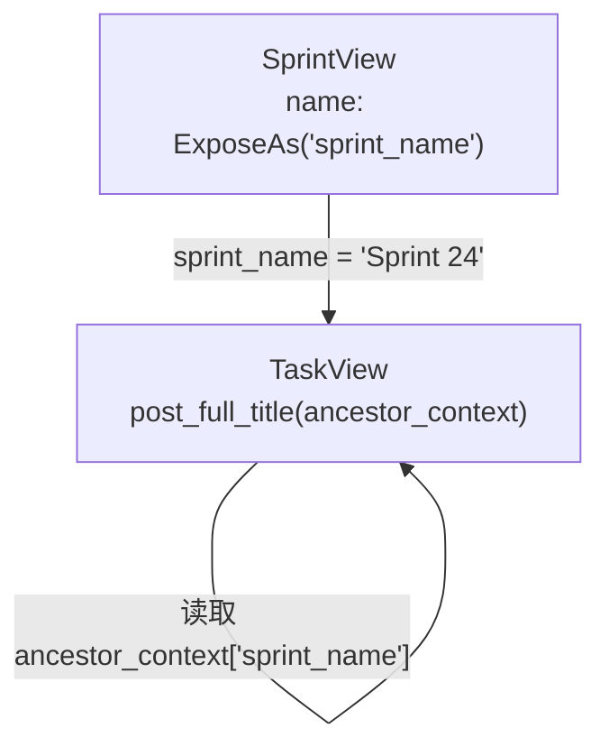
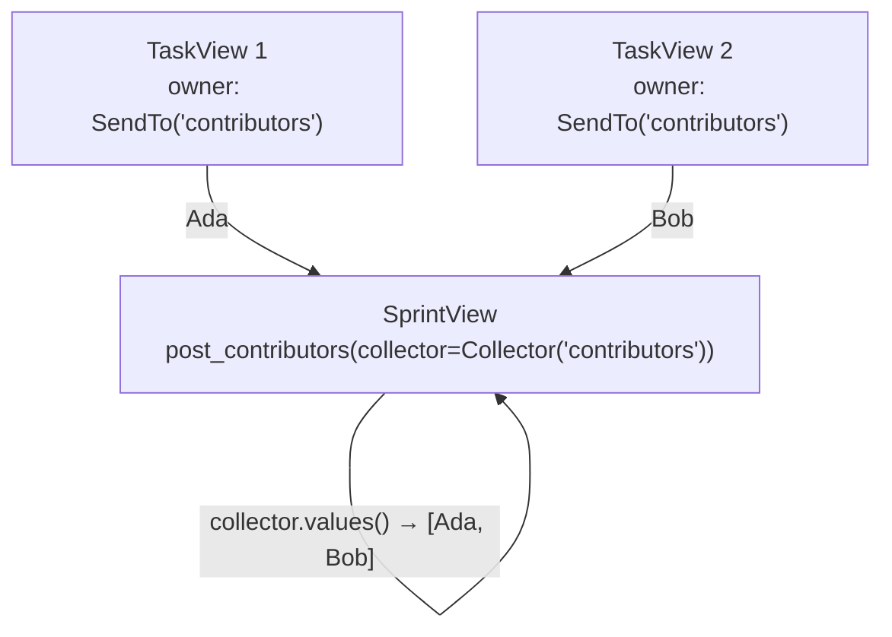
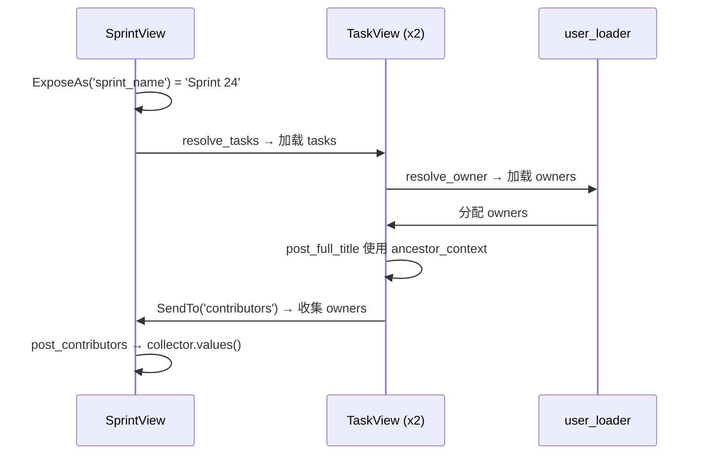

# 跨层数据流

[English](./cross_layer_data_flow.md)

大多数用户在第一天不需要这些功能。但是当父节点和子节点需要跨多层协调时，`ExposeAs`、`SendTo` 和 `Collector` 让你保持该逻辑声明性，而不是编写手动遍历代码。

我们将继续使用相同的 `Sprint -> Task -> User` 场景。

## 我们想要解决的两个问题

1. 每个 task 应该构建一个 `full_title`，如 `Sprint 24 / Design docs`。
2. sprint 应该将所有 task owners 聚合到 `contributors` 中。

两个问题都跨越对象边界。这正是跨层数据流开始产生回报的地方。

## 完整示例

```python
import asyncio
from typing import Annotated, Optional

from pydantic import BaseModel
from pydantic_resolve import Collector, ExposeAs, Loader, Resolver, SendTo, build_list, build_object


# --- 伪数据库 ---
USERS = {
    7: {"id": 7, "name": "Ada"},
    8: {"id": 8, "name": "Bob"},
}

TASKS = [
    {"id": 10, "title": "Design docs", "sprint_id": 1, "owner_id": 7},
    {"id": 11, "title": "Refine examples", "sprint_id": 1, "owner_id": 8},
]


async def user_loader(user_ids: list[int]):
    users = [USERS.get(uid) for uid in user_ids]
    return build_object(users, user_ids, lambda u: u.id)


async def task_loader(sprint_ids: list[int]):
    tasks = [t for t in TASKS if t["sprint_id"] in sprint_ids]
    return build_list(tasks, sprint_ids, lambda t: t["sprint_id"])


class UserView(BaseModel):
    id: int
    name: str


class SprintView(BaseModel):
    id: int
    name: Annotated[str, ExposeAs('sprint_name')]
    tasks: list['TaskView'] = []
    contributors: list[UserView] = []

    def resolve_tasks(self, loader=Loader(task_loader)):
        return loader.load(self.id)

    def post_contributors(self, collector=Collector('contributors')):
        return collector.values()


class TaskView(BaseModel):
    id: int
    title: str
    owner_id: int
    owner: Annotated[Optional[UserView], SendTo('contributors')] = None
    full_title: str = ""

    def resolve_owner(self, loader=Loader(user_loader)):
        return loader.load(self.owner_id)

    def post_full_title(self, ancestor_context):
        return f"{ancestor_context['sprint_name']} / {self.title}"


# --- 解析 ---
raw_sprints = [{"id": 1, "name": "Sprint 24"}]
sprints = [SprintView.model_validate(s) for s in raw_sprints]
sprints = await Resolver().resolve(sprints)

print(sprints[0].model_dump())
# {'id': 1, 'name': 'Sprint 24',
#  'tasks': [
#      {'id': 10, 'title': 'Design docs', 'owner_id': 7,
#       'owner': {'id': 7, 'name': 'Ada'},
#       'full_title': 'Sprint 24 / Design docs'},
#      {'id': 11, 'title': 'Refine examples', 'owner_id': 8,
#       'owner': {'id': 8, 'name': 'Bob'},
#       'full_title': 'Sprint 24 / Refine examples'},
#  ],
#  'contributors': [{'id': 7, 'name': 'Ada'}, {'id': 8, 'name': 'Bob'}]}
```

## 使用 ExposeAs 向下流动

`ExposeAs('sprint_name')` 意味着 `SprintView.name` 字段在别名 `sprint_name` 下发布给后代。

这就是为什么 `TaskView.post_full_title` 可以读取：

```python
ancestor_context['sprint_name']
```

### 工作原理



### 何时使用 ExposeAs

当后代需要祖先上下文时使用此功能，例如：

- Sprint 名称、项目名称、组织名称
- 租户标识符或权限范围
- 显示前缀或格式化配置
- 影响较低级别渲染的功能标志

### 实用规则

暴露别名应在解析树内全局唯一。如果不同的祖先对不相关的含义重用相同的别名，结果将变得难以推理。

```python
# 好：唯一别名
class Project(BaseModel):
    name: Annotated[str, ExposeAs('project_name')]

class Sprint(BaseModel):
    name: Annotated[str, ExposeAs('sprint_name')]

# 坏：冲突别名
class Project(BaseModel):
    name: Annotated[str, ExposeAs('name')]  # 歧义

class Sprint(BaseModel):
    name: Annotated[str, ExposeAs('name')]  # 与 Project 冲突
```

### 多级暴露

ExposeAs 跨任何深度工作。祖父的暴露值到达所有后代：

```python
class OrganizationView(BaseModel):
    org_name: Annotated[str, ExposeAs('org_name')]

    projects: list[ProjectView] = []

class ProjectView(BaseModel):
    project_name: Annotated[str, ExposeAs('project_name')]

    sprints: list[SprintView] = []

class SprintView(BaseModel):
    name: str
    context_info: str = ""

    def post_context_info(self, ancestor_context):
        # 可以读取 org_name 和 project_name
        org = ancestor_context.get('org_name', '')
        proj = ancestor_context.get('project_name', '')
        return f"{org} > {proj} > {self.name}"
```

## 使用 SendTo 和 Collector 向上流动

`SendTo('contributors')` 标记 `TaskView.owner` 为应该向上流入名为 `contributors` 的收集器的数据。

`SprintView.post_contributors` 是 sprint 消费聚合数据的地方：

```python
def post_contributors(self, collector=Collector('contributors')):
    return collector.values()
```

### 工作原理



### 使用 flat=True 的 Collector

默认情况下，`Collector` 使用 `append` 来累积值。使用 `flat=True`，它使用 `extend` 来合并列表：

```python
class SprintView(BaseModel):
    tasks: list[TaskView] = []
    all_tags: list[str] = []

    def resolve_tasks(self, loader=Loader(task_loader)):
        return loader.load(self.id)

    def post_all_tags(self, collector=Collector('task_tags', flat=True)):
        return collector.values()


class TaskView(BaseModel):
    tags: Annotated[list[str], SendTo('task_tags')] = []
```

没有 `flat=True`，结果将是 `[['design', 'docs'], ['examples']]`。使用 `flat=True`，它变成 `['design', 'docs', 'examples']`。

### 使用元组目标的 SendTo

一个字段可以发送到多个收集器：

```python
class TaskView(BaseModel):
    owner: Annotated[
        Optional[UserView],
        SendTo(('contributors', 'all_users'))
    ] = None
```

这会将相同的 `owner` 值发送到 `contributors` 和 `all_users` 收集器。

### 使用 ICollector 的自定义收集器

你可以通过子类化 `ICollector` 来实现自己的收集器：

```python
from pydantic_resolve import ICollector

class CounterCollector(ICollector):
    def __init__(self, alias):
        self.alias = alias
        self.counter = 0

    def add(self, val):
        self.counter += len(val)

    def values(self):
        return self.counter


class SprintView(BaseModel):
    tasks: list[TaskView] = []
    total_tag_count: int = 0

    def resolve_tasks(self, loader=Loader(task_loader)):
        return loader.load(self.id)

    def post_total_tag_count(self, collector=CounterCollector('task_tags')):
        return collector.values()
```

## 生命周期心智模型

跨层版本仍然遵循相同的两阶段规则：

1. 祖先数据向下暴露（`ExposeAs`）。
2. 后代解析和后处理自己（`resolve_*` + `post_*`）。
3. 后代值向上发送（`SendTo`）。
4. 父 `post_*` 方法消费收集的值（`Collector`）。



重要的一点是你仍然不需要编写手动树遍历代码。

## 何时这些功能值得使用

在以下情况下使用它们：

- 子节点需要祖先上下文，并且显式传递会使签名混乱
- 父节点需要聚合后代数据，手动循环会分散在接口代码中
- 同样的祖先数据在许多不同的嵌套级别需要

在以下情况下跳过它们：

- 字段可以在当前节点内本地计算
- 只涉及一层
- 显式版本仍然简短明显

## 组合多个注释

你可以在同一个字段上组合 `AutoLoad`、`SendTo` 和 `ExposeAs`：

```python
from pydantic_resolve import AutoLoad, SendTo

class TaskView(TaskEntity):
    owner: Annotated[
        Optional[UserEntity],
        AutoLoad(),                # 通过 ERD 自动解析
        SendTo('contributors')     # 发送到父节点的收集器
    ] = None
```

## 下一步

当重复的 `resolve_*` 连接开始出现在许多模型中时，继续阅读 [ERD 和 AutoLoad](./erd_and_autoload.zh.md)。
