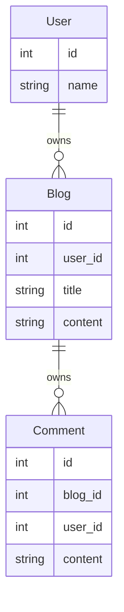

# DataLoader

DataLoader is a very important component in pydantic-resolve, utilizing a third-party independent library [aiodataloader](https://github.com/syrusakbary/aiodataloader). It is often used as a dependency in GraphQL-related libraries.

It can solve the N+1 query problem in GraphQL by combining multiple concurrent queries into a single batch query to optimize performance.

The internal mechanism of pydantic-resolve is somewhat similar to GraphQL, so it can be directly used to handle data loading. For some simple DataLoaders, reuse with other Python GraphQL frameworks can also be achieved.

For example, the code introduced in the introduction, when batch processing `get_cars_by_child`, multiple triggers occur, causing the N+1 query problem. We can solve this with DataLoader.

```python
class Child(BaseModel):
    id: int
    name: str

    cars: List[Car] = []
    # async def resolve_cars(self):
    #     return await get_cars_by_child(self.id)

    cars: List[Car] = []
    async def resolve_cars(self, loader=LoaderDepend(CarLoader)):
        return await loader.load(self.id)

    description: str = ''
    def post_description(self):
        desc = ', '.join([c.name for c in self.cars])
        return f'{self.name} owns {len(self.cars)} cars, they are: {desc}'

children = await Resolver.resolve([
        Child(id=1, name="Titan"), Child(id=1, name="Siri")])
```

## Sample



```python
import asyncio
import json
from typing import Optional
from pydantic import BaseModel
from pydantic_resolve import Resolver, build_object, build_list, LoaderDepend
from aiodataloader import DataLoader

# Schema/ Entity
class Comment(BaseModel):
    id: int
    content: str
    user_id: int

class Blog(BaseModel):
    id: int
    title: str
    content: str

class User(BaseModel):
    id: int
    name: str


# Loaders/ relationships
class CommentLoader(DataLoader):
    async def batch_load_fn(self, comment_ids):
        comments = [
            dict(id=1, content="world is beautiful", blog_id=1, user_id=1),
            dict(id=2, content="Mars is beautiful", blog_id=2, user_id=2),
            dict(id=3, content="I love Mars", blog_id=2, user_id=3),
        ]
        return build_list(comments, comment_ids, lambda c: c['blog_id'])

class UserLoader(DataLoader):
    async def batch_load_fn(self, user_ids):
        users = [ dict(id=1, name="Alice"), dict(id=2, name="Bob"), ]
        return build_object(users, user_ids, lambda u: u['id'])


# Compose schemas and dataloaders together
class CommentWithUser(Comment):
    user: Optional[User] = None
    def resolve_user(self, loader=LoaderDepend(UserLoader)):
        return loader.load(self.user_id)

class BlogWithComments(Blog):
    comments: list[CommentWithUser] = []
    def resolve_comments(self, loader=LoaderDepend(CommentLoader)):
        return loader.load(self.id)


# Run
async def main():
    raw_blogs =[
        dict(id=1, title="hello world", content="hello world detail"),
        dict(id=2, title="hello Mars", content="hello Mars detail"),
    ]
    blogs = await Resolver().resolve([BlogWithComments.parse_obj(b) for b in raw_blogs])
    print(json.dumps(blogs, indent=2, default=lambda o: o.dict()))

asyncio.run(main())
```

Note:
The purpose of this example is to demonstrate the ability to fetch related data. People often ask how to handle pagination. Generally, pagination is used when there is a large amount of root data, such as a paginated User list.

If you want to paginate Blogs, one way is to treat Blogs as the root data entry and paginate using `api/blog?limit=10&offset=0`.

Alternatively, you can use a single User and paginate the blogs with the `context` parameter. In this case, you cannot use DataLoader and need to replace it with a single method like `get_blogs_by_user_id_with_pagination`.

Additionally, DataLoader can add range limits, such as fetching a batch of users' blogs from the last N days or comments from the last M days. This approach aligns with the data volume displayed in the UI.

## Creating a DataLoader

There are two ways to create a DataLoader object. One is by inheritance:

```python
from aiodataloader import DataLoader

class UserLoader(DataLoader):
    max_batch_size = 20
    async def batch_load_fn(self, keys):
        return await my_batch_get_users(keys)

user_loader = UserLoader()
```

The inheritance method allows setting some `aiodataloader` related parameters, such as using `max_batch_size = 20` to slice and parallelize the keys.

These parameters are reserved parameter names for aiodataloader, so be careful not to use the same names when adding new parameters.

The other way is to directly create an `async def batch_load_fn(keys)` method, and pydantic-resolve will use `DataLoader(batch_load_fn)` to create an instance internally.

Generally, it is recommended to use the first method, and the reasons will be explained later.

Next, we will introduce a series of features provided by pydantic-resolve based on DataLoader:

## Multi-layer Data Stitching

Take Company, Office, and Member as examples. Office and Member have dataloaders that return their data, as long as the corresponding office_id and member_id are provided.

- OfficeLoader gets the corresponding Office list through company_id
- MemberLoader gets the Member list through office_id

Taking OfficeLoader as an example, passing in company_ids returns an array of offices obtained in the order of company_ids.

For example, input `company_ids = [1, 2, 3]`, return `[[office_1, office_2], [office_3], [office_4]]`, which means company 1 has `[office_1, office_2]`, and so on.

> build_list is a helper method provided by pydantic-resolve to simplify the assembly process

```python
class OfficeLoader(DataLoader)
    async def batch_load_fn(self, company_ids):
        offices = await get_offices_by_company_ids(company_ids)
        return build_list(offices, company_ids, lambda x: x['company_id'])  # Assuming the data is a dict

class Company(BaseModel):
    id: int
    name: str

    offices: List[Office] = []
    def resolve_offices(self, loader=LoaderDepend(OfficeLoader)):
        return loader.load(self.id)  # Returns a Future

class Office(BaseModel):
    id: int
    company_id: int
    name: str

    members: List[Member] = []
    def resolve_members(self, loader=LoaderDepend(MemberLoader)):
        return loader.load(self.id)  # Returns a Future

class Member(BaseModel):
    id: int
    office_id: int
    name: str

companies = [
    Company(id=1, name='Aston'),
    Compay(id=2, name="Nicc"),
    Company(id=3, name="Carxx")
]
companies = await Resolver().resolve(companies)
```

In this code, Company extends the offices data, and then Office extends the members data. During the entire process, the batch_load_fn in OfficeLoader and MemberLoader only executes once, regardless of the number of Offices and members.

> Of course, if max_batch_size is relatively small, multiple batch_load_fn may be executed concurrently

## Providing Parameters and Cloning

DataLoader can add parameters, but be careful to avoid conflicts with the default parameters in `aiodataloader`: `batch`, `max_batch_size`, `cache`, `cache_key_fn`, `cache_map`.

For example, add a `status` parameter to OfficeLoader to filter `open` offices.

```python
class OfficeLoader(DataLoader)
    status: Literal['open', 'closed', 'inactive']

    async def batch_load_fn(self, company_ids):
        offices = await get_offices_by_company_ids_by_status(company_ids, self.status)
        return build_list(offices, company_ids, lambda x: x['company_id'])
```

The defined parameters can be set in the Resolver through loader_params.

```python
companies = [
    Company(id=1, name='Aston'),
    Compay(id=2, name="Nicc"),
    Company(id=3, name="Carxx")
]
companies = await Resolver(
    loader_params={
        OfficeLoader: {
            'status': 'open'
        }
    }
).resolve(companies)
```

There is still a problem here. What if you need to get both `open` and `closed` data at the same time?

```python
class Company(BaseModel):
    id: int
    name: str

    open_offices: List[Office] = []
    def resolve_open_offices(self, loader=LoaderDepend(OfficeLoader)):
        return loader.load(self.id)

    closed_offices: List[Office] = []
    def resolve_closed_offices(self, loader=LoaderDepend(OfficeLoader)):
        return loader.load(self.id)
```

Different conditions for the data cannot be provided by a single OfficeLoader. pydantic-resolve provides a tool to clone two OfficeLoaders.

```python
from pydantic_resolve import copy_dataloader_kls

OfficeLoader1 = copy_dataloader_kls('OfficeLoader1', OfficeLoader)
OfficeLoader2 = copy_dataloader_kls('OfficeLoader2', OfficeLoader)

class Company(BaseModel):
    id: int
    name: str

    open_offices: List[Office] = []
    def resolve_open_offices(self, loader=LoaderDepend(OfficeLoader1)):
        return loader.load(self.id)

    closed_offices: List[Office] = []
    def resolve_closed_offices(self, loader=LoaderDepend(OfficeLoader2)):
        return loader.load(self.id)

companies = [
    Company(id=1, name='Aston'),
    Company(id=2, name="Nicc"),
    Company(id=3, name="Carxx")
]
companies = await Resolver(
    loader_params={
        OfficeLoader1: {
            'status': 'open'
        }，
        OfficeLoader2: {
            'status': 'closed'
        }
    }
).resolve(companies)
```

## Handling DataLoader Return Values

If you need to process the return value of `loader.load(self.id)`, you can change resolve_offices to async.

```python
class Company(BaseModel):
    id: int
    name: str

    offices: List[Office] = []
    async def resolve_offices(self, loader=LoaderDepend(OfficeLoader)):
        offices = await loader.load(self.id)
        return [of for of in offices if of['status'] == 'open']
```

In addition, pydantic-resolve does not restrict the name or number of loaders, so the following usage is also allowed. The example given is a bit strange though.

```python
class Company(BaseModel):
    id: int
    name: str

    offices: List[Office] = []
    async def resolve_offices(
            self,
            office_loader=LoaderDepend(OfficeLoader),
            manager_loader=LoaderDepend(ManagerLoader)):
        offices = await office_loader.load(self.id)
        managers = await manager_loader.load(self.id)

        offices = [of for of in offices if of['manager'] in managers]
        return offices
```

## Pre-generating DataLoader Instances

You can generate DataLoader instances in advance and set the data in advance, so you can use the cache mechanism of DataLoader to avoid query overhead during the resolve() phase.

This can be helpful in some specific scenarios.

```python
loader = SomeLoader()
loader.prime('tangkikodo', ['tom', 'jerry'])
loader.prime('john', ['mike', 'wallace'])
data = await Resolver(loader_instances={SomeLoader: loader}).resolve(data)
```

## Viewing DataLoader Instance Data

If you want to know which instances DataLoader has initialized and what data it has obtained, you can print it out to check.

```python
resolver = Resolver()
data = await resolver.resolve(data)
print(resolver.loader_instance_cache)
```
