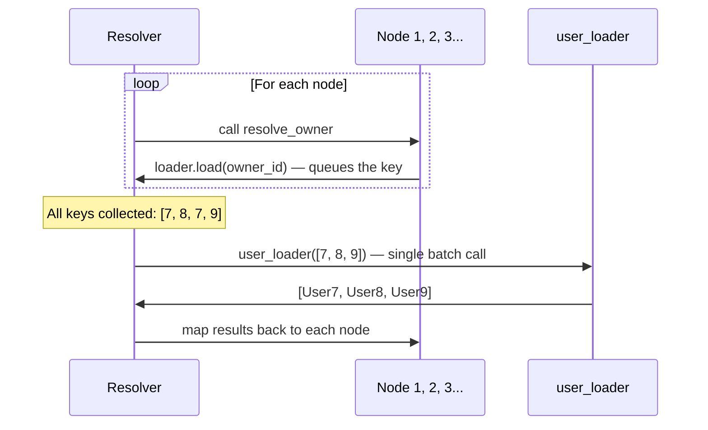

# DataLoader Deep Dive

[中文版](./dataloader_deep_dive.zh.md)

This page goes deeper into how DataLoader batching works, how to write effective loaders, and how to configure them for different scenarios.

## How DataLoader Batching Works

The core idea is simple: instead of loading data one at a time, the resolver collects all requested keys first, then calls each loader function once with the full batch.



The resolver collects keys during the `resolve_*` phase, then flushes all pending loads before descending into child nodes. This means one loader call per level, regardless of how many nodes request data.

## Creating a DataLoader

There are two ways to create a loader:

### Function-Based (Simpler)

```python
async def user_loader(user_ids: list[int]):
    users = await db.query(User).filter(User.id.in_(user_ids)).all()
    return build_object(users, user_ids, lambda u: u.id)
```

pydantic-resolve wraps this function in a `DataLoader(batch_load_fn=user_loader)` internally.

### Class-Based (More Flexible)

```python
from aiodataloader import DataLoader

class UserLoader(DataLoader):
    max_batch_size = 20

    async def batch_load_fn(self, user_ids):
        users = await db.query(User).filter(User.id.in_(user_ids)).all()
        return build_object(users, user_ids, lambda u: u.id)
```

Class-based loaders let you configure `aiodataloader` options:

| Parameter | Type | Default | Description |
|-----------|------|---------|-------------|
| `batch` | bool | `True` | Enable batching |
| `max_batch_size` | int | `None` | Split keys into chunks of this size |
| `cache` | bool | `True` | Enable key caching |
| `cache_key_fn` | Callable | `None` | Custom cache key function |
| `cache_map` | dict | `None` | Custom cache map |

For example, `max_batch_size = 20` splits 100 keys into 5 batches of 20.

## build_object, build_list, build_tree

These helper functions align fetched records with the incoming key order.

### build_object

For one-to-one relationships. Returns one item (or `None`) per key.

```python
from pydantic_resolve import build_object

async def user_loader(user_ids: list[int]):
    users = await fetch_users(user_ids)
    return build_object(users, user_ids, lambda u: u.id)
    # Result: [User7, User8, None, User9, ...]
    #         ^ aligned with user_ids order
```

**Signature:** `build_object(items, keys, get_key_fn) -> list[item | None]`

- `items`: the fetched records
- `keys`: the original key list
- `get_key_fn`: function to extract the key from an item

If a key has no matching item, `None` is returned in that position.

### build_list

For one-to-many relationships. Returns a list of items per key.

```python
from pydantic_resolve import build_list

async def task_loader(sprint_ids: list[int]):
    tasks = await fetch_tasks(sprint_ids)
    return build_list(tasks, sprint_ids, lambda t: t.sprint_id)
    # Result: [[Task1, Task2], [Task3], []]
    #          ^ sprint 1       ^ sprint 2  ^ sprint 3
```

**Signature:** `build_list(items, keys, get_key_fn) -> list[list[item]]`

### build_tree

For nested grouping with a tuple key. Groups items by a `(parent_key, child_key)` tuple.

```python
from pydantic_resolve import build_tree

async def comment_loader(post_and_user_ids: list[tuple[int, int]]):
    comments = await fetch_comments(post_and_user_ids)
    return build_tree(
        comments,
        post_and_user_ids,
        lambda c: (c.post_id, c.user_id)
    )
```

## Empty Loader Generators

When you need a loader that returns empty defaults for missing keys:

```python
from pydantic_resolve import (
    generate_strict_empty_loader,
    generate_list_empty_loader,
    generate_single_empty_loader,
)

# Returns None for missing keys
EmptySingleLoader = generate_single_empty_loader('EmptySingleLoader')

# Returns [] for missing keys
EmptyListLoader = generate_list_empty_loader('EmptyListLoader')

# Raises error for missing keys
StrictLoader = generate_strict_empty_loader('StrictLoader')
```

## Passing Parameters to Loaders

### Loader Class Attributes

Define class-level attributes on your loader and set them via `Resolver(loader_params=...)`:

```python
class OfficeLoader(DataLoader):
    status: str  # no default — must be provided

    async def batch_load_fn(self, company_ids):
        offices = await get_offices(company_ids, self.status)
        return build_list(offices, company_ids, lambda o: o.company_id)

# Provide the parameter
companies = await Resolver(
    loader_params={OfficeLoader: {'status': 'open'}}
).resolve(companies)
```

Attributes with default values do not need to be provided:

```python
class OfficeLoader(DataLoader):
    status: str = 'open'  # default — optional in loader_params
```

### global_loader_param

Set parameters for all loaders at once:

```python
companies = await Resolver(
    global_loader_param={'tenant_id': 1}
).resolve(companies)
```

If the same parameter appears in both `loader_params` and `global_loader_param`, a `GlobalLoaderFieldOverlappedError` is raised.

### Loader Context

Loaders can access the global context by declaring a `_context` attribute:

```python
class UserLoader(DataLoader):
    _context: dict  # receives Resolver's context

    async def batch_load_fn(self, keys):
        user_id = self._context.get('user_id')
        users = await query_users_with_permission(keys, user_id)
        return build_object(users, keys, lambda u: u.id)

# Provide context
result = await Resolver(context={'user_id': 123}).resolve(data)
```

If a loader declares `_context` but `Resolver` does not provide context, a `LoaderContextNotProvidedError` is raised.

## Cloning Loaders with copy_dataloader_kls

When you need the same loader with different parameters:

```python
from pydantic_resolve import copy_dataloader_kls

OpenOfficeLoader = copy_dataloader_kls('OpenOfficeLoader', OfficeLoader)
ClosedOfficeLoader = copy_dataloader_kls('ClosedOfficeLoader', OfficeLoader)

class Company(BaseModel):
    id: int
    name: str

    open_offices: list[Office] = []
    def resolve_open_offices(self, loader=Loader(OpenOfficeLoader)):
        return loader.load(self.id)

    closed_offices: list[Office] = []
    def resolve_closed_offices(self, loader=Loader(ClosedOfficeLoader)):
        return loader.load(self.id)

companies = await Resolver(
    loader_params={
        OpenOfficeLoader: {'status': 'open'},
        ClosedOfficeLoader: {'status': 'closed'},
    }
).resolve(companies)
```

## Pre-building Loader Instances

You can create a loader ahead of time and prime it with data:

```python
loader = UserLoader()
loader.prime(7, UserView(id=7, name="Ada"))
loader.prime(8, UserView(id=8, name="Bob"))

tasks = await Resolver(
    loader_instances={UserLoader: loader}
).resolve(tasks)
```

This bypasses the loader function for primed keys entirely.

## Query Metadata: self._query_meta

DataLoaders can inspect what fields the response model needs:

```python
class SampleLoader(DataLoader):
    async def batch_load_fn(self, keys):
        # self._query_meta contains field requirements
        fields = self._query_meta.get('fields', ['*'])
        # fields = ['id', 'name']  — only what the response model uses

        data = await query_students(fields, keys)
        return build_list(data, keys, lambda d: d.id)
```

`_query_meta` provides:

- `fields`: de-duplicated union of all request types' fields
- `request_types`: list of `{name, fields}` dicts, one per response model that uses this loader

This enables column-level optimization in SQL queries.

## Inspecting Loaded Data

After resolution, inspect which loaders were used and what they loaded:

```python
resolver = Resolver()
data = await resolver.resolve(data)
print(resolver.loader_instance_cache)
```

## Performance Tips

1. **Use `build_object` / `build_list` correctly.** Returning misaligned data is the most common bug.

2. **Set `max_batch_size` for large datasets.** Databases have `IN (...)` limits.

3. **Use `_query_meta` to select only needed columns.** Don't fetch 20 columns when you need 3.

4. **Prime loaders with known data** to skip queries when you already have the results.

5. **Keep loader functions pure.** Avoid side effects — loaders may be called in any order.

## Next

Continue to [ERD with DefineSubset](./erd_define_subset.md) to learn how to hide internal fields while keeping centralized relationships.
