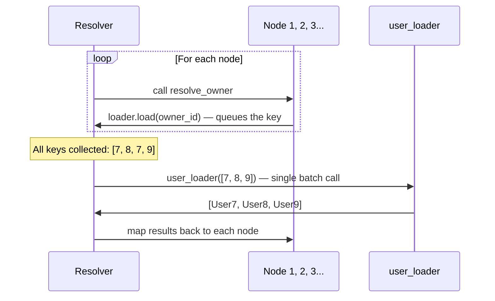

# DataLoader 深度解析

[English](./dataloader_deep_dive.md)

本文深入探讨 DataLoader 批处理的原理、如何编写高效的 loader，以及如何针对不同场景进行配置。

## DataLoader 批处理原理

核心思想很简单：不再逐个加载数据，而是先收集所有被请求的 key，然后一次性调用每个 loader 函数处理整个批次。



resolver 在 `resolve_*` 阶段收集 key，然后在进入子节点之前刷新所有待处理的加载。这意味着无论有多少节点请求数据，每层只会调用一次 loader。

## 创建 DataLoader

有两种方式创建 loader：

### 基于函数（更简单）

```python
async def user_loader(user_ids: list[int]):
    users = await db.query(User).filter(User.id.in_(user_ids)).all()
    return build_object(users, user_ids, lambda u: u.id)
```

pydantic-resolve 会在内部将这个函数包装为 `DataLoader(batch_load_fn=user_loader)`。

### 基于类（更灵活）

```python
from aiodataloader import DataLoader

class UserLoader(DataLoader):
    max_batch_size = 20

    async def batch_load_fn(self, user_ids):
        users = await db.query(User).filter(User.id.in_(user_ids)).all()
        return build_object(users, user_ids, lambda u: u.id)
```

基于类的 loader 可以配置 `aiodataloader` 选项：

| 参数 | 类型 | 默认值 | 描述 |
|-----------|------|---------|-------------|
| `batch` | bool | `True` | 启用批处理 |
| `max_batch_size` | int | `None` | 将 key 分割为指定大小的批次 |
| `cache` | bool | `True` | 启用 key 缓存 |
| `cache_key_fn` | Callable | `None` | 自定义缓存 key 函数 |
| `cache_map` | dict | `None` | 自定义缓存映射 |

例如，`max_batch_size = 20` 会将 100 个 key 分成 5 个批次，每批 20 个。

## build_object、build_list、build_tree

这些辅助函数将获取的记录与传入的 key 顺序对齐。

### build_object

用于一对一关系。每个 key 返回一个项（或 `None`）。

```python
from pydantic_resolve import build_object

async def user_loader(user_ids: list[int]):
    users = await fetch_users(user_ids)
    return build_object(users, user_ids, lambda u: u.id)
    # Result: [User7, User8, None, User9, ...]
    #         ^ 按 user_ids 顺序对齐
```

**签名：** `build_object(items, keys, get_key_fn) -> list[item | None]`

- `items`：获取的记录
- `keys`：原始 key 列表
- `get_key_fn`：从项中提取 key 的函数

如果某个 key 没有匹配的项，该位置返回 `None`。

### build_list

用于一对多关系。每个 key 返回一个项列表。

```python
from pydantic_resolve import build_list

async def task_loader(sprint_ids: list[int]):
    tasks = await fetch_tasks(sprint_ids)
    return build_list(tasks, sprint_ids, lambda t: t.sprint_id)
    # Result: [[Task1, Task2], [Task3], []]
    #          ^ sprint 1       ^ sprint 2  ^ sprint 3
```

**签名：** `build_list(items, keys, get_key_fn) -> list[list[item]]`

### build_tree

用于使用元组 key 的嵌套分组。按 `(parent_key, child_key)` 元组对项进行分组。

```python
from pydantic_resolve import build_tree

async def comment_loader(post_and_user_ids: list[tuple[int, int]]):
    comments = await fetch_comments(post_and_user_ids)
    return build_tree(
        comments,
        post_and_user_ids,
        lambda c: (c.post_id, c.user_id)
    )
```

## 空 Loader 生成器

当你需要一个为缺失的 key 返回空默认值的 loader：

```python
from pydantic_resolve import (
    generate_strict_empty_loader,
    generate_list_empty_loader,
    generate_single_empty_loader,
)

# 为缺失的 key 返回 None
EmptySingleLoader = generate_single_empty_loader('EmptySingleLoader')

# 为缺失的 key 返回 []
EmptyListLoader = generate_list_empty_loader('EmptyListLoader')

# 为缺失的 key 抛出错误
StrictLoader = generate_strict_empty_loader('StrictLoader')
```

## 向 Loader 传递参数

### Loader 类属性

在你的 loader 上定义类级别属性，并通过 `Resolver(loader_params=...)` 设置：

```python
class OfficeLoader(DataLoader):
    status: str  # 没有默认值 — 必须提供

    async def batch_load_fn(self, company_ids):
        offices = await get_offices(company_ids, self.status)
        return build_list(offices, company_ids, lambda o: o.company_id)

# 提供参数
companies = await Resolver(
    loader_params={OfficeLoader: {'status': 'open'}}
).resolve(companies)
```

有默认值的属性不需要提供：

```python
class OfficeLoader(DataLoader):
    status: str = 'open'  # 默认值 — 在 loader_params 中可选
```

### global_loader_param

一次性为所有 loader 设置参数：

```python
companies = await Resolver(
    global_loader_param={'tenant_id': 1}
).resolve(companies)
```

如果同一个参数同时出现在 `loader_params` 和 `global_loader_param` 中，会抛出 `GlobalLoaderFieldOverlappedError`。

### Loader 上下文

Loader 可以通过声明 `_context` 属性来访问全局上下文：

```python
class UserLoader(DataLoader):
    _context: dict  # 接收 Resolver 的上下文

    async def batch_load_fn(self, keys):
        user_id = self._context.get('user_id')
        users = await query_users_with_permission(keys, user_id)
        return build_object(users, keys, lambda u: u.id)

# 提供上下文
result = await Resolver(context={'user_id': 123}).resolve(data)
```

如果 loader 声明了 `_context` 但 `Resolver` 没有提供上下文，会抛出 `LoaderContextNotProvidedError`。

## 使用 copy_dataloader_kls 克隆 Loader

当你需要使用不同参数的同一个 loader：

```python
from pydantic_resolve import copy_dataloader_kls

OpenOfficeLoader = copy_dataloader_kls('OpenOfficeLoader', OfficeLoader)
ClosedOfficeLoader = copy_dataloader_kls('ClosedOfficeLoader', OfficeLoader)

class Company(BaseModel):
    id: int
    name: str

    open_offices: list[Office] = []
    def resolve_open_offices(self, loader=Loader(OpenOfficeLoader)):
        return loader.load(self.id)

    closed_offices: list[Office] = []
    def resolve_closed_offices(self, loader=Loader(ClosedOfficeLoader)):
        return loader.load(self.id)

companies = await Resolver(
    loader_params={
        OpenOfficeLoader: {'status': 'open'},
        ClosedOfficeLoader: {'status': 'closed'},
    }
).resolve(companies)
```

## 预构建 Loader 实例

你可以提前创建 loader 并用数据预填充：

```python
loader = UserLoader()
loader.prime(7, UserView(id=7, name="Ada"))
loader.prime(8, UserView(id=8, name="Bob"))

tasks = await Resolver(
    loader_instances={UserLoader: loader}
).resolve(tasks)
```

这会完全跳过预填充 key 的 loader 函数调用。

## 查询元数据：self._query_meta

DataLoader 可以检查响应模型需要哪些字段：

```python
class SampleLoader(DataLoader):
    async def batch_load_fn(self, keys):
        # self._query_meta 包含字段需求
        fields = self._query_meta.get('fields', ['*'])
        # fields = ['id', 'name']  — 仅响应模型使用的字段

        data = await query_students(fields, keys)
        return build_list(data, keys, lambda d: d.id)
```

`_query_meta` 提供：

- `fields`：所有请求类型的字段的去重并集
- `request_types`：`{name, fields}` 字典列表，每个使用此 loader 的响应模型一个

这使得 SQL 查询可以实现列级别的优化。

## 检查加载的数据

解析完成后，检查使用了哪些 loader 以及它们加载了什么：

```python
resolver = Resolver()
data = await resolver.resolve(data)
print(resolver.loader_instance_cache)
```

## 性能建议

1. **正确使用 `build_object` / `build_list`。** 返回未对齐的数据是最常见的 bug。

2. **为大数据集设置 `max_batch_size`。** 数据库有 `IN (...)` 限制。

3. **使用 `_query_meta` 仅选择需要的列。** 当你需要 3 个列时，不要获取 20 个列。

4. **用已知数据预填充 loader**，当你已经有结果时跳过查询。

5. **保持 loader 函数纯粹。** 避免副作用 — loader 可能以任何顺序调用。

## 下一步

继续阅读 [ERD 与 DefineSubset](./erd_define_subset.zh.md) 了解如何在隐藏内部字段的同时保持关系定义集中管理。
