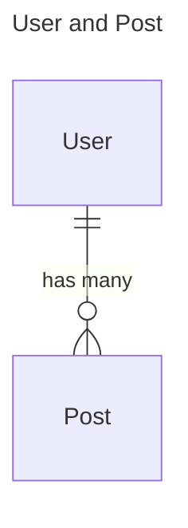
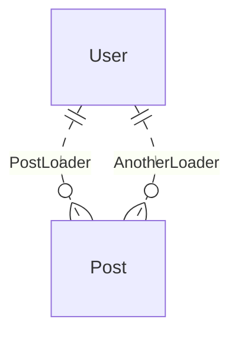
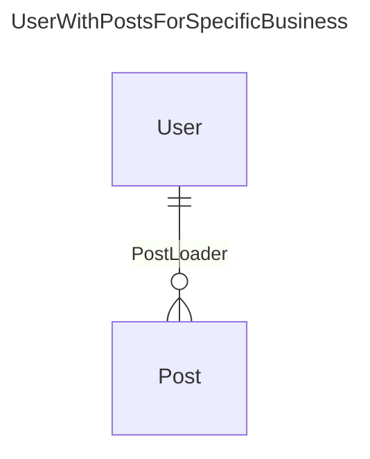
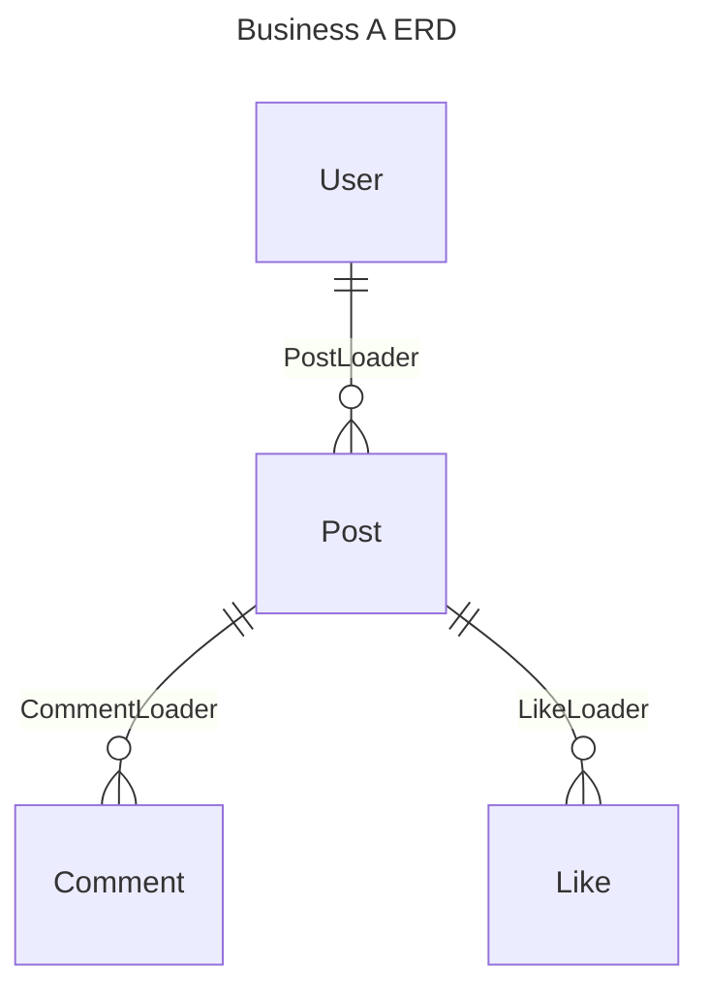

# ERD-Driven Development

ERD - Entity Relationship Diagram

For backend engineers, this concept is very familiar. Many database tools provide ERD visualization.

An ERD can also be a more abstract concept, independent of any specific database implementation. It describes relationships between entities, so many product managers also use ERDs to describe a product’s core data model.

Because of that, ERD is an important tool that runs through both product design and product implementation. If **the ERD structure stays clear across all stages**, the product becomes easier to maintain and extend.

When you combine ERD with pydantic-resolve, you can get a 3–5x boost in development efficiency and reduce code size by about 50%.

Let’s start from some existing approaches and talk about what they can do—and where they fall short.



## From SQL, ORM, to GraphQL

### SQL

Relational databases can store related data, but it’s not convenient to fetch an object together with its related objects using plain SQL.

When you do a join in SQL, if the relationship is one-to-many, the result size can explode due to the Cartesian product.

Simple queries can’t naturally produce nested related data (there are tricks to stitch JSON together, but that tends to be hard to maintain), or you end up deduplicating parent rows in the application layer.

```sql
select * from user join post on user.id = post.user_id
```

So the SQL result is a 2D table. Related data often needs to be represented as aggregated results.

```sql
select user.name, count(*) as post_count from user join post on user.id = post.user_id groupby user.id
```

### ORM

If you need relationship data, you typically use an ORM. After defining relationships in the ORM, you can access related objects.

Using SQLAlchemy as a common example:

```python
from sqlalchemy import Column, Integer, String, ForeignKey
from sqlalchemy.orm import relationship
from sqlalchemy.ext.declarative import declarative_base

Base = declarative_base()

class User(Base):
	__tablename__ = 'users'

	id = Column(Integer, primary_key=True)
	name = Column(String)

	# 定义 relationship
	posts = relationship("Post", back_populates="user")

class Post(Base):
	__tablename__ = 'posts'

	id = Column(Integer, primary_key=True)
	title = Column(String)
	user_id = Column(Integer, ForeignKey('users.id'))

	# 定义 relationship
	user = relationship("User", back_populates="posts")

rows = session.query(User).options(joinedload(User.posts)).all()
```

For fetching related data, you can tune different lazy-loading strategies. `select` can trigger N+1 queries when you iterate over Users, while `joined` / `subquery` can preload related data. You need to pay attention to these options to avoid performance issues.

At the same time, **ORMs have limitations**: if some data is not in the database—for example, it comes from a third-party API or a local file—you can’t benefit from ORM-style automatic relationship loading.

### GraphQL

GraphQL introduced a “new” way of thinking: **its schema is naturally close to an ERD-style description**.

It also abstracts the DataLoader concept, using a general shape like `async def batch_loadn_fn(keys)` to define input parameters and return values, while letting users decide the actual implementation.

For databases, you can batch fetch with `where .. in ..`.

```sql
select * from post where user_id in (1, 2, 3)
```

Then you group the result in code using something like `post.user_id`.

For a third-party API, it can be as simple as making a single async call.

```python
async def batch_load_fn(user_ids):
	posts = await get_posts_by_user_ids(user_ids)
	return build_list(posts, user_ids, lambda x: x.user_id)
```

This GraphQL mechanism provides a generic interface that’s independent of the underlying data source, leaving plenty of room for internal optimizations.

However, DataLoader’s power is limited inside the GraphQL ecosystem.

The most common case: by default, a DataLoader can only join data by `keys` (usually a single foreign key). If you need additional filtering on the resource, it becomes hard.

Using a query as an example, `(1, 2, 3, 4)` are the input keys, but there isn’t a clean way to add extra `where` conditions.

```sql
select * from post where post.user_id in (1,2,3,4)
	where post.created_at > '2021-12-12'
```

From a configuration perspective, keys are provided by individual User objects via `loader.load(key)`, while the `where` condition is configured directly on the loader.

GraphQL itself doesn’t provide a convenient, generic way to pass `where` parameters, which is unfortunate.

GraphQL describes data in a way that’s already very close to ERD, but the architecture is relatively heavy. There are many framework constraints, and exposing a flexible query interface is a double-edged sword.

We want a more lightweight approach.

## Define ERD with Pydantic

Pydantic is a great candidate: we can use it to define Entities and Relationships.

```python
class User(BaseModel):
	id: int
	name: str

class Post(BaseModel):
	id: int
	user_id: int
	title: str

class PostLoader(DataLoader):
	async def batch_load_fn(self, user_ids):
		posts = await get_posts_by_user_ids(user_ids)
		return build_list(posts, user_ids, lambda x: x.user_id)
```

Using Pydantic to define the structure of User and Post is concise and clear, and it can serve as an abstraction independent of the persistence layer.

The relationship between User and Post is defined by a DataLoader. The actual implementation is handled by `get_post_by_user_ids`.

For example, it could be a `session.query(UserModel).all()` database query, or a remote request via `aiohttp`.

> The relationship between User and Post is not limited to a single DataLoader. In practice, you can define multiple DataLoaders and choose one based on the scenario.



Here we use dashed lines to indicate that the relationship “can” happen.

Starting from Pydantic resolve v2, this kind of ERD can be declared more explicitly. When there is only one relationship for User -> Post, you can use `Relationship`:

```python
from pydantic_resolve import Relationship, base_entity, config_global_resolver

class User(BaseModel):
	id: int
	name: str

class Post(BaseModel):
	__pydantic_resolve_relationships__ = [
		Relationship(field='id', target_kls=list[User], loader=PostLoader)
	]
	id: int
	user_id: int
	title: str

config_global_resolver(BaseEntity.get_diagram())
```

If there are multiple possible paths between User -> Post, you can use `MultipleRelationship`:

```python
from pydantic_resolve import MultipleRelationship, Link, base_entity, config_global_resolver

BaseEntity = base_entity()

class User(BaseModel):
	id: int
	name: str

class Post(BaseModel, BaseEntity):
	__pydantic_resolve_relationships__ = [
		MultipleRelationship(
			field='id', 
			target_kls=list[User],
			links=[
				Link(biz='default', loader=PostLoader),
				Link(biz='another', loader=AnotherLoader)
			]
		)
	]
	id: int
	user_id: int
	title: str

config_global_resolver(BaseEntity.get_diagram())
```

If you are a FastAPI user, this ERD can also be visualized in FastAPI Voyager.


### Build relationships

Now let’s assume a business requirement: we want to connect User and Post.

We can reuse User fields via inheritance, and connect the data by defining `posts`.



```python
class UserWithPostsForSpecificBusiness(User):
	posts: List[Post] = []
	def resolve_posts(self, loader=LoaderDepend(PostLoader)):
		return loader.load(self.id)
```

This `UserWithPostsForSpecificBusiness` is a fixed composition of the User–Post relationship for a specific business requirement.

If you define an `ErDiagram`, you can simplify the code by removing the explicit DataLoader call.

```python
from pydantic_resolve import LoadBy

class UserWithPostsForSpecificBusiness(User):
	posts: Annotated[List[Post], LoadBy('id')] = []
```


### The key to maintainable code: keep business ERD consistent with your code structure

Now we have code whose structure closely matches the business ERD, and this code is business-specific.

In other words, the ERD defines a set of Entities and all possible Relationships, while the actual relationship wiring depends on the business requirement.

Two classes with the same structure can have different names, representing different use cases.

```python
class UserWithPostsForSpecificBusinessA(User):
	posts: List[Post] = []
	def resolve_posts(self, loader=LoaderDepend(PostLoader)):
		return loader.load(self.id)

class UserWithPostsForSpecificBusinessB(User):
	posts: List[Post] = []
	def resolve_posts(self, loader=LoaderDepend(PostLoader)):
		return loader.load(self.id)
```

Suppose the requirement for `UserWithPostsForSpecificBusinessA` changes: it should only load the latest 3 posts for each user.

You just create a new DataLoader and swap it in. (`UserWithPostsForSpecificBusinessB` is completely unaffected.)

```python
class UserWithPostsForSpecificBusinessA(User):
	posts: List[Post] = []
	def resolve_posts(self, loader=LoaderDepend(LatestThreePostLoader)):
		return loader.load(self.id)
```

In the end, we achieve the goal: the structure in code stays highly consistent with the ERD structure in product design, making future changes and iterations much easier.

### More examples

We can keep inheriting and extending Post, adding `comments` and `likes`.

In this scenario, each DataLoader only runs one query.



```python
class BizAPost(Post):
	comments: List[Comment] = []
	def resolve_comments(self, loader=LoaderDepend(CommentLoader)):
		return loader.load(self.id)

	likes: List[Like] = []
	def resolve_likes(self, loader=LoaderDepend(LikeLoader)):
		return loader.load(self.id)

class BizAUser(User):
	posts: List[BizAPost] = []
	def resolve_posts(self, loader=LoaderDepend(PostLoader)):
		return loader.load(self.id)
```

