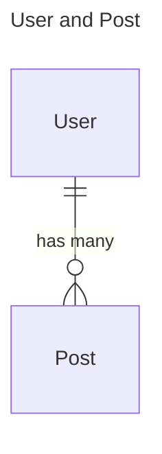
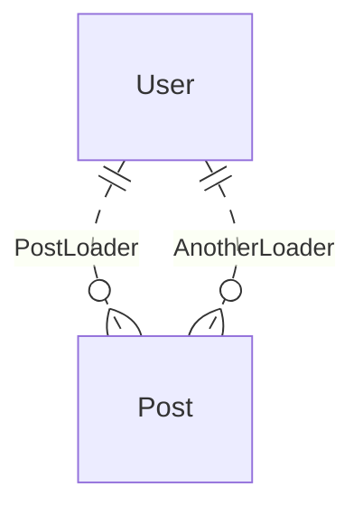
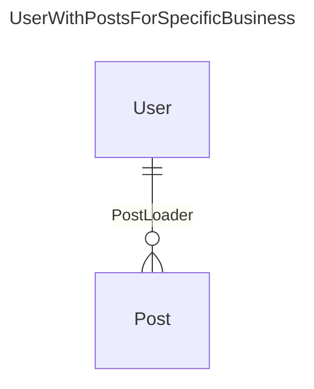
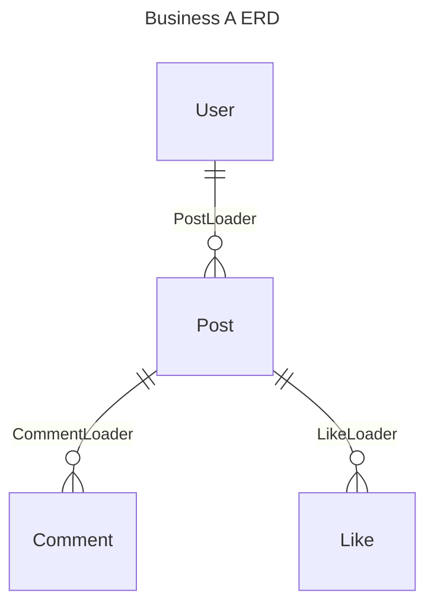

# ERD-Driven Development

ERD - Entity Relationship Diagram

For backend developers, this is a very familiar concept. Many database tools have ERD visualization features.

ERD itself can be a more abstract concept, independent of specific database implementations. It describes the entities and the relationships between them, so many product managers also use ERD to describe the core data relationships of a product.

Therefore, ERD is an important tool that runs through both product design and implementation. If **the structure of the ERD can remain clear in all stages**, the overall product becomes more maintainable and scalable.

When ERD is combined with pydantic-resolve, it can achieve a 3-5x increase in development efficiency and a 50% reduction in code volume.

Let's start by discussing some existing development methods, their capabilities, and limitations.



## From SQL, ORM, to GraphQL

### SQL

Relational databases can store related data, but it is not convenient to fetch objects and their related objects through SQL.

When using SQL for join queries, if the related table is one-to-many, it will cause an increase in the number of Cartesian products.

Simple queries cannot generate nested related data (although there are some tricks to assemble JSON, the maintainability is poor), or deduplicate parent nodes through the application layer.

```sql
select * from user join post on user.id = post.user_id
```

So the result of SQL is a two-dimensional table, and the related data can only be displayed as aggregated results.

```sql
select user.name, count(*) as post_count from user join post on user.id = post.user_id groupby user.id
```

### ORM

If you need to fetch related information, you will use ORM. After defining the relationship in ORM, you can get the related objects.

Take the commonly used SQLAlchemy as an example.

```python
from sqlalchemy import Column, Integer, String, ForeignKey
from sqlalchemy.orm import relationship
from sqlalchemy.ext.declarative import declarative_base

Base = declarative_base()

class User(Base):
    __tablename__ = 'users'

    id = Column(Integer, primary_key=True)
    name = Column(String)

    # Define relationship
    posts = relationship("Post", back_populates="user")

class Post(Base):
    __tablename__ = 'posts'

    id = Column(Integer, primary_key=True)
    title = Column(String)
    user_id = Column(Integer, ForeignKey('users.id'))

    # Define relationship
    user = relationship("User", back_populates="posts")

rows = session.query(User).options(joinedload(User.posts)).all()
```

For fetching related data, you can adjust through various lazy options. Select will cause N+1 queries when looping through User, while joined and subquery will preload the data. These options need to be adjusted by developers to avoid performance issues.

However, **ORM also has some limitations**. If some data is not in the database, such as data from a third-party API or local files, you cannot enjoy the convenience of automatic association.

### GraphQL

The emergence of GraphQL provides a "new" idea. **Its schema is a way that is easy to approach ERD descriptions**.

In addition, it abstracts the concept of DataLoader, using the general format of `async def batch_load_fn(keys)` to define input parameters and return data. Users can decide the implementation method themselves.

For example, in the case of a database, you can use `where ..in ..` to batch search.

```sql
select * from post where user_id in (1, 2, 3)
```

Then aggregate the fetched data in the code with the logic of groupby `post.user_id`.

If it is a third-party API, just make a simple asynchronous call.

```python
async def batch_load_fn(user_ids):
    posts = await get_posts_by_user_ids(user_ids)
    return build_list(posts, user_ids, lambda x: x.user_id)
```

This mechanism of GraphQL achieves a general interface that is independent of specific implementations, leaving ample room for internal optimization.

However, the power of DataLoader is limited under the GraphQL system.

The most common scenario is that DataLoader can only associate data through keys, which is a single foreign key. If you want to filter resources additionally, it will be difficult.

For example, `(1, 2, 3, 4)` are the keys passed in, and there is no suitable way to set the `where` condition.

```sql
select * from post where post.user_id in (1,2,3,4)
    where post.created_at > '2021-12-12'
```

From the perspective of setting parameters, keys are provided by `loader.load(key)` for each User object, while the `where` condition is directly configured for the loader.

GraphQL itself does not have a convenient way to provide a general `where` parameter, which is a pity.

GraphQL's description of data is already very close to ERD, but unfortunately, this architecture is relatively large, with too many framework constraints, and providing flexible query interfaces is also a double-edged sword.

We hope to find a simpler way.

## Using Pydantic to Define ERD

Pydantic is an excellent candidate. We can use it to define Entity and Relationship.

```python
class User(BaseModel):
    id: int
    name: str

class Post(BaseModel):
    id: int
    user_id: int
    title: str

class PostLoader(DataLoader):
    async def batch_load_fn(self, user_ids):
        posts = await get_posts_by_user_ids(user_ids)
        return build_list(posts, user_ids, lambda x: x.user_id)
```

Using Pydantic to define the structure of User and Post is very concise and clear. It can be used as an abstract expression independent of the persistence layer.

The association between User and Post is defined by DataLoader. The specific implementation is handled by `get_post_by_user_ids`.

For example, a query like `session.query(UserModel).all()`, or a remote request using `aiohttp`.

> The relationship between User and Post is not limited to being described by only one DataLoader. In fact, multiple DataLoaders can be defined and selected according to the actual scenario.



Use dashed lines to indicate the possible associations between them.

### Establishing Associations

Now let's assume there is a business requirement to establish an association between User and Post.

You can reuse User fields by inheriting User and define `posts` to link the data.



```python
class UserWithPostsForSpecificBusiness(User):
    posts: List[Post] = []
    def resolve_posts(self, loader=LoaderDepend(PostLoader)):
        return loader.load(self.id)
```

In this way, `UserWithPostsForSpecificBusiness` is a fixed combination of User and Post associations established for specific business requirements.

By the way, as mentioned in "Data Loaders", DataLoader allows additional parameters to be provided.

### The Secret to Maintainable Code: Keep Business ERD and Code Structure Definitions Consistent

Now we have obtained a code that is highly consistent with the business requirement ERD structure, and this code is dedicated.

In other words, ERD defines a series of Entities and all possible Relationships, and the actual establishment of relationships depends on the specific business requirements.

Two classes with exactly the same structure can have different names, representing different needs.

```python
class UserWithPostsForSpecificBusinessA(User):
    posts: List[Post] = []
    def resolve_posts(self, loader=LoaderDepend(PostLoader)):
        return loader.load(self.id)

class UserWithPostsForSpecificBusinessB(User):
    posts: List[Post] = []
    def resolve_posts(self, loader=LoaderDepend(PostLoader)):
        return loader.load(self.id)
```

Suppose the requirement of `UserWithPostsForSpecificBusinessA` changes, and it needs to load only the latest 3 posts for each user.

You only need to create a new DataLoader and replace it. (UserWithPostsForSpecificBusinessB is completely unaffected)

```python
class UserWithPostsForSpecificBusinessA(User):
    posts: List[Post] = []
    def resolve_posts(self, loader=LoaderDepend(LatestThreePostLoader)):
        return loader.load(self.id)
```

In the end, we achieved the goal of keeping the code structure highly consistent with the product design ERD structure, making subsequent changes and adjustments easier.

### More Examples



```python
class BizAPost(Post):
    comments: List[Comment] = []
    def resolve_comments(self, loader=LoaderDepend(CommentLoader)):
        return loader.load(self.id)

    likes: List[Like] = []
    def resolve_likes(self, loader=LoaderDepend(LikeLoader)):
        return loader.load(self.id)

class BizAUser(User):
    posts: List[BizAPost] = []
    def resolve_posts(self, loader=LoaderDepend(PostLoader)):
        return loader.load(self.id)
```
