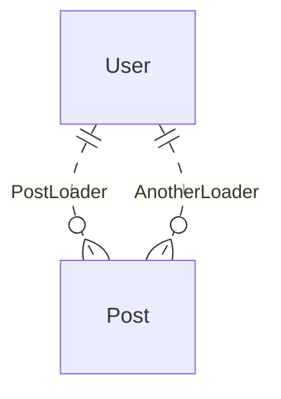
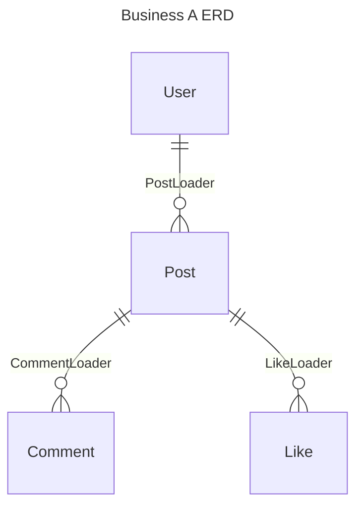

# ERD-Driven Development

ERD - Entity Relationship Diagram

For backend engineers, this concept is very familiar. Many database tools provide ERD visualization.

An ERD can also be a more abstract concept, independent of any specific database implementation. It describes relationships between entities, so many product managers also use ERDs to describe a product’s core data model.

Because of that, ERD is an important tool that runs through both product design and product implementation. If **the ERD structure stays clear across all stages**, the product becomes easier to maintain and extend.

When you combine ERD with pydantic-resolve, you can get a 3–5x boost in development efficiency and reduce code size by about 50%.

Let’s start from some existing approaches and talk about what they can do—and where they fall short.


```mermaid
---
title: User and Post
---

erDiagram
	User ||--o{ Post : "has many"

```

## From SQL, ORM, to Application-Layer ERD

### Relational Database Constraints

Relational databases are designed for storing related data, but have inherent limitations when fetching nested object structures:

- **SQL JOIN produces 2D tables**, not nested objects. One-to-many relationships cause Cartesian product explosions.
- **ORM relationships are tied to database schema**. When data comes from APIs, caches, or files, ORM-style automatic relationship loading doesn't work.
- **N+1 query problem** requires careful tuning of lazy-loading strategies.

### Application-Layer ERD Value

An ERD at the application layer is independent of storage implementation:

- **DataLoader pattern abstracts data fetching** — whether from PostgreSQL, MongoDB, Redis, or third-party APIs, the relationship definition stays the same.
- **Business logic is decoupled from data sources**. Changing from SQL to RPC doesn't require modifying relationship definitions.
- **pydantic-resolve brings this capability without GraphQL complexity** — no dedicated server, no steep learning curve.

## Define ERD with Pydantic

Pydantic is a great candidate: we can use it to define Entities and Relationships.

```python
class User(BaseModel):
	id: int
	name: str

class Post(BaseModel):
	id: int
	user_id: int
	title: str

class PostLoader(DataLoader):
	async def batch_load_fn(self, user_ids):
		posts = await get_posts_by_user_ids(user_ids)
		return build_list(posts, user_ids, lambda x: x.user_id)
```

Using Pydantic to define the structure of User and Post is concise and clear, and it can serve as an abstraction independent of the persistence layer.

The relationship between User and Post is defined by a DataLoader. The actual implementation is handled by `get_post_by_user_ids`.

For example, it could be a `session.query(UserModel).all()` database query, or a remote request via `aiohttp`.

> The relationship between User and Post is not limited to a single DataLoader. In practice, you can define multiple DataLoaders and choose one based on the scenario.


```mermaid
---
title:
---

erDiagram
	User ||..o{ Post : "PostLoader"
	User ||..o{ Post : "AnotherLoader"

```

Here we use dashed lines to indicate that the relationship “can” happen.

Starting from Pydantic resolve v2, this kind of ERD can be declared more explicitly. When there is only one loader for User -> Post, you can use `Relationship`:

```python
from pydantic_resolve import Relationship, base_entity, config_global_resolver

class User(BaseModel):
	id: int
	name: str

class Post(BaseModel):
	__pydantic_resolve_relationships__ = [
		Relationship(field='id', target_kls=list[User], loader=PostLoader)
	]
	id: int
	user_id: int
	title: str

config_global_resolver(BaseEntity.get_diagram())
```

If User -> Post has multiple loader implementations, you can define multiple `Relationship` entries:

```python
from pydantic_resolve import Relationship, base_entity, config_global_resolver

BaseEntity = base_entity()

class User(BaseModel, BaseEntity):
	__pydantic_resolve_relationships__ = [
		Relationship(field='id', target_kls=list[Post], field_name='posts', loader=PostLoader),
		Relationship(field='id', target_kls=list[Post], field_name='latest_three_posts', loader=LatestThreePostLoader)
	]
	id: int
	name: str

class Post(BaseModel, BaseEntity):
	__pydantic_resolve_relationships__ = []
	id: int
	user_id: int
	title: str

config_global_resolver(BaseEntity.get_diagram())
```

### External Declaration with ErDiagram

If you prefer not to modify entity classes, you can define relationships externally using `ErDiagram`:

```python
from pydantic_resolve import ErDiagram, Entity, Relationship, config_global_resolver

# Define entities without any relationship mixins
class User(BaseModel):
	id: int
	name: str

class Post(BaseModel):
	id: int
	user_id: int
	title: str

# Define relationships externally - no modification to entities
diagram = ErDiagram(configs=[
	Entity(
		kls=User,
		relationships=[
			Relationship(field='id', target_kls=list[Post], loader=PostLoader)
		]
	),
	Entity(
		kls=Post,
		relationships=[]  # Post has no outgoing relationships
	)
])

config_global_resolver(diagram)
```

**Benefits:**
- **Non-invasive**: entities remain pure Pydantic models
- **Centralized**: all relationships defined in one place
- **Flexible**: can define relationships for third-party or shared models

If you are a FastAPI user, this ERD can also be visualized in FastAPI Voyager.


### Build relationships

Once you have an `ErDiagram` defined, use `AutoLoad` to connect entities:

```python
from pydantic_resolve import AutoLoad

class UserWithPostsForSpecificBusiness(User):
	posts: Annotated[List[Post], AutoLoad('id')] = []
```

`AutoLoad('id')` looks up the relationship from the ERD and automatically resolves the data.

### The key to maintainable code: keep business ERD consistent with your code structure

Now we have code whose structure closely matches the business ERD, and this code is business-specific.

In other words, the ERD defines a set of Entities and all possible Relationships, while the actual relationship wiring depends on the business requirement.

Two classes with the same structure can have different names, representing different use cases.

```python
class UserWithPostsForSpecificBusinessA(User):
	posts: Annotated[List[Post], AutoLoad('id')] = []

class UserWithPostsForSpecificBusinessB(User):
	posts: Annotated[List[Post], AutoLoad('id')] = []
```

Suppose the requirement for `UserWithPostsForSpecificBusinessA` changes: it should only load the latest 3 posts for each user.

You just create a new DataLoader and reference it by field name. (`UserWithPostsForSpecificBusinessB` is completely unaffected.)

```python
class UserWithPostsForSpecificBusinessA(User):
	latest_three_posts: Annotated[List[Post], AutoLoad('id')] = []
```

In the end, we achieve the goal: the structure in code stays highly consistent with the ERD structure in product design, making future changes and iterations much easier.

### More examples

We can keep inheriting and extending Post, adding `comments` and `likes`.

In this scenario, each DataLoader only runs one query.


```mermaid
---
title: Business A ERD
---

erDiagram
	User ||--o{ Post : "PostLoader"
	Post ||--o{ Comment : "CommentLoader"
	Post ||--o{ Like : "LikeLoader"

```

```python
class BizAPost(Post):
	comments: Annotated[List[Comment], AutoLoad('id')] = []
	likes: Annotated[List[Like], AutoLoad('id')] = []

class BizAUser(User):
	posts: Annotated[List[BizAPost], AutoLoad('id')] = []
```

