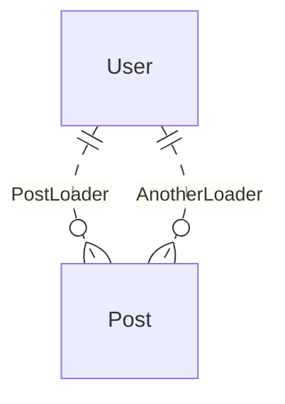
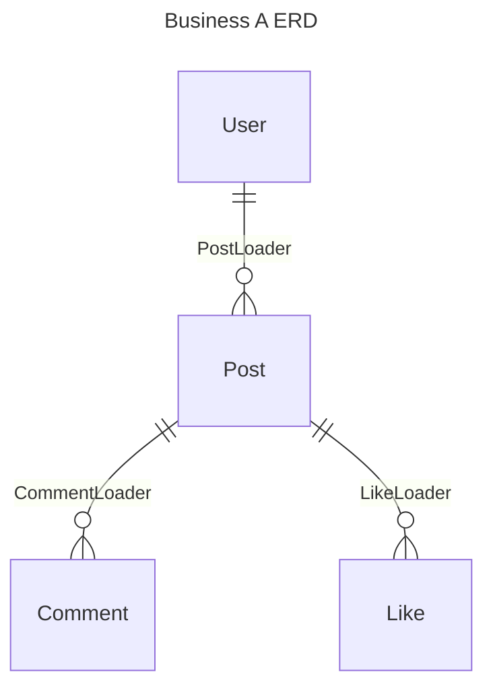

# ERD 驱动开发

ERD - Entity Relationship Diagram 实体关系图

对后端程序员来说这是一个很熟悉的概念， 很多数据库工具都有 ERD 可视化的功能。

ERD 本身可以是一个更加抽象的概念， 可以脱离具体数据库实现。它描述了实体和实体之间的关系， 所以许多产品经理也会用 ERD 来描述产品的核心数据关系。

因此对 ERD 是贯穿产品设计和产品实现的一个重要工具， 如果 **ERD 的结构可以在所有环节中维持清晰**， 那就能让产品整体更加可维护和可扩展。

当 ERD 和 pydantic-resolve 结合在一起， 就能实现 3 - 5 倍开发效率的提升， 以及 50% 代码量的减少。

我们先从已有的一些开发手段讲起， 说说他们的能力和局限。


```mermaid
---
title: User and Post
---

erDiagram
    User ||--o{ Post : "has many"

```

## 从 SQL，ORM，到应用层 ERD

### 关系型数据库的约束

关系型数据库为存储关联数据而设计，但在获取嵌套对象结构时存在固有限制：

- **SQL JOIN 产生二维表**，而非嵌套对象。一对多关系会导致笛卡尔积膨胀。
- **ORM 关系绑定于数据库 schema**。当数据来自 API、缓存或文件时，ORM 式的自动关联加载无法工作。
- **N+1 查询问题**需要精心调整懒加载策略。

### 应用层 ERD 的价值

应用层的 ERD 独立于存储实现：

- **DataLoader 模式抽象了数据获取**——无论是 PostgreSQL、MongoDB、Redis 还是第三方 API，关系定义保持不变。
- **业务逻辑与数据源解耦**。从 SQL 切换到 RPC 无需修改关系定义。
- **pydantic-resolve 带来这种能力，却无需 GraphQL 的复杂性**——无需独立服务器，学习曲线平缓。

## 使用 Pydantic 来定义 ERD

pydantic 就是一个优秀的候选人， 我们可以用它来定义 Entity 和 Relationship。

```python
class User(BaseModel):
    id: int
    name: str

class Post(BaseModel):
    id: int
    user_id: int
    title: str

class PostLoader(DataLoader):
    async def batch_load_fn(self, user_ids):
        posts = await get_posts_by_user_ids(user_ids)
        return build_list(posts, user_ids, lambda x: x.user_id)
```

使用 pydantic 来定义 User， Post 的结构， 非常简洁清晰。 可以作为脱离持久层的抽象表达。

而 User 和 Post 的关联由 DataLoader 来定义。 具体的实现交由 `get_post_by_user_ids` 来负责实现。

比如一个 `session.query(UserModel).all()` 的查询， 或者 `aiohttp` 的远程请求。

> Usr 和 Post 的关系并未限定只能有一种 DataLoader 来描述，实际上可以定义多种 DataLoader 根据实际场景来选用。


```mermaid
---
title:
---

erDiagram
    User ||..o{ Post : "PostLoader"
    User ||..o{ Post : "AnotherLoader"

```

使用虚线来表示他们之间 “可以” 发生的关联。

从 Pydantic resolve v2 开始， 这样的 ERD 可以被更加显式的申明出来，对于 User -> Post 只有一种 loader 的时候可以使用 Relationship：

```python
from pydantic_resolve import Relationship, base_entity, config_global_resolver

class User(BaseModel):
    id: int
    name: str

class Post(BaseModel):
    __relationships__ = [
        Relationship(fk='id', target=list[User], loader=PostLoader)
    ]
    id: int
    user_id: int
    title: str

config_global_resolver(BaseEntity.get_diagram())
```

如果 User -> Post 有多种 loader 实现， 则可以使用 MultipleRelationship 来定义：

```python
from pydantic_resolve import MultipleRelationship, Link, base_entity, config_global_resolver

BaseEntity = base_entity()

class User(BaseModel, BaseEntity):
    __relationships__ = [
        MultipleRelationship(
            fk='id',
            target=list[Post],
            links=[
                Link(biz='default', loader=PostLoader),
                Link(biz='latest_three', loader=LatestThreePostLoader)
            ]
        )
    ]
    id: int
    name: str

class Post(BaseModel, BaseEntity):
    __relationships__ = []
    id: int
    user_id: int
    title: str

config_global_resolver(BaseEntity.get_diagram())
```

### 使用 ErDiagram 外部声明

如果不想修改实体类，可以使用 `ErDiagram` 在外部定义关系：

```python
from pydantic_resolve import ErDiagram, Entity, Relationship, config_global_resolver

# 定义纯 Pydantic 实体，无需混入任何关系
class User(BaseModel):
    id: int
    name: str

class Post(BaseModel):
    id: int
    user_id: int
    title: str

# 在外部定义关系 —— 实体类无需修改
diagram = ErDiagram(configs=[
    Entity(
        kls=User,
        relationships=[
            Relationship(fk='id', target=list[Post], loader=PostLoader)
        ]
    ),
    Entity(
        kls=Post,
        relationships=[]  # Post 没有对外关系
    )
])

config_global_resolver(diagram)
```

**优势：**
- **无侵入**：实体保持纯 Pydantic 模型
- **集中管理**：所有关系定义在一处
- **灵活**：可以为第三方或共享模型定义关系

如果是 FastAPI 用户， 这样的 ERD 还可以在 FastAPI Voyager 中被可视化出来。


### 建立关联

定义好 `ErDiagram` 后，使用 `AutoLoad` 连接实体：

```python
from pydantic_resolve import AutoLoad

class UserWithPostsForSpecificBusiness(User):
    posts: Annotated[List[Post], AutoLoad()] = []
```

`AutoLoad()` 通过字段名（`posts`）匹配 ERD 中 `Relationship.name`，自动解析数据。当字段名与 `field_name` 不一致时，可通过 `AutoLoad(origin='posts')` 显式指定查找键。

### 可维护代码的诀窍： 使业务 ERD 和代码中的结构定义维持一致

现在我们得到了一个业务需求 ERD 结构高度一致的代码， 并且这段代码是业务专用的。

也即是说， ERD 定义了一系列 Entity 和所有可能的 Relationship， 而关系的真正建立是取决于实际业务需求的。

两个结构完全一样的 class， 可以拥有不相同的名字， 代表服务于不同的需求。

```python
class UserWithPostsForSpecificBusinessA(User):
    posts: Annotated[List[Post], AutoLoad()] = []

class UserWithPostsForSpecificBusinessB(User):
    posts: Annotated[List[Post], AutoLoad()] = []
```

假设 `UserWithPostsForSpecificBusinessA` 的需求发生了变更， 需要只加载每个 user 最近的 3 条 posts

那只需要创建好新的 DataLoader 然后替换进去即可。( UserWithPostsForSpecificBusinessB 则完全不受影响 )

```python
class UserWithPostsForSpecificBusinessA(User):
    latest_three_posts: Annotated[List[Post], AutoLoad()] = []
```

最终， 我们实现了目标， 让代码侧的结构与产品设计侧的 ERD 结构保持高度的一致， 这使得后续的变更和调整变得更容易。

### 更多案例

我们可以继续对 Post 进行继承和扩展， 让它扩展出 comments 和 likes 两个字段。

在这种场景下， 每个 dataloader 都只会执行一次查询。


```mermaid
---
title: Business A ERD
---

erDiagram
    User ||--o{ Post : "PostLoader"
    Post ||--o{ Comment : "CommentLoader"
    Post ||--o{ Like : "LikeLoader"

```

```python
class BizAPost(Post):
    comments: Annotated[List[Comment], AutoLoad()] = []
    likes: Annotated[List[Like], AutoLoad()] = []

class BizAUser(User):
    posts: Annotated[List[BizAPost], AutoLoad()] = []
```
