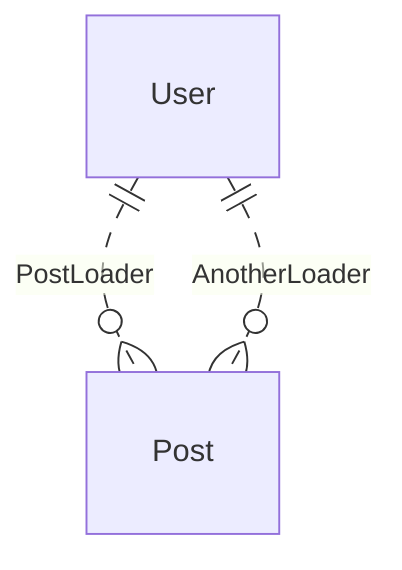
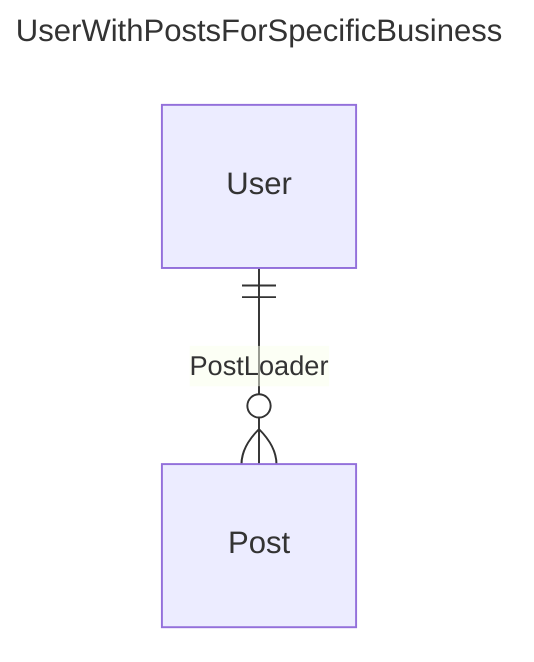
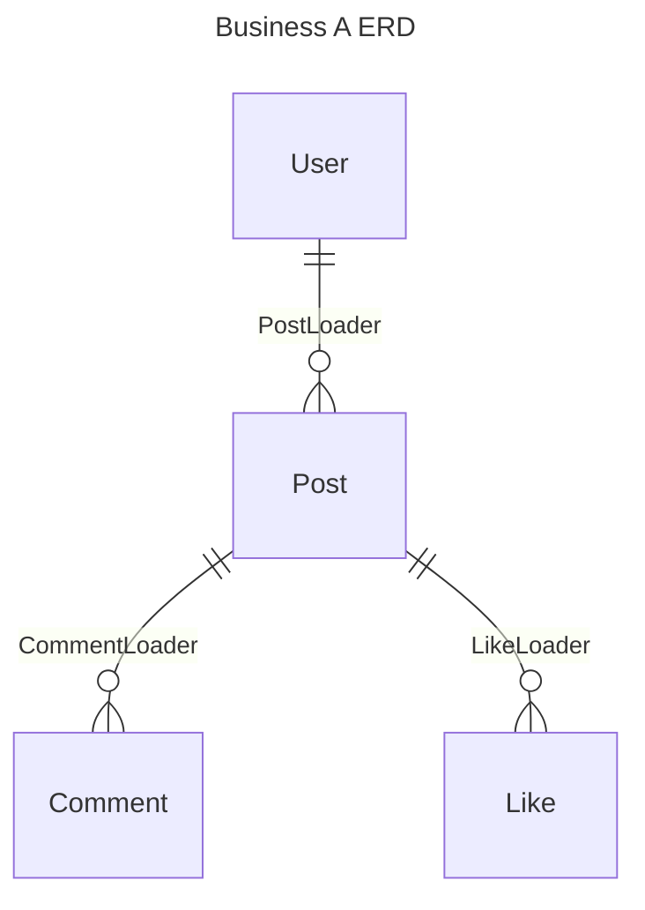

# ERD 驱动开发

ERD - Entity Relationship Diagram 实体关系图

对后端程序员来说这是一个很熟悉的概念， 很多数据库工具都有 ERD 可视化的功能。

ERD 本身可以是一个更加抽象的概念， 可以脱离具体数据库实现。它描述了实体和实体之间的关系， 所以许多产品经理也会用 ERD 来描述产品的核心数据关系。

因此对 ERD 是贯穿产品设计和产品实现的一个重要工具， 如果 **ERD 的结构可以在所有环节中维持清晰**， 那就能让产品整体更加可维护和可扩展。

当 ERD 和 pydantic-resolve 结合在一起， 就能实现 3 - 5 倍开发效率的提升， 以及 50% 代码量的减少。

我们先从已有的一些开发手段讲起， 说说他们的能力和局限。


## 从 SQL，ORM，到 GraphQL

### SQL

关系型数据库可以存储有相关性的数据， 但是通过 SQL 获取对象和关联对象并不方便。

使用 SQL 做 join 查询的时候， 如果关联的是一对多的表，那么就会引起笛卡尔积数量增加的情况。

简单的查询无法生成嵌套的关联数据 （ 虽然有拼装 json 的奇技淫巧， 但那个的可维护性比较糟糕 ）， 或者通过应用层做父节点去重。

```sql
select * from user join post on user.id = post.user_id
```

所以 SQL 的结果是一张二维表， 关联的数据只能转换成聚合计算的结果来展示。

```sql
select user.name, count(*) as post_count from user join post on user.id = post.user_id groupby user.id
```

### ORM

如果需要获取关联信息的话， 就会使用到 ORM， 在 ORM 中定义 relationship 之后， 就能获取到关联的对象。

以常用的 sqlalchemy 为例。

```python
from sqlalchemy import Column, Integer, String, ForeignKey
from sqlalchemy.orm import relationship
from sqlalchemy.ext.declarative import declarative_base

Base = declarative_base()

class User(Base):
    __tablename__ = 'users'

    id = Column(Integer, primary_key=True)
    name = Column(String)

    # 定义 relationship
    posts = relationship("Post", back_populates="user")

class Post(Base):
    __tablename__ = 'posts'

    id = Column(Integer, primary_key=True)
    title = Column(String)
    user_id = Column(Integer, ForeignKey('users.id'))

    # 定义 relationship
    user = relationship("User", back_populates="posts")

rows = session.query(User).options(joinedload(User.posts)).all()
```

对于关联数据的获取， 可以通过多种 lazy 选项来调整， select 在对 User 循环时会引起 N+1 查询， joined， subquery 则会提前将数据查询加载好。 这些选项的调整是需要开发去关注来避免性能问题的。

但同时 **ORM 也伴随了一些局限**， 如果有些数据不是在数据库中，比如需要从某个第三方 API， 或者本地文件中获取，就没法享受到自动关联的便利了。

### GraphQL

GraphQL 的出现提供了一种 “新的” 思路， **它的 schema 就是一种容易贴近 ERD 描述的方式**。

此外它抽象了 DataLoader 的概念， 使用 `async def batch_loadn_fn(keys)` 的通用格式来定义输入参数和返回数据， 用户可以自己决定实现方式。

以数据库为例， 可以使用 `where ..in ..` 来批量查找。

```sql
select * from post where user_id in (1, 2, 3)
```

然后将获取的数据在代码中 groupby `post.user_id` 的逻辑做聚合。

如果是第三方 API 的话， 只要简单发起一次异步调用。

```python
async def batch_load_fn(user_ids):
    posts = await get_posts_by_user_ids(user_ids)
    return build_list(posts, user_ids, lambda x: x.user_id)
```

GraphQL 的这个机制实现了这样一种和具体实现无关的通用接口， 这也为内部优化预留了充足的空间。

但 DataLoader 的威力在 GraphQL 体系下是被限制了的。

最常见的场景是 DataLoader 默认只能通过 keys， 也就是单一的外键来关联数据， 如果要对资源做额外过滤， 会很难做。

用查询来举例， `(1, 2, 3, 4)` 是传入的 keys， `where` 条件则没有合适的手段来设置。

```sql
select * from post where post.user_id in (1,2,3,4)
    where post.created_at > '2021-12-12'
```

从设置参数的角度来看， keys 是一个个 User 对象通过 `loader.load(key)` 提供的， 而 `where` 条件是则是直接针对 loader 做的配置。

GraphQL 本身没有方便的手段来提供通用的 `where` 参数， 这点比较遗憾。

GraphQL 对数据的描述已经非常贴近 ERD 了，可惜这个架构比较庞大， 存在太多框架的约束， 提供灵活的查询接口也是一把双刃剑。

我们希望找到一个更加简洁的方式。

## 使用 Pydantic 来定义 ERD

pydantic 就是一个优秀的候选人， 我们可以用它来定义 Entity 和 Relationship。

```python
class User(BaseModel):
    id: int
    name: str

class Post(BaseModel):
    id: int
    user_id: int
    title: str

class PostLoader(DataLoader):
    async def batch_load_fn(self, user_ids):
        posts = await get_posts_by_user_ids(user_ids)
        return build_list(posts, user_ids, lambda x: x.user_id)
```

使用 pydantic 来定义 User， Post 的结构， 非常简洁清晰。 可以作为脱离持久层的抽象表达。

而 User 和 Post 的关联由 DataLoader 来定义。 具体的实现交由 `get_post_by_user_ids` 来负责实现。

比如一个 `session.query(UserModel).all()` 的查询， 或者 `aiohttp` 的远程请求。

> Usr 和 Post 的关系并未限定只能有一种 DataLoader 来描述，实际上可以定义多种 DataLoader 根据实际场景来选用。



使用虚线来表示他们之间 “可以” 发生的关联。

### 建立关联

现在我们假设有个业务需求， 要给 User 和 Post 建立关联。

可以通过继承 User 来复用 User 字段， 通过定义 `posts` 来联系数据。



```python
class UserWithPostsForSpecificBusiness(User):
    posts: List[Post] = []
    def resolve_posts(self, loader=LoaderDepend(PostLoader)):
        return loader.load(self.id)
```

这样 `UserWithPostsForSpecificBusiness` 就是面向特定业务需求所建立的 User 和 Post 关联固定组合体。

顺带一提， 就如 "数据加载器" 中所提到的， DataLoader 是允许提供额外参数的。

### 可维护代码的诀窍： 使业务 ERD 和代码中的结构定义维持一致

现在我们得到了一个业务需求 ERD 结构高度一致的代码， 并且这段代码是专供的。

也即是说， ERD 定义了一系列 Entity 和所有可能的 Relationship， 而关系的真正建立是取决于实际业务需求的。

两个结构完全一样的 class， 可以拥有不相同的名字， 代表服务于不同的需求。

```python
class UserWithPostsForSpecificBusinessA(User):
    posts: List[Post] = []
    def resolve_posts(self, loader=LoaderDepend(PostLoader)):
        return loader.load(self.id)

class UserWithPostsForSpecificBusinessB(User):
    posts: List[Post] = []
    def resolve_posts(self, loader=LoaderDepend(PostLoader)):
        return loader.load(self.id)
```

假设 `UserWithPostsForSpecificBusinessA` 的需求发生了变更， 需要只加载每个 user 最近的 3 条 posts

那只需要创建好新的 DataLoader 然后替换进去即可。( UserWithPostsForSpecificBusinessB 则完全不受影响 )

```python
class UserWithPostsForSpecificBusinessA(User):
    posts: List[Post] = []
    def resolve_posts(self, loader=LoaderDepend(LatestThreePostLoader)):
        return loader.load(self.id)
```

最终， 我们实现了目标， 让代码侧的结构与产品设计侧的 ERD 结构保持高度的一致， 这使得后续的变更和调整变得更容易。

### 更多案例



```python
class BizAPost(Post):
    comments: List[Comment] = []
    def resolve_comments(self, loader=LoaderDepend(CommentLoader)):
        return loader.load(self.id)

    likes: List[Like] = []
    def resolve_likes(self, loader=LoaderDepend(LikeLoader)):
        return loader.load(self.id)

class BizAUser(User):
    posts: List[BizAPost] = []
    def resolve_posts(self, loader=LoaderDepend(PostLoader)):
        return loader.load(self.id)
```
