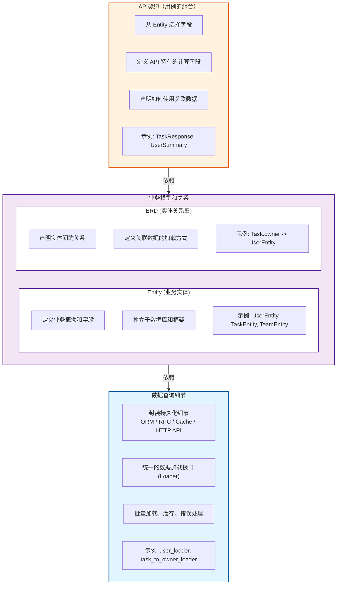

# FastAPI 中 Pydantic 的正确使用方式：Entity-First 架构

## 一、引言：被忽视的架构问题

### 1.1 现状观察

FastAPI 已经成为 Python Web 开发的首选框架之一，其与 Pydantic 的深度集成让数据验证变得前所未有的简单。然而，在浏览大量的 FastAPI 项目、官方模板、社区教程和最佳实践指南后，我们发现了一个惊人的相似性：几乎所有的项目都遵循着相同的模式——先定义 SQLAlchemy ORM 模型，然后基于这些模型创建 Pydantic schema。

这种"ORM 先行、Pydantic 跟随"的模式已经如此普遍，以至于许多开发者从未质疑过它的合理性。官方的 full-stack 模板采用这种方式，获得数千颗星的社区最佳实践仓库也推荐这种方式，大量的教程和文章都在传授这种方式。但这并不意味着它是正确的。

当我们深入分析这种模式的实际应用时，一些深层的问题开始浮现。Pydantic schema 被动地复制 ORM 模型的字段定义，导致类型定义在两个地方重复；数据库设计的任何变更都会直接影响到 API 契约 (可以理解为具体的用例）；业务概念被数据库结构深度渗透，难以表达领域模型的真实语义；当需要从多个数据源（数据库、RPC、缓存等）组合数据时，代码变得异常复杂且难以维护。

这些问题的根源在于我们混淆了两个不同层次的抽象：数据库模型（ORM）和领域模型（Entity）。ORM 模型应该只是数据持久化的实现细节，而不应该成为整个架构的中心。Pydantic schema 也不应该成为 ORM 的影子，而应该成为表达业务概念和 API 契约的独立抽象层。

### 1.2 核心论点

本文的核心论点很简单：Pydantic schema 不应该是 ORM 的影子，而应该建立在独立的业务实体层之上。这不仅仅是一个代码组织的问题，而是一个关乎架构清晰度、可维护性和长期演进的系统性问题。

**领域模型是架构的核心**。业务实体（Entity）应该表达纯粹的领域概念，比如"用户"、"任务"、"项目"，而不是数据库表。这些实体定义了业务对象的结构和它们之间的关系，独立于任何技术实现。当我们谈论业务时，我们说的是"这个任务属于哪个用户"、"这个项目包含哪些任务"，而不是"tasks 表有 user_id 外键"。领域模型的存在让我们能够用业务语言来思考和设计系统，而不是被技术实现细节束缚。

**具体用例驱动 API 设计**。每个 API 端点都是为特定的业务场景服务的，比如"用户列表页面需要用户的 id 和 name"、"任务详情页面需要任务的完整信息和负责人的详细信息"。这些用例决定了 API 应该返回什么数据，而不是数据库有什么字段。Pydantic schema 应该根据具体用例来定义，从领域模型中选择需要的字段，添加用例特有的计算字段和验证逻辑。这才是"响应模型"（Response Model）的真正含义。

**数据层只是实现细节**。无论数据存储在 PostgreSQL、MySQL、MongoDB 这样的数据库中，还是从 Redis、Memcached 这样的缓存中读取，亦或是通过 gRPC、REST API 从外部服务获取，这些都不应该影响领域模型和 API 契约的定义。数据层负责高效、可靠地获取数据，但它只是一个可替换的实现细节。数据库结构可能会改变，外部服务可能会迁移，缓存策略可能会调整，但只要数据层能够提供领域模型需要的数据，这些变化就不应该波及到业务逻辑和 API 契约。

这种分层架构的核心价值在于**稳定性和可演进性**。领域模型作为稳定的内核，独立于具体实现而存在。API 契约根据用例设计，为前端提供稳定的接口。数据层作为可替换的外壳，可以根据性能需求、技术栈升级、业务变化而灵活调整。当这三个层次清晰分离时，系统就具备了持续演进的能力——我们可以在不影响业务逻辑的前提下优化数据访问策略，可以在不破坏 API 契约的前提下重构数据模型，可以在不改变领域模型的前提下调整 API 设计。

这不仅是理论上的优雅，也是实践中的必要。当项目规模增长、业务复杂度提升、团队协作需求增加时，清晰的分层架构会成为项目能否持续演进的关键因素。一个被数据库结构深度渗透的系统，每一次数据库变更都会牵一发而动全身；而一个建立在稳定领域模型基础上的系统，则可以更从容地应对变化。

## 二、"ORM 先行"的架构问题

### 2.1 典型的项目结构

在大多数 FastAPI 项目中，你会看到相似的组织方式：

```
project/
├── models/
│   ├── user.py          # ORM 模型（数据库表结构）
│   ├── task.py
│   └── ...
├── schemas/
│   ├── user.py          # Pydantic schema（从 ORM 复制字段）
│   ├── task.py
│   └── ...
├── routes/
│   └── ...
└── services/
    └── ...
```

这种结构看起来很合理——数据模型和 API 契约分开存放——但问题在于，Pydantic schema 往往只是对数据库模型的被动复制，字段名称、类型、甚至注释都几乎一模一样。更深层的问题在于，整个项目分层存在缺失：从数据库模型到 Pydantic schema，没有任何独立的业务概念层存在。

### 2.2 核心问题分析

#### 问题 1：Schema 被动跟随 ORM

当一个项目的 Pydantic schema 只是数据库模型的影子时，就会出现一系列深层问题。最明显的是类型定义的重复：同样的字段名、同样的类型约束，在两个不同的地方定义并维护。这种重复违反了软件开发中的 DRY（Don't Repeat Yourself）原则，但更严重的是它暴露了架构本质上的混乱——API 契约不应该受限于数据库的物理设计。

试想一个实际场景：数据库中存储用户密码哈希是为了认证需求，这个字段是数据库实现细节，API 响应中完全不应该包含它。开发者为了避免暴露这个字段，不得不额外定义一个不包含 `password_hash` 的 Pydantic schema。

这种做法带来了两个问题：

**第一，繁琐的重复定义**：你需要维护两个几乎相同的类——一个包含所有字段的 ORM 模型，一个手动排除敏感字段的 Pydantic schema。当用户有 20 个字段时，你需要重复定义这 20 个字段，只为了排除其中 1 个。

如果开发者尝试抽取公共类来减少重复，又会面临新的困扰：抽取标准很模糊。比如，应该把哪些字段放入公共的 `UserBase`？哪些字段是所有场景都需要的？哪些字段是特定场景才需要的？当不同 API 端点对字段的需求差异较大时（有的需要 `email`，有的需要 `phone`，有的两者都不需要），公共类的定义会变得难以决策，维护成本反而更高。

**第二，修改时的维护负担**：当数据库新增字段（比如添加 `phone`）或修改字段类型（比如将 `name` 从 `String(50)` 改为 `String(100)`）时，你需要同时修改 ORM 模型和 Pydantic schema，很容易遗漏或产生不一致。更糟糕的是，当你有多个不同的响应场景（用户摘要、用户详情、用户头像信息）时，每个场景都需要手动复制和维护字段子集。

这违反了一个基本原则：API 应该是稳定的对外契约，而数据库实现是可以优化的内部细节。ORM-First 架构让这两者强耦合，任何数据库变更都会直接波及 API 契约。

#### 问题 2：业务概念被数据库结构渗透

当数据库结构成为整个架构的中心时，业务概念也会被数据库的设计细节所束缚。一个典型的例子是任务管理系统中"负责人"和"报告人"的概念。

**业务视角**：从业务角度看，这是两个清晰的角色——任务有一个负责人，也有一个报告人。这是业务领域中的自然概念。

**数据库设计决策**：在数据库设计中，这可能通过多种方式实现：两个外键字段（`owner_id` 和 `reporter_id`）、单个 `user_id` 加上 `role` 字段、或者多对多关系表。这些是纯粹的技术决策，取决于性能需求、数据量、查询模式等因素。

当 API 直接暴露数据库结构时，业务概念就被技术细节取代了，这违反了软件工程中的**最少知道原则（Law of Demeter）**：一个层级的封装应该让上层使用者知道的越少越好。前端作为 API 的使用者，只需要知道业务概念（"任务有负责人"），而不应该知道数据是如何存储的（"用两个字段存储"）。

```python
# 数据库设计 1：使用两个外键
class TaskORM(Base):
    __tablename__ = 'tasks'
    id = Column(Integer, primary_key=True)
    title = Column(String(100))
    owner_id = Column(Integer, ForeignKey('users.id'))      # 负责人
    reporter_id = Column(Integer, ForeignKey('users.id'))   # 报告人

# API Schema 被动复制 DB 结构
class TaskResponse(BaseModel):
    id: int
    title: str
    owner_id: int          # 前端必须知晓这是什么
    reporter_id: int       # 前端必须知晓这是什么
    owner: Optional['UserResponse']
    reporter: Optional['UserResponse']
```

现在的问题是：前端开发者需要理解 `owner_id` 和 `reporter_id` 的区别，需要知道为什么有两个字段。这些是数据库设计细节，与业务概念无关。如果后续数据库团队决定重构表结构（比如为了性能将两个字段合并为一个字段），API 也要跟着改，前端代码也需要相应调整。

```python
# 数据库设计 2：重构为单个字段 + role
class TaskORM(Base):
    __tablename__ = 'tasks'
    id = Column(Integer, primary_key=True)
    title = Column(String(100))
    user_id = Column(Integer, ForeignKey('users.id'))   # 合并字段
    role = Column(String(20))  # 'owner' 或 'reporter'

# API Schema 必须跟着改变
class TaskResponse(BaseModel):
    id: int
    title: str
    user_id: int           # 现在改成了 user_id
    role: str              # 新增了 role 字段
    # 前端代码必须全部修改！
```

这种变化与业务无关——业务上仍然有"负责人"和"报告人"两个角色——但纯粹的技术决策（数据库重构）却影响了系统的各个层次，包括前端应用。这正是业务概念被数据库结构渗透的直接后果。

真正的业务概念——"这个任务属于谁"、"谁负责跟进这个任务"——被淹没在了外键关系和表结构的技术细节中。我们无法用业务语言来思考和设计 API，而必须时刻考虑数据库是如何存储这些数据的。这种概念的混淆使得代码难以理解和维护，新加入的团队成员需要先理解数据库设计才能理解业务逻辑。

#### 问题 3：无法使用关系映射时的数据组装困境

SQLAlchemy 提供了 `relationship` 功能，可以在查询时自动加载关联数据，看起来很方便。但在实际项目中，这个功能并非万能。跨数据库查询时它无能为力，复杂的 JOIN 条件下它难以使用，需要优化性能的只读查询或报表查询往往也不适合用它。一旦脱离了 `relationship` 的便利，开发者就必须手动编写冗长的数据组装代码。

这个过程通常包含多个重复的步骤：先查询主数据（比如文章列表），然后收集所有的关联 ID（比如所有文章的作者 ID），接着批量查询关联数据（比如根据 ID 列表查询用户），再手动构建 ID 到对象的映射字典，最后循环遍历主数据，手动查找对应的关联对象并组装成最终的响应结构。这个过程代码量大、容易出错，而且每次需要类似的关联查询时都要重复编写。

更危险的是，手动编写这些代码很容易产生性能问题。如果开发者忘记批量查询，而是在循环中逐个查询关联数据，就会立即陷入经典的 N+1 查询陷阱——原本一次批量查询就能解决的问题，变成了 N 次独立查询。当数据量增大时，性能问题会迅速暴露。而使用 `relationship` 虽然能避免这个问题，但它又回到了之前提到的困境：不是所有场景都适合用它。

这种数据组装逻辑散落在项目的各个地方，每个需要关联数据的 API 端点都可能有一段类似的代码。这不仅违反了单一职责原则，也使得代码难以复用和测试。当需要优化数据加载策略时（比如添加缓存、调整查询顺序），需要在多处修改，容易遗漏或产生不一致。

#### 问题 4：多数据源难以统一处理

现代应用的复杂性在于数据往往不只来自一个地方。用户信息可能在 PostgreSQL 数据库中，订单数据可能在 MongoDB 中，库存状态可能需要调用外部 RPC 服务获取，推荐列表可能从 Redis 缓存中读取。当这些数据需要组合成一个统一的 API 响应时，传统的方式就显露出明显的不足。

每个数据源都有自己的数据格式和访问方式。数据库返回 ORM 对象，RPC 服务返回字典或自定义对象，缓存返回序列化的字符串或字节流。为了将它们统一到 Pydantic schema 中，开发者需要编写各种转换函数，处理字段映射、类型转换、数据提取等细节。这些转换逻辑分散在各个地方，难以集中管理和优化。

更糟糕的是，当某个数据源需要迁移或升级时（比如将用户服务从数据库迁移到独立的微服务），所有涉及该数据源的转换代码都需要修改。由于这些转换逻辑与业务逻辑混杂在一起，修改的影响范围难以评估，测试成本也很高。缺少统一的抽象层使得系统难以应对数据源的变化，每次变化都可能牵一发而动全身。

#### 问题 5：Schema 难以复用和组合

在实际项目中，同一个实体往往需要在不同的场景下以不同的形式出现。用户列表页面可能只需要显示用户的 ID 和姓名，用户详情页面需要显示完整信息包括邮箱、手机号、注册时间等，任务列表中嵌入的用户信息可能只需要 ID 和头像 URL。如果为每个场景都单独定义一个 Pydantic schema，就会出现大量的重复定义，字段类型的修改需要同步多处。

传统做法中，开发者要么复制粘贴代码（违反 DRY 原则），要么尝试用继承来组合（但 Pydantic 的继承机制并不直观，容易产生混淆）。更深层的问题是，这些 schema 之间缺少明确的"属于同一个实体"的关系——从代码上看，`UserSummary`、`UserDetail`、`UserIdOnly` 是三个独立的类，无法直观地看出它们都是对"用户"这个业务实体的不同视图。

这种缺乏统一性的schema定义，使得代码难以维护。当实体的字段类型需要修改时（比如将用户 ID 从整数改为 UUID），需要搜索所有相关的 schema 定义并逐一修改，很容易遗漏。也没有类型系统能保证这些 schema 的一致性——编译器不会告诉你 `UserSummary` 和 `UserDetail` 中的 `id` 字段类型不同。

## 三、Entity-First 架构

### 3.1 核心理念

Entity-First 架构的核心思想是：**通过 Pydantic 定义好业务实体（Entity）和关系 (Relationship) 之后，可以仅仅通过选择 Entity 的子集和扩展字段的方式，就能将所需的用例数据结构描述出来**， 重点是和 ORM-first 相比，对 用例层屏蔽掉掉所有的查询细节。

用一段代码来说明的话， 就是 Entity 定义完成之后， 在他们的基础之后， 通过取子集 + 组合的方式， 申明任意多种的用例结构， **并通过某种方式将所描述的数据结构查询出来。**

```python
# 1. 定义业务实体（应用层，不依赖数据库）
class UserEntity(BaseModel):
    id: int
    name: str
    email: str

class TaskEntity(BaseModel):
    id: int
    name: str
    owner_id: int  # 外键，指向负责人
    created_at: datetime

```

```python
# 2. 定义 API 响应（选择子集 + 扩展字段）， 类似 GraphQL pick 字段）
class UserSummary(DefineSubset):
    __subset__ = (UserEntity, ('id', 'name'))

class TaskResponse(DefineSubset):
    __subset__ = (UserEntity, ('id', 'name', 'owner_id'))
    owner: Optional[UserSummary]  # 扩展字段，关联数据


tasks = await get_tasks()
tasks = [TaskResponse.model_validate(t) for t in t]
tasks = await Resolver().resolve(tasks)  # 获取所有数据
```

用关系图来表示的话， 分为三大部份， 中间是核心的业务模型（和关系）的描述， 上层是基于业务模型构建出来的具体一个个的用例， 下层是对数据查询的封装。




### 3.2 优势与挑战

#### Entity-First 的核心优势

**稳定性和可演进性**是 Entity-First 架构最显著的优势。通过建立独立的业务实体层，系统获得了一个稳定的内核。当数据库结构需要优化时（比如拆分大表、调整索引、迁移到新数据库），只需要修改数据层的 Repository 实现，领域模型和 API 契约完全不受影响。当业务需求变化导致 API 契约需要调整时，只需要修改 Response 定义，数据层和领域模型保持不变。当业务逻辑演进需要新的实体关系时，只需要更新 ERD 定义，已有的数据访问逻辑可以保持稳定。这种三层分离使得系统具备了真正的持续演进能力。

**业务语义清晰**是另一个重要优势。在 Entity-First 架构中，我们用业务语言来定义系统，而不是数据库术语。`TaskEntity` 拥有 `owner` 和 `reporter` 这样的业务关系，而不是暴露 `owner_id` 和 `reporter_id` 这样的数据库外键。前端开发者不需要理解数据库设计，只需要理解业务概念。新加入的团队成员可以通过阅读 Entity 定义快速理解业务模型，而不需要先研究复杂的表结构和外键关系。

**多数据源的统一抽象**让复杂系统的开发变得简单。用户信息可能来自 PostgreSQL，订单数据可能来自 MongoDB，推荐列表可能从 Redis 缓存读取，库存状态可能通过 RPC 调用获取。在 Entity-First 架构中，这些差异都被数据访问层屏蔽了。Entity 只需要声明"我需要什么数据"，而不需要关心"数据从哪里来"。当某个数据源需要迁移或升级时（比如将用户服务从数据库迁移到微服务），只需要修改对应的 Repository，Entity 和 Response 完全不需要改动。

#### 核心挑战：数据关联与业务组合的鸿沟

**问题 1：Repository 的职责边界模糊**

Entity-First 架构引入了独立的业务实体层和 Repository 模式，这确实解决了很多问题。但在实际开发中，一个根本性的问题很快浮现：Repository 应该负责什么？

最直观的理解是，Repository 负责数据访问——`get_by_id`、`find_all`、`batch_get` 这样的方法。当 API 需要返回一个包含关联数据的响应时，比如"任务列表需要包含负责人信息"，问题就出现了：这个组装逻辑应该放在哪里？

**选项 1：放在 Repository 中**
```python
class TaskRepository:
    async def get_tasks_with_owners(self):
        # Repository 负责加载关联数据
        tasks = await self.get_tasks()
        user_ids = [t.owner_id for t in tasks]
        users = await user_repo.get_by_ids(user_ids)
        # 手动组装...
        return tasks_with_owners
```
问题：Repository 变得臃肿，职责混杂。每个不同的用例都需要一个特定的方法——`get_tasks_with_owners`、`get_tasks_with_projects`、`get_tasks_with_owners_and_projects`……Repository 成了用例的堆砌场。

**选项 2：放在 Service 层中**
```python
class TaskService:
    async def get_task_list_with_users(self):
        # Service 负责组装数据
        tasks = await task_repo.get_tasks()
        users = await user_repo.get_by_ids([t.owner_id for t in tasks])
        # 手动组装...
        return assembled_tasks
```
问题：Service 层充斥着数据组装代码。这些代码重复、易错、难以维护，而且与业务逻辑混杂在一起。

**选项 3：在路由/控制器层组装**
```python
@router.get("/tasks")
async def get_tasks(task_service=Depends(get_task_service),
                   user_service=Depends(get_user_service)):
    # 路由层负责组装数据
    tasks = await task_service.get_tasks()

    # ❌ 手动收集 ID、批量查询、构建映射、组装结果
    user_ids = list(set([t.owner_id for t in tasks]))
    users = await user_service.get_users_by_ids(user_ids)
    user_map = {u.id: u for u in users}

    result = []
    for task in tasks:
        task_dict = task.model_dump()
        task_dict['owner'] = user_map.get(task.owner_id)
        result.append(TaskResponse(**task_dict))

    return result
```
问题：数据组装逻辑散落在各个路由中，重复代码多，容易产生 N+1 查询，难以维护和测试。

无论选择哪种方式，核心问题都存在：**数据组装逻辑没有合适的地方安放**。Repository 应该只负责数据访问，Service 应该只负责业务逻辑，Response 应该只负责数据结构定义。但在 Entity-First 架构中，当需要从多个 Repository 获取数据并组合成响应时，这个逻辑应该放在哪里？传统的三层架构没有给出明确的答案。

---

**总结：Entity-First 架构的缺失拼图**

Entity-First 架构提供了一个清晰的理论框架——独立的业务实体层、Repository 模式、从 Entity 派生 Response。但在实际落地时，它缺少一个关键的执行层来处理**数据组装逻辑**：当需要从多个 Repository 获取数据并组合成响应时，这个逻辑应该放在哪里？

这个问题不解决，Entity-First 架构在实践中就会遇到两难选择：
- 让 Repository 承担数据组装职责 → Repository 变得臃肿，成为用例的堆砌场
- 让 Service 承担数据组装职责 → Service 层充斥着重复、易错的数据组装代码
- 让 Response 承担数据组装职责 → 每个 Response 都要自己实现，批量加载、N+1 查询、错误处理等问题都需要手动解决

这正是 pydantic-resolve 试图解决的问题——它提供了 Entity-First 架构中缺失的数据组装执行层。

### 3.3 实现方式

**GraphQL 的启发**

pydantic-resolve 的设计深受 GraphQL 启发。GraphQL 的核心优势在于：声明式的数据获取（客户端声明需要哪些字段）、自动的依赖解析（服务器自动解析字段间的依赖关系）、DataLoader 模式（自动批量加载避免 N+1 查询）。pydantic-resolve 将这些思想引入到 REST API 中——通过 `resolve_*` 方法声明数据依赖，通过 Resolver 自动分析和执行解析逻辑，通过 DataLoader 批量加载优化性能。不同的是，pydantic-resolve 保持了 REST API 的简单性和契约稳定性，避免了 GraphQL 引入的复杂度和学习成本。

#### Step 1: 定义业务实体（Entity）
```python
from pydantic import BaseModel
from pydantic_resolve import base_entity, Relationship

# 1. 创建 Entity 基类
BaseEntity = base_entity()

# 2. 定义业务实体（不依赖 ORM）
class UserEntity(BaseModel):
    """用户实体：表达业务概念"""
    id: int
    name: str
    email: str

class TaskEntity(BaseModel, BaseEntity):
    """任务实体：定义业务关系"""
    __relationships__ = [
        Relationship(
            field='owner_id',
            target_kls=UserEntity,
            loader=user_loader  # 不关心从哪加载
        )
    ]
    id: int
    name: str
    owner_id: int
    estimate: int
```

**关键点**：
- Entity 是业务概念，不绑定具体实现
- 关系通过 loader 连接，而不是 DB 外键
- 可以表达跨数据源的关系

#### Step 2: 定义数据加载器（Loader）
```python
# Loader 可以连接任意数据源
async def user_loader(user_ids: list[int]):
    # 从 ORM 加载
    users = await UserORM.filter(UserORM.id.in_(user_ids))
    return build_list(users, user_ids, lambda u: u.id)

# 或者从 RPC 加载
async def user_loader_from_rpc(user_ids: list[int]):
    users = await user_rpc.batch_get_users(user_ids)
    return build_list(users, user_ids, lambda u: u['id'])

# 或者从 Redis 加载
async def user_loader_from_cache(user_ids: list[int]):
    users = await redis.mget(f"user:{uid}" for uid in user_ids)
    return build_list(users, user_ids, lambda u: u['id'])
```

**关键点**：
- Loader 屏蔽数据源差异
- Entity 不关心数据从哪来
- 可以轻松切换或组合数据源

#### Step 3: 从 Entity 定义 API Response
```python
from pydantic_resolve import DefineSubset, LoadBy, SubsetConfig

# 场景 1：用户摘要
class UserSummary(DefineSubset):
    __subset__ = (UserEntity, ('id', 'name'))

# 场景 2：任务列表（包含负责人）
class TaskResponse(DefineSubset):
    __subset__ = (TaskEntity, ('id', 'name', 'estimate'))

    # 自动解析 owner，无需写 resolve 方法
    owner: Annotated[Optional[UserSummary], LoadBy('owner_id')] = None

# 场景 3：任务详情（包含更多字段）
class TaskDetailResponse(DefineSubset):
    __subset__ = (TaskEntity, ('id', 'name', 'estimate', 'created_at'))

    owner: Annotated[Optional[UserDetail], LoadBy('owner_id')] = None
```

**关键点**：
- Response 从 Entity 派生，类型安全
- 自动继承 Entity 的关系定义
- 可以复用和组合不同的字段子集
- Entity 变更时，Response 自动同步

### 3.3 架构优势

#### 优势 1：清晰的分层
- **Entity** → 领域层，表达业务概念
- **Response** → API 层，定义对外契约
- **Loader** → 数据层，处理实现细节

#### 优势 2：独立演进
- DB 结构改变 → 只需修改 Loader
- API 契约改变 → 只需修改 Response
- 业务逻辑改变 → 修改 Entity 和关系

#### 优势 3：统一的类型系统
```python
# Entity 作为"单一真相来源"
# 所有 Response 都从它派生，确保类型一致

class UserSummary(DefineSubset):
    __subset__ = (UserEntity, ('id', 'name'))

class UserDetail(DefineSubset):
    __subset__ = (UserEntity, ('id', 'name', 'email'))

# 类型安全：id 字段在所有 Response 中都是 int
```

#### 优势 4：天然支持多数据源
```python
# 可以轻松组合不同数据源的关系
class TaskEntity(BaseModel, BaseEntity):
    __relationships__ = [
        Relationship(
            field='owner_id',
            target_kls=UserEntity,
            loader=user_from_db_loader  # 从 DB 加载
        ),
        Relationship(
            field='project_id',
            target_kls=ProjectEntity,
            loader=project_from_rpc_loader  # 从 RPC 加载
        ),
        Relationship(
            field='status_id',
            target_kls=StatusEntity,
            loader=status_from_cache_loader  # 从缓存加载
        ),
    ]
```

#### 优势 5：自动数据组装，告别冗长代码

**对比：传统方式 vs pydantic-resolve**

**传统方式**（5个步骤，~30行代码）：
```python
async def get_posts_with_users(session: AsyncSession):
    # 1. 查询 posts
    posts_result = await session.execute(select(Post))
    posts = posts_result.scalars().all()

    # 2. 收集所有 user_id
    user_ids = list(set([post.user_id for post in posts]))

    # 3. 批量查询 users
    users_result = await session.execute(
        select(User).where(User.id.in_(user_ids))
    )
    users = users_result.scalars().all()

    # 4. 构建 user_id -> user 的映射
    user_map = {user.id: user for user in users}

    # 5. 手动组装 response
    result = []
    for post in posts:
        post_data = PostResponse(
            id=post.id,
            title=post.title,
            user_id=post.user_id
        )
        if post.user_id in user_map:
            user = user_map[post.user_id]
            post_data.user = UserResponse(
                id=user.id,
                name=user.name,
                email=user.email
            )
        result.append(post_data)

    return result
```

**pydantic-resolve 方式**（声明式，~10行代码）：
```python
# 1. 定义 Loader
async def user_batch_loader(user_ids: list[int]):
    async with get_db_session() as session:
        result = await session.execute(
            select(User).where(User.id.in_(user_ids))
        )
        users = result.scalars().all()
        return build_list(users, user_ids, lambda u: u.id)

# 2. 定义 Response（声明如何获取关联数据）
class PostResponse(BaseModel):
    id: int
    title: str
    user_id: int

    user: Optional[UserResponse] = None
    def resolve_user(self, loader=Loader(user_batch_loader)):
        return loader.load(self.user_id)

# 3. 使用 Resolver 自动组装
@router.get("/posts", response_model=List[PostResponse])
async def get_posts():
    posts = await query_posts_from_db()
    return await Resolver().resolve(posts)
```

**对比结果**：
| 维度 | 传统方式 | pydantic-resolve |
|------|----------|------------------|
| 代码行数 | ~30 行 | ~10 行 |
| 是否手动批量 | ✗ 需要手动实现 | ✓ 自动批量 |
| 是否容易出错 | ✗ 手动构建映射 | ✓ 框架保证 |
| 是否可复用 | ✗ 每处重复写 | ✓ Loader 可复用 |
| N+1 风险 | ✗ 容易忘记批量 | ✓ 自动避免 |
| 职责分离 | ✗ 数据组装散落各处 | ✓ 清晰分层 |

**关键差异**：
- **传统方式**：命令式，关注"怎么做"（如何查询、如何映射、如何组装）
- **pydantic-resolve**：声明式，关注"要什么"（需要哪些关联数据）

**更复杂的场景**：

当有多层嵌套时，传统方式的代码复杂度会指数增长：

```python
# 传统方式：获取 Sprints → Stories → Tasks → Owners（4层嵌套）
async def get_sprints_with_full_detail(session):
    # 需要 4 层循环，每个循环都要：
    # 1. 查询当前层数据
    # 2. 收集下一层的 ID
    # 3. 批量查询下一层数据
    # 4. 构建映射
    # 5. 手动组装
    # 代码会超过 100 行，难以维护
```

```python
# pydantic-resolve：同样的需求
class SprintResponse(BaseModel):
    id: int
    name: str

    stories: List[StoryResponse] = []
    def resolve_stories(self, loader=Loader(stprint_to_stories_loader)):
        return loader.load(self.id)

class StoryResponse(BaseModel):
    id: int
    name: str

    tasks: List[TaskResponse] = []
    def resolve_tasks(self, loader=Loader(story_to_tasks_loader)):
        return loader.load(self.id)

class TaskResponse(BaseModel):
    id: int
    name: str
    owner_id: int

    owner: Optional[UserResponse] = None
    def resolve_owner(self, loader=Loader(user_loader)):
        return loader.load(self.owner_id)

# 使用
sprints = await query_sprints_from_db()
result = await Resolver().resolve(sprints)
```

**代码量对比**：
- 传统方式：100+ 行，难以维护
- pydantic-resolve：30 行，清晰易读

## 四、实战案例：重构现有项目

### 4.1 重构前（ORM-First）
```python
# models/task.py（ORM）
from sqlalchemy.orm import relationship

class TaskORM(Base):
    __tablename__ = 'tasks'
    id = Column(Integer, primary_key=True)
    name = Column(String(100))
    owner_id = Column(Integer, ForeignKey('users.id'))
    project_id = Column(Integer, ForeignKey('projects.id'))

    # 定义 relationship 用于加载关联数据
    owner = relationship("UserORM", back_populates="tasks")
    project = relationship("ProjectORM", back_populates="tasks")

# schemas/task.py（从 ORM 复制）
class TaskBase(BaseModel):
    name: str

class TaskCreate(TaskBase):
    owner_id: int
    project_id: int

class TaskResponse(TaskBase):
    id: int
    owner_id: int
    project_id: int
    owner: Optional['UserResponse']
    project: Optional['ProjectResponse']

# routes/task.py
from sqlalchemy.orm import selectinload

@router.get("/tasks", response_model=List[TaskResponse])
async def get_tasks(session: AsyncSession = Depends(get_session)):
    # 必须指定加载策略，否则会产生 N+1 查询
    result = await session.execute(
        select(TaskORM)
        .options(
            selectinload(TaskORM.owner),      # 预加载 owner
            selectinload(TaskORM.project)     # 预加载 project
        )
    )
    tasks = result.scalars().all()
    return [TaskResponse.model_validate(t) for t in tasks]
```

### 4.2 重构后（Entity-First）
```python
# entities/task.py（业务实体）
class TaskEntity(BaseModel, BaseEntity):
    __relationships__ = [
        Relationship(field='owner_id', target_kls=UserEntity, loader=user_loader),
        Relationship(field='project_id', target_kls=ProjectEntity, loader=project_loader),
    ]
    id: int
    name: str
    owner_id: int
    project_id: int

# responses/task.py（API 契约）
class TaskResponse(DefineSubset):
    __subset__ = (TaskEntity, ('id', 'name', 'owner_id', 'project_id'))

    owner: Annotated[Optional[UserResponse], LoadBy('owner_id')] = None
    project: Annotated[Optional[ProjectSummary], LoadBy('project_id')] = None

# routes/task.py
@router.get("/tasks", response_model=List[TaskResponse])
async def get_tasks():
    tasks_orm = await query_tasks_from_db()
    # 1. 将 ORM 对象转换为 Response 对象
    tasks = [TaskResponse.model_validate(t) for t in tasks_orm]
    # 2. Resolver 自动解析关联数据
    return await Resolver().resolve(tasks)
```

**关键优势：组装流程完全屏蔽数据库细节，降低心智负担**

对比 4.1，Entity-First 方式在整个数据组装过程中**完全不需要感知数据库**：

- ❌ 不需要导入 `selectinload`、`relationship` 等 SQLAlchemy 模块
- ❌ 不需要思考加载策略（会不会 N+1？用 selectinload 还是 joinedload？）
- ❌ 不需要手动写循环组装代码

只需要声明业务语义："这个任务需要一个 owner" → `LoadBy('owner_id')`。数据库层面的批量查询、映射构建、性能优化全部由 `Resolver` 自动处理。

### 4.3 对比分析

| 维度 | ORM-First | Entity-First |
|------|-----------|--------------|
| 类型定义分散 | ORM 和 Schema 重复定义 | Entity 作为单一来源 |
| 关系定义 | 每个 Response 重复写 resolve | ERD 统一定义，自动复用 |
| 数据源切换 | 需要修改多处 | 只需修改 Loader |
| 字段子集 | 手动复制粘贴 | DefineSubset 自动生成 |
| 跨数据源 | 难以统一 | Loader 统一接口 |
| 测试友好性 | 依赖 DB | 可以 mock Loader |
| 实现细节暴露 | 路由层暴露 DB 字段（外键 ID）和加载策略（selectinload） | 路由层只声明业务语义，屏蔽 DB 细节 |

## 五、如何迁移到 Entity-First 架构

### 5.1 迁移步骤

#### Step 1: 提取 Entity
```python
# 从现有的 ORM 模型中提取业务概念
class UserEntity(BaseModel):
    # 只保留业务字段，去掉 DB 特定字段
    id: int
    name: str
    email: str
    # 移除：password_hash, created_at, updated_at
```

#### Step 2: 定义 ERD
```python
# 集中定义实体关系
class TaskEntity(BaseModel, BaseEntity):
    __relationships__ = [
        Relationship(field='owner_id', target_kls=UserEntity, loader=user_loader),
    ]
```

#### Step 3: 重构 Response
```python
# 从 Entity 派生，而不是从 ORM
class TaskResponse(DefineSubset):
    __subset__ = (TaskEntity, ('id', 'name'))
    owner: Annotated[Optional[UserSummary], LoadBy('owner_id')] = None
```

#### Step 4: 逐步替换
- 保留现有 ORM
- 新功能使用 Entity-First
- 旧接口逐步重构

### 5.2 注意事项
- 不要一次性重构所有代码
- 可以 ORM 和 Entity 并存
- 优先在新功能中使用 Entity-First
- 旧代码可以在维护时逐步迁移

## 六、常见问题（FAQ）

### Q1: Entity 不就是 ORM 的复制吗？
**A**: 不是，Entity 和 ORM 有本质区别：
- Entity 是业务概念，ORM 是 DB 映射
- Entity 可以表达 DB 无法表达的关系（跨数据源）
- Entity 可以包含计算字段，ORM 通常不包含
- Entity 是稳定的核心，ORM 是可替换的实现

### Q2: 这不会增加代码量吗？
**A**: 初期可能会增加，但长期收益更大：
- 消除了 ORM 和 Schema 的重复代码
- DefineSubset 自动生成 Response，减少手动维护
- Loader 可以复用，减少数据获取的重复逻辑

### Q3: 小项目也需要这样吗？
**A**: 取决于项目复杂度：
- 简单 CRUD 项目：ORM-First 足够
- 有复杂业务逻辑：建议 Entity-First
- 多数据源：强烈建议 Entity-First
- 团队协作：Entity-First 更易维护

### Q4: 如何处理写操作（POST/PUT/PATCH）？
**A**: 写操作和读操作不同：
- 写操作：仍然可以使用 ORM 或 Pydantic schema 作为 DTO
- 读操作：使用 Entity-First 获得架构优势
- 或者：定义专门的 CreateDTO/UpdateDTO，从 Entity 派生

## 七、总结

### 7.1 核心观点

本文的核心观点是：Pydantic schema 不应该是 ORM 的影子，而应该建立在独立的业务实体层之上。这意味着我们需要建立独立的业务实体层来纯粹的领域概念，通过 Loader 机制将数据源与业务逻辑解耦，最终从 Entity 派生出 API Response。这种架构转变不仅是代码组织方式的调整，更是对系统本质的重新思考——让业务概念成为架构的核心，而不是被数据库结构所束缚。

### 7.2 架构原则

Entity-First 架构遵循四个核心原则：首先是分层清晰，系统分为 API 层（对外契约）、Domain 层（业务实体）、Data 层（数据访问）；其次是单向依赖，上层依赖下层，但下层不依赖上层，保证了各层的独立性；第三是独立演进，各层可以独立修改而不影响其他层，数据库结构的优化不会波及业务逻辑和 API 契约；最后是类型安全，通过 Entity 统一类型定义，确保整个系统的类型一致性。

### 7.3 pydantic-resolve 的角色

pydantic-resolve 为 Entity-First 架构提供了完整的工具支持。它通过 ERD（实体关系图）统一管理实体关系，通过 DataLoader 模式自动优化数据获取、避免 N+1 查询，通过 DefineSubset 机制实现类型定义的复用和组合。更重要的是，它提供了自动的数据组装执行层，让开发者只需声明"需要什么数据"，而不必关心"如何获取和组装数据"，显著降低了开发的心智负担。

### 7.4 呼吁

希望 FastAPI 社区能够重新思考 Pydantic 的使用方式，从广泛使用的 "ORM-First" 转向更加清晰的 "Entity-First" 架构。这不仅是技术选型的调整，更是架构理念的升级——让系统建立在稳定的业务概念之上，而不是易变的数据库结构。长期来看，这种架构能够显著提升系统的可维护性、可演进性和团队协作效率。

## 八、其他

### 8.1 SQLModel 能解决多少问题？

SQLModel 是一个试图统一 SQLAlchemy 和 Pydantic 的库，它让一个类同时作为数据库模型和 Pydantic schema 使用。这是一个实用的工具，但它是否能解决本文讨论的架构问题？让我们客观分析。

#### SQLModel 能解决的问题

**类型定义重复**：SQLModel 确实解决了最明显的问题——不需要在 ORM 模型和 Pydantic schema 中重复定义相同的字段。一个 `class User(SQLModel, table=True)` 定义既可以用作数据库表结构，也可以用作数据验证和序列化。修改字段时只需要改一个地方，避免了不一致的风险。

**字段同步问题**：由于只有单一定义源，字段名称、类型、默认值等自然会保持一致，不会出现 ORM 和 Schema 字段不匹配的情况。

#### SQLModel 无法解决的核心问题

**Schema 被动跟随 ORM 的本质未变**：SQLModel 的核心设计理念仍然是"ORM 先行"。它让 Pydantic schema 成为数据库模型的别名，而不是建立独立的业务实体层。数据库设计仍然直接决定 API 契约的结构，业务概念仍然被数据库表结构束缚。

**缺少独立的业务抽象层**：当使用 SQLModel 时，`class User` 表达的是"users 表"，而不是"用户这个业务概念"。如果数据库设计将 `owner_id` 和 `reporter_id` 合并为单个字段，API 契约也必须跟着改变。SQLModel 没有提供一个层次来表达稳定的业务概念，与可变的技术实现分离开来。

**多数据源统一处理能力缺失**：SQLModel 只能处理 SQLAlchemy 连接的数据源。当项目需要从数据库、RPC 服务、Redis 缓存、外部 API 等多个数据源组合数据时，SQLModel 无能为力。它没有提供统一的抽象层来处理不同格式的数据源。

**数据组装困境依然存在**：对于不使用 SQLAlchemy `relationship` 的场景，SQLModel 并没有提供更好的解决方案。开发者仍然需要手动编写查询、批量加载、构建映射、组装数据的代码，面临的 N+1 查询风险和代码重复问题完全相同。

**Schema 复用和组合机制缺失**：实际项目中，同一个实体往往需要不同的视图（比如用户列表只需要 ID 和姓名，用户详情需要完整信息）。SQLModel 没有提供从模型派生字段子集的机制，开发者要么复制定义，要么手动选择字段，又回到了类型重复和维护困难的老问题。

#### SQLModel 的定位

SQLModel 是一个实用的工具，它在 ORM-First 的框架内优化了开发体验，但它没有解决架构层面的根本问题。更准确地说，SQLModel 是"更优的 ORM-First 方案"，而不是 Entity-First 方案。

**适合使用 SQLModel 的场景**：简单的 CRUD 项目，单一数据源，API 契约可以跟随数据库结构变化的小型项目。在这些场景下，SQLModel 能够减少样板代码，提高开发效率。

**不适合使用 SQLModel 的场景**：复杂业务逻辑，需要稳定 API 契约的长期项目，多数据源集成的系统，需要清晰分层架构的团队协作项目。在这些场景下，Entity-First 架构（配合 pydantic-resolve）提供的独立业务实体层、统一的类型系统、灵活的数据加载机制，才是可持续发展的正确选择。

---

### 8.2 Entity-First 与 Clean Architecture 的关系

Entity-First 架构与 Clean Architecture（整洁架构）有着天然的契合度。我们可以将 Entity-First 的三个核心层次映射到 Clean Architecture 的经典分层中，从而更清晰地理解其架构优势。

#### 层次对应关系

```
Clean Architecture          Entity-First Architecture
┌─────────────────┐        ┌──────────────────────────┐
│  Frameworks &   │        │   API Layer (Response)    │ ← 对外接口
│  Interfaces     │        │   - FastAPI 路由           │
├─────────────────┤        ├──────────────────────────┤
│  Application    │ ←──→   │   Resolver (执行层)       │ ← 用例编排
│  Business Rules │        │   - 数据组装逻辑          │
├─────────────────┤        ├──────────────────────────┤
│  Enterprise     │ ←──→   │   Domain Layer (Entity)   │ ← 业务规则
│  Business Rules │        │   - 业务实体定义          │
│  (Entities)     │        │   - ERD 关系声明          │
├─────────────────┤        ├──────────────────────────┤
│  DB, Web, GUI   │        │   Data Layer (Loader)     │ ← 数据访问
│  (Adapters)     │        │   - Repository 实现       │
└─────────────────┘        └──────────────────────────┘
```

#### 核心概念映射

**1. Entity（领域实体）- 完全对应**

Clean Architecture 中的 Entity 层包含企业级业务规则，是系统中最稳定、最高层级的部分。Entity-First 中的 Entity 扮演完全相同的角色：表达纯粹的业务概念（如 User、Task、Project），独立于任何框架、数据库或 UI 技术。

两者都强调：业务概念应该成为架构的核心，而不是被技术实现细节所束缚。

**2. Use Case（应用业务规则）与 Resolver - 自动化编排**

Clean Architecture 中的 Use Case 包含应用特定的业务规则，负责编排 Entity 的交互以完成特定用例。在"获取任务列表"这个用例中，Use Case 需要协调 Task、User、Project 的数据加载。

Entity-First 中的 `Resolver` 扮演相同的角色，但有一个关键差异：它将数据组装的通用模式自动化了。Clean Architecture 中需要为每个用例手写编排逻辑（查询主数据、收集 ID、批量加载、组装结果），而 Entity-First 通过声明式的 `LoadBy` 注解和自动依赖分析，让 `Resolver` 自动完成这些工作。

这种自动化减少了重复代码，降低了出错风险，同时保持了 Clean Architecture 的核心理念：用例编排是独立于具体实现的。

**3. Adapter（接口适配器）与 Loader - 统一抽象**

Clean Architecture 中的 Adapter 负责将外部世界的数据格式转换为内部可用的 Entity。无论数据来自 PostgreSQL、RPC 服务、Redis 缓存还是外部 API，Adapter 都将其统一转换为领域实体。

Entity-First 中的 `Loader` 扮演完全相同的角色。每个 Loader 就是一个适配器，它屏蔽了数据源的实现细节，只暴露"根据 ID 列表返回实体列表"的统一接口。这种抽象使得数据源的迁移、替换或组合变得异常简单——只需要修改 Loader 的实现，而不影响上层的业务逻辑。

#### 架构优势

**1. 依赖方向正确（依赖倒置原则）**

Clean Architecture 的核心原则是"依赖方向指向内层"，Entity-First 完全符合这一原则：

- **Entity 不依赖任何框架或数据库** - 它是最内层的稳定核心
- **API 层依赖 Entity** - 但 Entity 完全不知道 API 的存在
- **Loader/Adapter 实现可以随意替换** - 上层代码完全不受影响

这种依赖倒置保证了系统的可演进性：当数据库结构改变、外部服务迁移、缓存策略调整时，只需要修改对应的数据访问层，业务逻辑和 API 契约保持稳定。

**2. 业务逻辑与技术实现分离**

Entity-First 架构清晰地分离了三个层次：

- **Entity 表达"是什么"** - 用户有哪些属性、任务有负责人、这些是业务概念
- **Loader 解决"怎么做"** - 数据从哪里获取、如何批量查询、如何避免 N+1
- **Response 定义"暴露什么"** - API 返回哪些字段、如何组合、如何为特定用例定制

这种分离让开发者能够用业务语言思考问题，而不是时刻被技术细节打断。当业务需求变更时，修改往往局限在某一层，不会牵一发而动全身。

**3. 可测试性**

Clean Architecture 强调可测试性，因为业务逻辑与外部依赖完全解耦。Entity-First 继承了这一优势：

由于 Loader 是统一的数据访问接口，测试时可以轻松 Mock Loader，提供预定义的测试数据。测试用例专注于验证业务逻辑（如任务与负责人的关系是否正确），而不需要启动数据库、准备测试数据、管理事务状态。这使得单元测试运行快速、稳定、易于维护。

**4. 演进能力**

Clean Architecture 的终极目标是让系统具备长期演进的能力。Entity-First 在这方面表现突出：

| 演进场景 | Clean Architecture 应对 | Entity-First 实现 |
|---------|------------------------|------------------|
| 数据库迁移 | 只需修改 Adapter | 只需修改 Loader |
| API 升级 | 只需修改 Interface/Presenter | 只需修改 Response |
| 业务扩展 | 扩展 Entity 和 Use Case | 扩展 Entity 和 ERD |
| 多数据源集成 | 添加新的 Adapter | 添加新的 Loader |

这种架构让系统在业务增长、技术升级、团队扩张时，依然保持清晰、可控、可理解。长期来看，这是比短期开发效率更重要的投资回报。

#### 总结

Entity-First 架构是 Clean Architecture 在 FastAPI + Pydantic 生态中的自然实现。它不是凭空创造的新概念，而是将 Clean Architecture 的经典原则与现代 Python 技术栈相结合，提供了一套可落地的实践方案：

- **Entity 层**对应 Enterprise Business Rules，表达稳定的业务概念
- **Resolver 层**对应 Use Cases，自动化的数据组装编排
- **Loader 层**对应 Adapters，隔离外部数据源的实现细节

采用 Entity-First 架构，意味着你的项目从一开始就建立在经过验证的架构原则之上，这为系统的长期演进奠定了坚实基础。