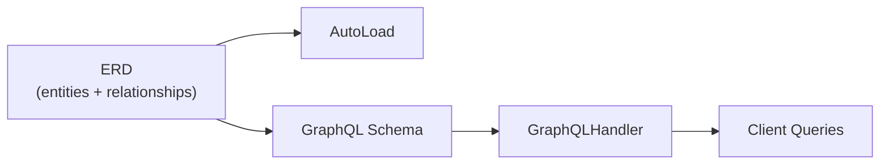
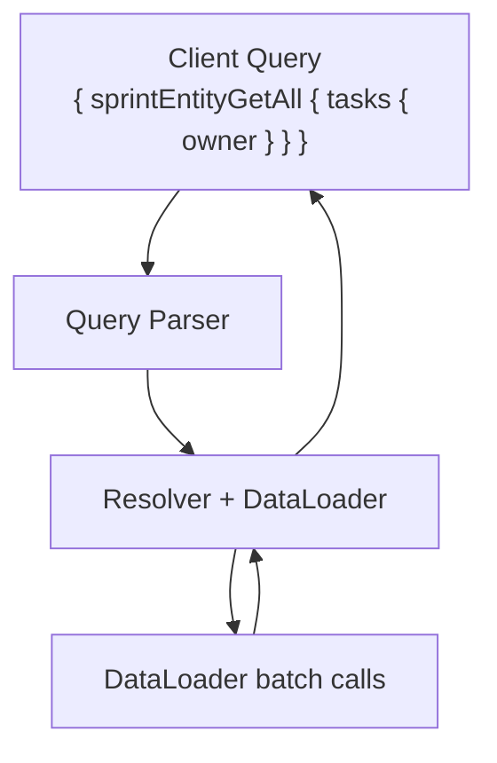

# GraphQL Guide

[中文版](./graphql_guide.zh.md)

Once an ERD is in place, GraphQL becomes a reuse layer. The same relationship graph that powers `AutoLoad` can also generate a full GraphQL schema and execute queries.

## Overview



## Setup

### 1. Define Entities with Queries

Use the `@query` decorator to add root entry points. The GraphQL operation name is auto-generated as `entityPrefix + MethodCamel` (e.g., `SprintEntity.get_all` → `sprintEntityGetAll`):

```python
from typing import Annotated, Optional

from pydantic import BaseModel
from pydantic_resolve import (
    Relationship,
    base_entity,
    build_list,
    build_object,
    query,
)


USERS = {
    7: {"id": 7, "name": "Ada"},
    8: {"id": 8, "name": "Bob"},
}

TASKS = [
    {"id": 10, "title": "Design docs", "sprint_id": 1, "owner_id": 7},
    {"id": 11, "title": "Refine examples", "sprint_id": 1, "owner_id": 8},
    {"id": 12, "title": "Write tests", "sprint_id": 2, "owner_id": 7},
]

SPRINTS = [
    {"id": 1, "name": "Sprint 24"},
    {"id": 2, "name": "Sprint 25"},
]


async def user_loader(user_ids: list[int]):
    users = [USERS.get(uid) for uid in user_ids]
    return build_object(users, user_ids, lambda u: u.id)


async def task_loader(sprint_ids: list[int]):
    tasks = [t for t in TASKS if t["sprint_id"] in sprint_ids]
    return build_list(tasks, sprint_ids, lambda t: t["sprint_id"])


BaseEntity = base_entity()


class UserEntity(BaseModel, BaseEntity):
    id: int
    name: str


class TaskEntity(BaseModel, BaseEntity):
    __relationships__ = [
        Relationship(fk='owner_id', target=UserEntity, name='owner', loader=user_loader)
    ]
    id: int
    title: str
    owner_id: int


class SprintEntity(BaseModel, BaseEntity):
    __relationships__ = [
        Relationship(fk='id', target=list[TaskEntity], name='tasks', loader=task_loader)
    ]
    id: int
    name: str

    @query
    async def get_all(cls, limit: int = 20) -> list['SprintEntity']:
        return [SprintEntity(**s) for s in SPRINTS[:limit]]


diagram = BaseEntity.get_diagram()
```

### 2. Execute Queries

```python
from pydantic_resolve.graphql import GraphQLHandler

handler = GraphQLHandler(diagram)

result = await handler.execute("""
{
    sprintEntityGetAll {
        id
        name
        tasks {
            id
            title
            owner {
                id
                name
            }
        }
    }
}
""")

print(result)
# {'data': {'sprintEntityGetAll': [
#     {'id': 1, 'name': 'Sprint 24', 'tasks': [
#         {'id': 10, 'title': 'Design docs', 'owner': {'id': 7, 'name': 'Ada'}},
#         {'id': 11, 'title': 'Refine examples', 'owner': {'id': 8, 'name': 'Bob'}},
#     ]},
#     {'id': 2, 'name': 'Sprint 25', 'tasks': [
#         {'id': 12, 'title': 'Write tests', 'owner': {'id': 7, 'name': 'Ada'}},
#     ]},
# ]}, 'errors': None}
```

## Adding Mutations

Use the `@mutation` decorator for write operations:

```python
from pydantic_resolve import mutation

class SprintEntity(BaseModel, BaseEntity):
    id: int
    name: str

    @mutation
    async def create(cls, name: str) -> 'SprintEntity':
        sprint = await db.create_sprint(name=name)
        return SprintEntity.model_validate(sprint)
```

Execute:

```python
result = await handler.execute("""
mutation {
    sprintEntityCreate(name: "Sprint 26") {
        id
        name
    }
}
""")
```

## External Configuration with QueryConfig / MutationConfig

`@query` and `@mutation` decorators bind root fields directly to entity classes. If you prefer to keep query/mutation logic separate from entity definitions — or your query functions live in a different module — use `QueryConfig` and `MutationConfig` instead.

### QueryConfig

```python
from pydantic_resolve import QueryConfig

QueryConfig(
    method: Callable,           # async function, first arg is `cls`
    name: str | None = None,    # Override for method-name part of the operation
    description: str | None = None,  # Field description in schema
)
```

The final GraphQL operation name is always `entityPrefix + MethodCamel` (e.g., `SprintEntity` + `get_all` → `sprintEntityGetAll`). The `name` parameter overrides the method-name part only: `name='sprints'` → `sprintEntitySprints`.

The `method` receives `cls` as its first argument (like a classmethod), followed by any GraphQL arguments:

```python
async def get_all_sprints(cls, limit: int = 20) -> list[SprintEntity]:
    return [SprintEntity(**s) for s in SPRINTS[:limit]]

async def get_sprint_by_id(cls, id: int) -> SprintEntity | None:
    return SprintEntity(**SPRINTS.get(id, {}))
```

### MutationConfig

```python
from pydantic_resolve import MutationConfig

MutationConfig(
    method: Callable,           # async function, first arg is `cls`
    name: str | None = None,    # Override for method-name part of the operation
    description: str | None = None,  # Field description in schema
)
```

```python
async def create_sprint(cls, name: str) -> SprintEntity:
    sprint = await db.create_sprint(name=name)
    return SprintEntity.model_validate(sprint)
```

### Wiring into ErDiagram

Attach `QueryConfig` and `MutationConfig` to an `Entity` inside `ErDiagram`:

```python
from pydantic_resolve import Entity, ErDiagram

diagram = ErDiagram(entities=[
    Entity(
        kls=SprintEntity,
        relationships=[...],
        queries=[
            QueryConfig(method=get_all_sprints),          # → sprintEntityGetAllSprints
            QueryConfig(method=get_sprint_by_id, name='sprint'),  # → sprintEntitySprint
        ],
        mutations=[
            MutationConfig(method=create_sprint),         # → sprintEntityCreateSprint
        ],
    ),
])
```

### Decorator vs Config: When to Use Which

| Aspect | `@query` / `@mutation` | `QueryConfig` / `MutationConfig` |
|--------|----------------------|----------------------------------|
| Definition location | Inside entity class | Outside, in any module |
| Coupling | Tight (query lives with entity) | Loose (query lives separately) |
| Multiple queries per entity | One method each | List of configs |
| Use case | Simple projects, colocation preferred | Shared entities, multi-module projects |

## GraphQLHandler

```python
from pydantic_resolve.graphql import GraphQLHandler

handler = GraphQLHandler(
    er_diagram=diagram,
    enable_from_attribute_in_type_adapter=False,  # optional
)

# Execute a query string directly
result = await handler.execute(query_string)
```

| Parameter | Type | Description |
|-----------|------|-------------|
| `er_diagram` | `ErDiagram` | The ERD to generate schema from |
| `enable_from_attribute_in_type_adapter` | `bool` | Enable Pydantic `from_attributes` mode |

## Integration with FastAPI

Serve GraphQL alongside REST endpoints:

```python
from fastapi import FastAPI, Request
from fastapi.responses import HTMLResponse
from pydantic_resolve.graphql import GraphQLHandler

app = FastAPI()
handler = GraphQLHandler(diagram)


@app.get("/graphql", response_class=HTMLResponse)
async def graphiql_playground():
    return handler.get_graphiql_html()


@app.post("/graphql")
async def graphql_endpoint(request: Request):
    body = await request.json()
    query = body.get("query", "")
    result = await handler.execute(query)
    return result
```

`GET /graphql` serves an interactive GraphiQL IDE with schema explorer and query history. `POST /graphql` handles query execution.

The default endpoint is `/graphql`. To use a different path, pass it to `get_graphiql_html`:

```python
handler.get_graphiql_html(endpoint="/api/graphql", title="My API")
```

## Request Context

When the GraphQL handler runs inside a web framework (FastAPI, Django, etc.), you often need to pass request-scoped data — such as the current user's ID from a JWT — into query methods. `handler.execute()` accepts a `context` dict for this purpose.

### Passing context from FastAPI

```python
@app.post("/graphql")
async def graphql_endpoint(request: Request):
    body = await request.json()
    query = body.get("query", "")

    # Extract user info from JWT (simplified example)
    user_id = decode_jwt(request.headers.get("Authorization", ""))
    context = {"user_id": user_id}

    result = await handler.execute(query, context=context)
    return result
```

### Receiving context in query methods

Add a `context` parameter to any `@query` or `@mutation` method (or `QueryConfig`/`MutationConfig` function). The parameter is **hidden from the GraphQL schema** — clients never see it.

```python
async def get_my_tasks(limit: int = 10, context: dict = None) -> list[TaskEntity]:
    """Get tasks assigned to the current user."""
    user_id = context['user_id']
    return await fetch_tasks_by_owner(user_id, limit)

Entity(
    kls=TaskEntity,
    queries=[
        QueryConfig(method=get_my_tasks, name='my_tasks'),
    ],
)
```

Clients query this as a normal field — no `context` argument in the query:

```graphql
{
    taskEntityMyTasks(limit: 5) { id title }
}
```

### Context in DataLoaders

The same `context` dict is also forwarded to the internal `Resolver(context=...)`, which injects it into class-based DataLoaders that declare a `_context` attribute. This allows loaders to filter or scope their queries by request-level data such as `user_id`:

```python
from aiodataloader import DataLoader

class TaskByOwnerLoader(DataLoader):
    _context: dict  # injected by Resolver

    async def batch_load_fn(self, sprint_ids):
        user_id = self._context['user_id']
        tasks = await db.query(Task).filter(
            Task.sprint_id.in_(sprint_ids),
            Task.owner_id == user_id,
        ).all()
        return build_list(tasks, sprint_ids, lambda t: t.sprint_id)
```

> Function-based loaders (plain async functions) cannot receive context. Use a class-based DataLoader when you need access to request-scoped data.

## How It Works

1. `GraphQLHandler` generates a GraphQL schema from the ERD entities and relationships.
2. Each `Relationship` becomes a GraphQL field with automatic resolution.
3. Root queries come from `@query` decorators or `QueryConfig`.
4. The handler uses the same `Resolver` and DataLoader batching internally.



## Next

Continue to [MCP Service](./mcp_service.md) to expose GraphQL APIs to AI agents.
