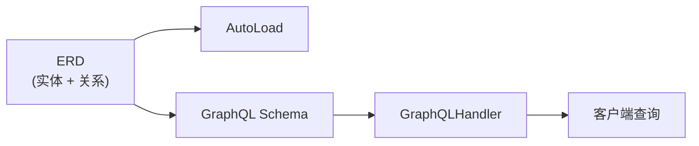
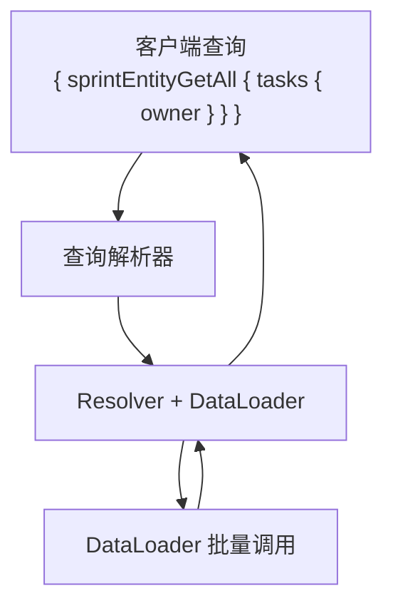

# GraphQL 指南

[English](./graphql_guide.md)

一旦 ERD 就位，GraphQL 就成为一个复用层。驱动 `AutoLoad` 的同一个关系图也可以生成完整的 GraphQL schema 并执行查询。

## 概述



## 设置

### 1. 定义带有查询的实体

使用 `@query` 装饰器添加根入口点。GraphQL 操作名自动生成为 `entityPrefix + MethodCamel`（例如 `SprintEntity.get_all` → `sprintEntityGetAll`）：

```python
from typing import Annotated, Optional

from pydantic import BaseModel
from pydantic_resolve import (
    Relationship,
    base_entity,
    build_list,
    build_object,
    query,
)


USERS = {
    7: {"id": 7, "name": "Ada"},
    8: {"id": 8, "name": "Bob"},
}

TASKS = [
    {"id": 10, "title": "Design docs", "sprint_id": 1, "owner_id": 7},
    {"id": 11, "title": "Refine examples", "sprint_id": 1, "owner_id": 8},
    {"id": 12, "title": "Write tests", "sprint_id": 2, "owner_id": 7},
]

SPRINTS = [
    {"id": 1, "name": "Sprint 24"},
    {"id": 2, "name": "Sprint 25"},
]


async def user_loader(user_ids: list[int]):
    users = [USERS.get(uid) for uid in user_ids]
    return build_object(users, user_ids, lambda u: u.id)


async def task_loader(sprint_ids: list[int]):
    tasks = [t for t in TASKS if t["sprint_id"] in sprint_ids]
    return build_list(tasks, sprint_ids, lambda t: t["sprint_id"])


BaseEntity = base_entity()


class UserEntity(BaseModel, BaseEntity):
    id: int
    name: str


class TaskEntity(BaseModel, BaseEntity):
    __relationships__ = [
        Relationship(fk='owner_id', target=UserEntity, name='owner', loader=user_loader)
    ]
    id: int
    title: str
    owner_id: int


class SprintEntity(BaseModel, BaseEntity):
    __relationships__ = [
        Relationship(fk='id', target=list[TaskEntity], name='tasks', loader=task_loader)
    ]
    id: int
    name: str

    @query
    async def get_all(cls, limit: int = 20) -> list['SprintEntity']:
        return [SprintEntity(**s) for s in SPRINTS[:limit]]


diagram = BaseEntity.get_diagram()
```

### 2. 执行查询

```python
from pydantic_resolve.graphql import GraphQLHandler

handler = GraphQLHandler(diagram)

result = await handler.execute("""
{
    sprintEntityGetAll {
        id
        name
        tasks {
            id
            title
            owner {
                id
                name
            }
        }
    }
}
""")

print(result)
# {'data': {'sprintEntityGetAll': [
#     {'id': 1, 'name': 'Sprint 24', 'tasks': [
#         {'id': 10, 'title': 'Design docs', 'owner': {'id': 7, 'name': 'Ada'}},
#         {'id': 11, 'title': 'Refine examples', 'owner': {'id': 8, 'name': 'Bob'}},
#     ]},
#     {'id': 2, 'name': 'Sprint 25', 'tasks': [
#         {'id': 12, 'title': 'Write tests', 'owner': {'id': 7, 'name': 'Ada'}},
#     ]},
# ]}, 'errors': None}
```

## 添加变更

使用 `@mutation` 装饰器进行写操作：

```python
from pydantic_resolve import mutation

class SprintEntity(BaseModel, BaseEntity):
    id: int
    name: str

    @mutation
    async def create(cls, name: str) -> 'SprintEntity':
        sprint = await db.create_sprint(name=name)
        return SprintEntity.model_validate(sprint)
```

执行：

```python
result = await handler.execute("""
mutation {
    sprintEntityCreate(name: "Sprint 26") {
        id
        name
    }
}
""")
```

## 使用 QueryConfig / MutationConfig 的外部配置

`@query` 和 `@mutation` 装饰器将根字段直接绑定到实体类内部。如果你希望将查询/变更逻辑与实体定义分离——或者查询函数位于不同模块——可以使用 `QueryConfig` 和 `MutationConfig`。

### QueryConfig

```python
from pydantic_resolve import QueryConfig

QueryConfig(
    method: Callable,           # 异步函数，第一个参数是 `cls`
    name: str | None = None,    # 覆盖操作名中的方法名部分
    description: str | None = None,  # schema 中的字段描述
)
```

最终的 GraphQL 操作名始终为 `entityPrefix + MethodCamel`（例如 `SprintEntity` + `get_all` → `sprintEntityGetAll`）。`name` 参数仅覆盖方法名部分：`name='sprints'` → `sprintEntitySprints`。

`method` 的第一个参数接收 `cls`（类似 classmethod），后面是任意 GraphQL 参数：

```python
async def get_all_sprints(cls, limit: int = 20) -> list[SprintEntity]:
    return [SprintEntity(**s) for s in SPRINTS[:limit]]

async def get_sprint_by_id(cls, id: int) -> SprintEntity | None:
    return SprintEntity(**SPRINTS.get(id, {}))
```

### MutationConfig

```python
from pydantic_resolve import MutationConfig

MutationConfig(
    method: Callable,           # 异步函数，第一个参数是 `cls`
    name: str | None = None,    # 覆盖操作名中的方法名部分
    description: str | None = None,  # schema 中的字段描述
)
```

```python
async def create_sprint(cls, name: str) -> SprintEntity:
    sprint = await db.create_sprint(name=name)
    return SprintEntity.model_validate(sprint)
```

### 接入 ErDiagram

将 `QueryConfig` 和 `MutationConfig` 附加到 `ErDiagram` 中的 `Entity` 上：

```python
from pydantic_resolve import Entity, ErDiagram

diagram = ErDiagram(entities=[
    Entity(
        kls=SprintEntity,
        relationships=[...],
        queries=[
            QueryConfig(method=get_all_sprints),          # → sprintEntityGetAllSprints
            QueryConfig(method=get_sprint_by_id, name='sprint'),  # → sprintEntitySprint
        ],
        mutations=[
            MutationConfig(method=create_sprint),         # → sprintEntityCreateSprint
        ],
    ),
])
```

### 装饰器 vs Config：何时用哪个

| 方面 | `@query` / `@mutation` | `QueryConfig` / `MutationConfig` |
|--------|----------------------|----------------------------------|
| 定义位置 | 实体类内部 | 外部，可以在任意模块 |
| 耦合度 | 紧密（查询与实体放在一起） | 松散（查询与实体分离） |
| 每个实体的多个查询 | 每个方法一个 | 配置列表 |
| 适用场景 | 简单项目，偏好放在一起 | 共享实体、多模块项目 |

## GraphQLHandler

```python
from pydantic_resolve.graphql import GraphQLHandler

handler = GraphQLHandler(
    er_diagram=diagram,
    enable_from_attribute_in_type_adapter=False,  # 可选
)

# 直接执行查询字符串
result = await handler.execute(query_string)
```

| 参数 | 类型 | 描述 |
|-----------|------|-------------|
| `er_diagram` | `ErDiagram` | 用于生成 schema 的 ERD |
| `enable_from_attribute_in_type_adapter` | `bool` | 启用 Pydantic `from_attributes` 模式 |

## 与 FastAPI 集成

与 REST 端点一起提供 GraphQL：

```python
from fastapi import FastAPI, Request
from fastapi.responses import HTMLResponse
from pydantic_resolve.graphql import GraphQLHandler

app = FastAPI()
handler = GraphQLHandler(diagram)


@app.get("/graphql", response_class=HTMLResponse)
async def graphiql_playground():
    return handler.get_graphiql_html()


@app.post("/graphql")
async def graphql_endpoint(request: Request):
    body = await request.json()
    query = body.get("query", "")
    result = await handler.execute(query)
    return result
```

`GET /graphql` 提供带有 Schema 浏览器和查询历史的交互式 GraphiQL IDE。`POST /graphql` 处理查询执行。

默认端点为 `/graphql`。如需使用其他路径，传入 `get_graphiql_html`：

```python
handler.get_graphiql_html(endpoint="/api/graphql", title="My API")
```

## 请求上下文

当 GraphQL handler 运行在 Web 框架（FastAPI、Django 等）中时，通常需要将请求级数据（如从 JWT 解析的当前用户 ID）传入查询方法。`handler.execute()` 接受一个 `context` dict 用于此目的。

### 从 FastAPI 传入上下文

```python
@app.post("/graphql")
async def graphql_endpoint(request: Request):
    body = await request.json()
    query = body.get("query", "")

    # 从 JWT 中提取用户信息（简化示例）
    user_id = decode_jwt(request.headers.get("Authorization", ""))
    context = {"user_id": user_id}

    result = await handler.execute(query, context=context)
    return result
```

### 在查询方法中接收上下文

在任意 `@query` 或 `@mutation` 方法（或 `QueryConfig`/`MutationConfig` 函数）中添加 `context` 参数即可接收。该参数**对 GraphQL schema 不可见** — 客户端无法看到它。

```python
async def get_my_tasks(limit: int = 10, context: dict = None) -> list[TaskEntity]:
    """获取当前用户的任务。"""
    user_id = context['user_id']
    return await fetch_tasks_by_owner(user_id, limit)

Entity(
    kls=TaskEntity,
    queries=[
        QueryConfig(method=get_my_tasks, name='my_tasks'),
    ],
)
```

客户端像普通字段一样查询，查询中不包含 `context` 参数：

```graphql
{
    taskEntityMyTasks(limit: 5) { id title }
}
```

### DataLoader 中的上下文

同一个 `context` dict 也会传入内部的 `Resolver(context=...)`，由 Resolver 自动注入到声明了 `_context` 属性的类式 DataLoader 中。这样 loader 可以按请求级数据（如 `user_id`）过滤或限定查询范围：

```python
from aiodataloader import DataLoader

class TaskByOwnerLoader(DataLoader):
    _context: dict  # 由 Resolver 注入

    async def batch_load_fn(self, sprint_ids):
        user_id = self._context['user_id']
        tasks = await db.query(Task).filter(
            Task.sprint_id.in_(sprint_ids),
            Task.owner_id == user_id,
        ).all()
        return build_list(tasks, sprint_ids, lambda t: t.sprint_id)
```

> 函数式 loader（普通异步函数）无法接收 context。需要访问请求级数据时，请使用类式 DataLoader。

## 分页

当一对多关系在 ORM 模型上定义了 `order_by` 时，可以为所有列表字段启用 limit/offset 分页。

### 启用分页

在 handler 和 schema builder 上同时设置 `enable_pagination=True`：

```python
handler = GraphQLHandler(
    diagram,
    enable_from_attribute_in_type_adapter=True,
    enable_pagination=True,
)
schema_builder = SchemaBuilder(diagram, enable_pagination=True)
```

前提条件：每个一对多 ORM 关系都必须配置 `order_by`，否则 `GraphQLHandler` 启动时会抛出 `ValueError`。

```python
class AuthorOrm(Base):
    articles: Mapped[list["ArticleOrm"]] = relationship(
        back_populates="author",
        order_by="ArticleOrm.id",  # 分页所必需
    )
```

### Schema 变化

启用分页后，一对多字段会增加 `limit` 和 `offset` 参数，返回类型从普通列表变为 `Result` 类型：

启用前（无分页）：

```graphql
type AuthorEntity {
  articles: [ArticleEntity!]!
}
```

启用后：

```graphql
type AuthorEntity {
  articles(limit: Int, offset: Int): ArticleEntityResult!
}

type ArticleEntityResult {
  items: [ArticleEntity!]!
  pagination: Pagination!
}

type Pagination {
  has_more: Boolean!
  total_count: Int
}
```

### 基本查询

```graphql
{
  authorEntityAuthors {
    id
    name
    articles(limit: 10, offset: 0) {
      items {
        id
        title
      }
      pagination {
        has_more
        total_count
      }
    }
  }
}
```

响应：

```json
{
  "articles": {
    "items": [
      {"id": 1, "title": "Article 1"},
      {"id": 2, "title": "Article 2"}
    ],
    "pagination": {
      "has_more": true,
      "total_count": 5
    }
  }
}
```

### 嵌套分页

每一层可以独立分页，分页参数按父实体分别生效：

```graphql
{
  authorEntityAuthors {
    id
    articles(limit: 2) {
      items {
        id
        title
        comments(limit: 1) {
          items { text }
          pagination { total_count has_more }
        }
      }
      pagination { total_count has_more }
    }
  }
}
```

### 穿过多对一关系的分页

分页参数也能穿透多对一关系传播：

```graphql
{
  authorEntityAuthors {
    articles(limit: 1) {
      items {
        title
        author {
          articles(limit: 1) {
            items { id title }
            pagination { total_count }
          }
        }
      }
    }
  }
}
```

### 分页大小配置

`Relationship` 支持 `default_page_size` 和 `max_page_size`：

- `default_page_size`（默认：20）— 省略 `limit` 时使用
- `max_page_size`（默认：100）— 限制实际生效的 limit 上限

使用 `build_relationship()` 从 ORM 集成时，这些值会自动填充。

### 分页字段选择

`pagination` 字段支持部分选择：

| 查询 | 结果 |
|------|------|
| `pagination { has_more }` | 仅返回 `has_more` |
| `pagination { total_count }` | 仅返回 `total_count` |
| `pagination { has_more total_count }` | 两个字段都返回 |
| 完全省略 `pagination` | 仅返回 `items` |

## 工作原理

1. `GraphQLHandler` 从 ERD 实体和关系生成 GraphQL schema。
2. 每个 `Relationship` 成为带有自动解析的 GraphQL 字段。
3. 根查询来自 `@query` 装饰器或 `QueryConfig`。
4. 处理程序内部使用相同的 `Resolver` 和 DataLoader 批处理。



## 下一步

继续阅读 [MCP 服务](./mcp_service.zh.md) 了解如何向 AI 代理暴露 GraphQL API。
