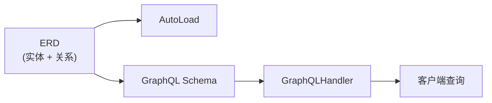
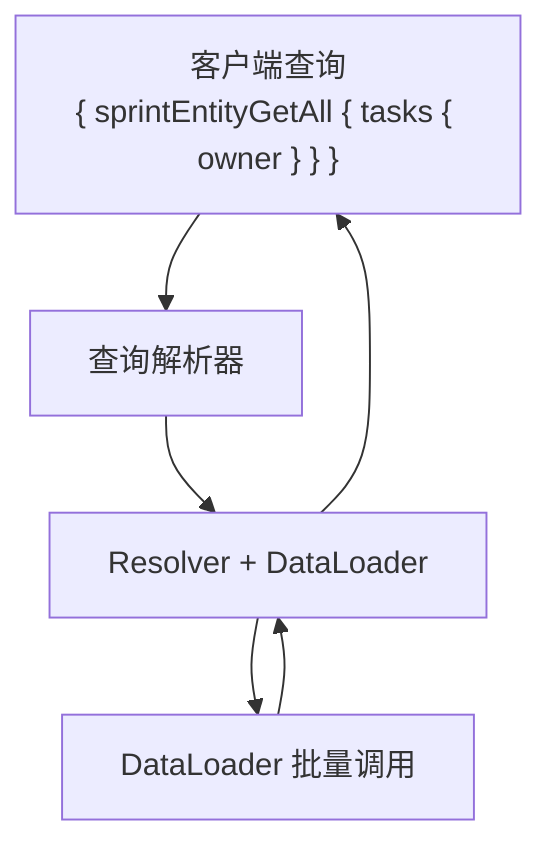

# GraphQL 指南

[English](./graphql_guide.md)

一旦 ERD 就位，GraphQL 就成为一个复用层。驱动 `AutoLoad` 的同一个关系图也可以生成完整的 GraphQL schema 并执行查询。

## 概述



## 设置

### 1. 定义带有查询的实体

使用 `@query` 装饰器添加根入口点。GraphQL 操作名自动生成为 `entityPrefix + MethodCamel`（例如 `SprintEntity.get_all` → `sprintEntityGetAll`）：

```python
from typing import Annotated, Optional

from pydantic import BaseModel
from pydantic_resolve import (
    Relationship,
    base_entity,
    build_list,
    build_object,
    config_global_resolver,
    query,
)


USERS = {
    7: {"id": 7, "name": "Ada"},
    8: {"id": 8, "name": "Bob"},
}

TASKS = [
    {"id": 10, "title": "Design docs", "sprint_id": 1, "owner_id": 7},
    {"id": 11, "title": "Refine examples", "sprint_id": 1, "owner_id": 8},
    {"id": 12, "title": "Write tests", "sprint_id": 2, "owner_id": 7},
]

SPRINTS = [
    {"id": 1, "name": "Sprint 24"},
    {"id": 2, "name": "Sprint 25"},
]


async def user_loader(user_ids: list[int]):
    users = [USERS.get(uid) for uid in user_ids]
    return build_object(users, user_ids, lambda u: u.id)


async def task_loader(sprint_ids: list[int]):
    tasks = [t for t in TASKS if t["sprint_id"] in sprint_ids]
    return build_list(tasks, sprint_ids, lambda t: t["sprint_id"])


BaseEntity = base_entity()


class UserEntity(BaseModel, BaseEntity):
    id: int
    name: str


class TaskEntity(BaseModel, BaseEntity):
    __relationships__ = [
        Relationship(fk='owner_id', target=UserEntity, name='owner', loader=user_loader)
    ]
    id: int
    title: str
    owner_id: int


class SprintEntity(BaseModel, BaseEntity):
    __relationships__ = [
        Relationship(fk='id', target=list[TaskEntity], name='tasks', loader=task_loader)
    ]
    id: int
    name: str

    @query
    async def get_all(cls, limit: int = 20) -> list['SprintEntity']:
        return [SprintEntity(**s) for s in SPRINTS[:limit]]


diagram = BaseEntity.get_diagram()
config_global_resolver(diagram)
```

### 2. 执行查询

```python
from pydantic_resolve.graphql import GraphQLHandler

handler = GraphQLHandler(diagram)

result = await handler.execute("""
{
    sprintEntityGetAll {
        id
        name
        tasks {
            id
            title
            owner {
                id
                name
            }
        }
    }
}
""")

print(result)
# {'sprintEntityGetAll': [
#     {'id': 1, 'name': 'Sprint 24', 'tasks': [
#         {'id': 10, 'title': 'Design docs', 'owner': {'id': 7, 'name': 'Ada'}},
#         {'id': 11, 'title': 'Refine examples', 'owner': {'id': 8, 'name': 'Bob'}},
#     ]},
#     {'id': 2, 'name': 'Sprint 25', 'tasks': [
#         {'id': 12, 'title': 'Write tests', 'owner': {'id': 7, 'name': 'Ada'}},
#     ]},
# ]}
```

## 添加变更

使用 `@mutation` 装饰器进行写操作：

```python
from pydantic_resolve import mutation

class SprintEntity(BaseModel, BaseEntity):
    id: int
    name: str

    @mutation
    async def create(cls, name: str) -> 'SprintEntity':
        sprint = await db.create_sprint(name=name)
        return SprintEntity.model_validate(sprint)
```

执行：

```python
result = await handler.execute("""
mutation {
    sprintEntityCreate(name: "Sprint 26") {
        id
        name
    }
}
""")
```

## 使用 QueryConfig / MutationConfig 的外部配置

`@query` 和 `@mutation` 装饰器将根字段直接绑定到实体类内部。如果你希望将查询/变更逻辑与实体定义分离——或者查询函数位于不同模块——可以使用 `QueryConfig` 和 `MutationConfig`。

### QueryConfig

```python
from pydantic_resolve import QueryConfig

QueryConfig(
    method: Callable,           # 异步函数，第一个参数是 `cls`
    name: str | None = None,    # 覆盖操作名中的方法名部分
    description: str | None = None,  # schema 中的字段描述
)
```

最终的 GraphQL 操作名始终为 `entityPrefix + MethodCamel`（例如 `SprintEntity` + `get_all` → `sprintEntityGetAll`）。`name` 参数仅覆盖方法名部分：`name='sprints'` → `sprintEntitySprints`。

`method` 的第一个参数接收 `cls`（类似 classmethod），后面是任意 GraphQL 参数：

```python
async def get_all_sprints(cls, limit: int = 20) -> list[SprintEntity]:
    return [SprintEntity(**s) for s in SPRINTS[:limit]]

async def get_sprint_by_id(cls, id: int) -> SprintEntity | None:
    return SprintEntity(**SPRINTS.get(id, {}))
```

### MutationConfig

```python
from pydantic_resolve import MutationConfig

MutationConfig(
    method: Callable,           # 异步函数，第一个参数是 `cls`
    name: str | None = None,    # 覆盖操作名中的方法名部分
    description: str | None = None,  # schema 中的字段描述
)
```

```python
async def create_sprint(cls, name: str) -> SprintEntity:
    sprint = await db.create_sprint(name=name)
    return SprintEntity.model_validate(sprint)
```

### 接入 ErDiagram

将 `QueryConfig` 和 `MutationConfig` 附加到 `ErDiagram` 中的 `Entity` 上：

```python
from pydantic_resolve import Entity, ErDiagram

diagram = ErDiagram(entities=[
    Entity(
        kls=SprintEntity,
        relationships=[...],
        queries=[
            QueryConfig(method=get_all_sprints),          # → sprintEntityGetAllSprints
            QueryConfig(method=get_sprint_by_id, name='sprint'),  # → sprintEntitySprint
        ],
        mutations=[
            MutationConfig(method=create_sprint),         # → sprintEntityCreateSprint
        ],
    ),
])
```

### 装饰器 vs Config：何时用哪个

| 方面 | `@query` / `@mutation` | `QueryConfig` / `MutationConfig` |
|--------|----------------------|----------------------------------|
| 定义位置 | 实体类内部 | 外部，可以在任意模块 |
| 耦合度 | 紧密（查询与实体放在一起） | 松散（查询与实体分离） |
| 每个实体的多个查询 | 每个方法一个 | 配置列表 |
| 适用场景 | 简单项目，偏好放在一起 | 共享实体、多模块项目 |

## GraphQLHandler

```python
from pydantic_resolve.graphql import GraphQLHandler

handler = GraphQLHandler(
    er_diagram=diagram,
    enable_from_attribute_in_type_adapter=False,  # 可选
)

# 执行查询
result = await handler.execute(query_string)

# 使用变量执行
result = await handler.execute(
    query_string,
    variables={"limit": 10}
)
```

| 参数 | 类型 | 描述 |
|-----------|------|-------------|
| `er_diagram` | `ErDiagram` | 用于生成 schema 的 ERD |
| `enable_from_attribute_in_type_adapter` | `bool` | 启用 Pydantic `from_attributes` 模式 |

## 与 FastAPI 集成

与 REST 端点一起提供 GraphQL：

```python
from fastapi import FastAPI, Request
from fastapi.responses import HTMLResponse
from pydantic_resolve.graphql import GraphQLHandler

app = FastAPI()
handler = GraphQLHandler(diagram)


@app.get("/graphql", response_class=HTMLResponse)
async def graphiql_playground():
    return handler.get_graphiql_html()


@app.post("/graphql")
async def graphql_endpoint(request: Request):
    body = await request.json()
    query = body.get("query", "")
    variables = body.get("variables", {})
    result = await handler.execute(query, variables=variables)
    return {"data": result}
```

`GET /graphql` 提供带有 Schema 浏览器和查询历史的交互式 GraphiQL IDE。`POST /graphql` 处理查询执行。

默认端点为 `/graphql`。如需使用其他路径，传入 `get_graphiql_html`：

```python
handler.get_graphiql_html(endpoint="/api/graphql", title="My API")
```

## 工作原理

1. `GraphQLHandler` 从 ERD 实体和关系生成 GraphQL schema。
2. 每个 `Relationship` 成为带有自动解析的 GraphQL 字段。
3. 根查询来自 `@query` 装饰器或 `QueryConfig`。
4. 处理程序内部使用相同的 `Resolver` 和 DataLoader 批处理。



## 下一步

继续阅读 [MCP 服务](./mcp_service.zh.md) 了解如何向 AI 代理暴露 GraphQL API。
