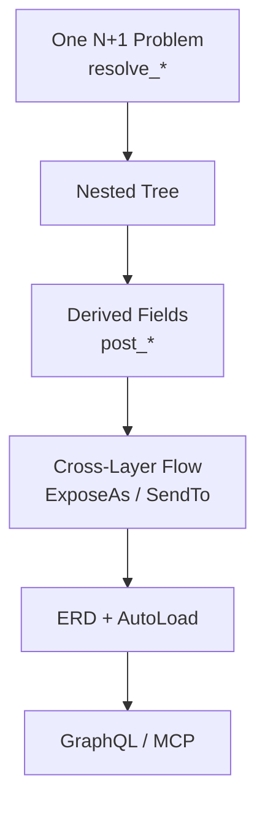

# pydantic-resolve

[中文版](./index.zh.md)

**pydantic-resolve** is a declarative data assembly library for Pydantic. It eliminates N+1 queries with minimal code by combining the DataLoader pattern with Pydantic models. It also provides rich data transformation capabilities — including derived field computation, cross-layer data flow, and field subset filtering — covering the full pipeline from data loading to final response construction.

The core idea: mark missing fields with `resolve_*`, compute derived values with `post_*`, and let the `Resolver` walk the tree. As your project grows, repeated relationship wiring can be consolidated into an ER Diagram with `AutoLoad`, which also powers GraphQL and MCP generation.

## What pydantic-resolve Gives You

| Need | What you write | What the framework does |
|------|----------------|-------------------------|
| Load related data | `resolve_*` + `Loader(...)` | Batch lookups and map results back |
| Compute derived fields | `post_*` | Run after descendants are fully resolved |
| Share data across layers | `ExposeAs`, `SendTo`, `Collector` | Pass context down or aggregate data up |
| Reuse relationship declarations | ER Diagram + `AutoLoad` | Centralize relationship wiring for many models |

## Who Is This For

- **Backend developers** building nested response data in FastAPI or similar frameworks
- **Teams** who want to solve N+1 queries without switching to GraphQL
- **Projects** where the same entity relationships repeat across multiple endpoints
- **Anyone** who wants Pydantic models to compose like self-contained components

## Learning Path

Every page in the Guide section uses the same business scenario: `Sprint` has many `Task`, each `Task` has one `owner`.

### Guide (Tutorial Path)

| Page | Main Question |
|---|---|
| [Quick Start](./quick_start.md) | How do I fix one N+1 problem with the smallest useful amount of code? |
| [Core API](./core_api.md) | How do `resolve_*` methods compose into a nested response tree? |
| [Post Processing](./post_processing.md) | When should a field be computed in `post_*` instead of loaded in `resolve_*`? |
| [Cross-Layer Data Flow](./cross_layer_data_flow.md) | How do parent and child nodes coordinate without hard-coded traversal logic? |
| [ERD and AutoLoad](./erd_and_autoload.md) | When is it worth turning repeated relationship wiring into reusable ERD declarations? |

### Guides (Practical Topics)

Once you understand the core model, these pages go deeper into specific areas:

| Page | Topic |
|---|---|
| [DataLoader Deep Dive](./dataloader_deep_dive.md) | How batching works, `build_object`/`build_list`, parameters, cloning |
| [ERD with DefineSubset](./erd_define_subset.md) | Hide internal fields while keeping centralized relationships |
| [ORM Integration](./orm_integration.md) | Auto-generate loaders from SQLAlchemy, Django, or Tortoise ORM |
| [FastAPI Integration](./fastapi_integration.md) | Use Resolver in FastAPI endpoints with dependency injection |
| [GraphQL Guide](./graphql_guide.md) | Generate and serve GraphQL from ERD |
| [MCP Service](./mcp_service.md) | Expose GraphQL APIs to AI agents |

### API Reference

Detailed signatures and parameters for all public APIs:

- [Resolver](./api_resolver.md) — traversal orchestrator
- [DataLoader Utilities](./api_dataloader.md) — `Loader`, `build_object`, `build_list`
- [Cross-Layer Annotations](./api_cross_layer.md) — `ExposeAs`, `SendTo`, `Collector`
- [ER Diagram](./api_erd.md) — `base_entity`, `Relationship`, `ErDiagram`, `AutoLoad`
- [DefineSubset](./api_subset.md) — `DefineSubset`, `SubsetConfig`
- [GraphQL API](./api_graphql.md) — `GraphQLHandler`, `@query`, `@mutation`
- [MCP API](./api_mcp.md) — `create_mcp_server`, `AppConfig`
