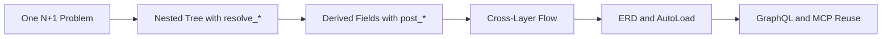

# docs

[中文版](./index.zh.md)

`docs/` is the new progressive documentation path for pydantic-resolve. It keeps the existing `docs/` directory untouched while we rebuild the learning experience around one scenario, one sequence, and clearer boundaries between tutorial material and reference material.

The design rule is simple: start with one concrete endpoint-level N+1 problem, stay on the same business model while complexity grows, and only introduce automation once the manual model is already clear.

## What This Path Optimizes For

- Fast onboarding from one real response-model problem
- One stable scenario: `Sprint -> Task -> User`
- Explicit separation between learning path and long-lived reference docs
- ERD, GraphQL, and MCP introduced as scaling and reuse steps, not entry points

## Learning Flow

## Read in This Order

| Page | Main Question |
|---|---|
| [Quick Start](./quick_start.md) | How do I fix one N+1 problem with the smallest useful amount of code? |
| [Core API](./core_api.md) | How do `resolve_*` methods compose into a nested response tree? |
| [Post Processing](./post_processing.md) | When should a field be computed in `post_*` instead of loaded in `resolve_*`? |
| [Cross-Layer Data Flow](./cross_layer_data_flow.md) | How do parent and child nodes coordinate without hard-coded traversal logic? |
| [ERD and AutoLoad](./erd_and_autoload.md) | When is it worth turning repeated relationship wiring into reusable ERD declarations? |
| [GraphQL and MCP](./graphql_and_mcp.md) | How can the same ERD power external interfaces without creating a second mental model? |
| [Reference Bridge](./reference_bridge.md) | Where should I go after the main path ends? |

## Shared Scenario

Every page in the main path uses the same business story:

- `Sprint` has many `Task`
- `Task` has one `owner`
- `Sprint` derives `task_count` and `contributor_names`
- `Sprint` can expose `sprint_name` downward to descendants
- `Task.owner` can be collected upward as `contributors`

For the full naming rules, see [Scenario Contract](./scenario_contract.md).

## What Is Deliberately Outside This Path

The following material still matters, but should not interrupt a first read:

- API reference
- migration guide
- changelog
- project motivation and origin story
- UI integration details
- advanced side topics such as inheritance-heavy reuse patterns

Those materials remain connected through [Reference Bridge](./reference_bridge.md).

## How This Directory Relates to the Existing Docs

`docs/` focuses on the progressive learning path, while `docs_old/` continues to hold the older topic-based material that has not been migrated yet.

- `docs/` is organized around onboarding and concept order.
- `docs_old/` still contains the earlier reference and topic-based pages.
- English and Chinese pages in `docs/` follow the same structure.

## Source Material

The first pass of `docs/` is assembled from material that originally lived in:

- `README.md`
- `README.zh.md`
- `docs_old/introduction.md`
- `docs_old/install.md`
- `docs_old/dataloader.md`
- `docs_old/expose_and_collect.md`
- `docs_old/erd_driven.md`
- `docs_old/schema_first.md`
- `docs_old/graphql.md`

For the migration matrix, see [Source Mapping](./source_mapping.md).