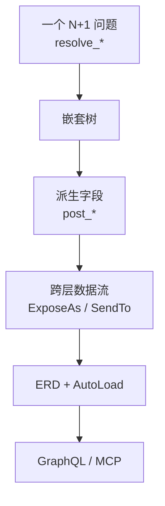

# pydantic-resolve

[English](./index.md)

**pydantic-resolve** 是一个基于 Pydantic 的声明式数据组装库。它通过将 DataLoader 模式与 Pydantic 模型结合，用最少的代码消除 N+1 查询。同时提供了丰富的数据调整能力：包括派生字段计算、跨层数据传递、字段子集筛选等，覆盖从数据加载到最终响应构造的完整链路。

核心思路：用 `resolve_*` 标记需要加载的字段，用 `post_*` 计算派生值，`Resolver` 负责遍历整棵树。当项目中关系定义开始重复时，可以把它们收敛到 ER Diagram + `AutoLoad`，同一份 ERD 还能继续驱动 GraphQL 和 MCP 生成。

## pydantic-resolve 能解决什么

| 需求 | 你写什么 | 框架负责什么 |
|------|----------|--------------|
| 加载关联数据 | `resolve_*` + `Loader(...)` | 批量查询并把结果映射回对应节点 |
| 计算派生字段 | `post_*` | 在后代节点全部解析完成后执行 |
| 跨层传递数据 | `ExposeAs`、`SendTo`、`Collector` | 向下传上下文，或向上聚合结果 |
| 复用关系声明 | ER Diagram + `AutoLoad` | 将关系定义集中管理，供多个模型复用 |

## 适用场景

- **后端开发者**：在 FastAPI 等框架中构建嵌套响应数据
- **团队**：想解决 N+1 查询问题，但不想切换到 GraphQL
- **项目**：同一批实体关系在多个接口中反复出现
- **任何人**：希望 Pydantic 模型像独立组件一样组合

## 学习路径

指南部分的每一页都复用同一套业务场景：`Sprint` 有多个 `Task`，每个 `Task` 有一个 `owner`。

### 指南（教程路径）

| 页面 | 主要回答的问题 |
|---|---|
| [快速开始](./quick_start.zh.md) | 如何用最小可用代码解决一个 N+1 问题？ |
| [核心 API](./core_api.zh.md) | 多个 `resolve_*` 方法如何组成一棵嵌套响应树？ |
| [后处理](./post_processing.zh.md) | 一个字段什么时候应该写在 `post_*`，而不是 `resolve_*`？ |
| [跨层数据流](./cross_layer_data_flow.zh.md) | 父子节点如何在不手写遍历逻辑的情况下协作？ |
| [ERD 与 AutoLoad](./erd_and_autoload.zh.md) | 什么时候值得把重复的关系声明提升为 ERD？ |

### 实用指南

理解核心模型后，这些页面深入具体领域：

| 页面 | 主题 |
|---|---|
| [DataLoader 深入](./dataloader_deep_dive.zh.md) | 批量加载原理、`build_object`/`build_list`、参数、克隆 |
| [ERD 与 DefineSubset](./erd_define_subset.zh.md) | 隐藏内部字段，同时保持集中化的关系声明 |
| [ORM 集成](./orm_integration.zh.md) | 从 SQLAlchemy、Django、Tortoise ORM 自动生成 loader |
| [FastAPI 集成](./fastapi_integration.zh.md) | 在 FastAPI 接口中使用 Resolver 和依赖注入 |
| [GraphQL 指南](./graphql_guide.zh.md) | 从 ERD 生成并提供 GraphQL 服务 |
| [MCP 服务](./mcp_service.zh.md) | 将 GraphQL API 暴露给 AI 代理使用 |

### API 参考

所有公开 API 的详细签名和参数：

- [Resolver](./api_resolver.zh.md) — 遍历编排器
- [DataLoader 工具](./api_dataloader.zh.md) — `Loader`、`build_object`、`build_list`
- [跨层注解](./api_cross_layer.zh.md) — `ExposeAs`、`SendTo`、`Collector`
- [ER 图](./api_erd.zh.md) — `base_entity`、`Relationship`、`ErDiagram`、`AutoLoad`
- [DefineSubset](./api_subset.zh.md) — `DefineSubset`、`SubsetConfig`
- [GraphQL API](./api_graphql.zh.md) — `GraphQLHandler`、`@query`、`@mutation`
- [MCP API](./api_mcp.zh.md) — `create_mcp_server`、`AppConfig`
