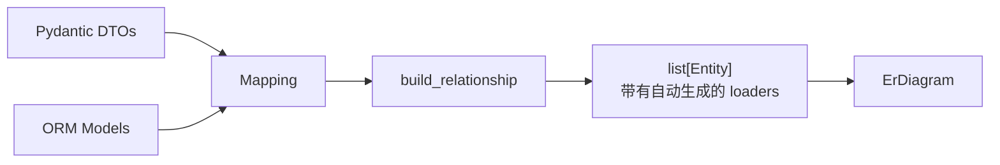

# ORM 集成

[English](./orm_integration.md)

当你的 ORM 已经知道表之间的关系时，你可以避免重复声明关系。`build_relationship()` 检查 ORM 元数据并自动生成 `Relationship` 定义和 DataLoader 函数。

## 支持的 ORM

| ORM | 导入 | 状态 |
|-----|--------|--------|
| SQLAlchemy | `pydantic_resolve.integration.sqlalchemy` | 完全支持 |
| Django | `pydantic_resolve.integration.django` | 完全支持 |
| Tortoise ORM | `pydantic_resolve.integration.tortoise` | 完全支持 |

## 安装

```bash
pip install pydantic-resolve[sqlalchemy]   # SQLAlchemy
pip install pydantic-resolve[django]       # Django
pip install pydantic-resolve[tortoise]     # Tortoise ORM
```

## 工作原理

集成遵循三个步骤：

1. 定义镜像 ORM 模型的 Pydantic DTO。
2. 通过 `Mapping` 将 DTO 映射到 ORM 模型。
3. 调用 `build_relationship()` 生成带有 loader 的 `Entity` 对象。



## SQLAlchemy 示例

### 1. 定义 ORM 模型

```python
from sqlalchemy import ForeignKey, Integer, String
from sqlalchemy.orm import DeclarativeBase, Mapped, mapped_column, relationship


class Base(DeclarativeBase):
    pass


class UserORM(Base):
    __tablename__ = "users"
    id: Mapped[int] = mapped_column(Integer, primary_key=True)
    name: Mapped[str] = mapped_column(String)
    posts: Mapped[list["PostORM"]] = relationship(back_populates="author")


class PostORM(Base):
    __tablename__ = "posts"
    id: Mapped[int] = mapped_column(Integer, primary_key=True)
    title: Mapped[str] = mapped_column(String)
    author_id: Mapped[int] = mapped_column(ForeignKey("users.id"))
    author: Mapped["UserORM"] = relationship(back_populates="posts")
    comments: Mapped[list["CommentORM"]] = relationship(back_populates="post")


class CommentORM(Base):
    __tablename__ = "comments"
    id: Mapped[int] = mapped_column(Integer, primary_key=True)
    content: Mapped[str] = mapped_column(String)
    post_id: Mapped[int] = mapped_column(ForeignKey("posts.id"))
    post: Mapped["PostORM"] = relationship(back_populates="comments")
```

### 2. 定义 Pydantic DTO

```python
from pydantic import BaseModel


class UserDTO(BaseModel):
    id: int
    name: str


class PostDTO(BaseModel):
    id: int
    title: str
    author_id: int


class CommentDTO(BaseModel):
    id: int
    content: str
    post_id: int
```

### 3. 构建关系

```python
from sqlalchemy.ext.asyncio import async_sessionmaker, create_async_engine
from pydantic_resolve import ErDiagram, config_global_resolver
from pydantic_resolve.integration.mapping import Mapping
from pydantic_resolve.integration.sqlalchemy import build_relationship

engine = create_async_engine("sqlite+aiosqlite:///blog.db")
session_factory = async_sessionmaker(engine, expire_on_commit=False)

entities = build_relationship(
    mappings=[
        Mapping(entity=UserDTO, orm=UserORM),
        Mapping(entity=PostDTO, orm=PostORM),
        Mapping(entity=CommentDTO, orm=CommentORM),
    ],
    session_factory=session_factory,
)

diagram = ErDiagram(entities=entities)
AutoLoad = diagram.create_auto_load()
config_global_resolver(diagram)
```

### 4. 在响应模型中使用

```python
from typing import Annotated, Optional


class CommentView(CommentDTO):
    pass


class PostView(PostDTO):
    author: Annotated[Optional[UserDTO], AutoLoad()] = None
    comments: Annotated[list[CommentView], AutoLoad()] = []


class UserView(UserDTO):
    posts: Annotated[list[PostView], AutoLoad()] = []
```

## Mapping 配置

```python
from pydantic_resolve.integration.mapping import Mapping

Mapping(
    entity=PostDTO,           # Pydantic 模型
    orm=PostORM,              # ORM 模型
    filters=[PostORM.active == True],  # 可选的针对目标的过滤器
)
```

| 参数 | 类型 | 描述 |
|-----------|------|-------------|
| `entity` | `type` | Pydantic DTO 类 |
| `orm` | `type` | ORM 模型类 |
| `filters` | `list \| None` | 针对目标的 ORM 过滤表达式 |

## build_relationship() 参数

### SQLAlchemy

```python
from pydantic_resolve.integration.sqlalchemy import build_relationship

entities = build_relationship(
    mappings=[...],
    session_factory=async_session_factory,
    default_filter=lambda orm_kls: [orm_kls.active == True],
)
```

| 参数 | 类型 | 描述 |
|-----------|------|-------------|
| `mappings` | `list[Mapping]` | DTO 到 ORM 的映射 |
| `session_factory` | `Callable` | 返回异步 `AsyncSession` |
| `default_filter` | `Callable \| None` | 接收目标 ORM 类，返回过滤表达式 |

### Django

```python
from pydantic_resolve.integration.django import build_relationship

entities = build_relationship(
    mappings=[...],
    using='default',  # 数据库别名或返回别名的可调用对象
    default_filter=lambda orm_kls: [orm_kls.active == True],
)
```

| 参数 | 类型 | 描述 |
|-----------|------|-------------|
| `mappings` | `list[Mapping]` | DTO 到 ORM 的映射 |
| `using` | `Any \| None` | 用于 `QuerySet.using()` 的数据库别名 |
| `default_filter` | `Callable \| None` | 接收目标 ORM 类，返回过滤表达式 |

### Tortoise ORM

```python
from pydantic_resolve.integration.tortoise import build_relationship

entities = build_relationship(
    mappings=[...],
)
```

## 支持的关系类型

| 关系 | SQLAlchemy | Django | Tortoise |
|-------------|-----------|--------|----------|
| 多对一 | 是 | 是 | 是 |
| 一对多 | 是 | 是 | 是 |
| 一对一（正向） | 是 | 是 | 是 |
| 反向一对一 | 是 | 是 | 是 |
| 多对多 | 是 | 是 | 是 |

## 生成的 Loader 行为

自动生成的 loader：

- 使用 `load_only`（SQLAlchemy）/ `only`（Django）仅选择 DTO 需要的列
- 应用针对映射的或默认的过滤器
- 通过 `model_validate` 将 ORM 行转换为 DTO
- 处理同步和异步会话

## DTO 验证

`build_relationship` 验证所有必需的 DTO 字段都作为标量列存在于 ORM 模型上：

```python
class TaskDTO(BaseModel):
    id: int
    name: str
    priority: str  # 不在 ORM 中

# ValueError: Required DTO fields not found in ORM scalar fields
# for mapping TaskDTO -> TaskORM: priority
```

## 与现有 ERD 合并

使用 `ErDiagram.add_relationship()` 将 ORM 生成的实体与手写的实体合并：

```python
from pydantic_resolve import base_entity

BaseEntity = base_entity()

class UserEntity(BaseModel, BaseEntity):
    id: int
    name: str

# 手写的 diagram
diagram = BaseEntity.get_diagram()

# ORM 生成的实体
sa_entities = build_relationship(
    mappings=[Mapping(entity=TaskDTO, orm=TaskORM)],
    session_factory=session_factory,
)

# 合并
merged_diagram = diagram.add_relationship(sa_entities)
AutoLoad = merged_diagram.create_auto_load()
config_global_resolver(merged_diagram)
```

对于具有相同 `kls` 的实体的合并规则：

- **relationships**：按 `name` 合并（重复时抛出 `ValueError`）
- **queries**：按方法名合并（重复时抛出 `ValueError`）
- **mutations**：按方法名合并（重复时抛出 `ValueError`）

具有新 `kls` 的实体被追加。

## 限制

- **SQLAlchemy**：不支持复合外键（抛出 `NotImplementedError`）
- **SQLAlchemy**：不支持没有显式 `secondary` 表的 `MANYTOMANY`
- 未映射的 ORM 目标会被跳过并发出警告
- 生成的 loader 不支持自定义转换逻辑 — 对于复杂情况使用手写的 loader

## 何时使用 ORM 集成

ORM 集成适用于：

- 你的 ORM 元数据稳定且已定义所有关系
- 你有许多实体并希望避免手写 loader
- 你想要关系的单一事实来源（ORM）

在以下情况下继续使用手写的 loader：

- 你需要自定义转换或过滤逻辑
- 数据来自多个来源（不仅仅是一个数据库）
- ORM 与你的 API 响应结构不太匹配

## 下一步

继续阅读 [FastAPI 集成](./fastapi_integration.zh.md) 了解如何在 FastAPI 端点中使用 resolver。
