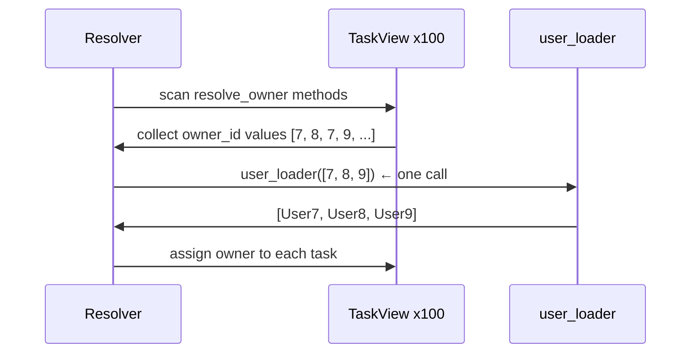

# Quick Start

[中文版](./quick_start.zh.md)

This page solves one endpoint-level problem with the smallest useful amount of code: each task has an `owner_id`, but the response model should expose a full `owner` object.

If you only need to fix a few N+1 issues in a handful of endpoints, this page and [Core API](./core_api.md) may already be enough.

## The Problem

Imagine a task list API that starts from data like this:

```python
raw_tasks = [
    {"id": 10, "title": "Design docs", "owner_id": 7},
    {"id": 11, "title": "Refine examples", "owner_id": 8},
]
```

The response contract you actually want is not just `owner_id`. You want:

```json
{
    "id": 10,
    "title": "Design docs",
    "owner": {
        "id": 7,
        "name": "Ada"
    }
}
```

The naive implementation is usually a loop that fetches one owner per task. That is exactly the kind of N+1 problem pydantic-resolve is built to remove.

## Install

```bash
pip install pydantic-resolve
```

If you later want MCP support as well:

```bash
pip install pydantic-resolve[mcp]
```

## The Smallest Useful Example

This example is self-contained and runnable. It uses a simple dict-based fake database so you can see the entire flow without setting up a real database.

```python
import asyncio
from typing import Optional

from pydantic import BaseModel
from pydantic_resolve import Loader, Resolver, build_object


# --- Fake database ---
USERS = {
    7: {"id": 7, "name": "Ada"},
    8: {"id": 8, "name": "Bob"},
    9: {"id": 9, "name": "Cara"},
}


# --- Loader function ---
async def user_loader(user_ids: list[int]):
    """Receives a batch of user_ids, returns results aligned with those keys."""
    users = [USERS.get(uid) for uid in user_ids]
    return build_object(users, user_ids, lambda user: user.id)


# --- Response models ---
class UserView(BaseModel):
    id: int
    name: str


class TaskView(BaseModel):
    id: int
    title: str
    owner_id: int
    owner: Optional[UserView] = None

    def resolve_owner(self, loader=Loader(user_loader)):
        return loader.load(self.owner_id)


# --- Resolve ---
raw_tasks = [
    {"id": 10, "title": "Design docs", "owner_id": 7},
    {"id": 11, "title": "Refine examples", "owner_id": 8},
]

tasks = [TaskView.model_validate(t) for t in raw_tasks]
tasks = await Resolver().resolve(tasks)

for t in tasks:
    print(t.model_dump())
```

Output:

```python
{'id': 10, 'title': 'Design docs', 'owner_id': 7, 'owner': {'id': 7, 'name': 'Ada'}}
{'id': 11, 'title': 'Refine examples', 'owner_id': 8, 'owner': {'id': 8, 'name': 'Bob'}}
```

## What Each Piece Does

### `owner` starts as `None`

```python
owner: Optional[UserView] = None
```

The root task data does not include full owner objects, so the field starts empty. The resolver will fill it.

### `resolve_owner` describes how to fetch the missing field

```python
def resolve_owner(self, loader=Loader(user_loader)):
    return loader.load(self.owner_id)
```

The method name follows the pattern `resolve_<field_name>`. The `Loader(user_loader)` argument declares a batched dependency — it does **not** call `user_loader` immediately.

### `user_loader` receives all keys at once

```python
async def user_loader(user_ids: list[int]):
    users = [USERS.get(uid) for uid in user_ids]
    return build_object(users, user_ids, lambda user: user.id)
```

The loader function receives a **list** of keys, not a single key. It must return results aligned with the incoming key order.

### `Resolver().resolve(tasks)` walks the model tree

The resolver scans all model instances for `resolve_*` methods, collects the requested keys, calls each loader once per batch, and maps results back to the correct fields.

## Why `build_object` Matters

`user_loader` must return a result for **each** key in `user_ids`, in the same order. `build_object` handles this alignment:

```python
from pydantic_resolve import build_object

# build_object(items, keys, get_key_fn) -> list[item | None]
#
# Returns one element per key:
# - the matching item if found
# - None if no item matches that key
```

For one-to-many relationships (one sprint has many tasks), use `build_list` instead — it returns a list of lists.

## Why This Avoids N+1

Suppose the task list contains 100 tasks. The resolver does **not** call `user_loader` 100 times. Instead:

1. It collects all requested `owner_id` values across all tasks.
2. It calls `user_loader` once with the full batch: `[7, 8, 7, 9, 8, ...]`.
3. It maps each loaded user back to the right `TaskView.owner`.

That is the core value of the library in its smallest form.



## Mental Model

The most useful first mental model is this:

> **`resolve_*` means: this field needs data from outside the current node.**

Everything else in the library builds on that idea:

- `post_*` runs **after** the subtree is ready
- `ExposeAs` / `SendTo` pass data across layers
- `AutoLoad` removes the need to write `resolve_*` at all

## resolve_* Can Be Sync or Async

Both forms work:

```python
# Sync — return a value directly
def resolve_owner(self, loader=Loader(user_loader)):
    return loader.load(self.owner_id)

# Async — await the loader, then transform the result
async def resolve_owner(self, loader=Loader(user_loader)):
    user = await loader.load(self.owner_id)
    return user
```

Use async when you need to post-process the loaded data before assignment.

## When to Stop Here

Staying at this level is completely reasonable when:

- you only need to fix a few related-data fields
- your response models are still changing quickly
- you do not have repeated relationship wiring across many models yet

## Next

Continue to [Core API](./core_api.md) to extend the same pattern from one field to a nested tree: `Sprint -> Task -> User`.
