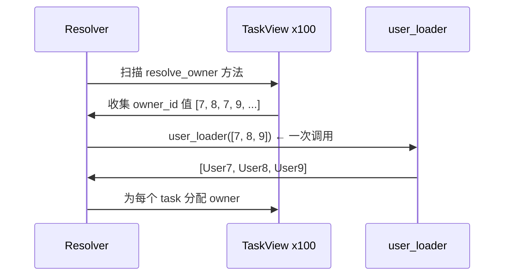

# 快速开始

[English](./quick_start.md)

本页用最少的有效代码解决一个接口级别的问题：每个 task 有一个 `owner_id`，但响应模型应该暴露完整的 `owner` 对象。

如果你只需要在少数几个接口中修复一些 N+1 问题，那么本页和 [核心 API](./core_api.zh.md) 可能已经足够了。

## 问题

想象一个任务列表 API，它的起始数据是这样的：

```python
raw_tasks = [
    {"id": 10, "title": "Design docs", "owner_id": 7},
    {"id": 11, "title": "Refine examples", "owner_id": 8},
]
```

你实际想要的响应契约不仅仅是 `owner_id`。你需要的是：

```json
{
    "id": 10,
    "title": "Design docs",
    "owner": {
        "id": 7,
        "name": "Ada"
    }
}
```

朴素实现通常是一个循环，为每个 task 获取一个 owner。这正是 pydantic-resolve 旨在消除的那种 N+1 问题。

## 安装

```bash
pip install pydantic-resolve
```

如果你后续还需要 MCP 支持：

```bash
pip install pydantic-resolve[mcp]
```

## 最小的可用示例

这个示例是自包含且可运行的。它使用简单的基于字典的伪数据库，这样你可以在不设置真实数据库的情况下看到完整流程。

```python
import asyncio
from typing import Optional

from pydantic import BaseModel
from pydantic_resolve import Loader, Resolver, build_object


# --- 伪数据库 ---
USERS = {
    7: {"id": 7, "name": "Ada"},
    8: {"id": 8, "name": "Bob"},
    9: {"id": 9, "name": "Cara"},
}


# --- Loader 函数 ---
async def user_loader(user_ids: list[int]):
    """接收一批 user_ids，返回与这些键对齐的结果。"""
    users = [USERS.get(uid) for uid in user_ids]
    return build_object(users, user_ids, lambda user: user.id)


# --- 响应模型 ---
class UserView(BaseModel):
    id: int
    name: str


class TaskView(BaseModel):
    id: int
    title: str
    owner_id: int
    owner: Optional[UserView] = None

    def resolve_owner(self, loader=Loader(user_loader)):
        return loader.load(self.owner_id)


# --- 解析 ---
raw_tasks = [
    {"id": 10, "title": "Design docs", "owner_id": 7},
    {"id": 11, "title": "Refine examples", "owner_id": 8},
]

tasks = [TaskView.model_validate(t) for t in raw_tasks]
tasks = await Resolver().resolve(tasks)

for t in tasks:
    print(t.model_dump())
```

输出：

```python
{'id': 10, 'title': 'Design docs', 'owner_id': 7, 'owner': {'id': 7, 'name': 'Ada'}}
{'id': 11, 'title': 'Refine examples', 'owner_id': 8, 'owner': {'id': 8, 'name': 'Bob'}}
```

## 每个部分的作用

### `owner` 初始为 `None`

```python
owner: Optional[UserView] = None
```

根 task 数据不包含完整的 owner 对象，因此该字段初始为空。解析器会填充它。

### `resolve_owner` 描述如何获取缺失的字段

```python
def resolve_owner(self, loader=Loader(user_loader)):
    return loader.load(self.owner_id)
```

方法名遵循 `resolve_<field_name>` 模式。`Loader(user_loader)` 参数声明了一个批处理依赖 —— 它**不会**立即调用 `user_loader`。

### `user_loader` 一次性接收所有键

```python
async def user_loader(user_ids: list[int]):
    users = [USERS.get(uid) for uid in user_ids]
    return build_object(users, user_ids, lambda user: user.id)
```

loader 函数接收一个键的**列表**，而不是单个键。它必须返回与传入键顺序对齐的结果。

### `Resolver().resolve(tasks)` 遍历模型树

解析器扫描所有模型实例的 `resolve_*` 方法，收集请求的键，每个 loader 每批调用一次，然后将结果映射回正确的字段。

## `build_object` 的重要性

`user_loader` 必须为 `user_ids` 中的**每个**键返回一个结果，顺序相同。`build_object` 处理这种对齐：

```python
from pydantic_resolve import build_object

# build_object(items, keys, get_key_fn) -> list[item | None]
#
# 为每个键返回一个元素：
# - 如果找到则返回匹配的项
# - 如果没有项匹配该键则返回 None
```

对于一对多关系（一个 sprint 有多个 task），请改用 `build_list` —— 它返回一个列表的列表。

## 为什么这能避免 N+1

假设任务列表包含 100 个任务。解析器**不会**调用 `user_loader` 100 次。相反：

1. 它收集所有任务中所有请求的 `owner_id` 值。
2. 它用完整批次调用 `user_loader` 一次：`[7, 8, 7, 9, 8, ...]`。
3. 它将每个加载的 user 映射回正确的 `TaskView.owner`。

这就是该库以最小形式提供的核心价值。



## 心智模型

最有用的第一个心智模型是：

> **`resolve_*` 意味着：这个字段需要来自当前节点之外的数据。**

库中的其他一切都是建立在这个想法之上的：

- `post_*` 在子树准备好**之后**运行
- `ExposeAs` / `SendTo` 跨层传递数据
- `AutoLoad` 完全消除了编写 `resolve_*` 的需要

## resolve_* 可以是同步或异步的

两种形式都可以：

```python
# 同步 —— 直接返回值
def resolve_owner(self, loader=Loader(user_loader)):
    return loader.load(self.owner_id)

# 异步 —— 等待 loader，然后转换结果
async def resolve_owner(self, loader=Loader(user_loader)):
    user = await loader.load(self.owner_id)
    return user
```

当你需要在赋值前对加载的数据进行后处理时，使用异步。

## 何时停留在此阶段

在以下情况下，停留在这个阶段是完全合理的：

- 你只需要修复几个关联数据字段
- 你的响应模型仍在快速变化
- 你还没有在多个模型中重复的关系连接

## 下一步

继续阅读 [核心 API](./core_api.zh.md)，将相同的模式从一个字段扩展到嵌套树：`Sprint -> Task -> User`。
