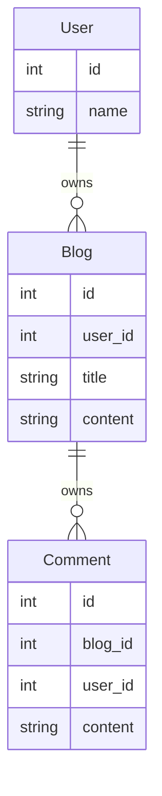

# 数据加载器 （DataLoader）

DataLoader 是 pydantic-resolve 中非常重要的一个组件， 使用了一个第三方独立库 [aiodataloader](https://github.com/syrusakbary/aiodataloader)， 它常常被作为依赖用在 GraphQL 相关的库中。

它可以解决 GraphQL 的 N+1 查询问题， 能将多个并发查询合并之后变成一次 batch 查询来优化性能。

pydantic-resolve 的内部机制和 GraphQL 有点类似， 所以可以直接使用它来负责数据加载。 对于一些简单的 DataLoader 也可以实现与其他 python GraphQL 框架间的复用。

比如简介中介绍的代码, 在批量处理 `get_cars_by_child` 时就会触发多次, 引起 N+1 查询问题. 我们能通过 DataLoader 来解决.

```python
class Child(BaseModel):
    id: int
    name: str

    cars: List[Car] = []
    # async def resolve_cars(self):
    #     return await get_cars_by_child(self.id)

    async def resolve_cars(self, loader=LoaderDepend(CarLoader)):
        return await loader.load(self.id)

    description: str = ''
    def post_description(self):
        desc = ', '.join([c.name for c in self.cars])
        return f'{self.name} owns {len(self.cars)} cars, they are: {desc}'

children = await Resolver.resolve([
        Child(id=1, name="Titan"), Child(id=1, name="Siri")])
```

## 样例



```python
import asyncio
import json
from typing import Optional
from pydantic import BaseModel
from pydantic_resolve import Resolver, build_object, build_list, LoaderDepend
from aiodataloader import DataLoader

# Schema/ Entity
class Comment(BaseModel):
    id: int
    content: str
    user_id: int

class Blog(BaseModel):
    id: int
    title: str
    content: str

class User(BaseModel):
    id: int
    name: str


# Loaders/ relationships
class CommentLoader(DataLoader):
    async def batch_load_fn(self, comment_ids):
        comments = [
            dict(id=1, content="world is beautiful", blog_id=1, user_id=1),
            dict(id=2, content="Mars is beautiful", blog_id=2, user_id=2),
            dict(id=3, content="I love Mars", blog_id=2, user_id=3),
        ]
        return build_list(comments, comment_ids, lambda c: c['blog_id'])

class UserLoader(DataLoader):
    async def batch_load_fn(self, user_ids):
        users = [ dict(id=1, name="Alice"), dict(id=2, name="Bob"), ]
        return build_object(users, user_ids, lambda u: u['id'])


# Compose schemas and dataloaders together
class CommentWithUser(Comment):
    user: Optional[User] = None
    def resolve_user(self, loader=LoaderDepend(UserLoader)):
        return loader.load(self.user_id)

class BlogWithComments(Blog):
    comments: list[CommentWithUser] = []
    def resolve_comments(self, loader=LoaderDepend(CommentLoader)):
        return loader.load(self.id)


# Run
async def main():
    raw_blogs =[
        dict(id=1, title="hello world", content="hello world detail"),
        dict(id=2, title="hello Mars", content="hello Mars detail"),
    ]
    blogs = await Resolver().resolve([BlogWithComments.parse_obj(b) for b in raw_blogs])
    print(json.dumps(blogs, indent=2, default=lambda o: o.dict()))

asyncio.run(main())
```

备注：
这个例子目的是展示获取关联数据的能力， 经常有人问如何处理分页， 一般来说使用分页的场景发生在根数据较多， 比如 User 列表是可以分页的。

如果要对 Blog 做分页， 一种是将 Blog 作为根数据入口，`api/blog?limit=10&offset=0` 的方式来分页

或者使用单个 User， 搭配 `context` 参数给 blogs 做分页， 此时无法使用 DataLoader， 需要替换成 `get_blogs_by_user_id_with_pagination` 之类的单方法。

另外使用 DataLoader 可以添加范围限制， 比如获取一批用户最近 N 天的 blogs， 或者最近 M 天的评论， 诸如此类。 这样做也是符合 UI 展示的数据量的。

## DataLoader 的创建

DataLoader 对象有两种创建方法， 一种是继承：

```python
from aiodataloader import DataLoader

class UserLoader(DataLoader):
    max_batch_size = 20
    async def batch_load_fn(self, keys):
        return await my_batch_get_users(keys)

user_loader = UserLoader()
```

继承的写法可以设置一些 `aiodataloader` 相关的参数， 比如使用 `max_batch_size = 20` 来对 keys 做切片并发。

这几个 param 作为 aiodataloader 的保留参数名， 在新增 param 时需要注意不要重名。

另一种则是直接创建一个 `async def batch_load_fn(keys)` 方法， 在 pydantic-resolve 内部会使用 `DataLoader(batch_load_fn)` 来创建实例。

一般建议使用第一种方法，原因会在下文阐述。

接下来将介绍 pydantic-resolve 基于 DataLoader 所提供的一些列功能：

## 多层的数据拼接

拿 Company, Office, Member 来举例子， Office 和 Member 有返回他们数据的 dataloader， 只要提供对应的 office_id 和 member_id。

- OfficeLoader 通过 company_id 来获取对应的 Office 列表
- MemberLoader 通过 office_id 来获取 Member 列表

以 OfficeLoader 为例， 传入 company_ids， 返回的是以 company_ids 为顺序， 获取到的 offices 数组。

比如输入 `company_ids = [1, 2, 3]`, 返回 `[[office_1, office_2], [office_3], [office_4]]`， 代表 company 1 有 `[office_1, office_2]`，以此类推。

> build_list 是 pydantic-resolve 提供的 helper 方法， 来简化拼装过程

```python
class OfficeLoader(DataLoader)
    async def batch_load_fn(self, company_ids):
        offices = await get_offices_by_company_ids(company_ids)
        return build_list(offices, company_ids, lambda x: x['company_id'])  # 假定数据是 dict

class Company(BaseModel):
    id: int
    name: str

    offices: List[Office] = []
    def resolve_offices(self, loader=LoaderDepend(OfficeLoader)):
        return loader.load(self.id)  # 返回的是 Future

class Office(BaseModel):
    id: int
    company_id: int
    name: str

    members: List[Member] = []
    def resolve_members(self, loader=LoaderDepend(MemberLoader)):
        return loader.load(self.id)  # 返回的是 Future

class Member(BaseModel):
    id: int
    office_id: int
    name: str

companies = [
    Company(id=1, name='Aston'),
    Compay(id=2, name="Nicc"),
    Company(id=3, name="Carxx")
]
companies = await Resolver().resolve(companies)
```

在这段代码中， Company 扩展了 offices 数据， 然后 Office 扩展了 members 数据， 在整个过程中，OfficeLoader 和 MemberLoader 中的 batch_load_fn 都只执行了一次，无论 Offices 和 members 的数量是多少。

> 当然如果 max_batch_size 比较小的话， 可能会并发多个 batch_load_fn

## 提供参数和克隆

DataLoader 可以添加参数， 但需要注意避免和 `aiodataloader` 中的默认参数冲突 `batch`, `max_batch_size`, `cache`, `cache_key_fn`, `cache_map`.

比如给 OfficeLoader 添加 `status` 参数， 用来过滤 `open` 的 office。

```python
class OfficeLoader(DataLoader)
    status: Literal['open', 'closed', 'inactive']

    async def batch_load_fn(self, company_ids):
        offices = await get_offices_by_company_ids_by_status(company_ids, self.status)
        return build_list(offices, company_ids, lambda x: x['company_id'])
```

定义好的参数可以在 Resolver 中通过 loader_params 来设置。

```python
companies = [
    Company(id=1, name='Aston'),
    Compay(id=2, name="Nicc"),
    Company(id=3, name="Carxx")
]
companies = await Resolver(
    loader_params={
        OfficeLoader: {
            'status': 'open'
        }
    }
).resolve(companies)
```

这里还存在一个问题， 如果需要同时获取 `open` 和 `closed` 的数据呢。

```python
class Company(BaseModel):
    id: int
    name: str

    open_offices: List[Office] = []
    def resolve_open_offices(self, loader=LoaderDepend(OfficeLoader)):
        return loader.load(self.id)

    closed_offices: List[Office] = []
    def resolve_closed_offices(self, loader=LoaderDepend(OfficeLoader)):
        return loader.load(self.id)
```

两个不同条件的数据没法使用单个 OfficeLoader 来提供数据， pydantic-resolve 提供了一个工具来克隆两个 OfficeLoader 出来。

```python
from pydantic_resolve import copy_dataloader_kls

OfficeLoader1 = copy_dataloader_kls('OfficeLoader1', OfficeLoader)
OfficeLoader2 = copy_dataloader_kls('OfficeLoader2', OfficeLoader)

class Company(BaseModel):
    id: int
    name: str

    open_offices: List[Office] = []
    def resolve_open_offices(self, loader=LoaderDepend(OfficeLoader1)):
        return loader.load(self.id)

    closed_offices: List[Office] = []
    def resolve_closed_offices(self, loader=LoaderDepend(OfficeLoader2)):
        return loader.load(self.id)

companies = [
    Company(id=1, name='Aston'),
    Company(id=2, name="Nicc"),
    Company(id=3, name="Carxx")
]
companies = await Resolver(
    loader_params={
        OfficeLoader1: {
            'status': 'open'
        }，
        OfficeLoader2: {
            'status': 'closed'
        }
    }
).resolve(companies)
```

## 处理 DataLoader 返回值

如果需要对 `loader.load(self.id)` 的返回值做处理， 可以将 resolve_offices 改为 async.

```python
class Company(BaseModel):
    id: int
    name: str

    offices: List[Office] = []
    async def resolve_offices(self, loader=LoaderDepend(OfficeLoader)):
        offices = await loader.load(self.id)
        return [of for of in offices if of['status'] == 'open']
```

另外， pydantic-resolve 并不限制 loader 的名字， 或者数量， 所以以下的用法也是允许的 ：）, 当然给的例子稍微有点奇怪。。

```python
class Company(BaseModel):
    id: int
    name: str

    offices: List[Office] = []
    async def resolve_offices(
            self,
            office_loader=LoaderDepend(OfficeLoader),
            manager_loader=LoaderDepend(ManagerLoader)):
        offices = await office_loader.load(self.id)
        managers = await manager_loader.load(self.id)

        offices = [of for of in offices if of['manager'] in managers]
        return offices
```

## 预先生成 DataLoader 实例

可以提前生成 DataLoader 的实例， 将数据提前设置进去， 这样就能利用 DataLoader 的 cache 机制避免 resolve() 阶段的查询开销。

在一些特定场景会有帮助。

```python
loader = SomeLoader()
loader.prime('tangkikodo', ['tom', 'jerry'])
loader.prime('john', ['mike', 'wallace'])
data = await Resolver(loader_instances={SomeLoader: loader}).resolve(data)
```

## 查看 DataLoader 实例数据

如果想知道 DataLoader 初始化了哪些实例, 获取了哪些数据, 可以打印出来查看.

```python
resolver = Resolver()
data = await resolver.resolve(data)
print(resolver.loader_instance_cache)
```
