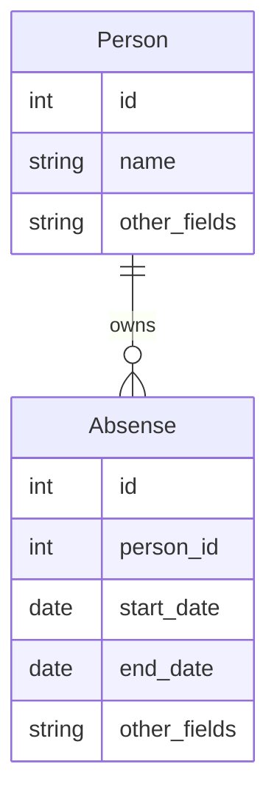
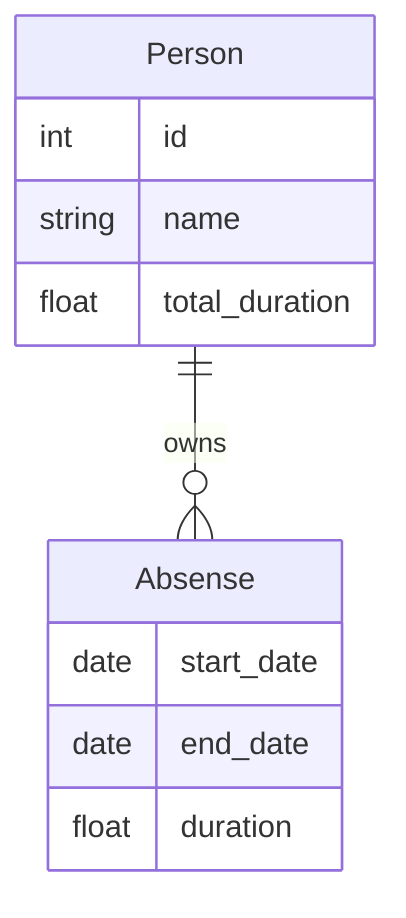

# Constructing Desired Data Structures from ER Models

The recommended approach for using pydantic-resolve is to construct the desired data structure based on the ER model.

When we construct data, a straightforward way of thinking is to first define the target data structure, compare it with the current data source structure, and find the shortest path of change.

> More detailed content will be introduced in "ERD Driven Development".

For example, I have an array of Person, and now I need to attach leave information Absense to each person and calculate the total number of leave days.

## Desired Structure

The current entities are Person and Absense, and Absense can be queried using AbsenseLoader based on person_id.



```python
class Person(BaseModel):
    id: int
    name: str
    other_field: str

class Absense(BaseModel):
    id: int
    user_id: int
    start_date: date
    end_date: date
    other_fields: str
```

The desired structure needs to read id, name from Person, and add absenses and total_duration fields.

In Absense, read start_date, end_date, and add duration field.

You can inherit from the parent class to get the fields and add the required new fields.

```python
class AbsenseWithDuration(Absense):
    duration: float = 0

class PersonWithAbsneses(Person):
    absenses: List[AbsenseWithDuration] = []
    total_duration: float = 0
```

Or select fields as needed, copy the required fields, and add `ensure_subset` to check for consistency.

```python
@ensure_subset(Absense)
class AbsenseWithDuration(BaseModel):
    start_date: date
    end_date: date
    duration: float = 0

@ensure_subset(Person)
class PersonWithDuration(BaseModel):
    id: int
    name: str
    absenses: List[AbsenseWithDuration] = []
    total_duration: float = 0
```

So we get the desired data structure.



## Fetch Data and Calculate Data

Add DataLoader for absense to fetch data.

Define post_duration to calculate duration, and define post_total_duration to calculate the total.

```python
@ensure_subset(Absense)
class AbsenseWithDuration(BaseModel):
    start_date: date
    end_date: date

    duration: float = 0
    def post_duration(self):
        return calc_duration(self.end_date, self.start_date)

@ensure_subset(Person)
class PersonWithDuration(BaseModel):
    id: int
    name: str

    absenses: List[AbsenseWithDuration] = []
    def resolve_absenses(self, loader=LoaderDepend(AbsenseLoader)):
        return loader.load(self.id)

    total_duration: float = 0
    def post_total_duration(self):
        return sum([a.duration for a in self.absenses])
```

## Start

Once the entire structure is defined, we can load and calculate all data by initializing people, and then just execute Resolver().resolve() on the people data once to complete all operations.

```python
people = [
    Person(id=1, name='alice'),
    Person(id=2, name='bob')
]
people = await Resolver().resolve(people)
```

Throughout this assembly process, we did not write a single line of code to expand the people array, all related code is inside the Person object.

If we were to handle it in a procedural way, we would need to at least consider:

- Aggregating annual and sick leaves based on person_id, generating two new variables person_annual_map and person_sick_map
- Iterating over the person objects with `for person in people`

These processes are all encapsulated internally in pydantic-resolve.
