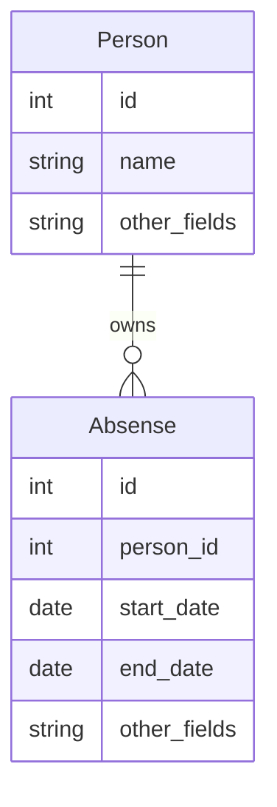
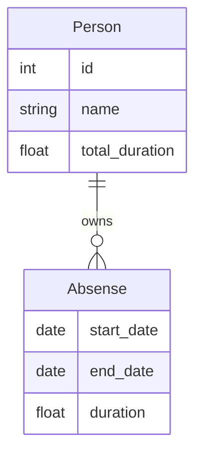

# 从 ER 模型构造期望数据结构

使用 pydantic-resolve 的推荐模式是，在 ER 模型的基础上，构建出期望的数据结构。

当我们构建数据时，一个很朴素的思考方式是：先定义好目标数据结构 Target，比较当前已有的数据源结构 Source，寻找最短的变化路径。

> 更加详细的内容会在 “ERD 驱动开发” 中介绍。

比如我有一个 Person 的数组，现在要为每个人附加请假信息 Absense，并计算总共请假了几天。

## 期望的结构

当前已有的 Entity 为 Person 和 Absense，Absense 可以使用 AbsenseLoader 根据 person_id 查询到.



```python
class Person(BaseModel):
    id: int
    name: str
    other_field: str

class Absense(BaseModel):
    id: int
    user_id: int
    start_date: date
    end_date: date
    other_fields: str
```

期望的结构需要在 Person 读取 id, name, 并且添加 absenses 和 total_duration 字段

在 Absense 中读取 start_date, end_date, 添加 duration 字段.

可以通过继承父类来获取字段, 并且添加所需的新字段

```python
class AbsenseWithDuration(Absense):
    duration: float = 0

class PersonWithAbsneses(Person):
    absenses: List[AbsenseWithDuration] = []
    total_duration: float = 0
```

或者根据需要挑选字段,  拷贝所需字段,  添加 `ensure_subset` 来检查内容一致.

```python
@ensure_subset(Absense)
class AbsenseWithDuration(BaseModel):
    start_date: date
    end_date: date
    duration: float = 0

@ensure_subset(Person)
class PersonWithDuration(BaseModel):
    id: int
    name: str
    absenses: List[AbsenseWithDuration] = []
    total_duration: float = 0
```

于是我们得到了期望的数据结构.



## 获取数据, 计算数据

为 abnsese 添加 DataLoader, 来获取数据

定义 post_duration 来计算 duration, 定义 post_total_duration 来计算总和.

```python
@ensure_subset(Absense)
class AbsenseWithDuration(BaseModel):
    start_date: date
    end_date: date

    duration: float = 0
    def post_duration(self):
        return calc_duration(self.end_date, self.start_date)

@ensure_subset(Person)
class PersonWithDuration(BaseModel):
    id: int
    name: str

    absenses: List[AbsenseWithDuration] = []
    def resolve_absenses(self, loader=LoaderDepend(AbsenseLoader)):
        return loader.load(self.id)

    total_duration: float = 0
    def post_total_duration(self):
        return sum([a.duration for a in self.absenses])
```

## 启动

当定义完整个结构后， 我们就能通过初始化 people 来加载和计算所有数据了，之后只需对 people 数据执行一次 Resolver().resolve() 就能完成所有的操作。

```python
people = [
    Person(id=1, name='alice'),
    Person(id=2, name='bob')
]
people = await Resolver().resolve(people)
```

在这整个拼装过程中， 我们没有书写一行循环展开 people 的代码，所有的相关代码都在 Person 对象的内部。

如果使用面向过程的方式来处理的话， 会需要至少考虑：

- annual, sick leaves 根据 person_id 聚合，生成 person_annual_map 和 person_sick_map 两个新变量
- `for person in people` 遍历 person 对象

这些过程在 pydantic-resolve 都是内部封装掉了的。
