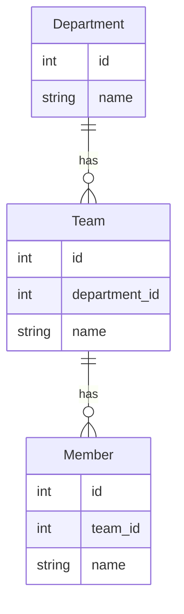

## Introduction

Assume we have 3 tables: `departments`, `teams` and `members`, which have `1:N relationship` from left to right.



```python
departments = [
    dict(id=1, name='INFRA'),
    dict(id=2, name='DevOps'),
    dict(id=3, name='Sales'),
]

teams = [
    dict(id=1, department_id=1, name="K8S"),
    dict(id=2, department_id=1, name="MONITORING"),
    # ...
    dict(id=10, department_id=2, name="Operation"),
]

members = [
    dict(id=1, team_id=1, name="Sophia"),
    # ...
    dict(id=19, team_id=10, name="Emily"),
    dict(id=20, team_id=10, name="Ella")
]
```

and we want to generate nested json base on these 3 tables. the output should be looks like:

```json
{
  "departments": [
    {
      "id": 1,
      "name": "INFRA",
      "teams": [
        {
          "id": 1,
          "name": "K8S",
          "members": [
            {
              "id": 1,
              "name": "Sophia"
            }
          ]
        }
      ]
    }
  ]
}
```

We will shows how to make it with `pydantic-resolve` which has 4 steps:

1. define dataloader
2. define pydantic schema, use dataloaders (no N+1 query)
3. resolve

```python
import json
import asyncio
from typing import List
from pydantic import BaseModel
from pydantic2_resolve import Resolver, LoaderDepend, build_list

# 0. prepare table records
departments = [
    dict(id=1, name='INFRA'),
    dict(id=2, name='DevOps'),
    dict(id=3, name='Sales'),
]

teams = [
    dict(id=1, department_id=1, name="K8S"),
    dict(id=2, department_id=1, name="MONITORING"),
    dict(id=3, department_id=1, name="Jenkins"),
    dict(id=5, department_id=2, name="Frontend"),
    dict(id=6, department_id=2, name="Bff"),
    dict(id=7, department_id=2, name="Backend"),
    dict(id=8, department_id=3, name="CAT"),
    dict(id=9, department_id=3, name="Account"),
    dict(id=10, department_id=3, name="Operation"),
]

members = [
    dict(id=1, team_id=1, name="Sophia"),
    dict(id=2, team_id=1, name="Jackson"),
    dict(id=3, team_id=2, name="Olivia"),
    dict(id=4, team_id=2, name="Liam"),
    dict(id=5, team_id=3, name="Emma"),
    dict(id=6, team_id=4, name="Noah"),
    dict(id=7, team_id=5, name="Ava"),
    dict(id=8, team_id=6, name="Lucas"),
    dict(id=9, team_id=6, name="Isabella"),
    dict(id=10, team_id=6, name="Mason"),
    dict(id=11, team_id=7, name="Mia"),
    dict(id=12, team_id=8, name="Ethan"),
    dict(id=13, team_id=8, name="Amelia"),
    dict(id=14, team_id=9, name="Oliver"),
    dict(id=15, team_id=9, name="Charlotte"),
    dict(id=16, team_id=10, name="Jacob"),
    dict(id=17, team_id=10, name="Abigail"),
    dict(id=18, team_id=10, name="Daniel"),
    dict(id=19, team_id=10, name="Emily"),
    dict(id=20, team_id=10, name="Ella")
]

# 1. define dataloader
async def teams_batch_load_fn(department_ids):
    """ return teams grouped by department_id """
    # visit [aiodataloader](https://github.com/syrusakbary/aiodataloader) to know how to define `DataLoader`

    dct = defaultdict(list)
    _teams = team_service.batch_query_by_department_ids(department_ids)  # assume data is exposed by service
    for team in _teams:
        dct[team['department_id']].append(team)

    return [dct.get(did, []) for did in department_ids]

async def members_batch_load_fn(team_ids):
    """ return members grouped by team_id """
    _members = member_service.batch_query_by_team_ids(team_ids)

    return build_list(_members, team_ids, lambda t: t['team_id'])  # helper func

# 2. define pydantic schemas
class Member(BaseModel):
    id: int
    name: str

class Team(BaseModel):
    id: int
    name: str

    members: List[Member] = []
    def resolve_members(self, loader=LoaderDepend(members_batch_load_fn)):
        return loader.load(self.id)

    member_count: int = 0
    def post_member_count(self):
        return len(self.members)

class Department(BaseModel):
    id: int
    name: str
    teams: List[Team] = []
    def resolve_teams(self, loader=LoaderDepend(teams_batch_load_fn)):
        return loader.load(self.id)

    member_count: int = 0
    def post_member_count(self):
        return sum([team.member_count for team in self.teams])

class Result(BaseModel):
    departments: List[Department] = []
    def resolve_departments(self):
        return departments

# 3. resolve
async def main():
    result = Result()
    data = await Resolver().resolve(result)
    print(json.dumps(data.model_dump(), indent=4))

asyncio.run(main())
```

then we got the output (display the first item for demostration)

```json
{
  "departments": [
    {
      "id": 1,
      "name": "INFRA",
      "member_count": 5,
      "teams": [
        {
          "id": 1,
          "name": "K8S",
          "member_count": 2,
          "members": [
            {
              "id": 1,
              "name": "Sophia"
            },
            {
              "id": 2,
              "name": "Jackson"
            }
          ]
        },
        {
          "id": 2,
          "name": "MONITORING",
          "member_count": 2,
          "members": [
            {
              "id": 3,
              "name": "Olivia"
            },
            {
              "id": 4,
              "name": "Liam"
            }
          ]
        },
        {
          "id": 3,
          "name": "Jenkins",
          "member_count": 1,
          "members": [
            {
              "id": 5,
              "name": "Emma"
            }
          ]
        }
      ]
    }
  ]
}
```
